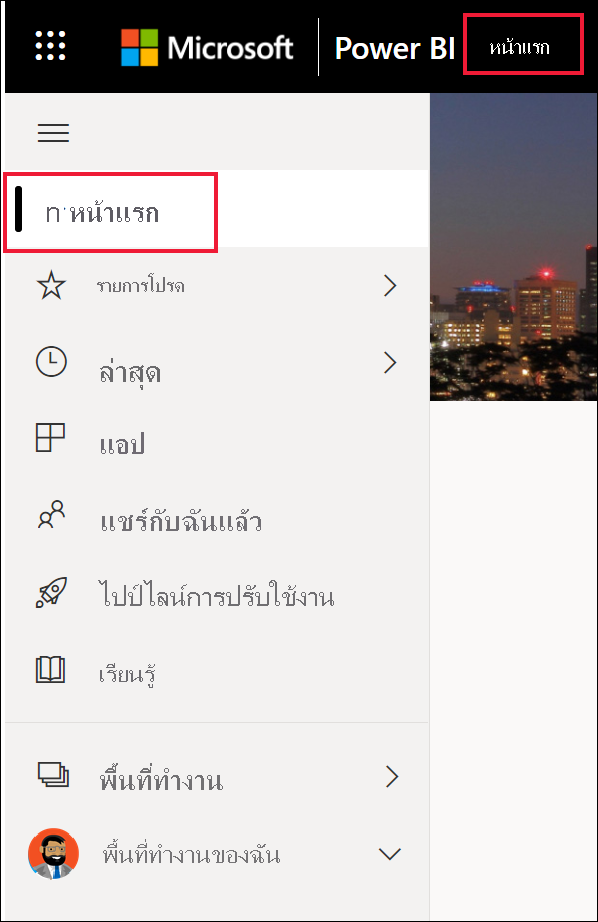
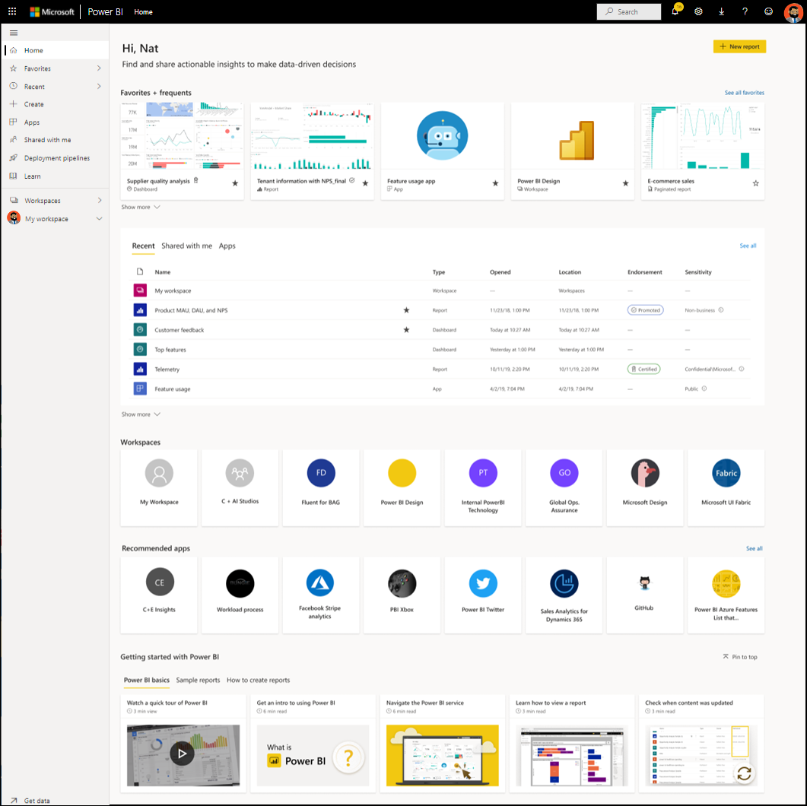
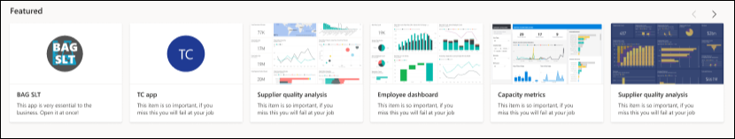
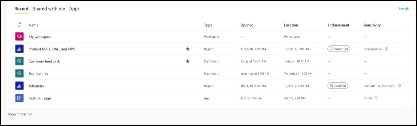
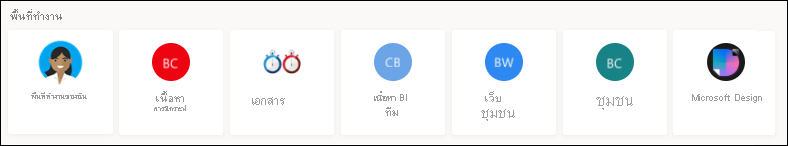
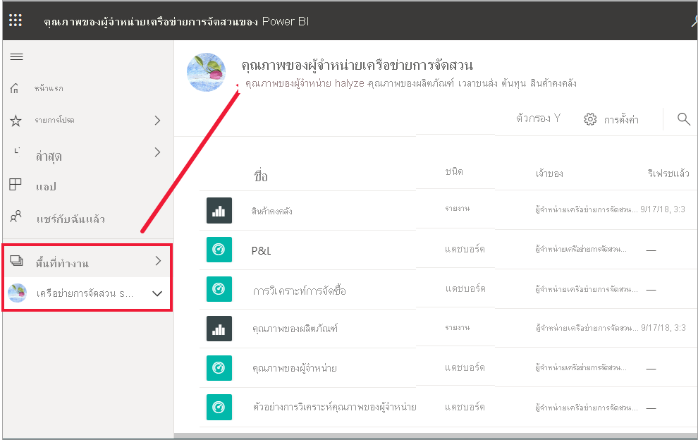
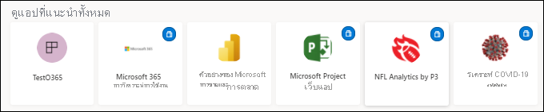
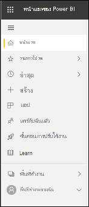

# ค้นหาแดชบอร์ด รายงาน และแอปของคุณ

[!INCLUDE[consumer-appliesto-yynn](../includes/consumer-appliesto-yynn.md)]
ใน Power BI คำว่า *เนื้อหา* หมายถึงแอป แดชบอร์ด และรายงาน *ผู้ออกแบบ* Power BI จะสร้างเนื้อหาขึ้น ซึ่งจะใช้งานร่วมกับเพื่อนร่วมงานเช่นคุณ เนื้อหาของคุณสามารถเข้าถึงได้และดูได้จากบริการของ Power BI ซึ่งสถานที่ที่ดีที่สุดในการเริ่มต้นทำงานใน Power BI ก็คือจาก **หน้าแรก** ของ Power BI

## สำรวจหน้าแรกของ Power BI
หลังจากที่คุณลงชื่อเข้าใช้บริการของ Power BI ให้เลือก **หน้าแรก** จากบานหน้าต่างนำทาง 

Power BI จะแสดงพื้นที่ทำงานของหน้าแรกของคุณดังแสดงในรูปต่อไปนี้ เค้าโครงและเนื้อหาบนหน้าแรกจะแตกต่างกันสำหรับผู้ใช้ทุกคน ภายหลังในบทความนี้ เราจะเห็นหน้าแรกสำหรับผู้ใช้ใหม่และสำหรับผู้ใช้ที่มีประสบการณ์มาก 
 

หน้าแรกของ Power BI จะมีในการค้นหาและดูเนื้อหาของคุณอยู่สามวิธี ทั้งสามวิธีจะเข้าสู่กลุ่มเนื้อหาเดียวกัน จะแตกต่างกันแค่วิธีในการรับเนื้อหานั้นเท่านั้น ในบางครั้ง การค้นหาจะเป็นวิธีที่ง่ายและรวดเร็วที่สุดในการค้นหาบางสิ่ง ในขณะที่บางครั้ง การเลือก *การ์ด* บนพื้นที่ทำงานของหน้าแรกจะเป็นตัวเลือกที่ดีที่สุดของคุณ

- พื้นที่ทำงานของหน้าแรกจะแสดงและจัดการเนื้อหาที่คุณชื่นชอบ เข้าบ่อย เข้าล่าสุด และที่แนะนำพร้อมกับแอปและพื้นที่ทำงาน  ถ้าคุณเพิ่งเริ่มใช้บริการ Power BI คุณจะมีส่วนการเริ่มต้นใช้งานด้วย เลือกการ์ด หรือข้อมูลในรายการเพื่อเปิด
- ที่ด้านซ้ายจะเป็นหน้าต่างนำทาง ที่เรียกว่าแถบนำทาง เลือก  เพื่อขยายบานหน้าต่างนำทาง ในบานหน้าต่างนำทางนี้ จะมีการจัดเรียงเนื้อหาเดิมของคุณในรูปแบบที่แตกต่างออกไปเล็กน้อย โดยจะเรียงเป็นรายการโปรด ล่าสุด แอป และแชร์กับฉัน จากที่นี่ คุณสามารถดูรายชื่อและเลือกเนื้อหาที่ต้องการเปิดได้
- ที่มุมขวาบน จะมีกล่องค้นหาส่วนกลางที่ช่วยให้คุณสามารถค้นหาเนื้อหาตามชื่อเรื่อง ชื่อ หรือคำสำคัญได้

หัวข้อต่อไปนี้จะเป็นการตรวจสอบตัวเลือกเหล่านี้แต่ละข้อเพื่อการค้นหาและการดูเนื้อหา

## พื้นที่ทำงานของหน้าหลัก
คุณจะสามารถเห็นเนื้อหาทั้งหมดที่คุณได้รับอนุญาตให้ใช้งานได้จากบนพื้นที่ทำงานของหน้าแรกนี้ พื้นที่ทำงานของหน้าแรกของคุณจะมีการอัปเดตเนื้อหาที่แนะนำและแหล่งข้อมูลการเรียนรู้ให้ด้วย ในตอนแรก คุณอาจไม่มีเนื้อหาจำนวนมากบนพื้นที่ทำงานของคุณ แต่จะเปลี่ยนไปเมื่อคุณเริ่มใช้ Power BI กับเพื่อนร่วมงานของคุณ

 
เมื่อคุณทำงานในบริการของ Power BI คุณจะได้รับแดชบอร์ด รายงาน และแอปจากเพื่อนร่วมงาน จากนั้นหน้าแรกของคุณจะค่อยๆ เติมเต็มในที่สุด เมื่อเวลาผ่านไป อาจมีลักษณะดังนี้

 
หัวข้อถัดไปจะเป็นการศึกษาหน้าแรกอย่างใกล้ชิดสำหรับผู้ใช้ที่มีประสบการณ์ ตั้งแต่ด้านบนลงจนถึงด้านล่าง

## เนื้อหาที่สำคัญที่สุดอยู่ใกล้เพียงปลายนิ้วของคุณ

### รายการโปรดและรายการที่ใช้บ่อย
ส่วนบนสุดนี้ประกอบด้วยลิงก์ไปยังเนื้อหาที่คุณเยี่ยมชมบ่อยที่สุดหรือเนื้อหาที่คุณแท็กไว้ว่าเป็นเนื้อหา[เด่นหรือรายการโปรด](end-user-favorite.md) โปรดสังเกตว่าการ์ดหลายใบมีดาวสีดำ เนื่องจากการ์ดเหล่านั้นได้รับการแท็กเป็นรายการโปรด 

นอกจากนี้ คุณสามารถแท็กเนื้อหาเป็น [ที่โดดเด่น](end-user-featured.md) ได้ เลือกแดชบอร์ดหรือรายงานหนึ่งรายการที่คุณคาดว่าจะดูบ่อยที่สุด และตั้งเป็นเนื้อหา *ที่โดดเด่น* ของคุณ แต่ละครั้งที่คุณเปิดบริการของ Power BI แดชบอร์ดที่โดดเด่นของคุณจะปรากฏเป็นรายการแรก 

### แนะนำ
ส่วนที่ **นำเสนอ** มีเนื้อหาที่ผู้ดูแลระบบของคุณ *เลื่อนระดับ* ไปที่หน้าหลักของคุณ โดยทั่วไป นี่คือเนื้อหาที่สำคัญหรือเป็นประโยชน์ต่อการทำงานของคุณ ในตัวอย่างนี้ เนื้อหาที่นำเสนอจะมีมาตรวัดเพื่อติดตามความสำเร็จ

### ล่าสุด แชร์กับฉัน และแอปของฉัน
ส่วนถัดไปคือรายการแบบแท็บ 
- **ล่าสุด** คือเนื้อหาที่คุณเข้าชมล่าสุด โปรดสังเกตประทับเวลาของแต่ละรายการ 
- เพื่อนร่วมงานสามารถแชร์แอปกับคุณ รวมถึงสามารถแชร์แดชบอร์ดและรายงานของแต่ละคนได้ด้วย ในส่วน **แชร์กับฉัน** คุณจะเห็นแดชบอร์ดและรายงานที่เพื่อนร่วมงานของคุณได้แชร์กับคุณ 
- ส่วน **แอปของฉัน** จะแสดงรายการแอปที่แชร์กับคุณหรือที่คุณได้ [ดาวน์โหลดมาจาก AppSource](end-user-apps.md) ซึ่งจะแสดงแอปล่าสุดไว้ที่นี่ 

### พื้นที่ทำงาน
ผู้ใช้ Power BI service ทุกคนจะมี **My workspace** **พื้นที่ทำงานของฉัน** จะมีเนื้อหาหากคุณดาวน์โหลดตัวอย่าง Microsoft หรือสร้างแดชบอร์ด รายงาน หรือแอปของคุณเอง สำหรับ *ผู้ใช้ทางธุรกิจ* หลายคน **My workspace** จะว่างเปล่าและจะยังคงไม่มีข้อมูลใด ๆ หากคุณเป็นผู้ใช้ใหม่ คุณจะมีพื้นที่ทำงานเดียวคือ **My workspace** 

และถ้าคุณเลือกหนึ่งในพื้นที่ทำงานนั้น คุณจะพบว่าไม่มีอะไรอยู่ในนั้น

แต่ละครั้งที่คุณ [ดาวน์โหลดแอป](end-user-app-marketing.md)หรือ [แอปได้รับการแชร์กับคุณ](end-user-apps.md) พื้นที่ทำงานใหม่จะถูกสร้างขึ้น เมื่อเวลาผ่านไป คุณจะมีพื้นที่ทำงานมากกว่าหนึ่งแห่ง หากต้องการเปิด *แอปพื้นที่ทำงาน* ให้เลือกจากพื้นที่ทำงานบนหน้าแรกของคุณ 

แอปจะเปิดบนพื้นที่ทำงานของคุณและคุณสามารถดูชื่อของพื้นที่ทำงานที่แสดงอยู่ในแถบนำทางของคุณได้ ภายในพื้นที่ทำงาน บริการของ Power BI แยกเนื้อหาของคุณตามประเภท: แดชบอร์ดและรายงาน ในบางกรณี คุณยังมีสมุดงานและชุดข้อมูลด้วย คุณจะเห็นองค์กรนี้เมื่อคุณเลือกพื้นที่ทำงานหนึ่ง ในตัวอย่างนี้ พื้นที่ทำงาน **เครือข่ายการจัดสวน** มีสี่แดชบอร์ดและสองรายงาน

### แอปที่แนะนำ
ตามการตั้งค่าบัญชีผู้ใช้และกิจกรรม ทาง Power BI จะแสดงชุดของแอปที่แนะนำ การเลือกการ์ดแอปจะเป็นการเปิดแอป แอปที่มีไอคอนสีน้ำเงินคือ[แอปเทมเพลต](../connect-data/service-template-apps-overview.md)

 
### ทำความรู้จักกับแหล่งข้อมูลการเรียนรู้
แหล่งข้อมูลที่ถูกต้องตรงกันจะปรากฏขึ้นตามกิจกรรม การตั้งค่า และผู้ดูแลระบบ Power BI ของคุณ หากคุณเป็นผู้ใช้ใหม่ ส่วนการเริ่มต้นใช้งานจะปรากฏที่ด้านบนของหน้าแรก หากคุณเป็นผู้ใช้ใหม่และคุณไม่ต้องการเห็นการเริ่มต้นใช้งานที่ด้านบนของหน้าแรกอีกต่อไป ให้เลือก **ตรึงไว้ที่ด้านล่าง**
 
## สำรวจบานหน้าต่างนำทาง

บานหน้าต่างนำทาง (nav pane) จะแยกประเภทเนื้อหาของคุณในรูปแบบที่ช่วยให้คุณสามารถค้นหาสิ่งที่คุณต้องการได้อย่างรวดเร็ว  

ใช้บานหน้าต่างนำทางเพื่อค้นหาและย้ายระหว่างแดชบอร์ด รายงาน และแอป ในบางครั้ง การใช้บานหน้าต่างนำทางจะเป็นวิธีที่เร็วที่สุดในการเข้าถึงเนื้อหา แถบนำทางจะปรากฏขึ้นเมื่อคุณเปิดหน้าแรกของคุณ และจะยังคงอยู่เช่นนั้นเมื่อคุณเปิดพื้นที่อื่นในบริการของ Power BI  สามารถยุบลงได้โดยการเลือกไอคอนซ่อน  .
  
บานหน้าต่างนำทางจัดระเบียบเนื้อหาของคุณไว้เป็นคอนเทนเนอร์คล้ายกับที่คุณได้เห็นในพื้นที่ทำงานหน้าแรก: รายการโปรด ล่าสุด แอป แชร์กับฉัน และพื้นที่ทำงาน การใช้เมนูลอย (flyout) จะช่วยให้คุณสามารถดูได้เฉพาะเนื้อหาล่าสุดของแต่ละคอนเทนเนอร์เหล่านี้ หรือคุณสามารถนำทางไปยังรายการเนื้อหาเพื่อดูเนื้อหาทั้งหมดของแต่ละคอนเทนเนอร์ได้
 
- หากต้องการเปิดเนื้อหาหนึ่งในส่วนเนื้อหาเหล่านี้ และแสดงรายการทั้งหมด ให้เลือกหัวเรื่อง
- หากต้องการดูเนื้อหาล่าสุดในแต่ละคอนเทนเนอร์ ให้เลือกเมนูลอย ( **>** )

    

 
บานหน้าต่างนำทางเป็นอีกวิธีหนึ่งในการค้นหาเนื้อหาที่คุณต้องการได้อย่างรวดเร็ว เนื้อหาจะถูกจัดเรียงไว้ในลักษณะที่คล้ายกับพื้นที่ทำงานของหน้าแรก แต่แสดงเป็นรายการแทนที่จะเป็นการ์ด 

## ค้นหาเนื้อหาของคุณทั้งหมด
บางครั้ง วิธีที่เร็วที่สุดในการค้นหาเนื้อหาของคุณคือการค้นหา เช่น คุณอาจพบว่าแดชบอร์ดที่คุณไม่ได้ใช้งานมาสักพักหนึ่งหายไปจากพื้นที่ทำงานของคุณ หรือบางทีคุณอาจจำได้ว่า แอรอน เพื่อนร่วมงานของคุณแชร์บางอย่างกับคุณ แต่คุณจำไม่ได้ว่าเนื้อหานั้นชื่ออะไร หรือไม่แน่ใจว่าชนิดของเนื้อหาที่เขาแชร์นั้นเป็นแดชบอร์ดหรือรายงาน หรือคุณอาจมีเนื้อหาจำนวนมากมากจนทำให้เป็นการง่ายกว่าที่จะค้นหาแทนที่จะเลื่อนหรือเรียงลำดับ 
 
เขตข้อมูลการค้นหาจะอยู่ในส่วนด้านขวาบนของแถบเมนูหน้าแรก คุณสามารถใส่ชื่อทั้งหมดหรือบางส่วนของแดชบอร์ดนั้นและทำการค้นหา นอกจากนี้ คุณยังสามารถใส่ชื่อของเพื่อนร่วมงานของคุณ และค้นหาเนื้อหาที่พวกเขาแชร์กับคุณได้ การค้นหาเป็นขอบเขตการค้นหารายการที่ตรงกันในเนื้อหาทั้งหมดที่คุณเป็นเจ้าของ หรือมีสิทธิ์เข้าถึง

## ขั้นตอนถัดไป
ภาพรวมของ[แนวคิดพื้นฐานของ Power BI](end-user-basic-concepts.md)

เนื้อหาจะแสดงเป็น *การ์ด* หรือรายการ การ์ดมีชื่อเรื่องและไอคอน การเลือกการ์ดจะเปิดเนื้อหานั้น