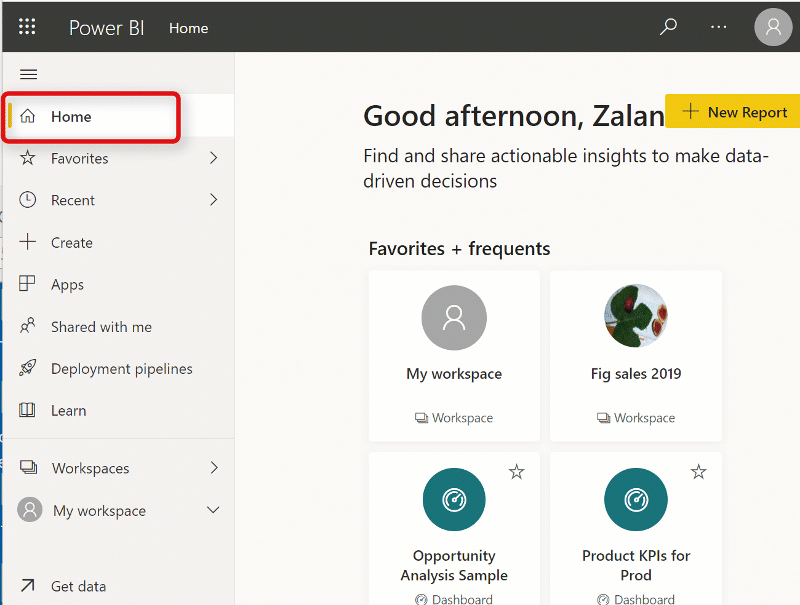
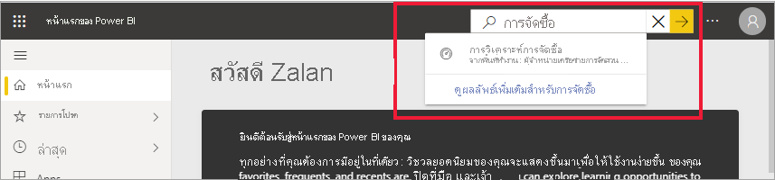

# ค้นหาแดชบอร์ด รายงาน และแอปของคุณFind your dashboards, reports, and apps

[!INCLUDE[consumer-appliesto-yynn](../includes/consumer-appliesto-yynn.md)]
ใน Power BI คำว่า *เนื้อหา* หมายถึงแอป แดชบอร์ด และรายงานIn Power BI, the term *content* refers to apps, dashboards, and reports. *ผู้ออกแบบ* Power BI จะสร้างเนื้อหาขึ้น ซึ่งจะใช้งานร่วมกับเพื่อนร่วมงานเช่นคุณContent is created by Power BI *designers*, who share it with colleagues like you. เนื้อหาของคุณสามารถเข้าถึงได้และดูได้จากบริการของ Power BI ซึ่งสถานที่ที่ดีที่สุดในการเริ่มต้นทำงานใน Power BI ก็คือจาก **หน้าแรก** ของ Power BIYour content is accessible and viewable in the Power BI service, and the best place to start working in Power BI is from Power BI **Home**.

## สำรวจหน้าแรกของ Power BIExplore Power BI Home
หลังจากที่คุณลงชื่อเข้าใช้บริการของ Power BI ให้เลือก **หน้าแรก** จากบานหน้าต่างนำทางAfter you sign in to the Power BI service, select **Home** from the navigation pane. 

Power BI จะแสดงพื้นที่ทำงานของหน้าแรกของคุณดังแสดงในรูปต่อไปนี้Power BI displays your Home canvas, as shown in the following image. เค้าโครงและเนื้อหาบนหน้าแรกจะแตกต่างกันสำหรับผู้ใช้ทุกคนThe layout and content on Home is different for every user. ภายหลังในบทความนี้ เราจะเห็นหน้าแรกสำหรับผู้ใช้ใหม่และสำหรับผู้ใช้ที่มีประสบการณ์มากLater in this article, we'll see Home for a brand new user and for a very experienced user. 
 

หน้าแรกของ Power BI จะมีในการค้นหาและดูเนื้อหาของคุณอยู่สามวิธีPower BI Home offers three different ways of locating and viewing your content. ทั้งสามวิธีจะเข้าสู่กลุ่มเนื้อหาเดียวกัน จะแตกต่างกันแค่วิธีในการรับเนื้อหานั้นเท่านั้นAll three access the same pool of content, they're merely different ways of getting to that content. ในบางครั้ง การค้นหาจะเป็นวิธีที่ง่ายและรวดเร็วที่สุดในการค้นหาบางสิ่ง ในขณะที่บางครั้ง การเลือก *การ์ด* บนพื้นที่ทำงานของหน้าแรกจะเป็นตัวเลือกที่ดีที่สุดของคุณOccasionally, searching will be the easiest and quickest way to find something, while other times, selecting a *card* on the Home canvas will be your best option.

- พื้นที่ทำงานของหน้าแรกจะแสดงและจัดการเนื้อหาที่คุณชื่นชอบ เข้าบ่อย เข้าล่าสุด และที่แนะนำพร้อมกับแอปและพื้นที่ทำงานThe Home canvas displays and organizes your favorite, frequent, recent, and recommended content, along with apps and workspaces.  ถ้าคุณเพิ่งเริ่มใช้บริการ Power BI คุณจะมีส่วนการเริ่มต้นใช้งานด้วยIf you're new to the Power BI service, you'll also have a Getting started section. เลือกการ์ด หรือข้อมูลในรายการเพื่อเปิดSelect a card, or an item in a list, to open it.
- ที่ด้านซ้ายจะเป็นหน้าต่างนำทาง ที่เรียกว่าแถบนำทางAlong the left side, is a navigation pane, referred to as the nav pane. เลือกSelect  เพื่อขยายบานหน้าต่างนำทางto expand the nav pane. ในบานหน้าต่างนำทางนี้ จะมีการจัดเรียงเนื้อหาเดิมของคุณในรูปแบบที่แตกต่างออกไปเล็กน้อย โดยจะเรียงเป็นรายการโปรด ล่าสุด แอป และแชร์กับฉันOn the nav pane, your same content is organized a little differently, by Favorites, Recent, Apps, and Shared with me. จากที่นี่ คุณสามารถดูรายชื่อและเลือกเนื้อหาที่ต้องการเปิดได้From here, you can view lists of content and select the one to open.
- ที่มุมขวาบน จะมีกล่องค้นหาส่วนกลางที่ช่วยให้คุณสามารถค้นหาเนื้อหาตามชื่อเรื่อง ชื่อ หรือคำสำคัญได้In the upper right corner, the global search box lets you search for content by title, name, or keyword.

หัวข้อต่อไปนี้จะเป็นการตรวจสอบตัวเลือกเหล่านี้แต่ละข้อเพื่อการค้นหาและการดูเนื้อหาThe following topics review each of these options for finding and viewing content.

## พื้นที่ทำงานของหน้าหลักHome canvas
คุณจะสามารถเห็นเนื้อหาทั้งหมดที่คุณได้รับอนุญาตให้ใช้งานได้จากบนพื้นที่ทำงานของหน้าแรกนี้On the Home canvas, you can view all the content that you have permission to use. พื้นที่ทำงานของหน้าแรกของคุณจะมีการอัปเดตเนื้อหาที่แนะนำและแหล่งข้อมูลการเรียนรู้ให้ด้วยYour Home canvas also updates with recommended content and learning resources. ในตอนแรก คุณอาจไม่มีเนื้อหาจำนวนมากบนพื้นที่ทำงานของคุณ แต่จะเปลี่ยนไปเมื่อคุณเริ่มใช้ Power BI กับเพื่อนร่วมงานของคุณAt first, you might not have much content on your Home canvas, but that will change as you start to use Power BI with your colleagues.

 
เมื่อคุณทำงานในบริการของ Power BI คุณจะได้รับแดชบอร์ด รายงาน และแอปจากเพื่อนร่วมงาน จากนั้นหน้าแรกของคุณจะค่อยๆ เติมเต็มในที่สุดAs you work in the Power BI service, you'll receive dashboards, reports, and apps from colleagues, and then Power BI Home will eventually fill in. เมื่อเวลาผ่านไป อาจมีลักษณะดังนี้Over time, it might resemble the following.

 
หัวข้อถัดไปจะเป็นการศึกษาหน้าแรกอย่างใกล้ชิดสำหรับผู้ใช้ที่มีประสบการณ์ ตั้งแต่ด้านบนลงจนถึงด้านล่างThe next few topics take a closer look at Home for an experienced user, from top to bottom.

## เนื้อหาที่สำคัญที่สุดอยู่ใกล้เพียงปลายนิ้วของคุณMost important content at your fingertips

### รายการโปรดและรายการที่ใช้บ่อยFavorites and frequents
ส่วนบนสุดนี้ประกอบด้วยลิงก์ไปยังเนื้อหาที่คุณเยี่ยมชมบ่อยที่สุดหรือเนื้อหาที่คุณแท็กไว้ว่าเป็นเนื้อหา[เด่นหรือรายการโปรด](end-user-favorite.md)This top section contains links to the content that you visit most often or that you've tagged as [featured or favorite](end-user-favorite.md). โปรดสังเกตว่าการ์ดหลายใบมีดาวสีดำ เนื่องจากการ์ดเหล่านั้นได้รับการแท็กเป็นรายการโปรดNotice that several cards have black stars; they've been tagged as favorites. 

นอกจากนี้ คุณสามารถแท็กเนื้อหาเป็น [ที่โดดเด่น](end-user-featured.md) ได้Additionally, you can tag content as [featured](end-user-featured.md). เลือกแดชบอร์ดหรือรายงานหนึ่งรายการที่คุณคาดว่าจะดูบ่อยที่สุด และตั้งเป็นเนื้อหา *ที่โดดเด่น* ของคุณPick the one dashboard or report that you expect to view most often, and set it as your *featured* content. แต่ละครั้งที่คุณเปิดบริการของ Power BI แดชบอร์ดที่โดดเด่นของคุณจะปรากฏเป็นรายการแรกEach time you open the Power BI service, your featured dashboard will display first. 

### แนะนำFeatured
ส่วนที่ **นำเสนอ** มีเนื้อหาที่ผู้ดูแลระบบของคุณ *เลื่อนระดับ* ไปที่หน้าหลักของคุณThe **Featured** section contains content that your administrator has *promoted* to your Home. โดยทั่วไป นี่คือเนื้อหาที่สำคัญหรือเป็นประโยชน์ต่อการทำงานของคุณTypically, this is content that is important or helpful for you to do your job. ในตัวอย่างนี้ เนื้อหาที่นำเสนอจะมีมาตรวัดเพื่อติดตามความสำเร็จIn this example, the featured content includes metrics to track success.

### ล่าสุด แชร์กับฉัน และแอปของฉันRecents, Shared with me, and My apps
ส่วนถัดไปคือรายการแบบแท็บThe next section is a tabbed list. 
- **ล่าสุด** คือเนื้อหาที่คุณเข้าชมล่าสุด**Recent** is the content you've visited most recently. โปรดสังเกตประทับเวลาของแต่ละรายการNotice the timestamp for each item. 
- เพื่อนร่วมงานสามารถแชร์แอปกับคุณ รวมถึงสามารถแชร์แดชบอร์ดและรายงานของแต่ละคนได้ด้วยColleagues share apps with you, but they can also share individual dashboards and reports. ในส่วน **แชร์กับฉัน** คุณจะเห็นแดชบอร์ดและรายงานที่เพื่อนร่วมงานของคุณได้แชร์กับคุณIn the **Shared with me** section, you'll find dashboards and  reports that your colleagues have shared with you. 
- ส่วน **แอปของฉัน** จะแสดงรายการแอปที่แชร์กับคุณหรือที่คุณได้ [ดาวน์โหลดมาจาก AppSource](end-user-apps.md) ซึ่งจะแสดงแอปล่าสุดไว้ที่นี่The **My apps** section lists apps that have been shared with you or that you've [downloaded from AppSource](end-user-apps.md); the most recent apps are listed here. 

### พื้นที่ทำงานWorkspaces
ผู้ใช้ Power BI service ทุกคนจะมี **My workspace**Every Power BI service user has one **My workspace**. **พื้นที่ทำงานของฉัน** จะมีเนื้อหาหากคุณดาวน์โหลดตัวอย่าง Microsoft หรือสร้างแดชบอร์ด รายงาน หรือแอปของคุณเอง**My workspace** will only contain content if you've downloaded Microsoft samples or created your own dashboards, reports, or apps. สำหรับ *ผู้ใช้ทางธุรกิจ* หลายคน **My workspace** จะว่างเปล่าและจะยังคงไม่มีข้อมูลใด ๆFor many *business users*, **My workspace** will be empty and will remain empty. หากคุณเป็นผู้ใช้ใหม่ คุณจะมีพื้นที่ทำงานเดียวคือ **My workspace**If you're a brand new user, you will only have one workspace, **My workspace** 

และถ้าคุณเลือกหนึ่งในพื้นที่ทำงานนั้น คุณจะพบว่าไม่มีอะไรอยู่ในนั้นAnd if you select that one workspace, you'll find it empty.

แต่ละครั้งที่คุณ [ดาวน์โหลดแอป](end-user-app-marketing.md)หรือ [แอปได้รับการแชร์กับคุณ](end-user-apps.md) พื้นที่ทำงานใหม่จะถูกสร้างขึ้นEach time you [download an app](end-user-app-marketing.md), or an [app is shared with you](end-user-apps.md), a new workspace is created. เมื่อเวลาผ่านไป คุณจะมีพื้นที่ทำงานมากกว่าหนึ่งแห่งOver time, you'll have more than one workspace. หากต้องการเปิด *แอปพื้นที่ทำงาน* ให้เลือกจากพื้นที่ทำงานบนหน้าแรกของคุณTo open an *app workspace*, select it on your Home canvas. 

แอปจะเปิดบนพื้นที่ทำงานของคุณและคุณสามารถดูชื่อของพื้นที่ทำงานที่แสดงอยู่ในแถบนำทางของคุณได้The app opens on your canvas and you can see the name of the workspace listed on your nav pane. ภายในพื้นที่ทำงาน บริการของ Power BI แยกเนื้อหาของคุณตามประเภท: แดชบอร์ดและรายงานWithin workspaces, the Power BI service separates your content by type: dashboards and reports. ในบางกรณี คุณยังมีสมุดงานและชุดข้อมูลด้วยIn some cases, you'll also have workbooks and datasets. คุณจะเห็นองค์กรนี้เมื่อคุณเลือกพื้นที่ทำงานหนึ่งYou'll see this organization when you select a workspace. ในตัวอย่างนี้ พื้นที่ทำงาน **เครือข่ายการจัดสวน** มีสี่แดชบอร์ดและสองรายงานIn this example, the **Gardening chain** workspace contains four dashboards and two reports.

### แอปที่แนะนำRecommended apps
ตามการตั้งค่าบัญชีผู้ใช้และกิจกรรม ทาง Power BI จะแสดงชุดของแอปที่แนะนำBased on your activity and account settings, Power BI displays a set of recommended apps. การเลือกการ์ดแอปจะเป็นการเปิดแอปSelecting an app card opens the app. แอปที่มีไอคอนสีน้ำเงินคือ[แอปเทมเพลต](../connect-data/service-template-apps-overview.md)Apps with the blue icon are [template apps](../connect-data/service-template-apps-overview.md).

 
### ทำความรู้จักกับแหล่งข้อมูลการเรียนรู้Getting started learning resources
แหล่งข้อมูลที่ถูกต้องตรงกันจะปรากฏขึ้นตามกิจกรรม การตั้งค่า และผู้ดูแลระบบ Power BI ของคุณThe exact resources that appear depend on your activity, settings, and Power BI administrator. หากคุณเป็นผู้ใช้ใหม่ ส่วนการเริ่มต้นใช้งานจะปรากฏที่ด้านบนของหน้าแรกIf you're a new user, the Getting started section displays at the top of Home. หากคุณเป็นผู้ใช้ใหม่และคุณไม่ต้องการเห็นการเริ่มต้นใช้งานที่ด้านบนของหน้าแรกอีกต่อไป ให้เลือก **ตรึงไว้ที่ด้านล่าง**If you're a new user, and you no longer want to see Getting started at the top of Home, select **Pin to bottom**.
 
## สำรวจบานหน้าต่างนำทางExplore the nav pane

บานหน้าต่างนำทาง (nav pane) จะแยกประเภทเนื้อหาของคุณในรูปแบบที่ช่วยให้คุณสามารถค้นหาสิ่งที่คุณต้องการได้อย่างรวดเร็วThe nav pane classifies your content in ways that help you find what you need, quickly.  

ใช้บานหน้าต่างนำทางเพื่อค้นหาและย้ายระหว่างแดชบอร์ด รายงาน และแอปUse the nav pane to locate and move between dashboards, reports, and apps. ในบางครั้ง การใช้บานหน้าต่างนำทางจะเป็นวิธีที่เร็วที่สุดในการเข้าถึงเนื้อหาOccasionally, using the nav pane will be the quickest way to get to content. แถบนำทางจะปรากฏขึ้นเมื่อคุณเปิดหน้าแรกของคุณ และจะยังคงอยู่เช่นนั้นเมื่อคุณเปิดพื้นที่อื่นในบริการของ Power BI The nav pane is there when you open your Home landing page, and remains there as you open other areas of the Power BI service. สามารถยุบลงได้โดยการเลือกไอคอนซ่อนIt can be collapsed by selecting the Hide icon  ..
  
บานหน้าต่างนำทางจัดระเบียบเนื้อหาของคุณไว้เป็นคอนเทนเนอร์คล้ายกับที่คุณได้เห็นในพื้นที่ทำงานหน้าแรก: รายการโปรด ล่าสุด แอป แชร์กับฉัน และพื้นที่ทำงานThe nav pane organizes your content into containers that are similar to what you've already seen on the Home canvas: Favorites, Recent, Apps, Shared with me, and workspaces. การใช้เมนูลอย (flyout) จะช่วยให้คุณสามารถดูได้เฉพาะเนื้อหาล่าสุดของแต่ละคอนเทนเนอร์เหล่านี้ หรือคุณสามารถนำทางไปยังรายการเนื้อหาเพื่อดูเนื้อหาทั้งหมดของแต่ละคอนเทนเนอร์ได้Using the flyouts, you can view just the most-recent content in each of these containers, or you can navigate to content lists to see all content for each container category.
 
- หากต้องการเปิดเนื้อหาหนึ่งในส่วนเนื้อหาเหล่านี้ และแสดงรายการทั้งหมด ให้เลือกหัวเรื่องTo open one of these content sections and display a list of all items, select the heading.
- หากต้องการดูเนื้อหาล่าสุดในแต่ละคอนเทนเนอร์ ให้เลือกเมนูลอย ( **>** )To see the most recent in each container, select the flyout (**>**).

    

 
บานหน้าต่างนำทางเป็นอีกวิธีหนึ่งในการค้นหาเนื้อหาที่คุณต้องการได้อย่างรวดเร็วThe nav pane is another way for you to find the content you want, quickly. เนื้อหาจะถูกจัดเรียงไว้ในลักษณะที่คล้ายกับพื้นที่ทำงานของหน้าแรก แต่แสดงเป็นรายการแทนที่จะเป็นการ์ดContent is organized in a manner similar to the Home canvas, but shown in lists instead of cards. 

## ค้นหาเนื้อหาของคุณทั้งหมดSearch all of your content
บางครั้ง วิธีที่เร็วที่สุดในการค้นหาเนื้อหาของคุณคือการค้นหาSometimes, the fastest way to find your content is to search for it. เช่น คุณอาจพบว่าแดชบอร์ดที่คุณไม่ได้ใช้งานมาสักพักหนึ่งหายไปจากพื้นที่ทำงานของคุณFor example, perhaps you've discovered that a dashboard you haven't used in a while isn't showing up on your Home canvas. หรือบางทีคุณอาจจำได้ว่า แอรอน เพื่อนร่วมงานของคุณแชร์บางอย่างกับคุณ แต่คุณจำไม่ได้ว่าเนื้อหานั้นชื่ออะไร หรือไม่แน่ใจว่าชนิดของเนื้อหาที่เขาแชร์นั้นเป็นแดชบอร์ดหรือรายงานOr, perhaps you remember that your colleague, Aaron, shared something with you, but you don't remember what he called it or what type of content he shared, whether it was a dashboard or a report. หรือคุณอาจมีเนื้อหาจำนวนมากมากจนทำให้เป็นการง่ายกว่าที่จะค้นหาแทนที่จะเลื่อนหรือเรียงลำดับOr you may have so much content that it's easier to search than it is to scroll or sort. 
 
เขตข้อมูลการค้นหาจะอยู่ในส่วนด้านขวาบนของแถบเมนูหน้าแรกThe search field is located in the upper right section of the Home menu bar. คุณสามารถใส่ชื่อทั้งหมดหรือบางส่วนของแดชบอร์ดนั้นและทำการค้นหาYou can enter the full or partial name of that dashboard and search for it. นอกจากนี้ คุณยังสามารถใส่ชื่อของเพื่อนร่วมงานของคุณ และค้นหาเนื้อหาที่พวกเขาแชร์กับคุณได้Additionally, you can enter your colleague's name and search for content that they have shared with you. การค้นหาเป็นขอบเขตการค้นหารายการที่ตรงกันในเนื้อหาทั้งหมดที่คุณเป็นเจ้าของ หรือมีสิทธิ์เข้าถึงThe search is scoped to look for matches in all the content that you own or have access to.

## ขั้นตอนถัดไปNext steps
ภาพรวมของ[แนวคิดพื้นฐานของ Power BI](end-user-basic-concepts.md)Overview of the [Power BI basic concepts](end-user-basic-concepts.md)

เนื้อหาจะแสดงเป็น *การ์ด* หรือรายการContent displays as either a *card* or a list. การ์ดมีชื่อเรื่องและไอคอนCards have a title and icon. การเลือกการ์ดจะเปิดเนื้อหานั้นSelecting a card opens that content.