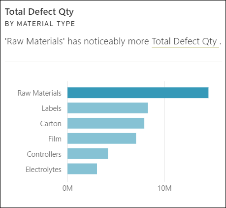
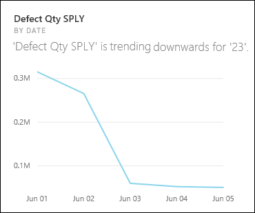
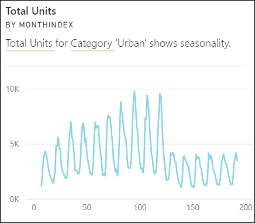
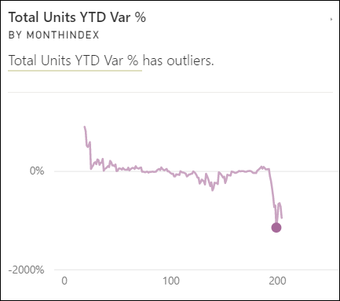

# ชนิดของข้อมูลเชิงลึกด่วนที่ได้รับการสนับสนุนโดย Power BITypes of insights supported by Power BI

[!INCLUDE[consumer-appliesto-yyny](../includes/consumer-appliesto-yyny.md)]

คุณสามารถขอให้ Power BI ค้นหาข้อมูลของคุณ และค้นหาแนวโน้มและรูปแบบที่น่าสนใจได้You can ask Power BI to look through your data and find interesting trends and patterns. แนวโน้มและรูปแบบเหล่านี้จะแสดงในรูปแบบของวิชวลที่เรียกว่า *ข้อมูลเชิงลึก*These trends and patterns are presented in the form of visuals that are called *Insights*. 

หากต้องการเรียนรู้วิธีการใช้ข้อมูลเชิงลึก โปรดดู [Power BI Insights](end-user-insights.md)To learn how to use Insights, see [Power BI Insights](end-user-insights.md)

## ข้อมูลเชิงลึกทำงานอย่างไรHow does Insights work?
Power BI จะค้นหาชุดข้อมูลย่อยที่แตกต่างกันของคุณได้อย่างรวดเร็วPower BI quickly searches different subsets of your dataset. ในขณะที่ค้นหา Power BI จะใช้ชุดของอัลกอริทึมที่มีความซับซ้อนเพื่อค้นหาข้อมูลเชิงลึกที่น่าสนใจAs it searches, Power BI applies a set of sophisticated algorithms to discover potentially interesting insights. *ผู้ใช้งาน Power BI แบบธุรกิจ* สามารถเรียกใช้ข้อมูลเชิงลึกบนไทล์แดชบอร์ดได้Power BI *business users* can run Insights on dashboard tiles.

## คำศัพท์บางคำSome terminology
Power BI ใช้อัลกอริทึมเชิงสถิติเพื่อเปิดเผยข้อมูลเชิงลึกPower BI uses statistical algorithms to uncover  Insights. อัลกอริทึมอยู่ในรายการและอธิบายไว้ในส่วนถัดไปของบทความนี้The algorithms are listed and described in the next section of this article. ก่อนที่เราจะไปยังอัลกอริทึม ต่อไปนี้เป็นข้อกำหนดสำหรับคำศัพท์บางคำที่อาจไม่คุ้นเคยBefore we get to the algorithms, here are definitions for some terms that may be unfamiliar. 

* **หน่วยวัด** - หน่วยวัดคือเขตข้อมูลเชิงปริมาณ (ตัวเลข) ที่สามารถใช้ในการคำนวณได้**Measure** - a measure is a quantitative (numeric) field that can be used to do calculations. การคำนวณทั่วไปคือ ผลรวม ค่าเฉลี่ย และต่ำสุดCommon calculations are sum, average, and minimum. ตัวอย่างเช่น หากบริษัทของเราผลิตและขายสเก็ตบอร์ด หน่วยวัดของเราอาจเป็นจำนวนสเก็ตบอร์ดที่ขายและกำไรเฉลี่ยต่อปีFor example, if our company makes and sells skateboards, our measures might be number of skateboards sold and average profit per year.  
* **มิติ** - มิติคือข้อมูลจัดกลุ่ม (ข้อความ)**Dimension** - dimensions are categorical (text) data. มิติจะอธิบายบุคคล วัตถุ รายการ ผลิตภัณฑ์ สถานที่ และเวลาA dimension describes a person, object, item, products, place, and time. ในชุดข้อมูล มิติเป็นวิธีการจัดกลุ่ม *หน่วยวัด* เป็นหมวดหมู่ที่มีประโยชน์In a a dataset, dimensions are a way to group *measures* into useful categories. สำหรับบริษัทสเก็ตบอร์ดของเรา บางมิติอาจรวมถึงการดูยอดขาย (หน่วยวัด) ตามแบบจำลอง สี ประเทศ หรือแคมเปญการตลาดFor our skateboard company, some dimensions might include looking at sales (a measure) by model, color, country, or marketing campaign.   
* **สหสัมพันธ์** - สหสัมพันธ์บอกให้เราทราบว่าพฤติกรรมของสิ่งต่างๆ มีความเกี่ยวข้องกันอย่างไร**Correlation** - a correlation tells us how the behavior of things are related.  ถ้ารูปแบบของการเพิ่มขึ้นและลดลงคล้ายกันแล้ว พวกเขาจะมีความสัมพันธ์เชิงบวกIf their patterns of increase and decrease are similar, then they are positively correlated. และถ้ารูปแบบของพวกเขาตรงกันข้าม พวกเขาจะมีความสัมพันธ์เชิงลบAnd if their patterns are opposite, then they are negatively correlated. ตัวอย่างเช่น ถ้ายอดขายของสเก็ตบอร์ดสีแดงของเราเพิ่มขึ้นแต่ละครั้งที่เราดำเนินแคมเปญการตลาดทางโทรทัศน์ หมายความว่ายอดขายของสเก็ตบอร์ดสีแดงและแคมเปญทางโทรทัศน์มีความสัมพันธ์เชิงบวกกันFor example, if sales of our red skateboard increase each time we run a tv marketing campaign, then sales of the red skateboard and the tv campaign are positively correlated.
* **อนุกรมเวลา** - อนุกรมเวลาคือวิธีการแสดงเวลาเป็นจุดข้อมูลที่ต่อเนื่องกัน**Time series** - a time series is a way of displaying time as successive data points. จุดข้อมูลเหล่านั้นอาจเพิ่มขึ้น เช่น วินาที ชั่วโมง เดือน หรือปีThose data points could be increments such as seconds, hours, months, or years.  
* **ตัวแปรต่อเนื่อง** - ตัวแปรแบบต่อเนื่องสามารถเป็นค่าใดก็ตามที่อยู่ระหว่างขีดจำกัดต่ำสุดและสูงสุด มิฉะนั้นจะเป็นตัวแปรที่ไม่ต่อเนื่อง**Continuous variable** - a continuous variable can be any value between its minimum and maximum limits, otherwise it is a discrete variable. ตัวอย่างคือ อุณหภูมิ น้ำหนัก อายุ และเวลาExamples are temperature, weight, age, and time. ตัวแปรแบบต่อเนื่องสามารถประกอบด้วยเศษหรือส่วนของตัวแปรได้Continuous variables can include fractions or portions of the value. จำนวนสเก็ตบอร์ดสีน้ำเงินทั้งหมดที่ขายได้เป็นตัวแปรแบบไม่ต่อเนื่องเนื่องจากเราไม่สามารถขายสเก็ตบอร์ดครึ่งตัวได้The total number of blue skateboards sold is a discrete variable since we can't sell half a skateboard.  

## คุณสามารถพบข้อมูลเชิงลึกประเภทใดบ้าง?What types of insights can you find?
นี่คืออัลกอริทึมที่ Power BI ใช้These are the algorithms that Power BI uses. 

### ประเภทข้อมูลที่ผิดปกติ (บน/ล่าง)Category outliers (top/bottom)
ไฮไลต์กรณีที่หนึ่งหรือสองหมวดหมู่มีค่ามากกว่าหมวดหมู่อื่นHighlights cases where one or two categories have much larger values than other categories.  

### เปลี่ยนจุดในชุดข้อมูลเวลาChange points in a time series
ไฮไลต์เมื่อมีการเปลี่ยนแปลงที่สำคัญในแนวโน้มในชุดข้อมูลเวลาHighlights when there are significant changes in trends in a time series of data.

### สหสัมพันธ์Correlation
ตรวจพบกรณีที่หน่วยวัดหลายตัวแสดงรูปแบบหรือแนวโน้มที่คล้ายกันเมื่อพล็อตกับหมวดหมู่หรือค่าในชุดข้อมูลDetects cases where multiple measures show a similar pattern or trend when plotted against a category or value in the dataset.

### ผลต่างต่ำLow Variance
ตรวจหากรณีที่จุดข้อมูลสำหรับมิติอยู่ไม่ไกลจากค่าเฉลี่ย ดังนั้น "ความแปรปรวน" จึงมีค่าต่ำDetects cases where data points for a dimension aren't far from the mean, so the "variance" is low. สมมติว่าคุณมีหน่วยวัด "ยอดขาย" และมิติ "ภูมิภาค"Let's say you have the measure "sales" and a dimension "region". และเมื่อมองไปทั่วภูมิภาคคุณจะเห็นว่ามีจุดแตกต่างกันเล็กน้อยระหว่างจุดข้อมูลกับค่าเฉลี่ย (ของจุดข้อมูล)And looking across region you see that there is very little difference between the data points and the mean (of the data points). ข้อมูลเชิงลึกจะทริกเกอร์เมื่อความแปรปรวนของยอดขายในทุกภูมิภาคต่ำกว่าค่าเกณฑ์The insight triggers when the variance of sales across all regions is below a threshold. กล่าวคือ เมื่อยอดขายใกล้เคียงกันในทุกภูมิภาคIn other words, when sales are pretty similar across all regions.

### ส่วนหลัก (ปัจจัยหลัก)Majority (Major factors)
ค้นหากรณีที่ส่วนใหญ่ของค่าทั้งหมดสามารถเกิดจากการคูณเดียวเมื่อแบ่งย่อยตามขนาดอื่นFinds cases where a majority of a total value can be attributed to a single factor when broken down by another dimension.  

### ค่าผิดปกติOutliers
ประเภทข้อมูลเชิงลึกนี้ใช้แบบจำลองคลัสเตอร์เพื่อค้นหาค่าผิดปกติในข้อมูลอนุกรมที่ไม่ใช่เวลาThis insight type uses a clustering model to find outliers in non-time series data. ค่าผิดปกติตรวจพบเมื่อมีหมวดหมู่เฉพาะที่มีค่าแตกต่างจากหมวดหมู่อื่นอย่างมีนัยสำคัญOutliers detects when there are specific categories with values significantly different than the other categories.

### แนวโน้มโดยรวมในชุดข้อมูลเวลาOverall trends in time series
ตรวจพบแนวโน้มขึ้น หรือลงในชุดข้อมูลเวลาDetects upward or downward trends in time series data.

### กาลในชุดข้อมูลเวลาSeasonality in time series
ค้นหารูปแบบเป็นครั้งคราวในข้อมูลชุดข้อมูลเวลา เช่นกาลรายสัปดาห์ เดือน หรือรายปีFinds periodic patterns in time series data, such as weekly, monthly, or yearly seasonality.

### การแชร์แบบคงที่Steady share
ไฮไลต์กรณีมีความสัมพันธ์หลัก-รองระหว่างใช้ร่วมกันของค่ารองสัมพันธ์กับค่าโดยรวมของค่าหลักระหว่างตัวแปรอย่างต่อเนื่องHighlights cases where there is a parent-child correlation between the share of a child value in relation to the overall value of the parent across a continuous variable. ข้อมูลเชิงลึกเกี่ยวกับการแชร์แบบคงที่จะนำไปใช้กับบริบทของหน่วยวัด มิติ และมิติวันที่/เวลาอื่นThe steady share insight applies to the context of a measure, a dimension, and another date/time dimension. ข้อมูลเชิงลึกนี้จะทริกเกอร์เมื่อมีค่ามิติเฉพาะเช่น "ภูมิภาคตะวันออก" มีเปอร์เซ็นต์คงที่ของยอดขายโดยรวมในมิติวันที่/เวลานั้นThis insight triggers when a particular dimension value, e.g. "the east region", has a steady percentage of overall sales across that date/time dimension.

ข้อมูลเชิงลึกเกี่ยวกับการแชร์แบบคงที่จะคล้ายกับข้อมูลเชิงลึกผลต่างต่ำเนื่องจากทั้งสองเกี่ยวข้องกับการขาดความแปรปรวนของค่าตลอดเวลาThe steady share insight is similar to the low variance insight, because they both relate to the lack of variance of a value across time. อย่างไรก็ตามข้อมูลเชิงลึกที่ใช้ร่วมกันจะวัดความแตกต่างของ **เปอร์เซ็นต์ของทั้งหมด** ในระหว่างช่วงเวลา ในขณะที่ข้อมูลเชิงลึกของผลต่างต่ำวัดความแปรปรวนของค่าหน่วยวัดแบบสัมบูรณ์ในมิติHowever, the steady share insight measures the lack of variance of the **percentage of overall** across time, while the low variance insight measures the lack of variance of the absolute measure values across a dimension.

### ข้อมูลชุดเวลาที่ผิดปกติTime series outliers
สำหรับข้อมูลทั่วทั้งชุดข้อมูลเวลา ตรวจพบเมื่อมีการระบุวันที่หรือเวลา ด้วยค่าที่แตกต่างอย่างมากจากค่าวันที่/เวลาอื่น ๆFor data across a time series, detects when there are specific dates or times with values significantly different than the other date/time values.

## ขั้นตอนถัดไปNext steps
[ข้อมูลเชิงลึกที่ power BIPower BI insights](end-user-insights.md)

มีคำถามเพิ่มเติมหรือไม่More questions? [ลองไปที่ชุมชน Power BITry the Power BI Community](https://community.powerbi.com/)

