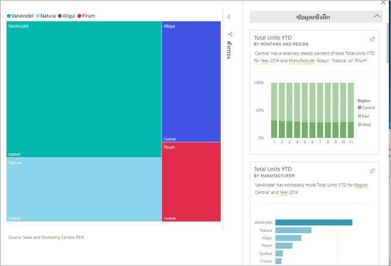
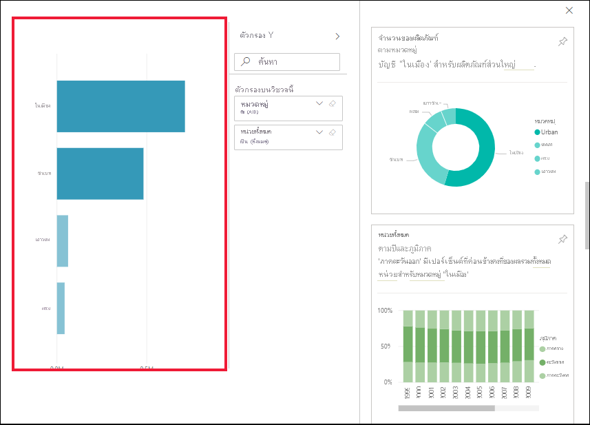

# ดูข้อมูลเชิงลึกบนไทล์แดชบอร์ดด้วย Power BIView data insights on dashboard tiles with Power BI

[!INCLUDE[consumer-appliesto-yyny](../includes/consumer-appliesto-yyny.md)]

[ไทล์](end-user-tiles.md)การแสดงผลแต่ละส่วนที่แดชบอร์ดของคุณจะเป็นช่องทางไปสู่การสืบค้นข้อมูลEach visual [tile](end-user-tiles.md) on your dashboard is a doorway into data exploration. เมื่อคุณเลือกไทล์ รายงานจะถูกเปิดขึ้นมา หรือเป็นการ[เปิดส่วนถามตอบ](end-user-q-and-a.md)เพื่อให้คุณสามารถกรอกและจัดเรียงและเจาะรายละเอียดชุดข้อมูลในรายงานดังกล่าวWhen you select a tile, it opens a report or [opens Q&A](end-user-q-and-a.md) where you can filter and sort and dig into the dataset behind the report. และเมื่อคุณเรียกใช้ข้อมูลเชิงลึก Power BI จะสำรวจข้อมูลให้คุณAnd when you run insights, Power BI does the data exploration for you.

เรียกใช้ข้อมูลเชิงลึกเพื่อจัดทำส่วนการแสดงผลอินเทอร์แอคทีฟที่น่าสนใจที่ยึดตามข้อมูลของคุณRun insights to generate interesting interactive visuals based on your data. สามารถเรียกใช้ข้อมูลเชิงลึกบนไทล์ของแดชบอร์ดเฉพาะและคุณยังสามารถเรียกใช้ข้อมูลเชิงลึกในข้อมูลเชิงลึกได้!Insights can be run on a specific dashboard tile and you can even run insights on an insight!

ฟีเจอร์ข้อมูลเชิงลึกมีอยู่แล้วภายในการเติบโต[ชุดของอัลกอริทึมวิเคราะห์ขั้นสูง](end-user-insight-types.md)พัฒนาขึ้นร่วมกับ Microsoft ค้นคว้าที่เราจะยังคงใช้การอนุญาตให้บุคคลเพิ่มเติมเมื่อต้องการค้นหาข้อมูลเชิงลึกในข้อมูลของพวกเขาในด้วยวิธีใหม่ ๆThe insights feature is built on a growing [set of advanced analytical algorithms](end-user-insight-types.md) developed in conjunction with Microsoft Research that we'll continue to use to allow more people to find insights in their data in new and intuitive ways.

## เรียกใช้ข้อมูลเชิงลึกบนไทล์แดชบอร์ดRun insights on a dashboard tile
เมื่อคุณเรียกใช้ข้อมูลเชิงลึกบนไทล์ของแดชบอร์ด Power BI จะค้นหาเฉพาะข้อมูลที่ใช้ในการสร้างไทล์ของแดชบอร์ดเดียวWhen you run insights on a dashboard tile, Power BI searches just the data used to create that single dashboard tile. 

1. [เปิดแดชบอร์ด](end-user-dashboards.md)[Open a dashboard](end-user-dashboards.md).
2. เลื่อนไปเหนือไทล์Hover over a tile. เลือก**ตัวเลือกเพิ่มเติม** (...) และเลือก**ดูข้อมูลเชิงลึก**select **More options** (...), and choose **View insights**. 

    

3. ไทล์เปิดขึ้นใน[โหมดโฟกัส](end-user-focus.md)ด้วยข้อมูลเชิงลึกการ์ดที่แสดงตามแนวทางด้านขวาThe tile opens in [Focus mode](end-user-focus.md) with the insights cards displayed along the right.    
   
        
4. ข้อมูลเชิงลึกกระตุ้นความสนใจของคุณหรือไม่Does one insight pique your interest? เลือกบัตรข้อมูลเชิงลึกเพื่อเจาะลึกเพิ่มเติมSelect that insight card to dig further. ข้อมูลเชิงลึกแสดงทางด้านซ้าย และการ์ดใหม่ เท่านั้นตามข้อมูลในข้อมูลเชิงลึกที่เดียว แสดงตามแนวทางด้านขวาThe selected insight appears on the left and new insight cards, based solely on the data in that single insight, display along the right.    

 ## โต้ตอบกับบัตรข้อมูลเชิงลึกInteract with the insight cards
เมื่อคุณเปิดข้อมูลเชิงลึกแล้ว ให้สำรวจต่อไปOnce you have an insight open, continue exploring.

   * กรองวิชวลบนพื้นที่Filter the visual on the canvas.  แสดงตัวกรอง โดยเลือกลูกศรเพื่อขยายบานหน้าต่างตัวกรองในมุมบนขวาTo display the filters, in the upper right corner, select the arrow to expand the Filters pane.

      
   
   * เรียกใช้ข้อมูลเชิงลึกบนบัตรข้อมูลเชิงลึกRun insights on the insight card itself. ซึ่งมักจะเรียกว่า**ข้อมูลเชิงลึกที่เกี่ยวข้อง**This is often referred to as **related insights**. เลือกการ์ดข้อมูลเชิงลึกเพื่อใช้งานSelect an insight card to make it active. การ์ดจะเลื่อนไปที่ด้านซ้าย และการ์ดใหม่ตามข้อมูลเฉพาะในข้อมูลเชิงลึกนั้นเท่านั้นที่จะแสดงตามแนวทางด้านขวาIt will move to the left side of the report canvas, and new cards, based solely on the data in that single insight,will  display along the right.
   
      
   
     
กลับไปที่รายงานของคุณ โดยเลือก **ออกจากโหมดโฟกัส**จากมุมด้านซ้ายบนTo return to your report, from the upper left corner, select **Exit Focus mode**.

## ข้อควรพิจารณาและการแก้ไขปัญหาConsiderations and troubleshooting
- **ดูข้อมูลเชิงลึก**ใช้ไม่ได้กับชนิดไทล์ของแดชบอร์ดทั้งหมด**View insights** doesn't work with all dashboard tile types. เช่น ไม่พร้อมใช้งานสำหรับวิชวลแบบกำหนดเองของ Power BIFor example, it is not available for Power BI custom visuals.<!--[Power BI visuals](end-user-custom-visuals.md)-->

## ขั้นตอนถัดไปNext steps

เรียกใช้ข้อมูลเชิงลึกบนวิชวลรายงาน [โดยใช้คุณลักษณะการวิเคราะห์](end-user-analyze-visuals.md)  Run insights on report visuals [using the Analyze feature](end-user-analyze-visuals.md)    
เรียนรู้เกี่ยวกับ[ชนิดของข้อมูลเชิงลึกที่พร้อมใช้งาน](end-user-insight-types.md)Learn about the [types of Insights available](end-user-insight-types.md)

