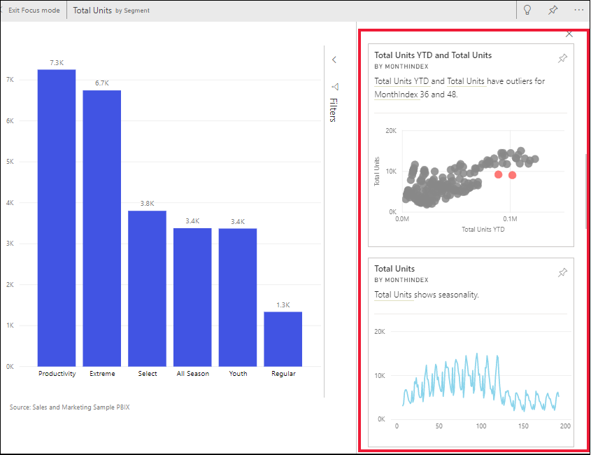

# ดูข้อมูลเชิงลึกบนไทล์แดชบอร์ดด้วย Power BI

[!INCLUDE[consumer-appliesto-yyny](../includes/consumer-appliesto-yyny.md)]

[ไทล์](end-user-tiles.md)การแสดงผลแต่ละส่วนที่แดชบอร์ดของคุณจะเป็นช่องทางไปสู่การสืบค้นข้อมูล เมื่อคุณเลือกไทล์ รายงานจะถูกเปิดขึ้นมา หรือเป็นการ[เปิดส่วนถามตอบ](end-user-q-and-a.md)เพื่อให้คุณสามารถกรอกและจัดเรียงและเจาะรายละเอียดชุดข้อมูลในรายงานดังกล่าว และเมื่อคุณเรียกใช้ข้อมูลเชิงลึก Power BI จะสำรวจข้อมูลให้คุณ

เรียกใช้ข้อมูลเชิงลึกเพื่อจัดทำส่วนการแสดงผลอินเทอร์แอคทีฟที่น่าสนใจที่ยึดตามข้อมูลของคุณ สามารถเรียกใช้ข้อมูลเชิงลึกบนไทล์ของแดชบอร์ดเฉพาะและคุณยังสามารถเรียกใช้ข้อมูลเชิงลึกในข้อมูลเชิงลึกได้!

ฟีเจอร์ข้อมูลเชิงลึกมีอยู่แล้วภายในการเติบโต[ชุดของอัลกอริทึมวิเคราะห์ขั้นสูง](end-user-insight-types.md)พัฒนาขึ้นร่วมกับ Microsoft ค้นคว้าที่เราจะยังคงใช้การอนุญาตให้บุคคลเพิ่มเติมเมื่อต้องการค้นหาข้อมูลเชิงลึกในข้อมูลของพวกเขาในด้วยวิธีใหม่ ๆ

## เรียกใช้ข้อมูลเชิงลึกบนไทล์แดชบอร์ด
เมื่อคุณเรียกใช้ข้อมูลเชิงลึกบนไทล์ของแดชบอร์ด Power BI จะค้นหาเฉพาะข้อมูลที่ใช้ในการสร้างไทล์ของแดชบอร์ดเดียว 

1. [เปิดแดชบอร์ด](end-user-dashboards.md)
2. เลื่อนไปเหนือไทล์ เลือก**ตัวเลือกเพิ่มเติม** (...) และเลือก**ดูข้อมูลเชิงลึก** 

    

3. ไทล์เปิดขึ้นใน[โหมดโฟกัส](end-user-focus.md)ด้วยข้อมูลเชิงลึกการ์ดที่แสดงตามแนวทางด้านขวา    
   
        
4. ข้อมูลเชิงลึกกระตุ้นความสนใจของคุณหรือไม่ เลือกบัตรข้อมูลเชิงลึกเพื่อเจาะลึกเพิ่มเติม ข้อมูลเชิงลึกแสดงทางด้านซ้าย และการ์ดใหม่ เท่านั้นตามข้อมูลในข้อมูลเชิงลึกที่เดียว แสดงตามแนวทางด้านขวา    

 ## โต้ตอบกับบัตรข้อมูลเชิงลึก
เมื่อคุณเปิดข้อมูลเชิงลึกแล้ว ให้สำรวจต่อไป

   * กรองวิชวลบนพื้นที่  แสดงตัวกรอง โดยเลือกลูกศรเพื่อขยายบานหน้าต่างตัวกรองในมุมบนขวา

      
   
   * เรียกใช้ข้อมูลเชิงลึกบนบัตรข้อมูลเชิงลึก ซึ่งมักจะเรียกว่า**ข้อมูลเชิงลึกที่เกี่ยวข้อง** เลือกการ์ดข้อมูลเชิงลึกเพื่อใช้งาน การ์ดจะเลื่อนไปที่ด้านซ้าย และการ์ดใหม่ตามข้อมูลเฉพาะในข้อมูลเชิงลึกนั้นเท่านั้นที่จะแสดงตามแนวทางด้านขวา
   
      
   
     
กลับไปที่รายงานของคุณ โดยเลือก **ออกจากโหมดโฟกัส**จากมุมด้านซ้ายบน

## ข้อควรพิจารณาและการแก้ไขปัญหา
- **ดูข้อมูลเชิงลึก**ใช้ไม่ได้กับชนิดไทล์ของแดชบอร์ดทั้งหมด เช่น ไม่พร้อมใช้งานสำหรับวิชวลแบบกำหนดเองของ Power BI<!--[Power BI visuals](end-user-custom-visuals.md)-->

## ขั้นตอนถัดไป

เรียกใช้ข้อมูลเชิงลึกบนวิชวลรายงาน [โดยใช้คุณลักษณะการวิเคราะห์](end-user-analyze-visuals.md)    
เรียนรู้เกี่ยวกับ[ชนิดของข้อมูลเชิงลึกที่พร้อมใช้งาน](end-user-insight-types.md)

