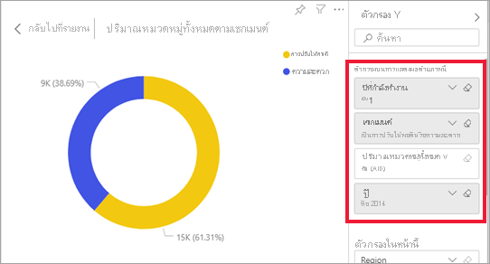

# วิธีการใช้วิชวลกรองข้ามกันในรายงาน Power BIHow visuals cross-filter each other in a Power BI report

[!INCLUDE[consumer-appliesto-yyny](../includes/consumer-appliesto-yyny.md)]

คุณลักษณะยอดเยี่ยมประการหนึ่งของ Power BI คือแนวทางที่ภาพทั้งหมดในหน้ารายงานเชื่อมโยงถึงกันOne of the great features of Power BI is the way all visuals on a report page are interconnected. หากคุณเลือกจุดข้อมูลในภาพภาพหนึ่ง ภาพอื่นทั้งหมดบนหน้าที่มีข้อมูลที่เปลี่ยนไปนั้นตามการเลือกนั้นIf you select a data point on one of the visuals, all the other visuals on the page that contain that data change, based on that selection. 

## การแสดงภาพทำงานโต้ตอบกันอย่างไรHow visuals interact with each other

ตามค่าเริ่มต้นแล้ว การเลือกจุดข้อมูลในการแสดงภาพหนึ่งบนหน้ารายงานจะกรองข้ามหรือไฮไลท์ข้ามการแสดงภาพอื่น ๆ บนหน้าBy default, selecting a data point in one visual on a report page will cross-filter or cross-highlight the other visuals on the page. *ผู้ออกแบบ* รายงานกำหนดการโต้ตอบของภาพบนหน้าไว้แท้จริงอย่างไรExactly how the visuals on a page interact is set by the report *designer*. *ผู้ออกแบบ* มีทางเลือกในการเปิดและปิดการโต้ตอบด้วยภาพ และเปลี่ยนลักษณะงานในการกรองข้าม การไฮไลท์ข้าม และ [การดูข้อมูลแบบเจาะลึก](end-user-drill.md)ตามค่าเริ่มต้น*Designers* have options to turn visual interactions on and off, and to change the default cross-filtering,  cross-highlighting, and [drilling](end-user-drill.md) behavior. 

หากคุณยังไม่พบลำดับชั้นหรือการดูข้อมูลแบบเจาะลึกใด ๆ คุณสามารถเรียนรู้ทั้งหมดได้โดยการอ่านหัวข้อ [ดูข้อมูลแบบเจาะลึกใน Power BI](end-user-drill.md)If you haven't encountered hierarchies or drilling yet, you can learn all about them by reading [drill down in Power BI](end-user-drill.md). 

### การกรองข้ามและการไฮไลต์แบบเชื่อมโยงCross-filtering and cross-highlighting

การกรองข้ามและการไฮไลท์ข้ามมีประโยชน์ในการแสดงให้เห็นว่าค่าหนึ่งในข้อมูลของคุณนั้นมีส่วนเกี่ยวข้องกับค่าอื่นอย่างไรCross-filtering and cross-highlighting can be useful to identify how one value in your data contributes to another. ระบบจะใช้คำว่า *การกรองข้าม* และ *การไฮไลท์ข้าม* เพื่อแยกแยะความแตกต่างระหว่างลักษณะงานที่อธิบายไว้ในส่วนนี้กับสิ่งที่เกิดขึ้นเมื่อคุณใช้บานหน้าต่าง **ตัวกรอง** เพื่อกรองและไฮไลท์ภาพThe terms *cross-filter* and *cross-highlight* are used to distinguish the behavior described here from what happens when you use the **Filters** pane to filter and highlight visuals.  

มากำหนดคำเหล่านี้ตามที่เราได้ดูหน้ารายงานด้านล่างLet's define these terms as we look at the report pages below. แผนภูมิโดนัท “ปริมาณประเภทโดยรวมตามเซกเม้น” มีสองค่า: "การควบคุม" และ "ความสะดวกสบาย"The "Total category volume by segment" doughnut chart has two values: "Moderation" and "Convenience". 

1. มาดูว่าเกิดอะไรขึ้นเมื่อเราเลือก **การควบคุม**Let's see what happens when we select **Moderation**.

    

2. **การกรองข้าม** นำข้อมูลที่ไม่ได้ใช้ออก**Cross-filtering** removes data that doesn't apply. การเลือก **การควบคุม** ในแผนภูมิรูปโดนัทกรองข้ามแผนภูมิแบบเส้นSelecting **Moderation** in the doughnut chart cross-filters the line chart. แผนภูมิแบบเส้นเท่านั้นที่แสดงจุดข้อมูลสำหรับส่วนควบคุมThe line chart now only displays data points for the Moderation segment. 

3. **การไฮไลต์แบบเชื่อมโยง** รักษาจุดข้อมูลดังเดิมแต่ลดส่วนที่ไม่ใช้กับการเลือกของคุณ**Cross-highlighting** retains all the original data points but dims the portion that does not apply to your selection. การเลือก **การควบคุม** ในแผนภูมิรูปโดนัทไฮไลต์แบบเชื่อมโยงแผนภูมิคอลัมน์Selecting **Moderation** in the doughnut chart cross-highlights the column chart. แผนภูมิคอลัมน์ลดข้อมูลทั้งหมดที่ใช้กับเซกเมนต์ความสะดวกและไฮไลต์ข้อมูลทั้งหมดที่ช่วยเซกเมนต์การควบคุมThe column chart dims all the data that applies to the Convenience segment and highlights all the data that applies to the Moderation segment. 

## ข้อควรพิจารณาและการแก้ไขปัญหาConsiderations and troubleshooting
- หากรายงานของคุณมีภาพที่สนับสนุน[การดูข้อมูลแบบเจาะลึก](end-user-drill.md)ตามค่าเริ่มต้น การเข้าถึงรายละเอียดของภาพหนึ่งจะไม่มีผลกระทบต่อภาพอื่น ๆ บนหน้ารายงานดังกล่าวIf your report has a visual that supports [drilling](end-user-drill.md), by default, drilling one visual has no impact on the other visuals on the report page. อย่างไรก็ตาม *ผู้ออกแบบ* รายงาน สามารถเปลี่ยนลักษณะการทำงานนี้ได้ ดังนั้นให้ตรวจสอบภาพที่สามารถเจ้าได้ของคุณเพื่อดูว่า **ตัวกรองภาพที่เจาะได้อื่นๆ** ได้รับการเปิดใช้งานโดย *ผู้ออกแบบ* รายงานHowever, the report *designer* can change this behavior, so check your drillable visuals to see if **drilling filters other visuals** has been enabled by the report *designer*.
    
- ตัวกรองระดับวิชวลจะถูกเก็บรักษาไว้เมื่อกรองแบบข้ามและไฮไลต์แบบเชื่อมโยงในการแสดงผลอื่นในหน้ารายงานVisual-level filters are retained when cross-filtering and cross-highlighting other visuals on the report page. ดังนั้นหาก VisualA มีฟิลเตอร์ระดับวิชวลที่ใช้โดยนักออกแบบรายงานหรือโดยคุณ และคุณใช้ visualA เพื่อตอบโต้กับ visualB ฟิลเตอร์ระดับวิชวลจาก visualA จะใช้กับ visualBSo, If VisualA has visual-level filters applied by the report designer or by you, and you use visualA to interact with visualB, visual-level filters from visualA will be applied to visualB.

    

## ขั้นตอนถัดไปNext steps
[วิธีการใช้ตัวกรองรายงานHow to use report filters](../consumer/end-user-report-filter.md)

[เกี่ยวกับการกรองและไฮไลท์](end-user-report-filter.md)[About filtering and highlighting](end-user-report-filter.md).
