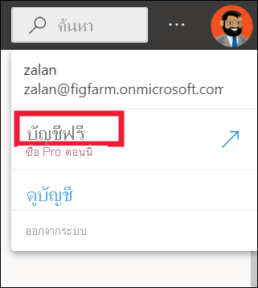
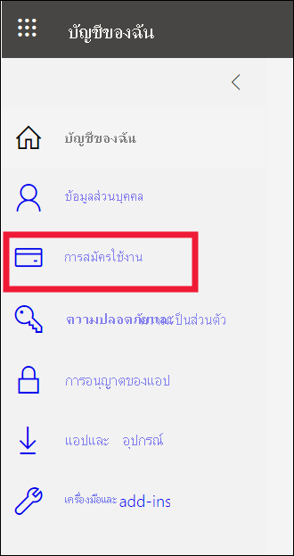
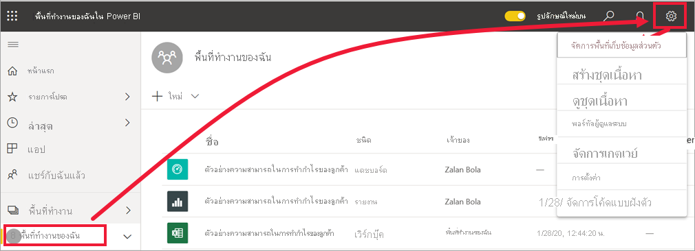
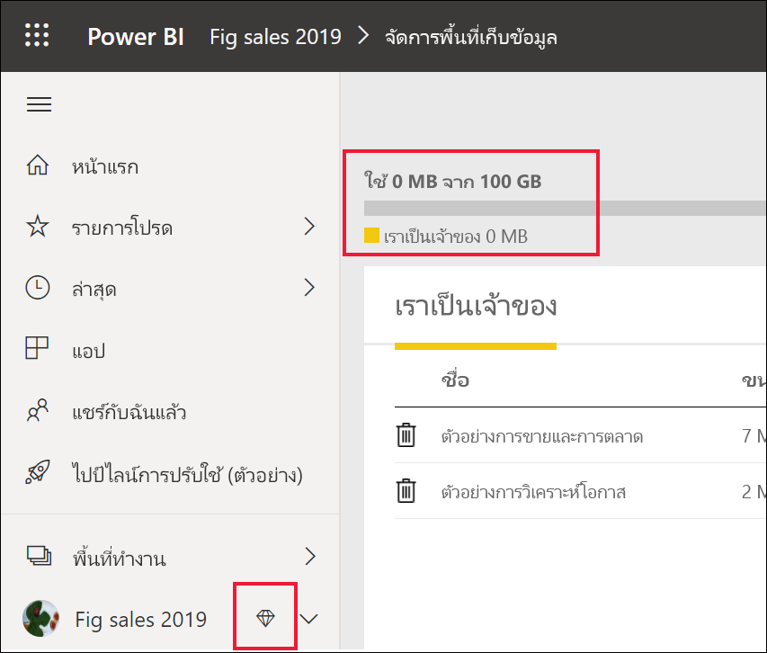
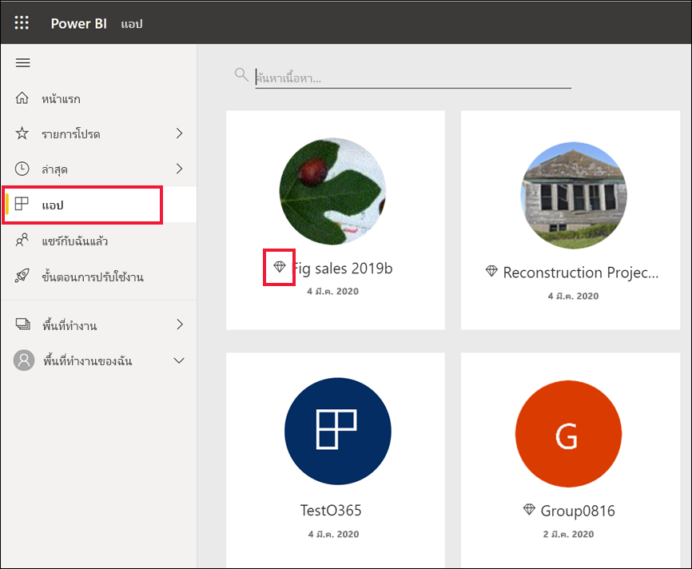
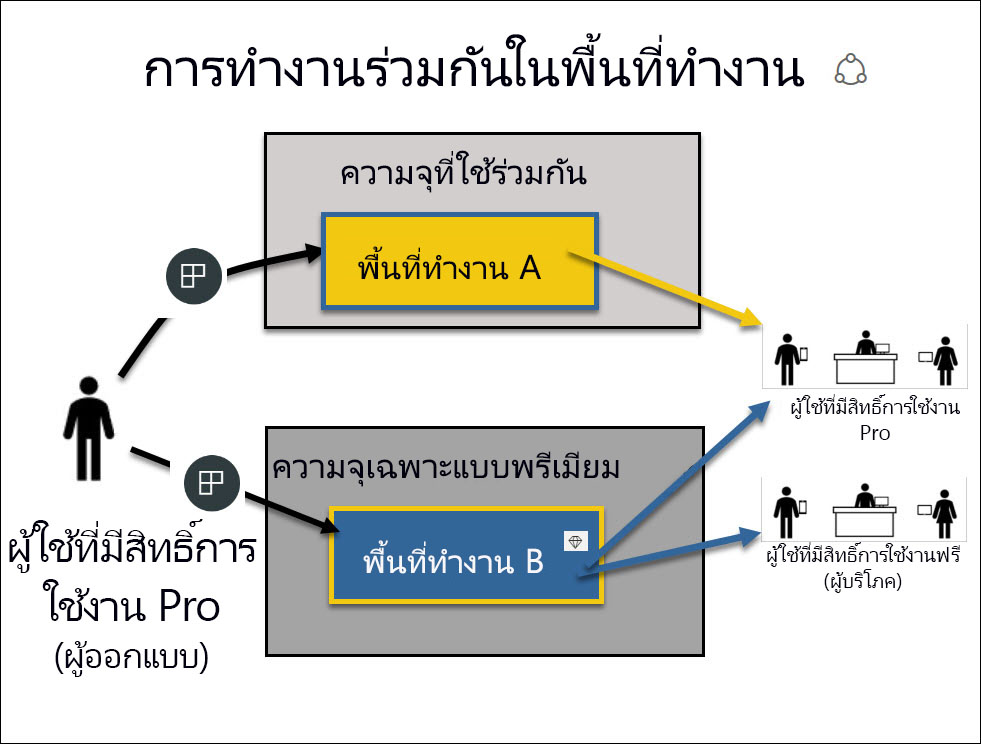

# สิทธิ์การใช้งานและการสมัครใช้งานสำหรับ *ผู้ใช้ทางธุรกิจ*Licenses and subscriptions for *business users*

[!INCLUDE[consumer-appliesto-ynnn](../includes/consumer-appliesto-ynnn.md)]

ในฐานะ [*ผู้ใช้ทางธุรกิจ*](end-user-consumer.md) คุณใช้ Power BI service เพื่อสำรวจรายงานและแดชบอร์ดเพื่อใช้ในการข้อมูลช่วยตัดสินใจทางธุรกิจAs a [*business user*](end-user-consumer.md), you use the Power BI service to explore reports and dashboards so you can make data-backed business decisions. หากคุณใช้ Power BI มาระยะหนึ่งแล้ว หรือกำลังคุยกับเพื่อนร่วมงานของคุณที่เป็น *ผู้ออกแบบ*  คุณอาจพบว่ามีคุณลักษณะบางอย่างที่ใช้งานได้เฉพาะเมื่อคุณมีสิทธิ์การใช้งาน การสมัครใช้งาน หรือการอนุญาตใช้งานบางประเภทเท่านั้นIf you've been using Power BI for a while, or have been chatting with your *designer* colleagues, you've probably discovered that there are some features that only work if you have a certain type of license, subscription, or permissions.

ความสามารถในบริการของ Power BI ที่คุณสามารถใช้งานได้จะขึ้นอยู่กับสามสิ่งต่อไปนี้:What you can do in the Power BI service depends on three things:
-    ประเภทของสิทธิการใช้งานและการสมัครสมาชิกที่คุณกำลังใช้the type of license and subscription you're using,
-    ที่จัดเก็บเนื้อหาและwhere content is stored, and
-    บทบาทและสิทธิ์ที่คุณได้รับมอบหมายthe roles and permissions you're assigned.

ในบทความนี้ เราจะอธิบายความสามารถของสิทธิการใช้งานแต่ละประเภทและ *สถานที่เก็บเนื้อหา* สามารถส่งผลต่อ *สิ่งที่คุณสามารถทำได้* ได้อย่างไรIn this article, we describe the capabilities of each license type and how *where content is stored* can affect *what you can do with it*. และคุณยังจะได้เรียนรู้วิธีการค้นหาสิทธิการใช้งานและการสมัครใช้งานของคุณ รวมถึงคิดว่าคุณจัดเก็บเนื้อหาของคุณไว้ที่ไหนYou'll also learn how to look up your license and subscription and figure out where your content is stored. คุณสามารถดูข้อมูลเพิ่มเติมเกี่ยวกับบทบาทและสิทธิ์ได้ที่ [บทบาทของพื้นที่ทำงาน](end-user-workspaces.md)For more information about roles and permissions, see [workspace roles](end-user-workspaces.md).

## สิทธิ์การใช้งานLicenses

ผู้ใช้บริการของ Power BI แต่ละรายมีสิทธิ์การใช้งานแบบ *ฟรี* หรือสิทธิ์การใช้งาน *Pro*Each user of the Power BI service has either a *free* license or a *Pro* license. หากคุณคือ *ผู้ใช้ทางธุรกิจ* ของ Power BI คุณอาจใช้สิทธิ์การใช้งานฟรีที่จัดการโดยผู้ดูแลระบบ Power BI ของคุณIf you're a Power BI *business user*, you're probably using a free license that is managed by your Power BI admin.

ซึ่งคุณสามารถมีสิทธิการใช้งานมากกว่าหนึ่งสิทธิในเวลาเดียวกันIt's possible to have more than one license at the same time.  บริการจะมอบประสบการณ์การใช้งานตามสิทธิ์การใช้งานที่ดีที่สุดที่คุณมีคุณในปัจจุบันเสมอThe service always delivers you the experience equal to the most-permissive license you currently have.

## ความจุ Power BI PremiumPower BI Premium capacity

Premium คือการสมัครใช้งานเชิงองค์กรที่ใช้วิธีอื่นในการจัดเก็บเนื้อหา -- ในความจุPremium is an organizational subscription that provides a different way to store content--in a capacity. เมื่อใช้ Premium ทุกคนที่มีสิทธิ์ ไม่ว่าพวกจะอยู่ภายในหรือภายนอกองค์กรของคุณ จะสามารถดูเนื้อหาที่จัดเก็บอยู่ในความจุ Premium ได้โดยไม่ต้องซื้อสิทธิ์การใช้งาน Power BI Pro เป็นรายบุคคลWith Premium, anyone with permissions, whether they're inside or outside your organization, can view content stored in this Premium capacity, without purchasing individual Power BI Pro licenses. 

ความเป็นพรีเมียมช่วยให้ผู้ใช้แบบ Pro สามารถกระจายเนื้อหาได้อย่างกว้างขวางโดยผู้รับไม่ต้องมีใบอนุญาต Pro ในการดูเนื้อหาPremium enables widespread distribution of content by Pro users without requiring Pro licenses for recipients who view the content. แต่ผู้สร้างเนื้อหายังคงต้องมีสิทธิการใช้งานแบบ ProPro licenses are required for content designers. ผู้สร้างจะเชื่อมต่อกับแหล่งข้อมูล ข้อมูลแบบจำลอง และสร้างรายงานและแดชบอร์ดที่รวมเป็นแอปพื้นที่ทำงานDesigners connect to data sources, model data, and create reports and dashboards that are packaged as workspace apps. ผู้ใช้ที่ไม่มีสิทธิ์การใช้งานแบบ Pro ยังคงสามารถเข้าถึงพื้นที่ทำงานที่อยู่ในความจุ Power BI Premium ได้ ตราบใดที่พวกเขาได้รับมอบบทบาท [ ในพื้นที่ทำงานนั้น ](end-user-workspaces.md)Users without a Pro license can still access a workspace that's in Power BI Premium capacity, as long as they're assigned a [role in that workspace](end-user-workspaces.md).

ภายในพื้นที่ทำงานเหล่านั้น นักออกแบบจะมอบหมายบทบาท เช่น **ผู้ชม** **ผู้สนับสนุน** **สมาชิก** และ **ผู้ดูแลระบบ**Within those workspaces, designers assign roles, like **Viewer**, **Contributor**, **Member**, and **Administrator**. บทบาทเหล่านี้จะเป็นตัวกำหนดขอบเขตที่เพื่อนร่วมงานสามารถโต้ตอบกับเนื้อหาได้These roles determine the extent to which colleagues can interact with the content. สำหรับข้อมูลเพิ่มเติม โปรดอ่านที่[สิทธิ์และบทบาทของพื้นที่ทำงาน](end-user-workspaces.md)For more information, see [workspace permissions and roles.](end-user-workspaces.md) 

สำหรับข้อมูลเพิ่มเติมเกี่ยวกับความจุแบบพรีเมียม โปรดดูที่ [Microsoft Power BI Premium คืออะไร](../admin/service-premium-what-is.md)For more info about Premium capacity, see [What is Microsoft Power BI Premium?](../admin/service-premium-what-is.md).

## เพื่อดูว่าคุณมีสิทธิการใช้งานใดบ้างFind out which licenses you have
เลือกรูปภาพโปรไฟล์ของคุณเพื่อแสดงข้อมูลบัญชีSelect your profile picture to display account information. Zalan ใช้สิทธิ์การใช้งานฟรีZalan is using a free license. 

ในการดูรายละเอียดเพิ่มเติมเกี่ยวกับบัญชีของคุณ ให้เลือก **ดูบัญชี**To see additional details about your account, select **View account**. [Microsoft ของคุณ **บัญชีของฉัน** หน้า](https://portal.office.com/account) เปิดขึ้นในแท็บเบราว์เซอร์ใหม่  ในการดูว่าสิทธิ์การใช้งานใดที่มอบหมายให้กับคุณ[Your Microsoft **My account** page](https://portal.office.com/account) opens in a new browser tab.  To see what licenses are assigned to you.  เลือกแท็บ **การสมัครใช้งาน**Select the tab for  **Subscriptions**.

Pradtanna ผู้ใช้รายแรกนี้มี Office 365 E5 ซึ่งรวมถึงสิทธิใช้งาน Power BI ProThis first user, Pradtanna, has Office 365 E5, which includes a Power BI Pro license.

Zalan ผู้ใช้รายที่สองนี้มีสิทธิการใช้งาน Power BI ฟรีThis second user, Zalan, has a Power BI free license. 

## เพื่อดูว่าคุณมีสิทธิ์เข้าถึงความจุแบบพรีเมียมหรือไม่Find out if you have access to Premium capacity

จากนั้นให้ตรวจสอบเพื่อดูว่าคุณเป็นส่วนหนึ่งขององค์กรที่มีความจุแบบพรีเมียมหรือไม่Next, check to see if you're part of an organization that has Premium capacity. ไม่ว่าจะเป็นผู้ใช้แบบ Pro หรือแบบฟรีก็สามารถเป็นบุคลกรขององค์กรที่มีสิทธิการใช้งานแบบพรีเมียมได้Either of the users above, Pro or free, could belong to an organization that has Premium capacity.  โปรดตรวจสอบผู้ใช้รายที่สองของเรา ZalanLet's check for our second user, Zalan.  

เราสามารถตรวจสอบว่าองค์กรของ Zalan มีความจุแบบพรีเมียมหรือไม่ได้โดยการดูจำนวนที่เก็บข้อมูลที่พร้อมใช้งานWe can determine whether Zalan's organization has Premium capacity by looking up the amount of storage available. 

- ในบริการ Power BI ให้เลือก **พื้นที่ทำงานของฉัน** จากนั้นเลือกไอคอนฟันเฟืองจากมุมขวาบนIn the Power BI service, select **My workspace** and then select the cog icon from the upper right corner. เลือก **จัดการที่เก็บข้อมูลส่วนตัว**Choose **Manage personal storage**.

    

    ถ้าคุณเห็นว่ามีมากกว่า 10 GB แสดงว่าคุณเป็นสมาชิกของบัญชีองค์กรที่มีสิทธิ์การสมัครใช้งานความจุแบบพรีเมียมIf you see more than 10 GB, then you're a member of an organization that has a Premium subscription. รูปด้านล่างแสดงให้เห็นว่าองค์กรของ Zalan มีพื้นที่เก็บข้อมูลสูงสุดที่ 100 GBThe image below shows that Zalan's organization has up to 100 GB of storage.  

    

โปรดสังเกตว่าผู้ใช้ Pro ได้แชร์พื้นที่ทำงานกับ Zalan แล้วNotice that a Pro user has already shared a workspace with Zalan. ไอคอนรูปเพชรเป็นการแสดงให้เห็นว่าพื้นที่ทำงานนี้จัดเก็บไว้ในความจุแบบพรีเมียมThe diamond icon shows that this workspace is stored in Premium capacity. 

## ค้นหาเนื้อหาที่โฮสต์อยู่ในความจุแบบพรีเมียมIdentify content hosted in Premium capacity

อีกวิธีหนึ่งในการดูว่าองค์กรของคุณมีความจุแบบพรีเมียมหรือไม่ คือการค้นหาแอปและพื้นที่ทำงานของแอปที่มีไอคอนรูปเพชรAnother way to find out if your organization has Premium capacity is to look for apps and app workspaces with a diamond icon. ไอคอนรูปเพชรเป็นการแสดงให้เห็นว่าพื้นที่ทำงานนั้นจัดเก็บไว้ในความจุแบบพรีเมียมThe diamond indicates that the content is stored in Premium capacity. 

ดังรูปด้านล่างนี้ แอปสามแอปนี้จัดเก็บไว้ในความจุแบบพรีเมียมIn the image below, three of the apps are stored in Premium capacity.

ถ้าคุณเป็นเป็นผู้ใช้ที่มีสิทธิ์การใช้งานฟรี ตราบใดที่ *นักออกแบบ* วางพื้นที่ทำงานในความจุแบบพรีเมียม คุณยังสามารถทำงาน **ภายในพื้นที่ทำงานนั้น** เพื่อดูเนื้อหาที่แชร์ ทำงานร่วมกับเพื่อนร่วมงาน ทำงานด้วยแอป แดชบอร์ด รายงาน และอื่นๆ อีกมากมายได้If you're a user with a free license, as long as the *designer* places the workspace in a Premium capacity, you have the ability, **within that workspace**, to view shared content, collaborate with colleagues, work with the app dashboards and reports, and more. ขอบเขตของสิทธิ์ของคุณจะขึ้นอยู่กับการตั้งค่าโดยผู้ดูแลระบบ Power BI และผู้ออกแบบเนื้อหาของคุณThe extent of your permissions is set by your Power BI administrator and by the content designer.

## ภาพรวมทั้งหมดPutting it all together

เมื่อองค์กรสมัครใช้งานความจุ Premium ไว้ โดยทั่วไปแล้วผู้ดูแลระบบจะกำหนดสิทธิ์การใช้งานแบบ Pro ให้กับพนักงานที่ทำงานในความจุ Premium เพื่อสร้างและแชร์เนื้อหาWhen an organization buys a Premium subscription, the admin typically assigns Pro licenses to the employees who will be working in Premium capacity to create and share content. ผู้ใช้ Pro สร้าง[พื้นที่ทำงาน](end-user-workspaces.md)และเพิ่มเนื้อหา (แดชบอร์ดรายงานแอป) ไปยังพื้นที่ทำงานเหล่านั้นThe Pro users create [workspaces](end-user-workspaces.md) and add content (dashboards, reports, apps) to those workspaces. เพื่อให้ผู้ใช้ฟรีสามารถทำงานร่วมกันในพื้นที่ทำงานเหล่านั้นได้ ผู้ดูแลระบบหรือผู้ใช้งานแบบ Pro จะกำหนดพื้นที่ทำงานไว้ใน *ความจุ*To allow free users to collaborate in those workspaces, the admin or Pro user assigns the workspaces to a *capacity*.  

|ประเภทสิทธิการใช้งานLicense type  |ความจุที่ใช้ร่วมกันShared capacity | ความจุแบบพรีเมียมPremium capacity  |
|---------|---------|---------|
|**แบบฟรี****Free**     |  การใช้เป็น sandbox ส่วนบุคคลที่คุณสร้างเนื้อหาสำหรับตัวคุณเองและโต้ตอบกับเนื้อหานั้นUse as a personal sandbox where you create content for yourself and interacts with that content. สิทธิ์การใช้งานฟรีเป็นวิธีที่ยอดเยี่ยมในการทดลองใช้บริการของ Power BIA free license is a great way to try out the Power BI service. คุณไม่สามารถใช้เนื้อหาจากบุคคลอื่นหรือแชร์เนื้อหาของคุณกับผู้อื่นได้ 1You can't consume content from anyone else or share your content with others  1     |   โต้ตอบกับเนื้อหาที่มอบหมายให้กับความจุพรีเมียมและแชร์กับคุณInteract with content assigned to Premium capacity and shared with you. ผู้ใช้ทั้งแบบฟรีและปบบ Pro สามารถทำงานร่วมกันได้โดยไม่จำเป็นต้องให้ผู้ใช้แบบฟรีใช้งานบัญชี ProFree and Pro users can collaborate without requiring the free users to have Pro accounts.      |
|**แบบ Pro****Pro**     |  ช่วยให้สามารถทำงานร่วมกับผู้ใช้ Pro รายอื่น ๆ ได้โดยการสร้างและแชร์เนื้อหาCollaborate with other Pro users by creating and sharing content.        |  ช่วยให้สามารถทำงานร่วมกับผู้ใช้แบบฟรีและแบบ Pro ได้โดยการสร้างและแชร์เนื้อหาCollaborate with free and Pro users by creating and sharing content.       |

1 อ่านข้อมูลเพิ่มเติมที่[ข้อควรพิจารณาและการแก้ไขปัญหา](#considerations-and-troubleshooting)1 See [Considerations and troubleshooting](#considerations-and-troubleshooting).

ในไดอะแกรมด้านล่าง ด้านซ้ายจะแสดงผู้ใช้ Pro ที่สร้างและแชร์เนื้อหาในพื้นที่ทำงานแอปIn the diagram below, the left side represents Pro users who create and share content in app workspaces.

- **พื้นที่ทำงาน A** ขององค์กรที่ไม่มีความจุแบบพรีเมียม**Workspace A** was created in an organization that doesn't have Premium capacity.

- **พื้นที่ทำงาน B** ถูกสร้างขึ้นในองค์กรที่ไม่มีการสมัครใช้งานแบบพรีเมียม**Workspace B** was created in an organization with a Premium subscription. พื้นที่ทำงานถูกบันทึกไว้ในความจุThe workspace was saved in a capacity. พื้นที่ทำงานนี้มีไอคอนรูปเพชรThis workspace has a diamond icon.  

    

*ผู้ออกแบบ* Power BI Pro สามารถแชร์และทำงานร่วมกับผู้ใช้แบบ Pro รายอื่นๆ ในพื้นที่ทำงานใดก็ได้The Power BI Pro *designer* can share and collaborate with other Pro users in either of the workspaces. แต่วิธีเดียวที่ผู้ใช้ Power BI Pro สามารถแชร์และทำงานร่วมกันกับผู้ใช้แบบฟรีได้คือการใช้พื้นที่ทำงาน B ซึ่งอยู่ในความจุแบบพรีเมียมBut, the only way the Power BI Pro user can share and collaborate with free users is by using Workspace B, which is in a Premium capacity.  ภายในพื้นที่ทำงาน นักออกแบบจะกำหนดบทบาทให้ผู้ร่วมงานดังนี้:Within the workspace, the designer assigns roles to collaborators. บทบาทของคุณกำหนดว่าการดำเนินการใดบ้างที่คุณสามารถใช้ได้ภายในพื้นที่ทำงานYour role determines what actions you can take within the workspace. *ผู้ใช้ทางธุรกิจ* ของ Power BI มักได้รับมอบหมายบทบาท *ผู้ชม*Power BI *business users* are usually assigned the *Viewer* role. หากต้องการเรียนรู้เพิ่มเติมเกี่ยวกับบทบาท โปรดดู [พื้นที่ทำงานสำหรับผู้ใช้งานทางธุรกิจของ Power BI](end-user-workspaces.md)To learn more about roles, see [Workspaces for Power BI business users](end-user-workspaces.md).

## ข้อควรพิจารณาและการแก้ไขปัญหาConsiderations and troubleshooting

- ซึ่งคุณอาจมีสิทธิการใช้งาน Power BI มากกว่าหนึ่งสิทธิIt's possible to have more than one Power BI license. บริการของ Power BI จะมอบประสบการณ์การใช้งานตามสิทธิการใช้งานที่ดีที่สุดที่คุณมีคุณในปัจจุบันเสมอThe Power BI service will always deliver the experience equal to the best license that you currently have. เช่น ถ้าคุณมีสิทธิ์การใช้งานทั้งในแบบ Pro และแบบฟรี บริการของ Power BI จะใช้สิทธิการใช้งานแบบ ProFor example, if you have both a Pro and a free license, the Power BI service will use the Pro license.

- ถ้าคุณต้องการสร้างและแชร์เนื้อหา (แดชบอร์ด รายงาน แอป) หรือเปิดเนื้อหาที่บุคคลอื่นแชร์กับคุณ คุณจะต้องมีสิทธิ์การใช้งานผู้ใช้แบบ ProIf you want to create and share content (dashboards, reports, apps), or open content that someone else shared with you, then you need to have a Pro user license. คุณสามารถลงทะเบียนเพื่อทดลองใช้งาน Power BI Pro แบบ 60 วันโดยไม่เสียค่าใช้จ่ายYou can sign up for a free 60-day individual trial of Power BI Pro. เลือกกล่องโต้ตอบการอัปเกรดที่ปรากฏในบริการของ Power BI เมื่อคุณใช้คุณลักษณะแบบ ProSelect the upgrade dialog that appears in the Power BI service whenever you try to use a Pro feature.

    

  เมื่อการทดลองใช้ 60 วันหมดอายุ สิทธิการใช้งานของคุณจะเปลี่ยนกลับเป็นสิทธิ์การใช้งาน Power BI แบบฟรีWhen the 60-day trial expires, your license changes back to a Power BI free license. หลังจากสิทธิ์การใช้งานกลับสู่สภาพเดิม คุณจะไม่สามารถเข้าถึงคุณลักษณะที่จำเป็นต้องมีสิทธิ์การใช้งาน Power BI Pro ได้After your license reverts, you no longer have access to features that require a Power BI Pro license. หากคุณต้องการใช้สิทธิ์การใช้งานแบบ Pro ต่อไป โปรดติดต่อผู้ดูแลระบบ หรือฝ่ายความช่วยเหลือด้าน IT ของคุณเพื่อการซื้อสิทธิ์การใช้งาน Power BI ProIf you want to continue with a Pro license, contact your administrator or IT Help Desk about purchasing a Power BI Pro license. ถ้าคุณไม่มีผู้ดูแลระบบหรือฝ่ายความช่วยเหลือด้าน IT โปรดเยี่ยมชม [หน้าแสดงรายการราคาของ Power BI](https://powerbi.microsoft.com/pricing/)If you don't have an admin or IT Help Desk, visit [the Power BI pricing page](https://powerbi.microsoft.com/pricing/).

- ถ้าคุณลงทะเบียนสำหรับสิทธิ์การใช้งานฟรีด้วยตัวคุณเองโดยการเลือกปุ่มประเภท *ลองใช้ฟรี* สิทธิ์นั้นจะไม่มีวันหมดอายุIf you signed up for a free license on your own by selecting a *Try it free* type of button, it never expires. ดังนั้น ถ้าคุณอัปเกรดเป็น Pro รุ่นทดลองใช้ หรือองค์กรของคุณให้สิทธิ์การใช้งานแบบ Pro แก่คุณ แล้วช่วงทดลองใช้สิ้นสุดลง หรือองค์กรของคุณถอดสิทธิ์การใช้งานแบบ Pro ของคุณออก คุณจะยังคงกลับไปใช้สิทธิ์การใช้งานฟรีได้ - เว้นเสียแต่ว่าคุณจะยกเลิกสิทธิ์การใช้งานSo if you upgrade to a Pro trial or your organization provides you with a Pro license, and then your trial ends or your organization removes your Pro license, you still have the free license to fall back on - unless you cancel the license.

- 1 สิทธิการใช้งานผู้ใช้ Power BI แบบฟรีเหมาะสำหรับผู้ที่ต้องการดูหรือใช้สำหรับการวิเคราะห์ข้อมูลส่วนบุคคลและการแสดงภาพโดยใช้ **พื้นที่ทำงานของฉัน**1 A free user license for the Power BI service is perfect for someone exploring or using it for personal data analysis and visualizations using **My workspace**. ผู้ใช้ฟรีแบบสแตนด์อโลนไม่ต้องใช้ Power BI เพื่อทำงานร่วมกับเพื่อนร่วมงานA free standalone user isn't using Power BI to collaborate with colleagues. ผู้ใช้ฟรีแบบสแตนด์อโลนไม่สามารถดูเนื้อหาที่แชร์โดยผู้อื่น หรือแชร์เนื้อหาของตนเองกับผู้ใช้ Power BI รายอื่นได้Standalone users with free  licenses can't view content shared by others or share their own content with other Power BI users.

## ขั้นตอนถัดไปNext steps

- [ฉันเป็นผู้ใช้ทางธุรกิจ *ของ Power BI หรือไม่*?Am I a Power BI *business user*?](end-user-consumer.md)    
- [เรียนรู้เพิ่มเติมเรื่องพื้นที่ทำงานLearn about workspaces](end-user-workspaces.md)    
- [ดูคุณลักษณะของผู้ใช้ทางธุรกิจของ Power BI ตามประเภทสิทธิ์การใช้งานView Power BI business user features by license type](end-user-features.md)
