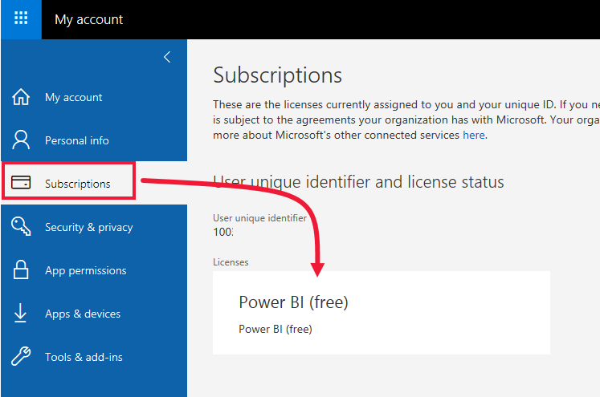

# สิทธิ์การใช้งานและการสมัครใช้งานสำหรับ *ผู้ใช้ทางธุรกิจ*

[!INCLUDE[consumer-appliesto-ynnn](../includes/consumer-appliesto-ynnn.md)]

ในฐานะ [*ผู้ใช้ทางธุรกิจ*](end-user-consumer.md) คุณใช้ Power BI service เพื่อสำรวจรายงานและแดชบอร์ดเพื่อใช้ในการข้อมูลช่วยตัดสินใจทางธุรกิจ หากคุณใช้ Power BI มาระยะหนึ่งแล้ว หรือกำลังคุยกับเพื่อนร่วมงานของคุณที่เป็น *ผู้ออกแบบ*  คุณอาจพบว่ามีคุณลักษณะบางอย่างที่ใช้งานได้เฉพาะเมื่อคุณมีสิทธิ์การใช้งาน การสมัครใช้งาน หรือการอนุญาตใช้งานบางประเภทเท่านั้น

ความสามารถในบริการของ Power BI ที่คุณสามารถใช้งานได้จะขึ้นอยู่กับสามสิ่งต่อไปนี้:
-    ประเภทของสิทธิการใช้งานและการสมัครสมาชิกที่คุณกำลังใช้
-    ที่จัดเก็บเนื้อหาและ
-    บทบาทและสิทธิ์ที่คุณได้รับมอบหมาย

ในบทความนี้ เราจะอธิบายความสามารถของสิทธิการใช้งานแต่ละประเภทและ *สถานที่เก็บเนื้อหา* สามารถส่งผลต่อ *สิ่งที่คุณสามารถทำได้* ได้อย่างไร และคุณยังจะได้เรียนรู้วิธีการค้นหาสิทธิการใช้งานและการสมัครใช้งานของคุณ รวมถึงคิดว่าคุณจัดเก็บเนื้อหาของคุณไว้ที่ไหน คุณสามารถดูข้อมูลเพิ่มเติมเกี่ยวกับบทบาทและสิทธิ์ได้ที่ [บทบาทของพื้นที่ทำงาน](end-user-workspaces.md)

## สิทธิ์การใช้งาน

ผู้ใช้แต่ละรายของบริการของ Power BI มีสิทธิ์การใช้งาน *ฟรี* , สิทธิ์การใช้งาน *Pro* หรือสิทธิ์การ *ใช้งานแบบพรีเมียมต่อหนึ่ง** หากคุณคือ *ผู้ใช้ทางธุรกิจ* ของ Power BI คุณอาจใช้สิทธิ์การใช้งานฟรีที่จัดการโดยผู้ดูแลระบบ Power BI ของคุณ

ซึ่งคุณสามารถมีสิทธิการใช้งานมากกว่าหนึ่งสิทธิในเวลาเดียวกัน  บริการจะมอบประสบการณ์การใช้งานตามสิทธิ์การใช้งานที่ดีที่สุดที่คุณมีคุณในปัจจุบันเสมอ

## การสมัครใช้งานความจุ Power BI Premium

Premium คือการ *สมัคร* ใช้งานในองค์กรที่มีวิธีอื่นในการจัดเก็บเนื้อหา--ในคอนเทนเนอร์เสมือนที่เรียกว่า *ความจุ* ด้วยความจุ Premium ทุกคนที่มีสิทธิ์ไม่ว่าจะอยู่ภายในหรือภายนอกองค์กรของคุณสามารถดูเนื้อหาที่จัดเก็บไว้ในความจุ Premium นี้ได้โดยไม่ต้องซื้อสิทธิ์การใช้งานของแต่ละบุคคล Power BI Pro หรือใบอนุญาตพิเศษแต่ละราย 

ความจุพรีเมียมช่วยให้สามารถกระจายเนื้อหาได้อย่างแพร่หลายโดยผู้ใช้ Pro โดยไม่จำเป็นต้องมีใบอนุญาต Pro สำหรับผู้รับที่ดูเนื้อหา บุคคลที่กำลังสร้างเนื้อหาในความจุพรีเมียมใช้สิทธิ์ในการทำงานของ Pro เพื่อเชื่อมต่อกับแหล่งข้อมูลข้อมูลแบบจำลองและสร้างรายงานและแดชบอร์ดที่จะถูกบันทึกไปยังพื้นที่ทำงานในความจุพรีเมียม ผู้ใช้ที่ไม่มีสิทธิ์การใช้งานแบบ Pro ยังคงสามารถเข้าถึงพื้นที่ทำงานที่อยู่ในความจุ Power BI Premium ได้ ตราบใดที่พวกเขาได้รับมอบบทบาท [ ในพื้นที่ทำงานนั้น ](end-user-workspaces.md) ถ้าเจ้าของพื้นที่ทำงานสร้างแอปโดยยึดตามเนื้อหาในพื้นที่ทำงานนั้นผู้ใช้ที่ไม่มีใบอนุญาต Pro ยังคงสามารถดูแอปในความจุ Premium ได้ตราบใดที่พวกเขาได้รับสิทธิ์สำหรับแอปนั้น 

ภายในพื้นที่ทำงานเหล่านั้น นักออกแบบจะมอบหมายบทบาท เช่น **ผู้ชม** **ผู้สนับสนุน** **สมาชิก** และ **ผู้ดูแลระบบ** บทบาทเหล่านี้จะเป็นตัวกำหนดขอบเขตที่เพื่อนร่วมงานสามารถโต้ตอบกับเนื้อหาได้ สำหรับข้อมูลเพิ่มเติม โปรดอ่านที่[สิทธิ์และบทบาทของพื้นที่ทำงาน](end-user-workspaces.md) 

เมื่อตัวออกแบบสร้างและเผยแพร่แอปพวกเขาให้สิทธิการเข้าถึงทั้งองค์กรหรือบุคคล ขอบเขตที่คุณสามารถโต้ตอบกับเนื้อหาของแอปจะขึ้นอยู่กับสิทธิ์การเข้าถึงเฉพาะที่กำหนดให้กับคุณ ตัวอย่างเช่นคุณอาจได้รับสิทธิการเข้าถึงเพื่อดูแอปเชื่อมต่อกับชุดข้อมูลเบื้องต้นทำสำเนาของรายงานหรือแชร์เนื้อหา

สำหรับข้อมูลเพิ่มเติมเกี่ยวกับความจุแบบพรีเมียม โปรดดูที่ [Microsoft Power BI Premium คืออะไร](../admin/service-premium-what-is.md)

## เพื่อดูว่าคุณมีสิทธิการใช้งานใดบ้าง
เลือกรูปภาพโปรไฟล์ของคุณเพื่อแสดงข้อมูลบัญชี Zalan ใช้สิทธิ์การใช้งานฟรี สิทธิ์การใช้งานประเภทอื่นๆคือ: **Pro** และ **Premium** 

ในการดูรายละเอียดเพิ่มเติมเกี่ยวกับบัญชีของคุณ ให้เลือก **ดูบัญชี** 

<!-- [Your Microsoft **My account** page](https://portal.office.com/account) opens in a new browser tab.  To see what licenses are assigned to you.  Select the tab for  **Subscriptions**.

This first user, Pradtanna, has Office 365 E5, which includes a Power BI Pro license.

This second user, Zalan, has a Power BI free license. 

 

## Find out if you have access to Premium capacity

Next, check to see if you're part of an organization that has Premium capacity. Either of the users above, Pro or free, could belong to an organization that has Premium capacity.  Let's check for our second user, Zalan.  

We can determine whether Zalan's organization has Premium capacity by looking up the amount of storage available. 

- In the Power BI service, select **My workspace** and then select the cog icon from the upper right corner. Choose **Manage personal storage**.

    

    If you see more than 10 GB, then you're a member of an organization that has a Premium subscription. The image below shows that Zalan's organization has up to 100 GB of storage. Zalan, personally, doesn't own 100GB as indicated by the heading **Owned by us**.  

    

    Notice that a Pro user has already shared a workspace with Zalan. The diamond icon shows that this workspace is stored in Premium capacity. 

    If you see any amount of storage, the words **Pro user** next to your name, and the heading **Owned by me**, then you have a Premium per-user license.  

    -->

## ค้นหาเนื้อหาที่โฮสต์อยู่ในความจุแบบพรีเมียม

มีสองวิธีในการระบุเนื้อหาที่จัดเก็บไว้ในความจุพรีเมียม วิธีหนึ่งคือการค้นหาแอปและพื้นที่ทำงานของแอปด้วยไอคอนรูปเพชร ไอคอนรูปเพชรเป็นการแสดงให้เห็นว่าพื้นที่ทำงานนั้นจัดเก็บไว้ในความจุแบบพรีเมียม 

ดังรูปด้านล่างนี้ แอปสามแอปนี้จัดเก็บไว้ในความจุแบบพรีเมียม

ถ้าคุณเป็นเป็นผู้ใช้ที่มีสิทธิ์การใช้งานฟรี ตราบใดที่ *นักออกแบบ* วางพื้นที่ทำงานในความจุแบบพรีเมียม คุณยังสามารถทำงาน **ภายในพื้นที่ทำงานนั้น** เพื่อดูเนื้อหาที่แชร์ ทำงานร่วมกับเพื่อนร่วมงาน ทำงานด้วยแอป แดชบอร์ด รายงาน และอื่นๆ อีกมากมายได้ ขอบเขตของสิทธิ์ของคุณจะขึ้นอยู่กับการตั้งค่าโดยผู้ดูแลระบบ Power BI และผู้ออกแบบเนื้อหาของคุณ

## ภาพรวมทั้งหมด

มีหลายวิธีที่องค์กรสามารถจัดการการสมัครใช้งาน Power BI และใบอนุญาตของพวกเขา จากมุมมองของ *ผู้ใช้ทางธุรกิจ* หนึ่งในสถานการณ์ที่พบบ่อยที่สุดคือเมื่อองค์กรซื้อการสมัครสมาชิก Premium ผู้ดูแลระบบกำหนดสิทธิ์การใช้งานโปรให้กับกลุ่มขนาดเล็กและผู้ใช้อื่นๆทั้งหมดที่สามารถดำเนินการได้ฟรีใบอนุญาต โดยทั่วไปผู้ดูแลระบบจะกำหนดสิทธิ์การใช้งาน Pro ให้กับพนักงานที่จะสร้างและแชร์เนื้อหา ผู้ใช้ Pro สร้าง [พื้นที่](end-user-workspaces.md) ทำงานและเพิ่มเนื้อหา (แดชบอร์ดรายงานชุดข้อมูลแอป) ไปยังพื้นที่ทำงานเหล่านั้น เพื่อให้ผู้ใช้ฟรีสามารถทำงานร่วมกันในพื้นที่ทำงานเหล่านั้นผู้ดูแลระบบหรือผู้ใช้ Pro จะกำหนดพื้นที่ทำงานให้กับ *ความจุพรีเมียม*  

|ประเภทสิทธิการใช้งาน  |ไม่อยู่ในความจุพรีเมียม | ความจุแบบพรีเมียม  |
|---------|---------|---------|
|**แบบฟรี**     |  ใช้เป็น sandbox ส่วนบุคคลที่คุณสร้างเนื้อหาสำหรับตัวคุณเองและโต้ตอบกับเนื้อหานั้น สิทธิ์การใช้งานฟรีเป็นวิธีที่ยอดเยี่ยมในการทดลองใช้บริการของ Power BI คุณไม่สามารถใช้เนื้อหาจากบุคคลอื่นหรือแชร์เนื้อหาของคุณกับผู้อื่นได้ 1     |   โต้ตอบกับเนื้อหาที่มอบหมายให้กับความจุพรีเมียมและแชร์กับคุณ ฟรี, Premium ต่อผู้ใช้และผู้ใช้ Pro สามารถทำงานร่วมกันได้โดยไม่จำเป็นต้องมีผู้ใช้ฟรีให้มีบัญชี Pro      |
|**แบบ Pro**     |  ทำงานร่วมกันกับผู้ใช้ระดับ Premium ต่อหนึ่งคนและ Pro โดยการสร้างและแชร์เนื้อหา        |  ทำงานร่วมกันได้ฟรี, Premium ต่อผู้ใช้และผู้ใช้ Pro โดยการสร้างและแชร์เนื้อหา       |

1 อ่านข้อมูลเพิ่มเติมที่[ข้อควรพิจารณาและการแก้ไขปัญหา](#considerations-and-troubleshooting)

ในไดอะแกรมด้านล่าง ด้านซ้ายจะแสดงผู้ใช้ Pro ที่สร้างและแชร์เนื้อหาในพื้นที่ทำงานแอป

- **พื้นที่ทำงาน A** ไม่ได้ถูกสร้างขึ้นในความจุพรีเมียม

- **พื้นที่ทำงาน B** ถูกสร้างและบันทึกในความจุพรีเมียม พื้นที่ทำงานนี้มีไอคอนรูปเพชร  

    

*ผู้ออกแบบ* Power BI Pro สามารถแชร์และทำงานร่วมกับผู้ใช้แบบ Pro รายอื่นๆ ในพื้นที่ทำงานใดก็ได้ แต่วิธีเดียวที่ผู้ใช้ Power BI Pro สามารถแชร์และทำงานร่วมกันกับผู้ใช้แบบฟรีได้คือการใช้พื้นที่ทำงาน B ซึ่งอยู่ในความจุแบบพรีเมียม  ภายในพื้นที่ทำงาน นักออกแบบจะกำหนดบทบาทให้ผู้ร่วมงานดังนี้: บทบาทของคุณกำหนดว่าการดำเนินการใดบ้างที่คุณสามารถใช้ได้ภายในพื้นที่ทำงาน *ผู้ใช้ทางธุรกิจ* ของ Power BI มักได้รับมอบหมายบทบาท *ผู้ชม* หากต้องการเรียนรู้เพิ่มเติมเกี่ยวกับบทบาท โปรดดู [พื้นที่ทำงานสำหรับผู้ใช้งานทางธุรกิจของ Power BI](end-user-workspaces.md)

## ข้อควรพิจารณาและการแก้ไขปัญหา

- ซึ่งคุณอาจมีสิทธิการใช้งาน Power BI มากกว่าหนึ่งสิทธิ บริการของ Power BI จะมอบประสบการณ์การใช้งานตามสิทธิการใช้งานที่ดีที่สุดที่คุณมีคุณในปัจจุบันเสมอ เช่น ถ้าคุณมีสิทธิ์การใช้งานทั้งในแบบ Pro และแบบฟรี บริการของ Power BI จะใช้สิทธิการใช้งานแบบ Pro

- ถ้าคุณต้องการสร้างและแชร์เนื้อหา (แดชบอร์ดรายงานแอป) หรือเปิดเนื้อหาที่ผู้อื่นแชร์กับคุณคุณจะต้องมีสิทธิ์การใช้งานของ Pro หรือสิทธิ์พิเศษต่อผู้ใช้ คุณสามารถลงทะเบียนเพื่อทดลองใช้งาน Power BI Pro แบบ 60 วันโดยไม่เสียค่าใช้จ่าย เลือกกล่องโต้ตอบการอัปเกรดที่ปรากฏในบริการของ Power BI เมื่อคุณใช้คุณลักษณะแบบ Pro

    

  เมื่อการทดลองใช้ 60 วันหมดอายุ สิทธิการใช้งานของคุณจะเปลี่ยนกลับเป็นสิทธิ์การใช้งาน Power BI แบบฟรี หลังจากสิทธิ์การใช้งานกลับสู่สภาพเดิม คุณจะไม่สามารถเข้าถึงคุณลักษณะที่จำเป็นต้องมีสิทธิ์การใช้งาน Power BI Pro ได้ หากคุณต้องการใช้สิทธิ์การใช้งานแบบ Pro ต่อไป โปรดติดต่อผู้ดูแลระบบ หรือฝ่ายความช่วยเหลือด้าน IT ของคุณเพื่อการซื้อสิทธิ์การใช้งาน Power BI Pro ถ้าคุณไม่มีผู้ดูแลระบบหรือฝ่ายความช่วยเหลือด้าน IT โปรดเยี่ยมชม [หน้าแสดงรายการราคาของ Power BI](https://powerbi.microsoft.com/pricing/)

- ถ้าคุณลงทะเบียนสำหรับสิทธิ์การใช้งานฟรีด้วยตัวคุณเองโดยการเลือกปุ่มประเภท *ลองใช้ฟรี* สิทธิ์นั้นจะไม่มีวันหมดอายุ ดังนั้น ถ้าคุณอัปเกรดเป็น Pro รุ่นทดลองใช้ หรือองค์กรของคุณให้สิทธิ์การใช้งานแบบ Pro แก่คุณ แล้วช่วงทดลองใช้สิ้นสุดลง หรือองค์กรของคุณถอดสิทธิ์การใช้งานแบบ Pro ของคุณออก คุณจะยังคงกลับไปใช้สิทธิ์การใช้งานฟรีได้ - เว้นเสียแต่ว่าคุณจะยกเลิกสิทธิ์การใช้งาน

- 1 สิทธิการใช้งานผู้ใช้ Power BI แบบฟรีเหมาะสำหรับผู้ที่ต้องการดูหรือใช้สำหรับการวิเคราะห์ข้อมูลส่วนบุคคลและการแสดงภาพโดยใช้ **พื้นที่ทำงานของฉัน** ผู้ใช้ฟรีแบบสแตนด์อโลนไม่ต้องใช้ Power BI เพื่อทำงานร่วมกับเพื่อนร่วมงาน ผู้ใช้ฟรีแบบสแตนด์อโลนไม่สามารถดูเนื้อหาที่แชร์โดยผู้อื่น หรือแชร์เนื้อหาของตนเองกับผู้ใช้ Power BI รายอื่นได้

## ขั้นตอนถัดไป

- [ฉันเป็นผู้ใช้ทางธุรกิจ *ของ Power BI หรือไม่*?](end-user-consumer.md)    
- [เรียนรู้เพิ่มเติมเรื่องพื้นที่ทำงาน](end-user-workspaces.md)    
- [ดูคุณลักษณะของผู้ใช้ทางธุรกิจของ Power BI ตามประเภทสิทธิ์การใช้งาน](end-user-features.md)
