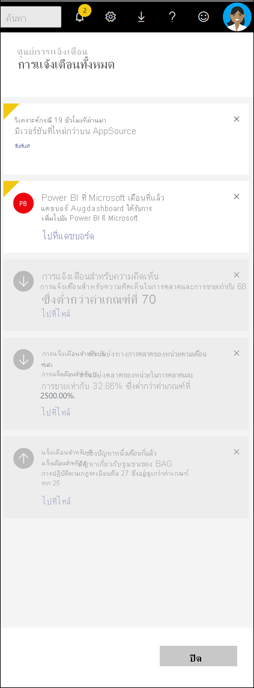

# ดูการแจ้งเตือน Power BIView Power BI notifications

[!INCLUDE[consumer-appliesto-yynn](../includes/consumer-appliesto-yynn.md)]

ศูนย์การแจ้งเตือนคือ ตัวดึงข้อมูลตามลำดับที่เกี่ยวข้องกับประสบการณ์การใช้งาน Power BI ของคุณThe Notification Center is a sequential feed of information related to your Power BI experience. เปิดเพื่อดูข้อความเกี่ยวกับแดชบอร์ดใหม่ที่มีการแชร์กับคุณ รายละเอียดเกี่ยวกับเหตุการณ์และการประชุมใน Power BI การแจ้งเตือนที่คุณได้ตั้งค่า และอื่น ๆOpen it to see messages about new dashboards that have been shared with you, information about Power BI events and meetings, alerts you've set, and more. คุณสามารถเลือก[ตั้งค่าการแจ้งเตือนในบริการ Power BI](end-user-alerts.md)ได้ รวมถึงในแอปฯมือถือ Power BI ได้เช่นกันYou can [set alerts in the Power BI service](end-user-alerts.md) and also in the Power BI mobile apps.

ดูการตรวจสอบ การจัดการ และการตอบสนองต่อการแจ้งเตือนของ AmandaWatch Amanda review, manage, and respond to notifications. จากนั้นทำตามคำแนะนำในวิดีโอด้านล่างทีละขั้นเพื่อลองทำด้วยตนเองThen follow the instructions below the video to try it out yourself.    

> [!NOTE]
> วิดีโอนี้แสดงบริการ Power BI รุ่นเก่าThis video shows an older version of the Power BI service. 

<iframe width="560" height="315" src="https://www.youtube.com/embed/bZMSv5KAlcE" frameborder="0" allowfullscreen></iframe>

## ดูการแจ้งเตือนของคุณView your notifications
1. เมื่อคุณเข้าสู่ระบบ Power BI การแจ้งเตือนใหม่ใด ๆ ที่ถูกส่งถึงคุณในขณะที่คุณออฟไลน์ จะถูกเพิ่มเข้าไปยังตัวดึงข้อมูลของคุณด้วยWhen you log in to Power BI, any new notifications that were sent to you while you were offline are added to your feed. ถ้าคุณมีการแจ้งเตือนใหม่ Power BI แสดงฟองอากาศสีเหลืองด้วยจำนวนของรายการใหม่If you do have new notifications, Power BI displays a yellow bubble with the number of new items.
   
   
2. จากแถบเมนู Power BI เลือกไอคอน **การแจ้งให้ทราบ**In the Power BI menu bar, select the **Notifications** icon.
   
   
3. การแจ้งเตือนจะแสดงรายการล่าสุดที่ด้านบนสุด รวมถึงไฮไลท์ข้อความที่ยังไม่ได้อ่านNotifications are displayed with the most-recent on top and unread messages highlighted. การแจ้งเตือนจะถูกเก็บไว้เป็น 90 วัน เว้นแต่ว่าคุณลบเร็วกว่านั้น หรือถึงขีดจำกัดสูงสุด 100 การแจ้งเตือนNotifications are retained for 90 days, unless you delete them sooner or reach the maximum limit of 100.
   
   
4. เมื่อต้องการปิดการแจ้งเตือน เลือกไอคอน XTo dismiss a notification, select the X icon.

## ขั้นตอนถัดไปNext steps
* [แจ้งเตือนข้อมูลในบริการ Power BIData alerts in Power BI service](end-user-alerts.md)
* [ตั้งค่าการแจ้งเตือนข้อมูลในแอปฯ iPhone (Power BI สำหรับ iOS)Set data alerts in the iPhone app (Power BI for iOS)](mobile/mobile-set-data-alerts-in-the-mobile-apps.md)
* [ตั้งค่าการแจ้งเตือนข้อมูลในแอป mobile Power BI สำหรับ Windows 10Set data alerts in the Power BI mobile app for Windows 10](mobile/mobile-set-data-alerts-in-the-mobile-apps.md)
* มีคำถามเพิ่มเติมหรือไม่More questions? [ลองไปที่ชุมชน Power BITry the Power BI Community](https://community.powerbi.com/)

