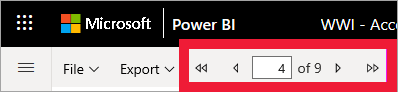

# รายงานที่มีการแบ่งหน้าในบริการ Power BIPaginated reports in the Power BI service

[!INCLUDE[consumer-appliesto-yyny](../includes/consumer-appliesto-yyny.md)]

คุณได้เรียนรู้เกี่ยวกับ[รายงาน Power BI](end-user-reports.md) และรายงานเหล่านี้เป็นประเภทของรายงานที่คุณน่าจะพบบ่อยที่สุดYou've learned about [Power BI reports](end-user-reports.md), and those are the types of report you're most likely to encounter. รายงาน power BI ได้รับการปรับให้เหมาะสำหรับการสำรวจและโต้ตอบPower BI reports are optimized for exploration and interactivity. เมื่อพนักงานขายต้องการแบ่งส่วนข้อมูลในรายงานยอดขายตัวเดียวกันโดยแยกตามเขตพื้นที่/อุตสาหกรรม/ลูกค้า แล้วดูการเปลี่ยนแปลงของตัวเลข การสร้างรายงาน Power BI จะดีที่สุดA sales report where different salespeople want to slice the data in the same report for their specific region/industry/customer and see how the numbers change would be best served by a Power BI report.

มีรายงานอีกประเภทหนึ่งที่เรียกว่า *รายงานที่มีการแบ่งหน้า*However, there is another type of report called a *paginated report*. การรับและการดูรายงานแบบแบ่งหน้าจำเป็นต้องมีสิทธิ์การใช้งาน Power BI Pro เพื่อให้รายงานสามารถบันทึกในความจุแบบ Premium ได้Receiving and viewing paginated reports requires a Power BI Pro license of for the report to be saved in Premium capacity.  [เรียนรู้เกี่ยวกับสิทธิ์การใช้งาน](end-user-license.md)[Learn about licenses](end-user-license.md).  

## ระบุรายงานที่มีการแบ่งหน้าIdentify a paginated report

ในรายการเนื้อหาและในหน้า Landing Page คุณสามารถระบุรายงานที่มีการแบ่งหน้าได้โดยไอคอนของรายงานเหล่านั้น In content lists and on your Home landing page, paginated reports can be identified by their icon .  ซึ่งสามารถแชร์รายงานที่มีการแบ่งหน้ากับคุณได้โดยตรง หรือให้เป็นส่วนหนึ่งของ [แอป Power BI](end-user-apps.md)A paginated report can be shared with you directly, or as part of a [Power BI app](end-user-apps.md). หาก *ผู้ออกแบบ* รายงานให้สิทธิ์แก่คุณ คุณจะสามารถแชร์รายงานที่มีการแบ่งหน้า และสมัครใช้งานด้วยตัวคุณเองและผู้อื่นได้If the report *designer* gave you permissions, you'll be able to re-share the paginated report and subscribe yourself and others.

## รายงานที่มีการแบ่งหน้าคืออะไร?What is a paginated report?

รายงานเหล่านี้ถูกเรียกว่ารายงาน *แบบแบ่งหน้า* เนื่องจากมีการจัดรูปแบบให้พอดีกับหน้าที่พิมพ์These reports are called *paginated* because they're formatted to fit well on a printed page. ข้อดีอย่างหนึ่งคือรายงานเหล่านี้แสดงข้อมูลทั้งหมดในตาราง แม้ว่าตารางนั้นต้องใช้พื้นที่หลายหน้าOne advantage is that they display all the data in a table, even if the table spans multiple pages. รายงานที่มีการแบ่งหน้าบางครั้งเรียกว่า "พิกเซลสมบูรณ์แบบ" เนื่องจาก *นักออกแบบ* รายงานได้ควบคุมการจัดวางหน้ารายงานได้อย่างแม่นยำPaginated reports are sometimes called "pixel perfect" because report *designers* control the report page layout exactly.

รายงานแบบแบ่งหน้าเหมาะที่สุดในสถานการณ์ที่ต้องใช้เอาต์พุตที่มีการจัดรูปแบบสูงและเป็นพิกเซลสมบูรณ์แบบที่เหมาะกับการพิมพ์หรือการสร้าง PDFPaginated reports are best for scenarios that require a highly formatted, pixel-perfect output optimized for printing or PDF generation. การสร้างงบกำไรขาดทุนเป็นตัวอย่างชนิดรายงานที่ดีที่คุณอาจต้องการดูเป็นตัวอย่างรูปแบบรายงานแบบแบ่งหน้าA profit and loss statement is a good example of the type of report you would probably want to see as a paginated report.

## รายงานแบบแบ่งหน้ามีการทำงานอย่างไรHow do paginated reports work?

เมื่อ *ผู้ออกแบบ* รายงานสร้างรายงานที่มีการแบ่งหน้า คือพวกเขากำลังสร้าง *ข้อกำหนดของรายงาน* อย่างแท้จริงWhen report *designers* create a paginated report, they're really creating a *report definition*. ซึ่งไม่ได้มีข้อมูลIt doesn't contain the data. แต่จะระบุว่าต้องรับเอาข้อมูลจากที่ใด เอาข้อมูลใด และแสดงข้อมูลอย่างไรIt specifies where to get the data, which data to get, and how to display the data. เมื่อคุณเรียกดูรายงาน ตัวประมวลผลรายงานจะใช้ข้อกำหนดของรายงาน ดึงข้อมูลออกมา แล้วรวมเข้ากับเค้าโครงรายงานเพื่อสร้างรายงานขึ้นWhen you run the report, the report processor takes the report definition, retrieves the data, and combines it with the report layout to generate the report. ในบางครั้ง รายงานจะแสดงข้อมูลเริ่มต้นSometimes, the report displays default data. บางครั้งคุณจำเป็นต้องป้อนพารามิเตอร์ก่อนรายงานจึงสามารถแสดงข้อมูลใดก็ตามได้Other times you need to enter parameters before the report can display any data. 

เลือกรายงานที่มีการแบ่งหน้าเพื่อเปิดในบริการของ Power BISelect a paginated report to open it in the Power BI service. ถ้ามีพารามิเตอร์ คุณต้องเลือกก่อนที่คุณจะสามารถดูรายงานได้If it has parameters, you need to select them before you can view the report.

   

และโดยทั่วไปแล้ว นั่นคือขอบเขตของการโต้ตอบ - การตั้งค่าพารามิเตอร์And that's typically the extent of the interaction - setting the parameters. หากคุณเป็นนักวิเคราะห์การเรียกเก็บเงิน คุณอาจใช้รายงานที่มีการแบ่งหน้าเพื่อสร้างหรือพิมพ์ใบแจ้งหนี้ได้If you're a billing analyst, you may use paginated reports to create or print invoices. หากคุณเป็นผู้จัดการฝ่ายขาย คุณสามารถใช้รายงานที่มีการแบ่งหน้าเพื่อดูคำสั่งซื้อตามร้านค้าหรือพนักงานขายได้If you're a sales manager, you may use paginated reports to view orders by store or sales person. 

รายงานที่มีการแบ่งหน้าแบบง่ายนี้จะสร้างผลกำไรตามปีหลังจากที่คุณเลือกพารามิเตอร์ **Year (ปี)**This simple paginated report generates profit by year, after you select the **Year** parameter. 

เมื่อเปรียบเทียบกับรายงานที่มีการแบ่งหน้า Power BI นั้นตอบสนองได้มากกว่ามากCompared to paginated reports, Power BI reports are much more interactive. รายงาน Power BI อนุญาตให้มีการรายงานแบบเฉพาะกิจ และรองรับวิชวลประเภทอื่น ๆ อีกมากมาย รวมถึงวิชวลแบบกำหนดเองPower BI reports allow for ad hoc reporting, and support many more types of visuals, including custom visuals.

## โต้ตอบกับรายงานที่มีการแบ่งหน้าInteract with a paginated report

วิธีที่คุณโต้ตอบกับรายงานที่มีการแบ่งหน้านั้นแตกต่างจากรายงานอื่นThe way you interact with a paginated report is different from other reports. คุณสามารถทำสิ่งต่าง ๆ เช่น พิมพ์ บุ๊กมาร์ก ส่งออก และแสดงความคิดเห็น แต่มีการโต้ตอบน้อยลงYou can do things like print, bookmark, export, and comment, but there is less interactivity. บ่อยครั้งที่รายงานที่มีการแบ่งหน้าต้องการอินพุตจากคุณเพื่อเติมข้อมูลลงในพื้นที่รายงานOften, paginated reports require input from you to populate the report canvas.  ในบางครั้งรายงานจะแสดงข้อมูลค่าเริ่มต้น และคุณสามารถป้อนพารามิเตอร์เพื่อดูข้อมูลที่แตกต่างกันได้Other times the report displays default data and you can enter parameters to see different data.

### พิมพ์รายงานที่มีการแบ่งหน้าPrint a paginated report

รายงาน *ที่มีการแบ่งหน้า* ถูกจัดรูปแบบเพื่อให้พอดีกับหน้าและพิมพ์ออกมาได้ด้วย*Paginated* reports are formatted to fit well on a page and to print well. สิ่งที่คุณเห็นในเบราว์เซอร์คือสิ่งที่คุณเห็นเมื่อคุณพิมพ์ออกมาWhat you see in the browser is what you see when you print. นอกจากนี้ หากรายงานมีตารางยาว ทั้งตารางจะถูกพิมพ์ออกมาแม้ว่าจะครอบคลุมหลายหน้าก็ตามPlus, if the report has a long table, the entire table prints, even if it spans multiple pages. 

รายงานแบบแบ่งหน้าสามารถมีหลายหน้าได้Paginated reports can have many pages. ตัวอย่าง รายงานฉบับนี้มี 563 หน้าFor example, this report has 563 pages. แต่ละหน้ามีรูปแบบเหมือนกัน โดยใช้หนึ่งหน้าต่อใบแจ้งหนี้หนึ่งใบ และมีส่วนหัวกับส่วนท้ายหน้าซ้ำกันEach page is laid out exactly, with one page per invoice and repeating headers and footers. เมื่อคุณพิมพ์รายงานนี้ คุณจะได้รับตัวแบ่งหน้าระหว่างใบแจ้งหนี้When you print this report, you'll get page breaks between invoices.

   

### นำทางไปยังรายงานที่มีการแบ่งหน้าNavigate the paginated report

ในรายงานคำสั่งขายนี้ มีพารามิเตอร์สามตัวดังนี้ ประเภทธุรกิจ ผู้ค้าปลีก และหมายเลขคำสั่งซื้อIn this sales order report, there are three parameters: Business type, Reseller, and Order number. 

หากต้องการเปลี่ยนแปลงข้อมูลที่แสดง ให้ป้อนค่าใหม่สำหรับพารามิเตอร์สามรายการและเลือก **ดูรายงาน**To change the information being displayed, enter new values for the three parameters and select **View report**. ที่นี่ เราได้เลือก **ร้านจักรยานชนิดพิเศษ**, **Alpine Ski House** และหมายเลขคำสั่งซื้อ **SO46085**Here, we've selected **Specialty bike shop**, **Alpine Ski House**, and order number **SO46085**. การเลือก **ดูรายงาน** รีเฟรชพื้นที่รายงานของเราด้วยคำสั่งขายใหม่นี้Selecting **View report** refreshes our report canvas with this new sales order.

คำสั่งขายใหม่จะแสดงขึ้นโดยใช้พารามิเตอร์ที่เราเลือกThe new sales order displays, using the parameters we selected. 

รายงานที่มีการแบ่งหน้าบางรายงานมีหลายหน้าSome paginated reports have many pages.  ใช้ตัวควบคุมหน้าเพื่อนำทางไปยังรายงานUse the page controls to navigate through the report. 

### ส่งออกรายงานที่มีการแบ่งหน้าExport the paginated report
คุณมีตัวเลือกมากมายสำหรับการส่งออกรายงานที่มีการแบ่งหน้า รวมทั้ง PDF, Word, XML, PowerPoint, Excel และอื่นๆ อีกมากมายYou have a variety of options for exporting paginated reports, including PDF, Word, XML, PowerPoint, Excel, and more. เมื่อส่งออกรายงาน จะมีการเก็บรักษาการจัดรูปแบบให้มากที่สุดเท่าที่เป็นไปได้When exporting, as much of the formatting as possible is preserved. รายงานที่มีการแบ่งหน้าที่ส่งออกไปยัง Excel, Word, PowerPoint, MHTML และ PDF ตัวอย่างเช่น เก็บรักษาการจัดรูปแบบ "พิกเซลสมบูรณ์แบบ"Paginated reports exported to Excel, Word, PowerPoint, MHTML, and PDF, for example, keep the "pixel perfect" formatting. 

### สมัครใช้งานรายงานที่มีการแบ่งหน้าSubscribe to the paginated report
เมื่อคุณสมัครใช้งานรายงานที่มีการแบ่งหน้า Power BI จะส่งอีเมลพร้อมกับรายงานเป็นเอกสารแนบมาให้When you subscribe to a paginated report, Power BI sends you an email with the report as an attachment. ในการตั้งค่าการสมัครใช้งานของคุณ คุณเลือกจำนวนครั้งที่คุณต้องการรับอีเมล: รายวัน รายสัปดาห์ รายชั่วโมง หรือรายเดือนIn setting up your subscription, you choose how often you want to receive the emails: daily, weekly, hourly, or monthly. การสมัครใช้งานประกอบด้วยเอกสารแนบของเอาต์พุตรายงานทั้งหมด ขนาดสูงสุด 25 MBThe subscription contains an attachment of the entire report output, up to 25MB in size. ส่งออกรายงานทั้งหมดหรือเลือกพารามิเตอร์ล่วงหน้าExport the entire report or choose the parameters ahead of time. เลือกจากไฟล์แนบที่แตกต่างกันมากมาย ได้แก่ Excel, PDF, PowerPoint และอื่น ๆ อีกมากมายChoose from many different attachment types, including Excel, PDF, PowerPoint, and more.  

## ข้อควรพิจารณาและการแก้ไขปัญหาConsiderations and troubleshooting

- รายงานที่มีการแบ่งหน้าสามารถปรากฏขึ้นเป็นรายงานว่างเปล่าจนกว่าคุณจะเลือกพารามิเตอร์ และเลือก **ดูรายงาน**A paginated report can appear blank until you select parameters and choose **View report**.

- หากคุณไม่มีรายงานที่มีการแบ่งหน้า อาจเป็นเพราะไม่มีใครแบ่งปันรายงานประเภทนี้กับคุณIf you don't have any paginated reports, it could be because nobody has shared this type of report with you. นอกจากนี้ยังอาจหมายความว่าผู้ดูแลระบบของคุณยังไม่ได้เปิดใช้งานรายงานที่มีการแบ่งหน้าสำหรับคุณอีกด้วยIt could also mean that your system administrator hasn't enabled paginated reports for you. 

 

## ขั้นตอนถัดไปNext steps
- [รายงาน Power BIPower BI reports](end-user-reports.md)
- [รายงานที่มีการแบ่งหน้าใน Power BI คำถามที่ถามบ่อยPaginated reports in Power BI: FAQ](../paginated-reports/paginated-reports-faq.md)
- มีคำถามเพิ่มเติมหรือไม่More questions? ลองไปที่ [ชุมชน Power BI](https://community.powerbi.com/)Try the [Power BI Community](https://community.powerbi.com/).
