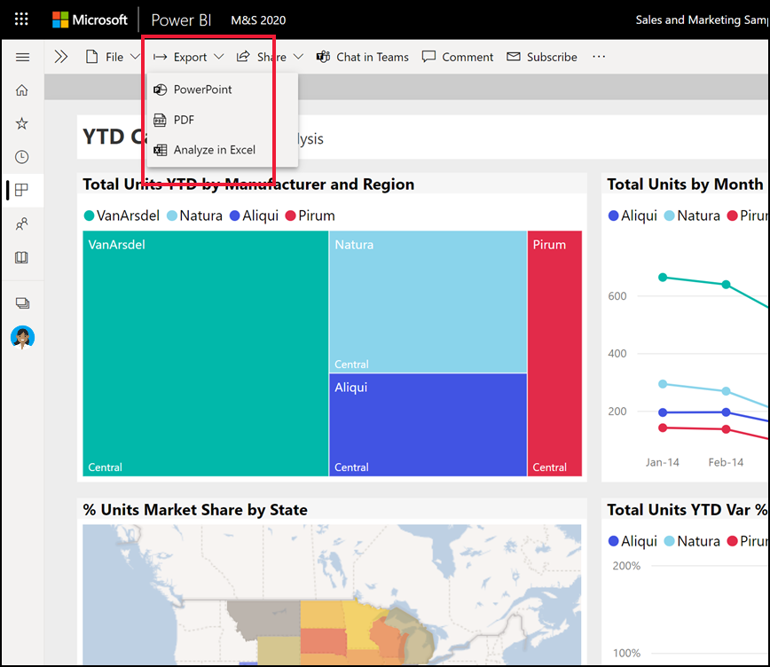
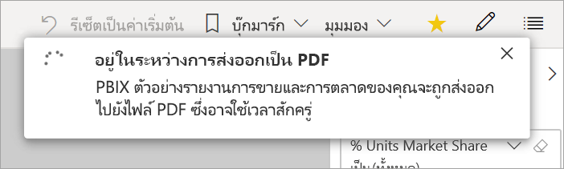
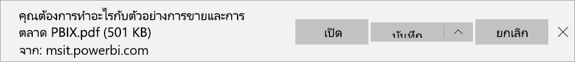

# ส่งออกรายงานจาก Power BI เป็น PDFExport reports from Power BI to PDF

[!INCLUDE[consumer-appliesto-yyny](../includes/consumer-appliesto-yyny.md)]

ขณะใช้ Power BI คุณสามารถเผยแพร่รายงานของคุณเป็นเอกสาร PDF และจัดทำเอกสารได้ง่าย ๆ ตามรายงาน Power BI ของคุณWith Power BI, you can publish your report to PDF format and easily create a document based on your Power BI report. เมื่อคุณส่งออกเป็น PDF แต่ละหน้าในรายงาน Power BI จะกลายเป็นหน้าใดหน้าหนึ่งในเอกสาร PDF ของคุณWhen you export to PDF, each page in the Power BI report becomes an individual page in your PDF document.

## ส่งออกรายงาน Power BI ของคุณเป็น PDFExport your Power BI report to PDF
ในบริการ Power BI เลือกรายงานที่จะแสดงบนพื้นที่In the Power BI service, select a report to display it on the canvas. คุณยังสามารถเลือกรายงานจาก **หน้าแรก** หน้าเพจ **แอป** หรือคอนเทนเนอร์อื่นจากบนบานหน้าต่างนำทางได้You can also select a report from your **Home** page, **Apps**, or any other container from the nav pane.

1. เลือก **ส่งออก** > **PDFจาก** แถบเมนูSelect **Export** > **PDF** from the menu bar.

    

    ป็อปอัพจะปรากฏในที่ซึ่งคุณมีตัวเลือกที่จะเลือก **ค่าปัจจุบัน** หรือ **ค่าเริ่มต้น**A pop-up appears where you have the option to select **Current values** or **Default values**. **ค่าปัจจุบัน** ส่งออกรายงานในสถานะปัจจุบัน ซึ่งรวมถึงการเปลี่ยนแปลงที่ใช้งานอยู่ที่คุณทำกับตัวแบ่งส่วนข้อมูลและตัวกรอง**Current values** exports the report in the current state, which includes the active changes you made to slicer and filter values. ผู้ใช้งานส่วนใหญ่เลือกตัวเลือกนี้Most users select this option. ในทางกลับกัน การเลือก **ค่าเริ่มต้น** จะส่งออกรายงานในสถานะดั้งเดิม (ตามที่ *ผู้ออกแบบ* แบ่งปันข้อมูล) และไม่มีผลต่อการเปลี่ยนแปลงใด ๆ ที่คุณทำกับสถานะดั้งเดิมนั้นAlternatively, selecting **Default values** exports the report in its original state, as the *designer* shared it, and doesn't reflect any changes you've made to that original state.
    
    นอกจากนี้ ยังมีกล่องกาเครื่องหมายเพื่อเลือกว่าจะส่งออกแท็บที่ซ่อนรายงานไว้หรือไม่Additionally, there's a check box to select whether or not to export the hidden tabs of a report. เลือกช่องทำเครื่องหมายนี้หากคุณต้องการส่งออกเฉพาะแท็บรายงานที่ปรากฏขึ้นสำหรับคุณในเบราเซอร์Select this check box if you want to export only report tabs that are visible to you in your browser. หากต้องการรับแท็บซ่อนทั้งหมดเป็นส่วนหนึ่งในข้อมูลส่งออก คุณจะต้องไม่ทำเครื่องหมายในช่องนี้If you prefer to get all the hidden tabs as part of your export, you can leave this check box cleared. ถ้ากล่องกาเครื่องหมายเป็นสีเทา แสดงว่าไม่มีแท็บที่ซ่อนอยู่ในรายงานIf the check box is grayed out, there are no hidden tabs in the report. เมื่อคุณได้ทำการเลือกของคุณแล้ว เลือก **ส่งออก** เพื่อดำเนินต่อAfter you make your selections, select **Export** to continue.
    
    คุณยังสามารถเลือกที่จะส่งออกเฉพาะหน้าปัจจุบันที่คุณกำลังดูในรายงานได้โดยการเลือกตัวเลือก **ส่งออกหน้าปัจจุบันเท่านั้น**You may also choose to export only the current page you're viewing in a report by checking the **Only export current page** option.  ตามค่าเริ่มต้น การดำเนินการนี้จะถูกยกเลิกการเลือกและหน้าทั้งหมดจะถูกส่งออกจากรายงานของคุณBy default, this is unchecked and all pages will be exported from your report.
    
    แถบความคืบหน้าแสดงอยู่ที่มุมบนขวาA progress bar displays in the upper-right corner. การส่งออกนี้อาจใช้เวลาสักครู่Exporting might take a few minutes. คุณสามารถทำงานใน Power BI ในขณะที่กำลังส่งออกรายงานYou can continue to work in Power BI while the report is being exported.

    

    หลังจากบริการ Power BI สิ้นสุดการส่งออก แบนเนอร์แจ้งเตือนจะเปลี่ยนไปเพื่อแจ้งให้คุณทราบAfter the Power BI service finishes the export process, the notification banner changes to let you know.

2. ไฟล์ของคุณพร้อมแล้วในเบราว์เซอร์ที่แสดงไฟล์ที่ดาวน์โหลดYour file is then available where your browser displays downloaded files. ในรูปต่อไปนี้ จะแสดงเป็นแบนเนอร์ดาวน์โหลดชิดด้านล่างของหน้าต่างเบราว์เซอร์In the following image, it's shown as a download banner along the bottom of the browser window.

    

และมีแค่นั้นAnd that's all there is to it. คุณสามารถดาวน์โหลดไฟล์ และเปิดไฟล์นั้นกับตัวแสดง PDF เช่นเดียวกับที่มีอยู่ใน Microsoft EdgeYou can download the file and open it with any PDF viewer, like the one available in Microsoft Edge.

## ข้อจำกัดและข้อควรพิจารณาLimitations and considerations
มีข้อควรพิจารณาและข้อจำกัดสองสามข้อที่ควรทราบเมื่อทำงานร่วมกับคุณสมบัติ **ส่งออกเป็น PDF**There are a few considerations and limitations to keep in mind when you work with the **Export to PDF** feature.

* PDF จะรวมข้อมูลและการแสดงภาพที่มองเห็นได้บนผืนผ้าใบ Power BI ของคุณThe PDF will include the data and visualizations visible on your Power BI canvas. หากวิชวลมีแถบเลื่อน PDF จะรวมวิชวลไว้ในสถานะเริ่มต้นที่ไม่มีการเลื่อนIf the visual includes scrollbars, the PDF will include the visual in its unscrolled default state.  
* การแสดงผลด้วยภาพแบบ R และ Python ยังไม่รองรับในขณะนี้R and Python visuals aren't currently supported. ใน PDF ภาพเหล่านี้จะว่างเปล่า และแสดงข้อความข้อผิดพลาดIn the PDF, these visuals are blank and display an error message. 
* รองรับวิชวล Power BI ที่ผ่านการรับรองแล้วPower BI visuals that have been certified are supported. สำหรับข้อมูลเพิ่มเติมเกี่ยวกับภาพวิชวล Power BI ที่ได้การรับรอง รวมถึงวิธีการรับภาพวิชวล Power BI ที่ได้รับการรับรอง ให้ดู[รับวิชวล Power BI ที่ได้รับการรับรอง](../developer/visuals/power-bi-custom-visuals-certified.md)For more information on certified Power BI visuals, including how to get a Power BI visual certified, see [Get a Power BI visual certified](../developer/visuals/power-bi-custom-visuals-certified.md). ไม่สนับสนุนวิชวล Power BI ที่ไม่ได้รับการรับรองPower BI visuals that haven't been certified aren't supported. ใน PDF ภาพเหล่านี้จะแสดงพร้อมด้วยข้อความข้อผิดพลาดIn the PDF, they display with an error message.
* ไม่รองรับวิชวลแบบ ESRIThe ESRI visual is not supported.
* รายงานที่มีจำนวนหน้ารายงานเกิน 50 หน้าไม่สามารถส่งออกได้ในขณะนี้Reports with more than 50 report pages currently can't be exported.
* ขั้นตอนการส่งออกรายงานเป็น PDF อาจใช้เวลาสักครูจนกว่าจะเสร็จสมบูรณ์ ดังนั้นโปรดรอสักครู่The process of exporting the report to PDF might take a few minutes to complete, so be patient. ปัจจัยที่สามารถส่งผลกระทบต่อเวลาจำเป็นต้องมีโครงสร้างของรายงาน และมีการโหลดบน Power BI service ปัจจุบันFactors that can affect the time required include the structure of the report and the current load on the Power BI service.
* หากรายการเมนู **ส่งออกเป็น PDF** ไม่พร้อมใช้งานในบริการของ Power BI อาจเป็นไปได้ว่าผู้ดูแลระบบ Power BI ของคุณได้ปิดใช้งานคุณลักษณะนี้If the **Export to PDF** menu item isn't available in the Power BI service, it's likely because your Power BI admin disabled the feature. ติดต่อผู้ดูแลระบบของคุณสำหรับรายละเอียดContact your admin for details.
* ภาพพื้นหลังจะถูกตัดรูปด้วยพื้นที่ที่กำหนดขอบเขตของแผนภูมิBackground images are cropped with the chart's bounding area. แนะนำให้คุณลบภาพพื้นหลังก่อนส่งออกเป็นไฟล์ PDFWe recommend that you remove background images before you export to PDF.
* รายงานที่มีเจ้าของเป็นผู้ใช้ภายนอกโดเมนผู้เช่า Power BI ของคุณ เช่น รายงานที่มีบุคคลภายนอกองค์กรของคุณเป็นเจ้าของ และถูกแชร์ให้คุณ ไม่สามารถเผยแพร่เป็น PDF ได้Reports that are owned by a user outside your Power BI tenant domain, such as a report owned by someone outside your organization and shared with you, can't be published to PDF.
* ถ้าคุณแชร์แดชบอร์ดกับบุคคลภายนอกองค์กรของคุณ (และดังนั้น ผู้ใช้ที่ไม่อยู่ในผู้เช่า Power BI ของคุณ) ผู้ใช้รายนั้นจะไม่สามารถส่งรายงานที่เกี่ยวข้องของแดชบอร์ดที่แชร์เป็น PDF ได้If you share a dashboard with someone outside of your organization, and thereby, a user who isn't in your Power BI tenant, that user can't export the shared dashboard's associated reports to PDF. ตัวอย่างเช่น ถ้าคุณเป็นเช่นนั้น aaron@contoso.comคุณสามารถแชร์ให้cassie@northwinds.comได้For example, if you're aaron@contoso.com, you can share with cassie@northwinds.com. แต่cassie@northwinds.comไม่สามารถส่งรายงานที่เกี่ยวข้องเป็น PDF ได้But cassie@northwinds.com can't export the associated reports to PDF.
* ขณะส่งออกเป็นไฟล์ PDF พร้อมรายงานที่มีภาพพื้นหลัง คุณอาจพบภาพปผิดเพี้ยนในผลงานส่งออกหากใช้ **ปกติ** หรือ **เติม** สำหรับ **พื้นหลังหน้าเอกสาร**When you export to PDF with reports that contain a background image, you might see a distorted image in the export if you use the **Normal** or **Fill** options for the **Page Background**. เพื่อให้ได้ผลลัพธ์ดีที่สุด ใช้ตัวเลือก **ปรับพอดี** เพื่อป้องกันปัญหากับเอกสารที่คุณส่งออกFor best results, use the **Fit** option to avoid issues with your exported document.
* บริการของ Power BI ใช้การตั้งค่าภาษาของ Power BI เป็นภาษาสำหรับการส่งออกเป็น PDFThe Power BI service uses your Power BI language setting as the language for the PDF export. ดูหรือตั้งค่าภาษาของคุณโดยเลือกไอคอนรูปเฟือง  > **การตั้งค่า** > **ทั่วไป** > **ภาษา**To see or set your language preference, select the cog icon  > **Settings** > **General** > **Language**.
* ตัวกรอง URL จะไม่ถูกนำมาพิจารณาหากคุณเลือก **ค่าปัจจุบัน** สำหรับการส่งออกของคุณURL filters aren't currently respected when you choose **Current Values** for your export.
* รายงานที่มีขนาดหน้ากระดาษแบบกำหนดเองที่ไม่ปกติอาจประสบปัญหาในสถานการณ์การส่งออกReports with unusual custom page sizes may experience issues in export scenarios. เพื่อให้ได้ผลลัพธ์ที่ดีที่สุด ให้ลองสลับไปยังขนาดหน้ากระดาษมาตรฐานสำหรับรายงานของคุณFor best results, consider switching to a standard page size for your report.
* เมื่อส่งออกเป็น PDF แล้ว รายงานที่ใช้ธีมที่มีแบบอักษรที่กำหนดเองจะมีการแทนที่แบบอักษรที่กำหนดเองด้วยแบบอักษรเริ่มต้นWhen exporting to PDF, reports using themes with custom fonts will have the custom font replaced with a default font.
* ในขณะที่เรากำลังมองหาประสบการณ์ที่สอดคล้องกัน เราไม่สามารถรับประกันว่า PDF ที่ส่งออกจากบริการของ Power BI จะตรงกับ PDF ที่ส่งออกจากไฟล์ Power BI Desktop ภายในเครื่องเสมอWhile we look to provide a consistent experience, we can't guarantee the exported PDF from the Power BI service will always match the exported PDF from a local Power BI Desktop file.
* เมื่อส่งออกเป็นไฟล์ PDF เราไม่สามารถรับประกันความถูกต้องของพิกเซลที่สมบูรณ์แบบสำหรับรายงาน PBIXWhen exporting to PDF, we cannot guarantee pixel perfect fidelity for PBIX reports.

## ขั้นตอนถัดไปNext steps
[พิมพ์หน้ารายงานPrint a report](end-user-print.md)
