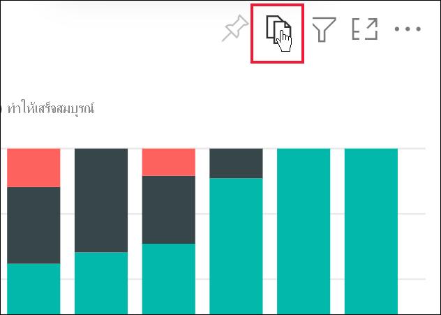
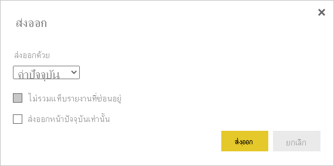
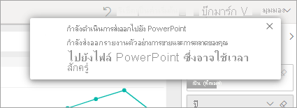
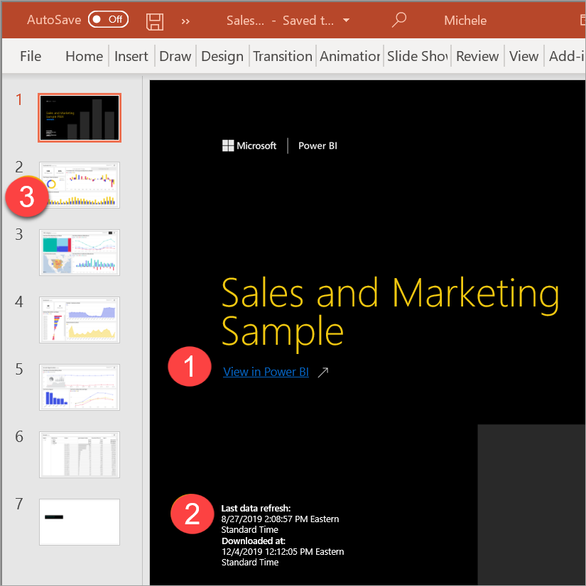

# ส่งออกรายงานไปยัง PowerPoint

[!INCLUDE[consumer-appliesto-yynn](../includes/consumer-appliesto-yynn.md)]

ด้วยบริการของ Power BI (app.powerbi.com) คุณสามารถเผยแพร่รายงานของคุณไปยัง Microsoft PowerPoint และสร้างชุดสไลด์ที่ยึดตามรายงาน Power BI ของคุณได้อย่างง่ายดาย ขณะส่งออกเป็น PowerPoint กรณีต่อไปนี้จะเกิดขึ้น:

* แต่ละหน้าในรายงาน Power BI กลายเป็นแต่ละสไลด์ใน PowerPoint
* แต่ละหน้าในรายงาน Power BI จะถูกส่งออกเป็นรูปภาพความละเอียดสูงหนึ่งรูปใน PowerPoint
* คุณสามารถสงวนการตั้งค่าตัวกรองและตัวแบ่งส่วนข้อมูลที่คุณเพิ่มไปยังรายงานได้
* ลิงก์ถูกสร้างขึ้นใน PowerPoint ที่เชื่อมโยงกลับไปยังรายงาน Power BI

รับ **รายงาน Power BI** ของคุณ ที่ถูกส่งออกเป็น **PowerPoint** อย่างรวดเร็ว ทำตามขั้นตอนที่แสดงในส่วนถัดไป

คุณยังสามารถคัดลอกหนึ่งวิชวลต่อหนึ่งครั้งจากบริการของ Power BI และวางลงใน PowerPoint (หรือโปรแกรมอื่นๆ ที่รองรับการวาง) ได้ เลือกไอคอน **คัดลอกเป็นรูปภาพ** เพื่อคัดลอกวิชวลไปยังคลิปบอร์ดของคุณ จากนั้นจึงเปิด PowerPoint และวางวิชวล สำหรับข้อมูลเพิ่มเติม ดู [คัดลอกวิชวลเป็นรูปภาพคงที่](../visuals/power-bi-visualization-copy-paste.md)

## ส่งออกรายงาน Power BI ของคุณไปยัง PowerPoint
ใน **บริการ Power BI** ให้เลือกรายงานที่จะแสดงบนพื้นที่ทำงาน คุณยังสามารถเลือกรายงานจาก **หน้าแรก** **แอป** หรือคอนเทนเนอร์อื่นจากบนบานหน้าต่างนำทางได้

เมื่อรายงานที่คุณต้องการส่งออกไปยัง PowerPoint ถูกแสดงอยู่บนพื้นที่แก้ไข ให้เลือก **ไฟล์** > **ส่งออกไปยัง PowerPoint** จากแถบเมนู

ป็อปอัพจะปรากฏในที่ซึ่งคุณมีตัวเลือกที่จะเลือก **ค่าปัจจุบัน** หรือ **ค่าเริ่มต้น** **ค่าปัจจุบัน** ส่งออกรายงานในสถานะปัจจุบัน ซึ่งรวมถึงการเปลี่ยนแปลงที่ใช้งานอยู่ที่คุณทำกับตัวแบ่งส่วนข้อมูลและตัวกรอง  ผู้ใช้งานส่วนใหญ่เลือกตัวเลือกนี้ หากคุณได้ทำการเลื่อน **ค่าปัจจุบัน** ไม่ได้รวมสถานะการเลื่อนของวิชวล แต่จะส่งออกส่วนบนสุดของข้อมูลแทน หรือเลือก **ค่าเริ่มต้น** เพื่อส่งออกรายงานในสถานะดั้งเดิมตามที่ *ผู้ออกแบบ* แชร์ไว้ โดยไม่ครอบคลุมการเปลี่ยนแปลงใด ๆ ที่คุณทำไว้กับสถานะเริ่มต้น

 
นอกจากนี้ ยังมีกล่องกาเครื่องหมายเพื่อเลือกว่าจะส่งออกแท็บที่ซ่อนรายงานไว้หรือไม่ เลือกช่องทำเครื่องหมายนี้หากคุณต้องการส่งออกเฉพาะแท็บรายงานที่ปรากฏขึ้นสำหรับคุณในเบราเซอร์ หากต้องการรับแท็บซ่อนทั้งหมดเป็นส่วนหนึ่งในข้อมูลส่งออก คุณจะต้องไม่ทำเครื่องหมายในช่องนี้ ถ้ากล่องกาเครื่องหมายเป็นสีเทา แสดงว่าไม่มีแท็บที่ซ่อนอยู่ในรายงาน ตัวอย่างของแท็บที่ซ่อนไว้จะเป็นแท็บคำแนะนำเครื่องมือ [คำแนะนำเครื่องมือแบบกำหนดเอง](../create-reports/desktop-tooltips.md) จะถูกสร้างขึ้นโดย *ผู้ออกแบบ* รายงานและไม่แสดงเป็นแท็บรายงานใน Power BI service สำหรับ *ผู้ใช้ทางธุรกิจ* 

คุณยังสามารถเลือกที่จะส่งออกเฉพาะหน้าปัจจุบันที่คุณกำลังดูในรายงานได้โดยการเลือกตัวเลือก **ส่งออกหน้าปัจจุบันเท่านั้น**  ตามค่าเริ่มต้น การดำเนินการนี้จะถูกยกเลิกการเลือกและหน้าทั้งหมดจะถูกส่งออกจากรายงานของคุณ

เมื่อคุณได้ทำการเลือกของคุณแล้ว เลือก **ส่งออก** เพื่อดำเนินต่อ คุณจะเห็นแบนเนอร์การแจ้งเตือนในมุมบนขวาของหน้าต่างเบราว์เซอร์ของ Power BI service ซึ่ง รายงานจะส่งออกไปยัง PowerPoint 

การส่งออกนี้อาจใช้เวลาสักครู่ ปัจจัยที่สามารถส่งผลกระทบต่อเวลาจำเป็นต้องมีโครงสร้างของรายงาน และมีการโหลดบน Power BI service ปัจจุบัน คุณสามารถทำงานใน Power BI ในขณะที่กำลังส่งออกรายงาน

หลังจากบริการ Power BI สิ้นสุดกระบวนการส่งออก แบนเนอร์แจ้งเตือนจะเปลี่ยนไปเพื่อแจ้งข้อมูลให้คุณทราบ ไฟล์ของคุณพร้อมแล้วในเบราว์เซอร์ที่แสดงไฟล์ที่ดาวน์โหลด ในรูปต่อไปนี้ จะแสดงเป็นแบนเนอร์ดาวน์โหลดชิดด้านล่างของหน้าต่างเบราว์เซอร์

และมีแค่นั้น คุณสามารถดาวน์โหลดไฟล์ ให้เปิดมันด้วย PowerPoint และปรับเปลี่ยนหรือปรับปรุงเหมือนกับที่คุณต้องการชุด PowerPoint ใดๆ

## เปิดไฟล์ PowerPoint
เมื่อคุณเปิดไฟล์ PowerPoint ที่ส่งออก Power BI คุณจะพบองค์ประกอบที่ยอดเยี่ยม และมีประโยชน์บางอย่าง ดูที่รูปภาพต่อไปนี้ จากนั้นเช็คเอาท์องค์ประกอบที่ลำดับเลขที่ซึ่งอธิบายฟีเจอร์ยอดเยี่ยมเหล่านั้นบางอย่าง หน้าใน PowerPoint จะถูกสร้างขึ้นในขนาดมาตรฐาน 9:16 เสมอ โดยไม่คำนึงถึงขนาดหน้าเดิมหรือมิติในรายงาน Power BI

1. หน้าแรกของชุดสไลด์มีชื่อของรายงานของคุณ และลิงก์เพื่อให้คุณสามารถดูรายงาน  **Power BI** ที่ยึดตามชุดสไลด์
2. คุณจะได้รับข้อมูลที่เป็นประโยชน์เกี่ยวกับรายงานนี้ด้วยเช่นกัน **รีเฟรชข้อมูลล่าสุด** ใช้เพื่อแสดงวันที่และเวลาสำหรับรายงานที่ส่งออก **ดาวน์โหลดที่** ใช้เพื่อแสดงวันที่และเวลาเมื่อส่งออกรายงาน Power BI เป็นไฟล์ PowerPoint เวลา **ที่ดาวน์โหลด** ได้รับการตั้งค่าเป็นโซนเวลาของคอมพิวเตอร์ของคุณในเวลาที่ส่งออก

3. แต่ละหน้ารายงานเป็นสไลด์แยกต่างหาก ดังที่แสดงในบานหน้าต่างนำทาง 
4. รายงานที่คุณเผยแพร่แล้วจะแสดงในภาษาตามการตั้งค่า Power BI ของคุณ หรือจากการตั้งค่าตำแหน่งที่ตั้งของเบราว์เซอร์ของคุณ ดูหรือตั้งค่าภาษาในเบราว์เซอร์ของคุณโดยเลือก  > **การตั้งค่า** > **ทั่วไป** > **ภาษา** สำหรับข้อมูลของพื้นที่ ให้ดู[ภาษาที่รองรับและประเทศหรือภูมิภาคสำหรับ Power BI](../fundamentals/supported-languages-countries-regions.md)

เมื่อคุณดูแต่ละสไลด์ คุณจะสังเกตเห็นว่า แต่ละหน้ารายงานคือรูปภาพที่แยกจากกัน การเลื่อนใน PowerPoint ไม่พร้อมใช้งานเนื่องจากแต่ละสไลด์เป็นรูปภาพคงที่

สิ่งที่คุณทำกับชุด PowerPoint ของคุณจากที่นั่น หรือจากรูปภาพที่มีความละเอียดสูงใด ขึ้นอยู่กับคุณ

## ข้อควรพิจารณาและการแก้ไขปัญหา
มีข้อควรพิจารณาและข้อจำกัดสองสามตัวที่ควรทราบเมื่อทำงานกับฟีเจอร์ **ส่งออกไปยัง PowerPoint**
 

* ถ้าคุณไม่เห็นตัวเลือกการ **ส่งออก** ตรวจสอบให้แน่ใจว่าคุณกำลังดูรายงาน (ไม่ใช่แดชบอร์ด)

* [ตัวกรอง URL](../collaborate-share/service-url-filters.md) จะไม่ถูกนำมาพิจารณาหากคุณเลือก **ค่าปัจจุบัน** สำหรับการส่งออกของคุณ

* เมื่อทำการส่งออกไปยัง PowerPoint หากรายงานใช้แบบอักษรแบบกำหนดเอง แบบอักษรดังกล่าวจะถูกแทนที่ด้วยแบบอักษรเริ่มต้น

* ชนิดวิชวลต่อไปนี้ไม่ได้รับการรองรับ และจะไม่ถูกส่งออกไปยัง PowerPoint:
   - ไม่รองรับ [วิชวลแบบกำหนดเองที่ไม่ได้รับการรับรอง](../developer/visuals/power-bi-custom-visuals-certified.md)) 
   - ไม่รองรับ[วิชวล ESRI ArcGIS](../visuals/power-bi-visualizations-arcgis.md)
   - ไม่รองรับวิชวล R และ Python
   - ภาพพื้นหลังจะถูกตัดรูปด้วยพื้นที่ที่กำหนดขอบเขตของแผนภูมิ แนะนำให้คุณลบภาพพื้นหลังก่อนส่งออกเป็นไฟล์ PowerPoint

* ไม่สามารถส่งออกรายงานบางรายการได้ สิ่งเหล่านี้รวมถึง:
    - ถ้าคุณแชร์แดชบอร์ดกับบุคคลภายนอกองค์กรของคุณ (และดังนั้น ผู้ใช้ที่ไม่อยู่ในผู้เช่า Power BI ของคุณ) ผู้ใช้รายนั้นจะไม่สามารถส่งรายงานที่เกี่ยวข้องของแดชบอร์ดที่แชร์เป็น PowerPoint ได้ ตัวอย่างเช่น ถ้าคุณเป็นเช่นนั้น aaron@contoso.comคุณสามารถแชร์ให้david@cohowinery.comได้ แต่ david@cohowinery.com ไม่สามารถส่งออกรายงานที่เชื่อมโยงไปยังไฟล์ PowerPoint
    - รายงานที่มีจำนวนหน้ารายงานมากกว่า 50 หน้า รายงานจนไม่มีข้อจำกัดนี้ ดู [พิมพ์รายงานจน](end-user-paginated-report.md#interact-with-a-paginated-report) สำหรับรายละเอียด
    - รายงานที่มีขนาดใหญ่กว่า 500 MB เมื่อส่งออก 
    - รายงานที่มีการส่งออกไปยัง PowerPoint ในเวอร์ชันที่เก่ากว่า
    - รายงานที่ใช้เวลานานกว่าหนึ่งชั่วโมงเพื่อดำเนินการ 
    - หน้ารายงานที่ใช้เวลานานกว่า 6 นาทีในการโหลด 

* หากรายการเมนู **ส่งออกเป็น PowerPoint** ไม่พร้อมใช้งานใน Power BI service อาจเป็นไปได้ว่าผู้ดูแลระบบ Power BI ของคุณหรือเจ้าของรายงานได้ปิดใช้งานคุณลักษณะนี้ ติดต่อผู้ดูแลระบบของคุณหรือเจ้าของเพื่อสอบถามรายละเอียด
* Power BI service ใช้การตั้งค่าภาษาของ Power BI ของคุณเป็นภาษาสำหรับการส่งออกไปยัง PowerPoint ดูหรือตั้งค่าภาษาในเบราว์เซอร์ของคุณโดยเลือก  > **การตั้งค่า** > **ทั่วไป** > **ภาษา**

## ขั้นตอนถัดไป
[คัดลอกวิชวลเป็นรูปภาพแบบคงที่](../visuals/power-bi-visualization-copy-paste.md)    
[พิมพ์หน้ารายงาน](end-user-print.md)
