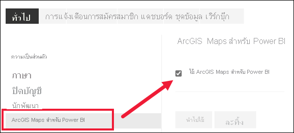

# เลือกใช้ฟีเจอร์ตัวอย่างของบริการ Power BIOpt in for Power BI service preview features

[!INCLUDE[consumer-appliesto-yynn](../includes/consumer-appliesto-yynn.md)]

## อะไรคือ *ฟีเจอร์ตัวอย่าง*What are *preview features*?
ขณะที่เราปรับปรุงบริการของ Power BI เราจะปล่อยฟังก์ชันใหม่บางอย่างที่เป็น *ฟีเจอร์ตัวอย่าง*As we make improvements to the Power BI service, we'll release some new functionality as *preview features*. ฟีเจอร์ตัวอย่างสามารถเปิดและปิด ทำให้คุณมีโอกาสในการลองได้Preview features can be turned on and off, giving you the opportunity to try them out.

ฟีเจอร์ตัวอย่างบางอย่างสามารถสลับเปิดและปิดจากแดชบอร์ด Power BI ของคุณ หน้าแรก หรือรายงานSome preview features can be toggled on and off from your Power BI dashboard, Home, or report itself. ในขณะที่ฟีเจอร์ตัวอย่างอื่น ๆ จะสามารถใช้งานได้จากเมน *การตั้งค่า* ของคุณWhile other preview features are made available from your *Settings* menu. บทความนี้จะแสดงวิธีการเข้าถึงฟีเจอร์ตัวอย่างผ่านเมนูการตั้งค่าThis article shows you how to access preview features via the Settings menu.

## แสดงตัวอย่างการค้นหา และเปิดใช้งาน(และปิด)Find previews and turn them on (and off)
1. เปิดเมนูการตั้งค่าของคุณ โดยการเลือกไอคอนรูปเฟืองที่มุมขวาบนของหน้าจอ Power BI ของคุณ แล้วเลือก **ตั้งค่า**Open your Settings menu by selecting the gear icon in the upper-right corner of your Power BI screen and choosing **Settings**.
   
   ..
2. เลือกคำแท็บ **ทั่วไป** ถ้ามีการแสดงตัวอย่าง คุณจะเห็นตัวเลือกสำหรับ **ฟีเจอร์ตัวอย่าง** หรือคุณจะเห็นเป็นฟีเจอร์การแสดงตัวอย่างที่แสดงอยู่ทางด้านซ้ายSelect the **General** tab. If previews exist, you'll either see an option for **Preview features** or you'll see a preview feature listed on the left.  ในตัวอย่างนี้ ไม่มีการแสดงตัวอย่างที่แสดงรายการของ ArcGIS MapsIn this example, there is a preview listed for ArcGIS Maps. 
   
   
3. เลือกปุ่มตัวเลือก **เปิด** หรือทำเครื่องหมายในกล่อง เพื่อลองใช้ประสบการณ์การใช้งานใหม่Select the **On** radio button, or mark the checkbox, to try out the new experience. แล้ว เลือก **นำไปใช้**Then select **Apply**.
4. เมื่อต้องการปิดใช้งานฟีเจอร์ตัวอย่าง ให้ปฏิบัติตามขั้นตอนที่ 1-3 ด้านบน โดยในขั้นตอนที่ 3 เลือก **ปิด** หรือลบเครื่องหมายถูกออกไป แล้วเลือก **ใช้**To turn off preview features, follow steps 1-3 above, and in step 3, choose **Off**, or remove the checkmark, and select **Apply**.

มีคำถามหรือคำติชมหรือไม่Have questions or feedback? [เยี่ยมชมฟอรั่มชุมชน Power BI](https://community.powerbi.com/t5/Navigation-Preview-Forum/bd-p/NavigationPreview)[Visit the Power BI community forum](https://community.powerbi.com/t5/Navigation-Preview-Forum/bd-p/NavigationPreview).

