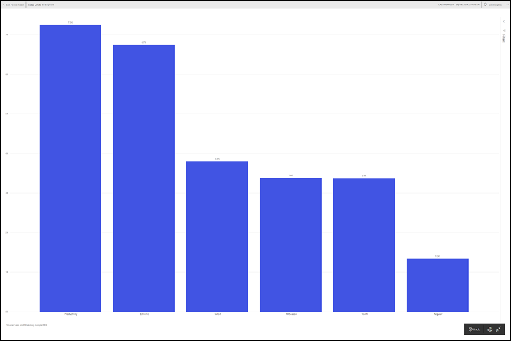

# การพิมพจากบริการของ Power BIPrinting from the Power BI service

[!INCLUDE[consumer-appliesto-yynn](../includes/consumer-appliesto-yynn.md)]
## สิ่งที่สามารถพิมพ์ได้What can be printed

พิมพ์ทั้งแดชบอร์ด ไทล์ของแดชบอร์ หน้ารายงาน หรือภาพรายงานจากบริการของ Power BIPrint an entire dashboard, a dashboard tile, a report page, or a report visual from the Power BI service. หากรายงานของคุณมีมากกว่าหนึ่งหน้า คุณจะต้องพิมพ์แต่ละหน้าแยกกันIf your report has more than one page, you'll need to print each page separately. 

## ข้อควรพิจารณาเกี่ยวกับการพิมพ์Printing considerations

แดชบอร์ดและรายงานของ Power BI ส่วนใหญสร้างขึ้นโดย *นักออกแบบ* รายงาน เพื่อใช้งานออนไลน์และเพื่อให้ดูน่าทึ่งเมื่อแสดงบนอุปกรณ์ต่าง ๆMost Power BI dashboards and reports are created by report *designers* to be used online and to look amazing when displayed on a variety of devices. เมื่อคุณพิมพ์รายงาน วิธีในการแสดงเนื้อหาในกระดาษนั้นควบคุมโดยเบราว์เซอร์ของคุณWhen you print a report, how that content displays on paper is controlled by your browser. 

โดยมีการตั้งค่าเบราว์เซอร์ที่คุณสามารถใช้เพื่อปรับรูปแบบการพิมพ์ ถึงกระนั้นคุณอาจจะไม่ได้รับสิ่งที่คุณต้องการThere are browser settings you can use to adjust the printout, but even then you still may not get the result you want. พิจารณาการ[ส่งออกเป็น PDF](end-user-pdf.md) ก่อน แล้วจึงพิมพ์ PDF แทนConsider [exporting to PDF](end-user-pdf.md) first and printing the PDF instead. 

## ปรับการตั้งค่าการพิมพ์ของเบราว์เซอร์ของคุณAdjust your browser print settings
เมื่อคุณพิมพ์จาก Power BI ให้เบราว์เซอร์ของคุณเปิดหน้าต่างพิมพ์When you print from Power BI, your browser opens a Print window. หน้าต่างพิมพ์ของแต่ละเบราว์เซอร์นั้นแตกต่างกันEach browser's Print window is different from the others. แต่คุณจะพบว่าเบราว์เซอร์มีตัวเลือกที่คล้ายกัน เพื่อให้คุณใช้ควบคุมลักษณะของงานพิมพ์ของคุณBut, you'll find that they all have similar options available for you to use to control the look of your printout. 

นี่คือเคล็ดลับด่วนที่คุณสามารถใช้ปรับรูปแบบงานพิมพ์ของคุณHere are a few quick tips you can use to format your printout.

   > 
1. หากแดชบอร์ด รายงาน หรือการแสดงผลของคุณมีความกว้างมากกว่าความสูง เลือกใช้เค้าโครง **แนวนอน**If your dashboard, report, or visual is more wide than it is tall, consider using the **Landscape** layout. 

   

2. เพื่อให้พอดีกับหน้าพิมพ์ ให้ปรับระยะของและสเกลTo fit more onto a printed page, adjust things like margins and scale. 

    

ทดสอบกับการตั้งค่าเบราว์เซอร์เฉพาะของคุณจนกระทั้งคุณได้ลักษณะที่คุณต้องการExperiment with your particular browser's settings until you get the look that you like. บางเบราว์เซอร์ยังมีตัวเลือกพิมพ์กราฟิกพื้นหลังSome browsers even have options to print background graphics. 

## พิมพ์แดชบอร์ดPrint a dashboard
1. เปิดแดชบอร์ดที่คุณต้องการพิมพ์Open the dashboard that you'd like to print.
2. ที่มุมบนซ้าย เลือก **ไฟล์** และเลือก **พิมพ์หน้านี้**In the upper left corner, select **File** and choose **Print this page**.
   
    

3. หน้าต่างการพิมพ์สำหรับเบราว์เซอร์ของคุณเปิดขึ้นThe Print window for your browser opens. เลือกการตั้งค่าChoose the settings. สำหรับตัวอย่าง หากแดชบอร์ดของคุณกว้างกว่าวามสูง คุณอาจจะต้องเปลี่ยนเค้าโครงเป็น **แนวนอน**For example, if your dashboard is wider than it is long, you may want to change the layout to **Landscape**. เลือก **พิมพ์**Select **Print**.
   
    

## พิมพ์แดชบอร์ดไทล์Print a dashboard tile
1. เปิดแดชบอร์ดใน[โหมดเต็มหน้าจอ](end-user-focus.md)โดยการเลือกไอคอนเต็มหน้าจอจากแถบเมนูด้านบนOpen the dashboard in [full screen mode](end-user-focus.md) by selecting the full screen icon  from the upper menu bar.

3. [เปิดไทล์ในโหมดโฟกัส](end-user-focus.md)โดยการเลื่อนเมาส์ลอยไว้ด้านบนเพื่อเผย **ตัวเลือกเพิ่มเติม** (...) แล้วเลือก **เปิดในโหมดโฟกัส** หรือเลือกไอคอนโฟกัส[Open the tile in Focus mode](end-user-focus.md) by hovering to reveal **More options** (...) and choosing **Open in focus mode** or the focus icon .
   
    

4. ลากเคอร์เซอร์เหนือไทล์เพื่อเปิดเมนูตัวเลือกHover over the tile to reveal the Options menu.
   
    

    

4. เลือกไอคอนพิมพ์Select the Print icon ..     

5. หน้าต่างการพิมพ์สำหรับเบราว์เซอร์ของคุณเปิดขึ้นThe Print window for your browser opens. เลือกการตั้งค่าChoose the settings. สำหรับตัวอย่าง หากไทล์ของคุณไม่พอดีกับหน้า คุณอาจจะต้องเปลี่ยนสเกลเป็น 75%For example, if your tile isn't fitting on the page, you may want to change the scale to 75%. เลือก **พิมพ์**Select **Print**.

     

> [!TIP]
> หากคุณทำตามขั้นตอนเหล่านี้ แต่ไทล์ของยังคงไม่แสดงตามที่คุณต้องการ ให้ลองขั้นตอนต่อไปนี้If you've followed all of these steps and your tile still isn't displaying the way you want it to, try the following.
> 1. เปิดหน้าต่างพิมพ์และเปลี่ยนการตั้งค่าการพิมพ์ที่คุณคิดว่าจะทำให้งานพิมพ์ออกมาดีที่สุดOpen the Print window and make the changes to the print settings that you believe will result in the best printout. ตัวอย่างเช่น เปลี่ยนเค้าโครง ระยะของ และสเกลFor example, change the layout, margins, and scale. 
> 2. แต่แทนที่จะพิมพ์ ให้เลือก **ยกเลิก**But, instead of printing, select **Cancel**. 
> 3. ดำเนินการตามขั้นตอน 1-5 อีกครั้งGo through steps 1-5 again. ไทล์ของคุณจะปรับเป็นการตั้งค่าหน้าต่างพิมพ์ใหม่และพร้อมที่จะพิมพ์Your tile will adjust to the new Print window settings and be ready to print.

## พิมพ์หน้ารายงานPrint a report page
รายงานสามารถพิมพ์ออกมาหนึ่งหน้าในแต่ละครั้งReports can be printed one page at a time.

1. เปิดรายงานแล้วเลือก **ไฟล์** > **พิมพ์หน้านี้** เพื่อพิมพ์หน้ารายงานปัจจุบันOpen the report and select **File** > **Print this page** to print the current report page.
   
    
2. หน้าต่างการพิมพ์สำหรับเบราว์เซอร์ของคุณเปิดขึ้นThe Print window for your browser opens.

3. ทำตามขั้นตอนการพิมพ์จาก **พิมพ์แดชบอร์ด** ข้างต้นFollow the printing steps from **Print a dashboard**, above.
   

## พิมพ์รูปแบบรายงานPrint a report visual
1. [เปิดภาพในโหมดโฟกัส](end-user-focus.md)โดยลากเคอร์เซอร์เหนือไทล์ แล้วเลือกไอคอนโฟกัสจากมุมบนขวา[Open the visual in Focus mode](end-user-focus.md) by hovering over the tile and selecting the Focus icon  from the top-right corner.

    

2. จากมุมบนซ้าย เลือก **ไฟล์** > **พิมพ์หน้านี้** เพื่อพิมพ์วิชวลFrom the upper left corner, select **File** > **Print this page** to print the visual.

    

3. ทำตามขั้นตอนการพิมพ์จาก **พิมพ์แดชบอร์ด** ข้างต้นFollow the printing steps from **Print a dashboard**, above.

## ข้อควรพิจารณาและการแก้ไขปัญหาConsiderations and troubleshooting

* Q:ฉันไม่สามารถพิมพ์หน้ารายงานทั้งหมดในครั้งเดียวQ: I cannot print all the report pages at once.    
* A:ถูกต้องแล้วA: That is correct. หน้ารายงานพิมพ์ได้เพียงหนึ่งหน้ากระดาษต่อการพิมพ์แต่ละครั้งReport pages can only be printed one page at a time.
* Q:ฉันไม่สามารถพิมพ์เป็น PDFQ: I cannot print to PDF.    
* A:คุณจะเห็นตัวเลือกนี้ ถ้าคุณได้กำหนดค่าไดรเวอร์ PDF ในเบราว์เซอร์ของคุณA: You will only see this option if you've already configured the PDF driver in your browser.    
* Q:สิ่งที่ฉันเห็นเมื่อฉันเลือก **พิมพ์** ไม่ตรงกับสิ่งที่คุณกำลังแสดงให้ฉันที่นี่Q: What I see when I select **Print** doesn't match what you're showing me here.    
* A:พิมพ์หน้าจอแตกต่างกันไปตามเบราว์เซอร์และรุ่นของซอฟต์แวร์A: The Print screens vary by browser and software version.
* Q:สิ่งพิมพ์ไม่ถูกปรับขนาดอย่างถูกต้องQ: My printout isn't scaled correctly.  แดชบอร์ดของฉันไม่พอดีกับหน้าMy dashboard doesn't fit on the page. คำถามอื่นๆ เกี่ยวกับอัตราส่วนและทิศทางOther scaling and orientation questions.    
* A: เราไม่สามารถรับประกันได้ว่าสำเนาที่พิมพ์ออกมานั้นจะตรงตามที่ปรากฏในบริการของ Power BI อย่างไม่ผิดเพี้ยนA: We cannot guarantee that the printed copy will be exactly the same as it appears in the Power BI service. สิ่งต่าง ๆ เช่นมาตราส่วน ระยะขอบ รายละเอียดรูป วางแนว และขนาดจะไม่ถูกควบคุมโดย Power BIThings like scaling, margins, visual details, orientation, and size are not controlled by Power BI. ลองปรับการตั้งค่าการพิมพ์ที่เบราว์เซอร์ของคุณTry adjusting the print settings for your browser. เบราว์เซอร์บางตัวเราแนะนำการวางแนวกระดาษ (แนวตั้ง หรือ แนวนอน) ขนาดระยะขอบ และสเกลSome of the ones we suggest above are page orientation (portrait or landscape), margin size, and scale. หากการดำเนินการดังกล่าวไม่ได้ช่วยให้ดีขึ้น ให้อ้างอิงถึงเอกสารประกอบของเบราว์เซอร์ของคุณIf these don't help, refer to the documentation for your specific browser.      
* Q: เมื่อฉันจะพิมพ์โหมดเต็มหน้าจอ ฉันไม่เห็นตัวเลือกการพิมพ์เมื่อฉันเลื่อนเมาส์เหนือการแสดงผลQ: When I'm printing from Full screen mode, I don't see the print option when I hover over the visual.   
* A: ย้อนกลับไปที่แดชบอร์ดหรือรายงานในมุมมองเริ่มต้น แล้วเปิดการแสดงผลโหมดโฟกัสและโหมดเต็มหน้าจอตามลำดับA: Go back to the dashboard or report in default view and re-open the visual in Focus mode and then Full screen mode. 

## ขั้นตอนถัดไปNext steps
[แชร์แดชบอร์ดและรายงานกับเพื่อนร่วมงานและผู้อื่นShare dashboards and reports with colleagues and others](../collaborate-share/service-share-dashboards.md)

มีคำถามเพิ่มเติมหรือไม่More questions? [ลองไปที่ชุมชน Power BITry the Power BI Community](https://community.powerbi.com/)
