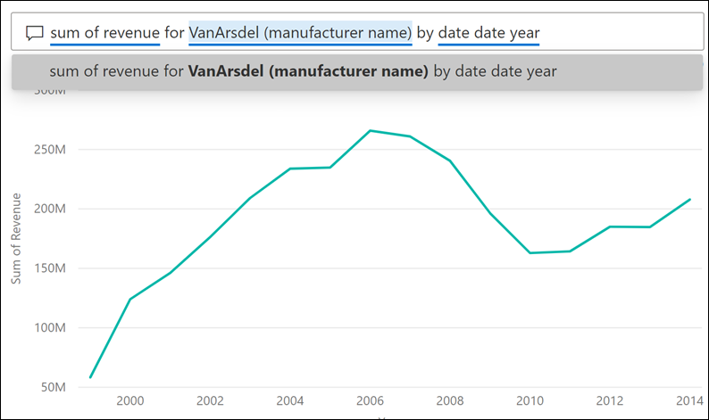
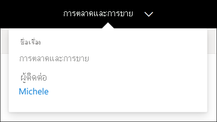

# ถามตอบสำหรับผู้ใช้ธุรกิจ Power BIQ&A for Power BI business users

[!INCLUDE[consumer-appliesto-yyny](../includes/consumer-appliesto-yyny.md)]

[!INCLUDE [power-bi-service-new-look-include](../includes/power-bi-service-new-look-include.md)]

## Q&A คืออะไรWhat is Q&A?
ในบางครั้ง วิธีที่เร็วที่สุดในการให้ได้คำตอบจากข้อมูลของคุณคือ การถามคำถามโดยใช้ภาษาธรรมชาติSometimes the fastest way to get an answer from your data is to ask a question using natural language. ตัวอย่างเช่น "ยอดขายรวมปีที่แล้วเป็นเท่าไหร่"For example, "what were total sales last year."

ใช้ Q&A เพื่อสำรวจข้อมูลของคุณโดยใช้การอนุมาน ความสามารถภาษาธรรมชาติ และรับคำตอบในรูปแบบของแผนภูมิและกราฟUse Q&A to explore your data using intuitive, natural language capabilities and receive answers in the form of charts and graphs. Q&A แตกต่างจากโปรแกรมค้นหา Q&A เพียงแค่แสดงผลลัพธ์เกี่ยวกับข้อมูลใน Power BIQ&A is different from a search engine -- Q&A only provides results about the data in Power BI.

## การแสดงภาพแบบใดที่ Q&A ใช้Which visualization does Q&A use?
Q&A เลือกการแสดงภาพที่ดีที่สุดที่ยึดตามข้อมูลที่ถูกแสดงQ&A picks the best visualization based on the data being displayed. บางครั้งข้อมูลในชุดข้อมูลพื้นฐานถูกกำหนดเป็นชนิดหรือประเภทบางอย่าง และวิธีนี้ช่วยให้ระบบถามตอบรู้ว่าจะแสดงอย่างไรSometimes data in the underlying dataset is defined as a certain type or category and this helps Q&A know how to display it. ตัวอย่างเช่น ถ้าข้อมูลถูกกำหนดเป็นชนิดวัน โดยแสดงเป็นแผนภูมิเส้นFor example, if data is defined as a date type, it is more likely to be displayed as a line chart. ข้อมูลที่ถูกจัดประเภทเป็นเมือแสดงบนแผนที่Data that is categorized as a city is more likely to be displayed as a map.

คุณยังสามารถบอก Q&A ว่าต้องการใช้การแสดงผลด้วยภาพใด ด้วยการเพิ่มคำถามของคุณYou can also tell Q&A which visual to use by adding it to your question. แต่โปรดทราบว่าอาจจะไม่เป็นไปได้เสมอ ที่ Q&A จะแสดงข้อมูลในรูปแบบของการแสดงผลด้วยภาพชนิดที่คุณร้องขอBut keep in mind that it may not always be possible for Q&A to display the data in the visual type you requested. Q&A จะพร้อมท์ให้คุณทราบถึงรายการประเภทการแสดงผลด้วยภาพที่สามารถทำงานได้Q&A will prompt you with a list of workable visual types.

## ฉันสามารถใช้ Q&A ได้จากที่ไหน?Where can I use Q&A?
คุณจะพบ Q&A บนหน้าแดชบอร์ดในบริการ Power BI และที่ด้านล่างของแดชบอร์ดใน Power BI mobileYou'll find Q&A on dashboards in the Power BI service, and at the bottom of the dashboard in Power BI mobile. เว้นแต่ว่ผู้ออกแบบได้ให้สิทธิ์การแก้ไข คุณจะไม่สามารถใช้ Q&A เพื่อสำรวจข้อมูลแต่จะไม่สามารถบันทึกการแสดงภาพใดๆ ที่สร้างขึ้น ด้วย Q&AUnless the designer has given you edit permissions, you'll be able to use Q&A to explore data but won't be able to save any visualizations created with Q&A.

นอกจากนี้คุณยังจะได้พบกับระบบถามตอบในรายงานถ้า *ผู้ออกแบบ* รายงานเพิ่ม [วิชวลถามตอบ](../visuals/power-bi-visualization-q-and-a.md) ไว้แล้วYou'll also find Q&A on reports, if the report *designer* added a [Q&A visual](../visuals/power-bi-visualization-q-and-a.md).   

## ระบบถามตอบบนแดชบอร์ดQ&A on dashboards

**Power BI Q&A** พร้อมใช้งานสิทธิ์การใช้งานระดับ Pro และ Premium**Power BI Q&A** is available with a Pro or Premium license.  [Q&A ในแอป Power BI สำหรับอุปกรณ์เคลื่อนที่ ](mobile/mobile-apps-ios-qna.md)และ[ Q&A ที่มี Power BI Embedded](../developer/embedded/qanda.md) ครอบคลุมในบทความต่างหาก[Q&A in the Power BI mobile apps](mobile/mobile-apps-ios-qna.md) and [Q&A with Power BI Embedded](../developer/embedded/qanda.md) are covered in separate articles. ในปัจจุบัน **Power BI Q&A** สนับสนุนการสอบถามภาษาธรรมชาติที่ถามเป็นภาษาอังกฤษเท่านั้น แม้ว่าจะมีตัวอย่างสำหรับภาษาสเปนที่สามารถเปิดใช้งานโดยผู้ดูแลระบบ Power BI ของคุณAt the current time, **Power BI Q&A** only supports answering natural language queries asked in English, although there is a preview available for Spanish that can be enabled by your Power BI administrator.

การถามคำถามเป็นเพียงการเริ่มต้นAsking the question is just the beginning.  สนุกกับการเดินทางผ่านข้อมูลของคุณ เพื่อปรับแต่งหรือขยายคำถามของคุณ ค้นพบข้อมูลใหม่ที่น่าเชื่อถือ และให้ความสำคัญกับรายละเอียดและซูมออกเพื่อให้ได้มุมมองที่กว้างขึ้นHave fun traveling through your data refining or expanding your question, uncovering trust-worthy new information, zeroing in on details and zooming out for a broader view. คุณจะรู้สึกยินดีกับข้อมูลเชิงลึกและการค้นพบที่คุณทำYou'll be delighted by the insights and discoveries you make.

ประสบการณ์การใช้งานเป็นแบบโต้ตอบอย่างแท้จริง... และรวดเร็วThe experience is truly interactive…and fast! รับการสนับสนุนโดยการเก็บข้อมูลในหน่วยความจำ ตอบสนองได้เกือบทันทีPowered by an in-memory storage, response is almost instantaneous.

## ใช้ Q&A บนแดชบอร์ดในบริการของ Power BIUse Q&A on a dashboard in the Power BI service
ในบริการของ Power BI (app.powerbi.com) แดชบอร์ดประกอบด้วย ไทล์ที่ปักหมุดจากชุดข้อมูลหนึ่งหรือหลายชุด ดังนั้นคุณสามารถถามคำถามเกี่ยวกับข้อมูลที่มีอยู่ในชุดข้อมูลใดๆ เหล่านั้นIn the Power BI service (app.powerbi.com), a dashboard contains tiles pinned from one or more datasets, so you can ask questions about any of the data contained in any of those datasets. หากต้องการดูว่ามีการใช้รายงานและชุดข้อมูลใดในการสร้างแดชบอร์ด ให้เลือก **ดูเนื้อหาที่เกี่ยวข้อง** จากเมนูแบบเลื่อนลงของ **การทำงานเพิ่มเติม**To see what reports and datasets were used to create the dashboard, select **See related content** from the **More actions** dropdown.

## ฉันจะเริ่มต้นอย่างไร?How do I start?
ขั้นแรก ทำความคุ้นเคยกับเนื้อหาFirst, get familiar with the content. ดูที่การแสดงผลด้วยภาพบนแดชบอร์ดและในรายงานTake a look at the visuals on the dashboard and in the report. รับทราบประเภทและช่วงของข้อมูลที่พร้อมใช้งานGet a feel for the type and range of data that is available to you. 

ตัวอย่างเช่น:For example:

* ถ้าป้ายชื่อแกนและค่าของการแสดงผลด้วยภาพมีการรวม "ยอดขาย" "บัญชี" "เดือน" และ "โอกาส" คุณจะสามารถสอบถามในเรื่องต่อไปนี้ได้: "*บัญชี*ใดมี*โอกาส*สูงสุด หรือแสดง*ยอดขาย*ต่อเดือนในแผนภูมิแท่ง"If a visual's axis labels and values include "sales",  "account", "month", and "opportunities", then you can confidently ask questions such as: "Which *account* has the highest *opportunity*, or show *sales* by month as a bar chart."

* ถ้าคุณมีข้อมูลประสิทธิภาพการทำงานเว็บไซต์ใน Google Analytics คุณสามารถถาม Q&A เกี่ยวกับเวลาที่ใช้ในเว็บเพจ จำนวนการเยี่ยมชมหน้าเฉพาะและอัตราการมีส่วนร่วมของผู้ใช้If you have website performance data in Google Analytics, you can ask Q&A about time spent on a web page, number of unique page visits, and user engagement rates. หรือ ถ้าคุณกำลังทำคิวรี่ข้อมูลประชากร คุณอาจถามคำถามเกี่ยวกับอายุและรายไดในครัวเรือนตามท้องถิ่นOr, if you're querying demographic data, you might ask questions about age and household income by location.

เมื่อคุณคุ้นเคยกับข้อมูลแล้ว ให้กลับไปที่แดชบอร์ดและวางเคอร์เซอร์ของคุณในกล่องคำถามOnce you're familiar with the data, head back to the dashboard  and place your cursor in the question box. ซึ่งจะเปิดหน้าจอ Q&AThis opens the Q&A screen.

 

ถึงแม้ว่าคุณยังไม่เริ่มพิมพ์ ถามตอบจะแสดงหน้าจอใหม่ ด้วยคำแนะนำเพื่อช่วยคุณสร้างคำถามของคุณEven before you start typing, Q&A displays a new screen with suggestions to help you form your question. คุณเห็นวลีและคำถามที่ประกอบด้วยชื่อของตารางในชุดข้อมูลพื้นฐาน และอาจเห็นคำถาม *แนะนำ* ที่สร้างขึ้นโดยเจ้าของชุดข้อมูลYou see phrases and questions containing the names of the tables in the underlying datasets and may even see *featured* questions created by the dataset owner.

คุณสามารถเลือกรายการเหล่านี้เพื่อเพิ่มลงในกล่องคำถาม และจากนั้นปรับปรุงการค้นหาคำตอบเฉพาะYou can select any of these to add them to the question box and then refine them to find a specific answer. 

 

อีกวิธีหนึ่งท Power BI ช่วยให้คุณในการตั้งคำถามด้วยฟีเจอร์ เช่น: ข้อความพรอมท์ การกรอกข้อมูลอัตโนมัติ และภาพงานนำเสนอ Power BI ให้ความช่วยเหลือนี้สำหรับถามตอบบนแดชบอร์ดและด้วยวิชวลถามตอบAnother way Power BI helps you ask questions is with features such as: prompts, autocomplete, and visual cues. Power BI provides this help for Q&A on dashboards and with the Q&A visual. เราจะพูดถึงคุณลักษณะเหล่านี้โดยละเอียดด้านล่างในส่วน [สร้างภาพถามตอบโดยพิมพ์คำค้นหาภาษาธรรมชาติของคุณเอง](#create-a-visual-using-your-own-qa-question)We'll discuss these features in detail below, in the section [Create a Q&A visual by typing your own natural language query](#create-a-visual-using-your-own-qa-question)

## วิชวลถามตอบด้วยภาพในรายงาน Power BIThe Q&A visual in Power BI reports

วิชวลถามตอบช่วยให้คุณสามารถถามคำถามที่เป็นภาษาธรรมชาติและรับคำตอบในรูปแบบของวิชวลได้The Q&A visual allows you to ask natural language questions and get answers in the form of a visual. วิชวลถามตอบทำงานเหมือนกับวิชวลอื่น ๆ ในรายงาน ซึ่งสามารถทำการกรองข้าม/การไฮไลต์แบบเชื่อมโยง และยังสนับสนุนบุ๊กมาร์กและความคิดเห็นด้วยThe Q&A visual behaves like any other visual in a report, it can be cross-filtered/cross-highlighted and also supports bookmarks and comments. 

คุณสามารถระบุวิชวลถามตอบโดยใช้กล่องคำถามที่อยู่ด้านบนYou can identify a Q&A visual by its question box across the top. นี่คือบริเวณที่คุณจะป้อนหรือพิมพ์คำถามโดยใช้ภาษาธรรมชาติThis is where you'll enter or type questions using natural language. วิชวลถามตอบสามารถใช้ซ้ำแล้วซ้ำอีกเพื่อถามคำถามเกี่ยวกับข้อมูลของคุณThe Q&A visual can be used over and over again to ask questions about your data. เมื่อคุณออกจากรายงาน วิชวลถามตอบจะรีเซ็ตเป็นค่าเริ่มต้นWhen you leave the report, the Q&A visual resets to its default. 

## การใช้ Q&AUse Q&A 
ในการใช้ Q&A เกี่ยวกับแดชบอร์ดและวิชวลถามตอบในรายงาน เลือกคำถามที่แนะนำหนึ่งคำถาม หรือพิมพ์คำถามในภาษาธรรมชาติของคุณTo use Q&A on a dashboard or to use the Q&A visual in a report, select one of the suggested questions or type your own natural language question. 

### สร้างการแสดงผลด้วยภาพโดยใช้คำถามที่แนะนำCreate a visual by using a suggested question

ที่นี่ เราได้เลือก **สถานะทางภูมิศาสตร์ยอดนิยมตามหน่วยทั้งหมด**Here, we've selected **top geo states by total units**. Power BI พยายามอย่างดีที่สุดเพื่อเลือกชนิดวิชวลที่จะใช้Power BI does its best to select which visual type to use. ในกรณีนี้เป็นแผนที่พื้นฐานIn this case, it's a basic map.

แต่คุณสามารถบอก Power BI ว่าจะใช้วิชวลชนิดใดโดยการเพิ่มลงในคิวรีภาษาธรรมชาติของคุณBut you can tell Power BI which visual type to use by adding it to your natural language query. โปรดทราบว่าไม่ใช่วิชวลทุกชนิดที่จะทำงานหรือเข้ากับข้อมูลของคุณKeep in mind that not all visual types will work or make sense with your data. ตัวอย่างเช่น ข้อมูลนี้จะไม่สร้างแผนภูมิแบบกระจายที่มีความหมายFor example, this data wouldn't produce a meaningful scatter chart. แต่จะใช้เป็นแผนที่แบบเติมBut it works as a filled map.

ถ้าคุณไม่แน่ใจว่าคำถามชนิดใดที่ต้องถามหรือคำศัพท์ใดที่จะใช้ ให้ขยาย **แสดงคำแนะนำทั้งหมด** หรือดูวิชวลอื่นในรายงานIf you're unsure what type of questions to ask or terminology to use, expand **Show all suggestions** or look through the other visuals in the report. การดำเนินการนี้จะทำให้คุณคุ้นเคยกับศัพท์และเนื้อหาของชุดข้อมูลThis will get you familiar with the terms and content of the  dataset.

### สร้างการแสดงผลด้วยภาพโดยใช้คำถามถามตอบของคุณเองCreate a visual using your own Q&A question

1. พิมพ์คำถามของคุณลงในเขตข้อมูลถามตอบโดยใช้ภาษาธรรมชาติType your question into the Q&A field using natural language. ในขณะที่คุณพิมพ์คำถามของคุณ Power BI จะช่วยคุณด้วยการกรอกข้อมูลอัตโนมัติ ภาพงานนำเสนอ และคำติชมAs you type your question, Power BI helps you with autocomplete, visual cues, and feedback.

    **การกรอกข้อมูลอัตโนมัติ** - ในขณะที่คุณพิมพ์คำถามของคุณ Power BI Q&A จะแสดงคำแนะนำที่เกี่ยวข้องตามบริบท เพื่อช่วยให้คุณทำงานได้อย่างรวดเร็วด้วยภาษธรรมชาติ**Autocomplete** - as you type your question, Power BI Q&A shows relevant and contextual suggestions to help you quickly become productive with natural language. ขณะที่คุณพิมพ์ คุณจะได้รับผลป้อนกลับและผลลัพธ์ทันทีAs you type, you get immediate feedback and results. การใช้งานจะคล้ายกับการพิมพ์ในเครื่องมือค้นหาThe experience is similar to typing in a search engine.

    ในตัวอย่างนี้ คำแนะนำที่เราต้องการเป็นรายการสุดท้ายIn this example, the suggestion we want is the last one. 

    

    **ขีดเส้นใต้แบบทึบและจุด** - ถามตอบ Power BI แสดงคำที่มีขีดเส้นใต้เพื่อช่วยให้คุณเห็นว่าคำใดที่ Power BI รู้จักหรือไม่รู้จัก**Solid and dotted underlines**- Power BI Q&A shows words with underlines to help you see which words Power BI did or did not recognize. 

    เส้นใต้ทึบสีนำเงินบ่งบอกว่าเป็นคำที่ Power BI รู้จักA solid blue underline indicates that Power BI recognized the word. ตัวอย่างด้านล่างแสดงให้เห็นว่าการถามตอบยอมรับข้อกำหนด **ความเชื่อมั่นในข้อเท็จจริงการขาย** และ **ภูมิภาค**The example below shows that Q&A recognized the terms **sales fact sentiment** and **region**.

    

    ขีดเส้นใต้คู่สีแดงบ่งบอกถึงคำที่ Power BI ไม่รู้จักเลยA red double underline indicates a word that Power BI doesn't recognize at all. ตัวอย่างอาจเป็นการใช้คำว่า 'ภูมิประเทศ' แต่ทว่าคำนี้ไม่เคยปรากฎอยู่ในที่ใดเลยบนข้อมูลAn example could be using the word 'geography' though it doesn't exist anywhere in the data. คำมีอยู่ในพจนานุกรมภาษาอังกฤษ แต่ระบบถามตอบจะทำเครื่องหมายคำนี้ด้วยการขีดเส้นใต้สีแดงThe word is in the English dictionary, but Q&A marks this term with a red underline. Power BI Q&A ไม่สามารถแสดงผลได้ และแนะนำให้คุณขอนักออกแบบรายงานให้เพิ่มคำPower BI Q&A cannot create a visualization and suggests that you ask the report designer to add the term.  

    

    หาก Power BI ไม่แน่ใจในคำคุณจะเห็นขีดเส้นใต้แบบจุดIf Power BI is unsure of a word, you'll see a dotted underline. เลือกคำเพื่อดูรายการคำแนะนำSelect the word to see a list of suggestions. ตัวอย่างอาจเป็นคำว่า 'ตำแหน่ง'An example could be the word 'Location'. หลายช่องอาจมีคำว่า 'ตำแหน่งที่ตั้ง' ดังนั้นระบบจะแจ้งให้คุณเลือกเขตข้อมูลที่คุณต้องการMultiple fields could contain the word 'Location', so the system prompts you to choose the field you meant.  

    

    
    
    ระบบถามตอบของ Power BI รู้จักคำที่มีความหมายเหมือนกันเนื่องจากมีการรวมเข้าด้วยกันด้วย Bing และ OfficePower BI Q&A recognizes words that mean the same thing, thanks to the integration with Bing and Office. ถามตอบเน้นคำเพื่อให้คุณรู้ว่าไม่ใช่การจับคู่โดยตรงQ&A underlines the word so you know it's not a direct match

    

    **คำแนะนำ** - ในขณะที่คุณพิมพ์คำถามเพิ่มเติม Power BI ช่วยให้คุณทราบถ้าระบบไม่เข้าใจคำถาม และพยายามช่วยเหลือ**Suggestions** - as you type more of the question, Power BI lets you know if it doesn't understand the question, and tries to help. ในตัวอย่างด้านล่าง Power BI แนะนำเขตข้อมูลที่แตกต่างกันสองเชตข้อมูลที่รู้จักสำหรับ 'VanArsdel'In the example below, Power BI suggests two different fields that it recognizes for 'VanArsdel'. 

    

    หลังจากเลือกการแก้ไขของ Power BI โปรดสังเกตว่าทุกคำได้รับการยอมรับและขีดเส้นใต้เป็นสีน้ำเงินAfter selecting Power BI's correction, notice that all words are recognized and underlined in blue. ผลลัพธ์ของคุณจะแสดงเป็นแผนภูมิเส้นYour results display as a line chart. 

    

    แต่คุณสามารถเปลี่ยนแผนภูมิเส้นไปเป็นวิชวลชนิดอื่นได้But, you can change the line chart to another visual type.  

    

## ข้อควรพิจารณาและการแก้ไขปัญหาConsiderations and troubleshooting

**คำถาม**: ฉันไม่เห็น Q&A บนแดชบอร์ดนี้**Question**: I don't see Q&A on this dashboard.    
**คำตอบ 1**: ถ้าคุณไม่เห็นกล่องคำถาม ให้ตรวจสอบการตั้งค่าก่อน**Answer 1**: If you don't see a question box, first check your settings. ในการดำเนินการนี้ ให้เลือกไอคอนฟันเฟืองในมุมขวาบนของแถบเครื่องมือ Power BI ของคุณหรือจากเมนูแบบเลื่อนลง \*\* ตัวเลือกเพิ่มเติม (... )To do this, select the cog icon in the upper right corner of your Power BI toolbar, or from the \*\*More options (...) dropdown menu.   

แล้ว เลือก**ตั้งค่า** > **แดชบอร์ด**Then choose **Settings** > **Dashboards**. ตรวจสอบว่ามีเครื่องหมายถูกอยู่ติดกับ **แสดงช่องค้นหา Q&A บนแดชบอร์ดนี้** หรือไม่Make sure there is a checkmark next to **Show the Q&A search box on this dashboard**.    
  

**คำตอบที่ 2**: ในบางครั้งคุณจะไม่สามารถเข้าถึงการตั้งค่าได้**Answer 2**: Sometimes you won't have access to the settings. หากเจ้าของแดชบอร์ดหรือผู้ดูแลระบบของคุณปิดการถามตอบ ให้ตรวจสอบกับพวกเขาว่าสามารถเปิดอีกครั้งได้หรือไม่If the dashboard owner or your administrator turned Q&A off, check with them to see if it's OK to turn it back on. ในการค้นหาเจ้าของ ให้เลือกชื่อแดชบอร์ดจากแถบเมนูด้านบนTo look up the owner, select the name of the dashboard from the top menu bar.

    

**คำถาม**: ฉันไม่ได้รับผลลัพธ์ที่ฉันต้องการเห็นเมื่อฉันพิมพ์คำถาม**Question**: I'm not getting the results I'd like to see when I type a question.    
**คำตอบ**: เลือกตัวเลือกเพื่อติดต่อเจ้าของรายงานหรือแดชบอร์ด**Answer**: Select the option to contact the report or dashboard owner. คุณสามารถทำสิ่งนี้ได้โดยตรงจากหน้าแดชบอร์ดของระบบถามตอบ หรือวิชวลถามตอบYou can do this directly from the Q&A dashboard page or the Q&A visual. หรือคุณสามารถค้นหาเจ้าของได้จากส่วนหัวของ Power BIOr, you can look up the owner from the Power BI header.  มีหลายสิ่งที่เจ้าของสามารถทำได้เพื่อปรับปรุงผลลัพธ์ของถามตอบThere are many things the owner can do to improve the Q&A results. ตัวอย่างเช่น เจ้าของสามารถเปลี่ยนชื่อคอลัมน์ในชุดข้อมูลเพื่อใช้คำที่เข้าใจง่าย (`CustomerFirstName` แทน `CustFN`)For example, the owner can rename columns in the dataset to use terms that are easily understood (`CustomerFirstName` instead of `CustFN`). เนื่องจากเจ้าของรู้จักชุดข้อมูลเป็นอย่างดี พวกเขาจึงสามารถตั้งคำถามที่เป็นประโยชน์และเพิ่มเข้าไปในคำถามที่แนะนำของถามตอบได้Since the owner knows the dataset really well, they can also come up with helpful questions and add them to the Q&A suggested questions.

## ความเป็นส่วนตัวPrivacy

Microsoft อาจใช้คำถามของคุณเพื่อปรับปรุง Power BIMicrosoft may use your questions to improve Power BI. โปรดตรวจทาน[คำชี้แจงสิทธิ์ส่วนบุคคลของ Microsoft](https://go.microsoft.com/fwlink/?LinkId=521839) สำหรับข้อมูลเพิ่มเติมPlease review the [Microsoft Privacy Statement](https://go.microsoft.com/fwlink/?LinkId=521839) for more information.

## ขั้นตอนถัดไปNext steps
หากต้องการเรียนรู้วิธีสร้างและจัดการวิชวลถามตอบโดย*ผู้ออกแบบ*รายงาน ให้ดู [ประเภทของวิชวลถามตอบ](../visuals/power-bi-visualization-q-and-a.md)To learn how a Q&A visual is created and managed by a report *designer*, see [Q&A visual type](../visuals/power-bi-visualization-q-and-a.md).
