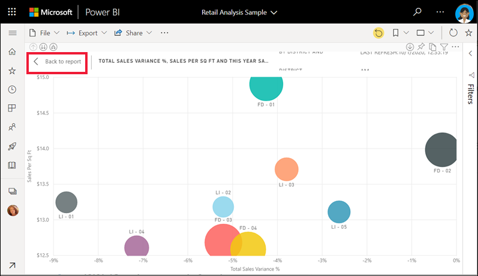

# เริ่มต้นด่วน: เรียนรู้เกี่ยวกับความสามารถของ Power BI สำหรับ *ผู้ใช้ทางธุรกิจ*Quickstart: learn about the Power BI capabilities for *business users*

[!INCLUDE[consumer-appliesto-ynny](../includes/consumer-appliesto-ynny.md)]

ในเริ่มต้นใช้งานด่วนนี้ คุณจะได้เรียนรู้วิธีการโต้ตอบกับ Power BI เพื่อค้นหาข้อมูลธุรกิจเชิงลึกIn this quickstart, you'll learn how to interact with Power BI to discover data-driven business insights. บทความนี้ไม่ได้มีวัตถุประสงค์เพื่อเจาะลึก แต่เป็นการเดินทางอย่างรวดเร็วผ่านการดำเนินการต่าง ๆ ที่พร้อมใช้งานสำหรับ **ผู้ใช้ทางธุรกิจ** ของ Power BIThis article isn't intended to be a deep dive, but rather a quick trip through many of the actions available for Power BI **business users**.

ถ้าคุณไม่ได้ลงทะเบียน Power BI ให้[ลงทะเบียนรุ่นทดลองใช้ฟรี](https://app.powerbi.com/signupredirect?pbi_source=web)ก่อนที่คุณจะเริ่มต้นใช้งานIf you're not signed up for Power BI, [sign up for a free trial](https://app.powerbi.com/signupredirect?pbi_source=web) before you begin.

## Power BI คืออะไรWhat is Power BI? 
Power BI เป็นคอลเลกชันของบริการซอฟต์แวร์ แอป และตัวเชื่อมต่อที่ทำงานร่วมกันเพื่อเปลี่ยนแหล่งข้อมูลที่ไม่เกี่ยวข้องของคุณให้เป็นข้อมูลเชิงลึกที่สอดคล้องกัน แสดงข้อมูลได้ และโต้ตอบได้Power BI is a collection of software services, apps, and connectors that work together to turn your unrelated sources of data into coherent, visually immersive, and interactive insights. ไม่ว่าข้อมูลของคุณจะเป็นสเปรดชีต Excel ง่ายๆ หรือคอลเลกชันของข้อมูจากแหล่งข้อมูลที่แตกต่างกัน Power BI จะช่วยให้คุณเชื่อมต่อกับแหล่งข้อมูลของคุณ แสดงภาพ (หรือค้นพบ) ข้อมูลสำคัญ และแชร์ข้อมูลนั้นกับใครก็ตามหรือทุกคนที่คุณต้องการได้อย่างง่ายดายWhether your data is a simple Excel spreadsheet, or a collection of data from different data sources, Power BI lets you easily connect to your data sources, visualize (or discover) what's important, and share that with anyone or everyone you want. 

เปิดบริการ Power BI ในเบราว์เซอร์หรือบนอุปกรณ์เคลื่อนที่Open the Power BI service, in a browser or on a mobile device. คุณและเพื่อนร่วมงานของคุณสามารถใช้งานได้จากแอป แดชบอร์ด และรายงานที่เชื่อถือได้ฉบับเดียวกัน ซึ่งมีการอัปเดตและการรีเฟรชโดยอัตโนมัติ ดังนั้นคุณจึงทำงานกับเนื้อหาที่สดใหม่อยู่เสมอYou and your colleagues work from the same trusted apps, dashboards, and reports, that update and refresh automatically, so you're always working with the freshest content.   

## มุมมองการอ่านReading view
มีสองโหมดสำหรับการโต้ตอบกับรายงานในบริการของ Power BI: มุมมองการแก้ไขและมุมมองการอ่านThere are two modes for interacting with reports in the Power BI service: Editing view and Reading view.  หากคุณเป็น *ผู้ใช้ทางธุรกิจ* คุณมีแนวโน้มที่จะใช้มุมมองการอ่านเพื่อดูรายงานที่สร้างโดยผู้อื่นIf you are a *business user*, then you are more likely to use Reading view to consume reports created by others. มุมมองการแก้ไขที่ถูกใช้โดย *นักออกแบบ* รายงาน ซึ่งสร้างรายงานและแบ่งปันให้กับคุณEditing view is used by report *designers*, who create the reports and share them with you. มุมมองการอ่านเป็นวิธีสำรวจและโต้ตอบกับรายงานที่เพื่อนร่วมงานสร้างขึ้นReading view is your way to explore and interact with reports created by colleagues. 

แม้ในมุมมองการอ่านเนื้อหาจะไม่คงที่Even in Reading view, the content isn't static. คุณสามารถเจาะลึก ค้นหาเทรนด์ ข้อมูลเชิงลึกและระบบธุรกิจอัจฉริยะอื่น ๆYou can dig in, looking for trends, insights, and other business intelligence. แบ่งส่วนและแยกย่อยเนื้อหาและแม้แต่ถามคำถามโดยใช้คำพูดของคุณเองSlice and dice the content, and even ask it questions using your own words. หรือนั่งลง และปล่อยให้ข้อมูลของคุณค้นพบข้อมูลเชิงลึกที่น่าสนใจสำหรับคุณ ส่งการแจ้งเตือนเมื่อมีการเปลี่ยนแปลงข้อมูล และรายงานทางอีเมลถึงคุณตามกำหนดเวลาที่คุณตั้งไว้Or, sit back and let your data discover interesting insights for you; send you alerts when data changes, and email reports to you on a schedule you set. เข้าถึงข้อมูลทั้งหมดของคุณได้ทุกที่ทุกเวลาในระบบคลาวด์หรือภายในองค์กรจากอุปกรณ์ใดก็ได้All your data, any time, in the cloud or on-premises, from any device. 

อ่านเพื่อเรียนรู้เกี่ยวกับสิ่งเหล่านี้และอื่น ๆRead on to learn about these and more.

## เนื้อหา Power BIPower BI content
เมื่อเราใช้คำว่า "เนื้อหา" ใน Power BI เราจะอ้างอิงถึงรายงาน แดชบอร์ด และแอปWhen we use the term "content" in Power BI, we're referring to reports, dashboards, and apps. สิ่งเหล่านี้คือบล็อกการสร้างที่คุณจะใช้เพื่อสำรวจข้อมูลของคุณและทำการตัดสินใจทางธุรกิจThese are the building blocks you'll use to explore your data and make business decisions. 

> [!NOTE]
> เราสามารถดูและแชร์แดชบอร์ด รายงาน และแอปบนมือถือได้ด้วยDashboards, reports, and apps can be viewed and shared on mobile devices, too.

###  แอปApps

*แอป* เป็นประเภทเนื้อหา Power BI ที่รวมแดชบอร์ดและรายงานที่เกี่ยวข้องทั้งหมดไว้ในที่เดียวกันAn *app* is a Power BI content type that combines related dashboards and reports, all in one place. แอปสามารถมีแดชบอร์ดอย่างน้อยหนึ่งรายการและรายงานอย่างน้อยหนึ่งรายงานทั้งหมดรวมเข้าด้วยกันAn app can have one or more dashboards and one or more reports, all bundled together. แอปถูกสร้างขึ้นโดย Power BI *นักออกแบบ* ที่แจกจ่ายและแบ่งปันแอปกับ *ผู้ใช้ทางธุรกิจ* เช่นคุณApps are created by Power BI *designers* who distribute and share the apps with *business users* like you. 

วิธีหนึ่งในการดูแอปของคุณคือการเลือก **แอป** จากหน้าต่างนำทางและเลือกแอปเพื่อเปิดOne way to view your apps is to select **Apps** from the nav pane and choose an app to open.

หากต้องการเรียนรู้เพิ่มเติมเกี่ยวกับการดูแอป โปรดดูหัวข้อ [แอป Power BI](end-user-apps.md)To learn more about viewing apps, see [Power BI apps](end-user-apps.md)

### รายงานReports

รายงาน Power BI มีมุมมองแบบหลากหลายมุมมองในชุดข้อมูล พร้อมด้วยวิชวลที่แสดงถึงผลลัพธ์และข้อมูลเชิงลึกที่แตกต่างจากชุดข้อมูลนั้นA Power BI report is a multi-perspective view into a dataset, with visuals that represent different findings and insights from that dataset. รายงานอาจมีวิชวลเดียวหรือมีหน้าที่เต็มไปด้วยวิชวลA report can have a single visual or pages full of visuals. รายงานที่สร้างขึ้นโดย *นักออกแบบ* ของ Power BI ที่แจกจ่ายและแบ่งปันรายงานกับ *ผู้ใช้ทางธุรกิจ* เช่นคุณReports are created by Power BI *designers* who distribute and share the reports with *business users* like you.

หากต้องการเรียนรู้วิธีการดูรายงาน โปรดดูหัวข้อ [รายงาน Power BI](end-user-reports.md)To learn how to view reports, see [Power BI reports](end-user-reports.md)

### แดชบอร์ดDashboards

แดชบอร์ด Power BI เป็นแบบหน้าเดียว ซึ่งมักเรียกว่าพื้นที่ทำงานที่ใช้การแสดงผลข้อมูลด้วยภาพเพื่อบอกเล่าเรื่องราวหนึ่ง ๆ ได้A Power BI dashboard is a single page, often called a canvas, that uses visualizations to tell a story. เนื่องจากจำกัดอยู่เพียงหนึ่งหน้า แดชบอร์ดทีี่ออกแบบมาอย่างดีจะประกอบด้วยองค์ประกอบที่สำคัญที่สุดของเรื่องราวเท่านั้นBecause it is limited to one page, a well-designed dashboard contains only the most-important elements of that story.

การแสดงผลข้อมูลด้วยภาพที่คุณเห็นบนแดชบอร์ดเรียกว่าไทล์ และจะถูกปักหมุดไปยังแดชบอร์ดโดยรายงานของ *ผู้ออกแบบ*The visualizations you see on the dashboard are called tiles and are pinned to the dashboard by report *designers*. ในกรณีส่วนใหญ่ การเลือกไทล์ที่จะนำคุณไปยังหน้ารายงานที่การแสดงภาพถูกสร้างขึ้นIn most cases, selecting a tile takes you to the report page where the visualization was created. 

หากต้องการเรียนรู้วิธีการดูแดชบอร์ด โปรดดูหัวข้อ [แดชบอร์ด Power BI](end-user-dashboards.md)To learn how to view dashboards, see [Power BI dashboards](end-user-dashboards.md)
 
## โต้ตอบในบริการของ Power BI:Interact in the Power BI service

### ทำงานร่วมกับเพื่อนร่วมงานCollaborate with colleagues
ข้ามอีเมลSkip the email. เพิ่มข้อคิดเห็นส่วนบุคคล หรือเริ่มการสนทนากับเพื่อนร่วมงานเกี่ยวกับแดชบอร์ด ตรงนั้นบนแดชบอร์ดนั้นAdd a personal comment or start a conversation with colleagues about a dashboard, right there on that dashboard. คุณลักษณะข้อคิดเห็นเป็นเพียงหนึ่งในหลายแนวทางที่คุณสามารถทำงานร่วมกับผู้อื่นได้The comment feature is just one of the ways you can collaborate with others. 

เรียนรู้เพิ่มเติมเกี่ยวกับ [การแสดงข้อคิดเห็น](end-user-comment.md)Learn more about [commenting](end-user-comment.md)

### เอนหลังและปล่อยให้ Power BI ทำงานให้คุณSit back and let Power BI work for you
แนวทางสองวิธีที่บริการ Power BI ทำงานสำหรับคุณคือการสมัครใช้งานและการแจ้งเตือนTwo of the ways that the Power BI service does the work for you is with subscriptions and alerts. 

#### สมัครใช้งานแดชบอร์ด (หรือรายงาน)Subscribe to a dashboard (or report)
ไม่จำเป็นต้องเปิด Power BI เพื่อตรวจสอบแดชบอร์ดIt's not necessary to open Power BI to monitor a dashboard.  คุณสามารถสมัครใช้งานแทนได้ และ Power BI จะส่งสแนปช็อตของแดชบอร์ดนั้นตามเวลาที่คุณตั้งค่าถึงคุณทางอีเมลYou can subscribe instead, and Power BI will email you a snapshot of that dashboard on a schedule you set. 

 เรียนรู้เพิ่มเติมเกี่ยวกับ [การสมัครใช้งาน Power BI](end-user-subscribe.md)Learn more about [Power BI subscriptions](end-user-subscribe.md)

#### รับการแจ้งเตือนเมื่อข้อมูลของคุณถึงขีดจำกัดGet alerts when your data reaches a threshold
ข้อมูลของคุณเป็นแบบสด และวิชวลของคุณจะอัปเดตโดยอัตโนมัติเพื่อสะท้อนถึงสิ่งนี้Your data is live, and your visuals update automatically to reflect this. หากคุณต้องการรับการแจ้งเตือนเมื่อมีการเปลี่ยนแปลงข้อมูลที่สูงกว่าหรือต่ำกว่าเกณฑ์ที่คุณกำหนด ให้ใช้การแจ้งเตือนข้อมูลIf you want to get notified when data changes above or below a threshold you set, use data alerts. การแจ้งเตือนจะทำงานบนตัววัด KPI และการ์ดAlerts work on gauges, KPIs, and cards.    

Power BI ส่งอีเมลถึงคุณเมื่อค่าเพิ่มขึ้นหรือลดลงเกินขีดจำกัดที่คุณตั้งไว้Power BI sends you an email when the value increases or decreases past the limit you set.  

เรียนรู้เพิ่มเติมเกี่ยวกับ [การแจ้งเตือน Power BI](end-user-alerts.md)Learn more about [Power BI alerts](end-user-alerts.md)

### ใช้ ถามตอบ เพื่อถามคำถามโดยใช้ภาษาธรรมชาติUse Q&A to ask questions using natural language
ในบางครั้ง วิธีที่เร็วที่สุดในการให้ได้คำตอบจากข้อมูลของคุณคือ การถามคำถามโดยใช้ภาษาธรรมชาติSometimes the fastest way to get an answer from your data is to ask a question using natural language. กล่องคำถามของ ถามตอบ จะพร้อมใช้งานที่ด้านบนของแดชบอร์ดของคุณThe Q&A question box is available at the top of your dashboard. ตัวอย่างเช่น "แสดงให้ฉันเห็นถึงโอกาสในการขายตามระยะการขายเป็นแผนภูมิกรวย"For example, "show me count of large opportunities by sales stage as a funnel." 

เรียนรู้เพิ่มเติมเกี่ยวกับ [ถามตอบ Power BI](end-user-q-and-a.md)Learn more about [Power BI Q&A](end-user-q-and-a.md)

### แสดงรายละเอียดในภาพDisplay details on a visualization
วิชวลประกอบขึ้นจากจุดข้อมูลและโดยการวางเมาส์เหนือจุดข้อมูล คุณสามารถดูรายละเอียดได้Visuals are made up of datapoints, and by hovering over a datapoint, you can view the details.

### แดชบอร์ดรายการโปรดFavorite a dashboard
เมื่อคุณทำให้เนื้อหาเป็น *รายการโปรด* คุณจะสามารถเข้าถึงได้จาก [หน้าแรก](end-user-home.md) และจากบานหน้าต่างนำทางWhen you make content a *favorite*,  you'll be able to access it from [Home](end-user-home.md) and from the nav pane. บานหน้าต่างนำทางสามารถมองเห็นได้จากทุกพื้นที่บริการของ Power BIThe nav pane is visible from just about every area of the Power BI service. รายการโปรดโดยทั่วไปมักเป็นแดชบอร์ด หน้ารายงาน และแอปที่คุณเยี่ยมชมบ่อยที่สุดFavorites are typically the dashboards, report pages, and apps that you visit most often.

ในการบันทึกเนื้อหาเป็นรายการโปรด จากมุมขวาบนของบริการ Power BI ให้เลือกไอคอนรูปดาวTo save content as a favorite, from the upper right corner of the Power BI service, select the star icon. 
   

หากต้องการดูรายการโปรดของคุณ ให้เลือก **รายการโปรด** จากบานหน้าต่างนำทางTo see your favorites, select **Favorites** from the nav pane.

ดูการดำเนินการอื่น ๆ ที่มีอยู่ในแถบเมนูTake a look at the other actions available in the menu bar.  เราไม่ได้กล่าวถึงทั้งหมดในบทความนี้ แต่จะครอบคลุมในบทความอื่น ๆWe don't cover all of them in this article, but we do cover them in other articles.  เรียนรู้เพิ่มเติมโดยการใช้สารบัญ Power BI หรือเขตข้อมูล **ค้นหา**Learn more by using the Power BI table of contents or **Search** field. 

เรียนรู้เพิ่มเติมเกี่ยวกับ[รายการโปรดและรายการโดดเด่น](end-user-favorite.md)Learn more about [favorites and featured](end-user-favorite.md)

### ปรับขนาดการแสดงAdjust the display dimensions
รายงานจะดูได้บนหลายอุปกรณ์ ที่มีขนาดหน้าจอและอัตราส่วนกว้างยาวแตกต่างกันReports are viewed on many different devices, with varying screen sizes and aspect ratios.  การแสดงภาพตามค่าเริ่มต้นอาจไม่ใช่สิ่งที่คุณต้องการดูบนอุปกรณ์ของคุณThe default rendering may not be what you want to see on your device.  

ในการปรับจากแถบเมนูด้านขวาบน ให้เลือกไอคอน **มุมมอง** และเลือกหนึ่งในตัวเลือกการแสดงผลTo adjust, from the upper right menu bar select the **View** icon and choose one of the display options. 

### ดูว่าภาพทั้งหมดในหน้าเว็บเชื่อมต่อระหว่างกันอย่างไรSee how all the visuals on a page are interconnected
ไฮไลต์แบบเชื่อมโยงและกรองแบบเชื่อมโยงการแสดงผลข้อมูลด้วยภาพที่เกี่ยวข้องบนหน้ารายงานCross-highlight and cross-filter the related visualizations on a report page. การแสดงภาพข้อมูลบนหน้ารายงานหนึ่งจะ "เชื่อมต่อ" กันทั้งหมดThe visualizations on a single report page are all "connected" to each other.  นั่นหมายความว่า ถ้าคุณเลือกค่าอย่างน้อยหนึ่งค่าในภาพหนึ่ง ภาพอื่น ๆ ที่ใช้ค่านั้นจะเปลี่ยนไปตามสิ่งที่คุณเลือกWhat this means is that if you select one or more values in one visualization, other visualizations that use that same value will change based on your selection.

> 

เรียนรู้เพิ่มเติมเกี่ยวกับ [การโต้ตอบกับวิชวล](end-user-interactions.md)Learn more about [visual interactions](end-user-interactions.md)

<!-- ###  Open the **Selection** pane
Easily navigate between the visualizations on the report page. 

1. Select **View > Selection pane** to open the Selection pane. Toggle **Selection pane** to On.

    

2. The Selection pane opens on your report canvas. Select a visual from the list to make it active.

     -->

### ซูมขยายภาพต่าง ๆZoom in on individual visuals
วางเมาส์เหนือวิชวล และเลือกไอคอน **โหมดโฟกัส** Hover over a visual and select the **Focus mode** icon . เมื่อคุณดูภาพในโหมดโฟกัส ภาพจะขยายเต็มพื้นที่รายงานทั้งหมดตามที่แสดงด้านล่างWhen you view a visualization in Focus mode, it expands to fill the entire report canvas as shown below.

ในการแสดงการแสดงภาพเดียวกันโดยไม่รบกวนแถบเมนูบานหน้าต่างตัวกรองและ Chrome อื่น ๆ  -- ให้เลือก **เต็มหน้าจอ** จากเมนูแบบเลื่อนลงของมุมมองTo display that same visualization without the distraction of menu bars, filter pane, and other chrome -- select **Full screen** from the View dropdown.   

เรียนรู้เพิ่มเติมเกี่ยวกับ[โหมดโฟกัสและโหมดเต็มหน้าจอ](end-user-focus.md)Learn more about [focus mode and full screen mode](end-user-focus.md)

### เรียงลำดับการแสดงภาพSort a visualization
สามารถเรียงลำดับภาพต่าง ๆ ในหน้ารายงานและบันทึกภาพต่าง ๆ ที่คุณทำการเปลี่ยนแปลงVisuals on a report page can be sorted and saved with your changes applied. 

วางเมาส์เหนือวิชวลเพื่อทำให้วิชวลทำงาน และเลือก **ตัวเลือกเพิ่มเติม** (...) เพื่อเปิดตัวเลือกการเรียงลำดับHover over a visual to make it active, and select **More options** (...) to open sorting options.

 

เรียนรู้เพิ่มเติมเกี่ยวกับ [การเรียงลำดับวิชวล](end-user-search-sort.md)Learn more about [sorting visuals](end-user-search-sort.md)

### แสดงข้อมูลที่ใช้เพื่อสร้างการแสดงภาพShow the data used to create a visualization
ภาพ Power BI จะสร้างขึ้นโดยใช้ข้อมูลจากชุดข้อมูลเบื้องต้นA Power BI visualization is constructed using data from underlying datasets. หากคุณสนใจที่เห็นเบื้องหลัง Power BI ให้คุณสามารถ *แสดง* ข้อมูลที่กำลังกำลังมีการใช้เพื่อสร้างภาพดังกล่าวIf you're interested in seeing behind-the-scenes, Power BI lets you *display* the data that is being used to create the visual. เมื่อคุณเลือก **แสดงเป็นตาราง** Power BI จะแสดงข้อมูลด้านล่าง (หรือถัดจาก) การแสดงผลด้วยภาพWhen you select **Show as a table**, Power BI displays the data below (or next to) the visualization.

ด้วยวิชวลที่ทำงาน ให้เลือก **ตัวเลือกเพิ่มเติม** (... ) และเลือก **แสดงเป็นตาราง**With a visual active, select **More options** (...) and choose **Show as a table**.
   
   

### ส่งออกข้อมูลไปยัง ExcelExport data to Excel
นอกจากการแสดงข้อมูลที่ใช้ในการสร้างวิชวลแล้ว คุณยังสามารถส่งออกข้อมูลและดูใน Microsoft Excel ได้อีกด้วยIn addition to showing the data that is used to create a visual, you can also export that data and view it in Microsoft Excel. เมื่อคุณส่งออกไปยัง Excel คุณกำลังสร้างเอกสารแยกต่างหาก ซึ่งเป็นสเปรดชีตที่ไม่ใช่ส่วนหนึ่งของ Power BIWhen you export to Excel, you're creating a separate document, a spreadsheet that isn't part of Power BI. การเปลี่ยนแปลงใดก็ตามที่คุณทำในไฟล์ Excel จะไม่ส่งผลกระทบต่อข้อมูลใน Power BIAny changes that you make in the Excel file won't impact the data in Power BI. ไม่ว่าคุณจะต้องการดูข้อมูลอย่างใกล้ชิดหรือต้องการใช้ข้อมูลในแอปพลิเคชันอื่นหรือเพื่อวัตถุประสงค์อื่น Power BI ให้ความยืดหยุ่นแก่คุณWhether you want to take a closer look at the data, or you want to use the data in another application or for another purpose, Power BI gives you that flexibility.

<!-- Exporting isn't limited to individual visuals; you can export entire reports to PowerPoint or PDF to share with your colleagues.

 -->

นี่เป็นภาพรวมคร่าว ๆ ของบางสิ่งที่ *ผู้ใช้ทางธุรกิจ* สามารถทำได้ด้วยบริการของ Power BIThis has been a quick overview of just some of the things *business users* can do with the Power BI service.  

## ล้างแหล่งข้อมูลClean up resources
- ถ้าคุณเชื่อมต่อกับแอป จากหน้าต่างนำทาง ให้เลือก **แอป** เพื่อเปิดรายการเนื้อหาแอปIf you connected to an app, from the nav pane, select **Apps** to open the Apps content list. วางเมาส์เหนือแอป แล้วเลือกไอคอนถังขยะHover over the app to delete, and select the trashcan icon.

- ถ้าคุณนำเข้าหรือเชื่อมต่อกับรายงานตัวอย่าง Power BI จากหน้าต่างนำทาง ให้เปิด **พื้นที่ทำงานของฉัน**If you imported or connected to a Power BI sample report, from the nav pane, open **My workspace**. ใช้แท็บที่ด้านบน เพื่อค้นหาแดชบอร์ด รายงาน และชุดข้อมูล และเลือกไอคอนถังขยะสำหรับแต่ละรายการUsing the tabs at the top, locate the dashboard, report, and dataset, and select the trashcan icon for each.

## ขั้นตอนถัดไปNext steps
[Power BI สำหรับ ผู้ใช้ทางธุรกิจPower BI for business users](end-user-consumer.md)

