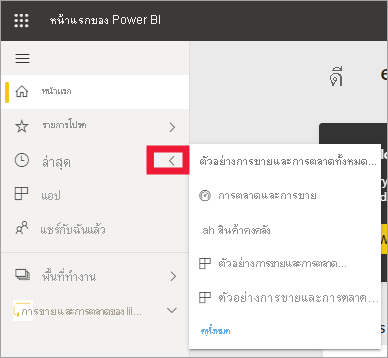
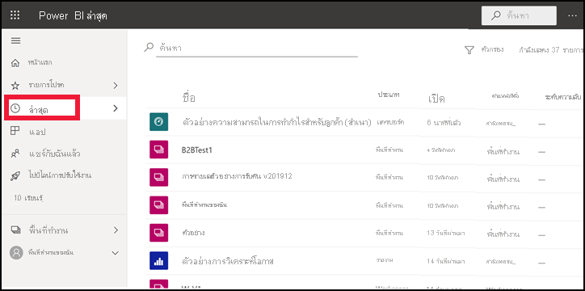
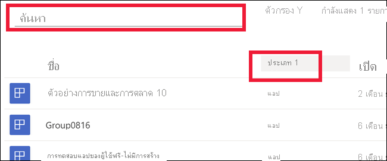

# เนื้อหา **ล่าสุด** ในบริการ Power BI

[!INCLUDE[consumer-appliesto-yyny](../includes/consumer-appliesto-yyny.md)]

เนื้อหา **ล่าสุด** คือรายการสุดท้ายที่คุณเข้าชมในบริการ Power BI ซึ่งรวมถึง: แดชบอร์ด รายงาน แอป พื้นที่ทำงาน และเวิร์กบุ๊ก เมื่อคุณเลือก **ล่าสุด** จากแถบนำทาง Power BI จะแสดงเนื้อหานี้โดยเรียงลำดับจากมากไปหาน้อยตามวันที่  เมื่อต้องการเปลี่ยนลำดับการจัดเรียง ให้เลือกหนึ่งในหัวเรื่องและเลือกจากน้อยไปหามากหรือมากไปหาน้อย

โปรดสังเกตว่ารายการทั้งสองรายการคือ [รายการโปรด](end-user-favorite.md) และมีไอคอนรูปดาวกำกับอยู่ และหนึ่งรายการ คือตัวอย่างความสามารถในการทำกำไรสำหรับลูกค้า จะถูกจัดเก็บใน [ความจุแบบพรีเมียม](end-user-license.md)

## ดูห้ารายการล่าสุดของคุณ

หากคุณต้องการดูห้ารายการที่เข้าชมล่าสุด ให้ไปยังเมนูนำทางแล้วเลือกลูกศรไปทางขวาของ **ล่าสุด**  จากที่นี่ ให้เลือกเนื้อหาเพื่อเปิด 

## ดูเนื้อหาล่าสุดทั้งหมดของคุณ

หากคุณมีรายการที่เยี่ยมชมล่าสุดมากกว่าห้ารายการ ให้เลือก **ดูทั้งหมด** เพื่อเปิดหน้าจอ **ล่าสุด** ในขณะที่เราได้เริ่มต้นบทความนี้ คุณสามารถข้ามเมนูลอยและเปิดหน้าจอ **ล่าสุด** ได้โดยการเลือกคำ **ล่าสุด** หรือไอคอน จากบานหน้าต่างนำทาง

## ค้นหาและเรียงลำดับรายการเนื้อหาล่าสุดของคุณ

นอกจากนี้ หากคุณมีรายการยาว [ใช้เขตข้อมูลค้นหาและการจัดเรียงเพื่อหาสิ่งที่คุณต้องการ](end-user-search-sort.md) ค้นหาว่าคอลัมน์ใดที่สามารถจัดเรียงได้โดยเลื่อนไปด้านบนเพื่อดูว่ามีลูกศรปรากฏขึ้นหรือไม่ จากตัวอย่างนี้ การเลื่อนไปที่ **ชนิด** จะเป็นการทำให้ลูกศรปรากฏ - โดยสามารถจัดเรียงเนื้อหาล่าสุดของคุณโดยเรียงตามลำดับตัวอักษร ตามชนิดของเนื้อหา 

ให้ดู Amanda สาธิตว่ารายการ **ล่าสุด** ของบริการ Power BI นั้นเติมข้อมูลอย่างไร จากนั้นทำตามคำแนะนำแบบทีละขั้นตอนตามด้านล่างวิดีโอเพื่อลองใช้งานด้วยตัวคุณเอง

<iframe width="560" height="315" src="https://www.youtube.com/embed/G26dr2PsEpk" frameborder="0" allowfullscreen></iframe>

> [!NOTE]
> วิดีโอนี้ใช้บริการ Power BI รุ่นเก่า

<!--
## Actions available from the **Recent** content list
The actions available to you will depend on the settings assigned by the content *designer*. Some of your options may include:
* Select the star icon to [favorite a dashboard, report, or app](end-user-favorite.md) .
* Some dashboards and reports can be re-shared  .
* [Open the report in Excel](end-user-export.md)  
* [View insights](end-user-insights.md) that Power BI finds in the data . -->

## ขั้นตอนถัดไป
[แอปบริการของ power BI](end-user-apps.md)

มีคำถามเพิ่มเติมหรือไม่ [ลองไปที่ชุมชน Power BI](https://community.powerbi.com/)

