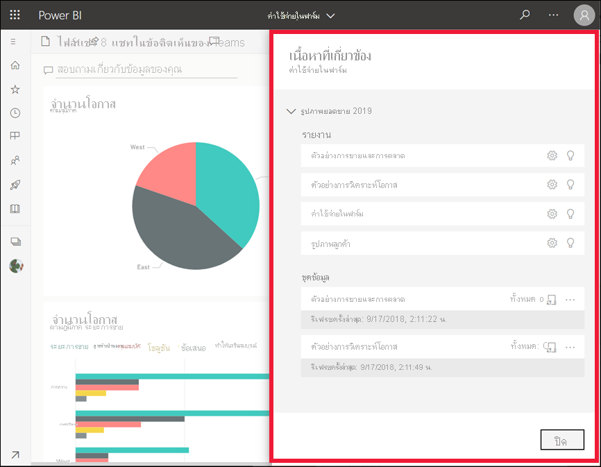
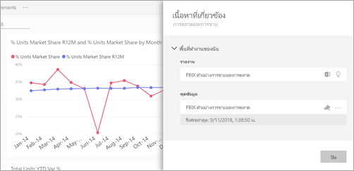
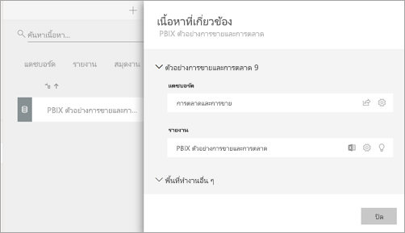

# ดูเนื้อหาที่เกี่ยวข้องในบริการ Power BI

[!INCLUDE[consumer-appliesto-yyny](../includes/consumer-appliesto-yyny.md)]

บานหน้าต่าง **เนื้อหาที่เกี่ยวข้อง** แสดงว่าเนื้อหาPower BI service แดชบอร์ด รายงาน และชุดข้อมูลของคุณเชื่อมต่อกันอย่างไร บานหน้าต่าง **เนื้อหาที่เกี่ยวข้อง** จะเป็นเสมือนจุดเริ่มต้นในการดำเนินการ จากที่นี่คุณสามารถทำสิ่งต่างๆเช่นเปิดแดชบอร์ดเปิดรายงานสร้างข้อมูลเชิงลึกวิเคราะห์ข้อมูลใน Excel และอื่นๆ อีกมากมาย  

ในบริการ Power BI รายงานถูกสร้างขึ้นบนชุดข้อมูล วิชวลรายงานจะถูกปักหมุดไว้ที่แดชบอร์ด และลิงก์วิชวลของแดชบอร์ดกลับไปที่รายงาน แต่คุณจะรู้ได้อย่างไรว่าแดชบอร์ดใดที่คอยจัดการดูแลภาพจากรายงานทางการตลาดของคุณ และคุณจะค้นหาแดชบอร์ดเหล่านั้นได้อย่างไร แดชบอร์ดการจัดซื้อของคุณกำลังใช้งานภาพจากชุดข้อมูลมากกว่าหนึ่งชุดหรือไม่ ถ้าเป็นเช่นนั้น พวกเขาตั้งชื่ออะไร และวิธีสามารถเปิดและแก้ไขเอกสารนั้นได้อย่างไร ชุดข้อมูล HR ของคุณกำลังถูกใช้งานในการรายงานหรือบอร์ดใดหรือไม่ หรือ มันสามารถถูกเคลื่อนย้ายโดยไม่ส่งผลกระทบต่อลิงก์ต่าง ๆ ได้ไหม คำถามเหล่านี้ทั้งหมดสามารถได้รับการตอบบนบานหน้าต่าง **เนื้อหาที่เกี่ยวข้อง**  บานหน้าต่างนี้ไม่เพียงแต่แสดงเนื้อหาที่เกี่ยวข้อง ทว่ายังอนุญาตให้คุณดำเนินการกับเนื้อหา และเปิดเนื้อหาที่เกี่ยวข้องได้อย่างง่ายดายอีกด้วย

> [!NOTE]
> ลักษณะการทำงานเนื้อหาที่เกี่ยวข้องไม่สามารถใช้งานได้สำหรับชุดข้อมูลแบบสตรีม
> 
> 

## ดูเนื้อหาที่เกี่ยวข้องสำหรับแดชบอร์ดหรือรายงาน
ดูเนื้อหาที่เกี่ยวข้องของแดชบอร์ด จากนั้นทำตามคำแนะนำทีละขั้นตอนด้านล่างวิดีโอเพื่อทดลองใช้ด้วยตัวคุณเองด้วยตัวอย่างการวิเคราะห์ด้านการจัดซื้อ

> [!NOTE]
> วิดีโอนี้อิงตามบริการ Power BI เวอร์ชันก่อนหน้า 

<iframe width="560" height="315" src="https://www.youtube.com/embed/B2vd4MQrz4M#t=3m05s" frameborder="0" allowfullscreen></iframe>

เมื่อเปิดแดชบอร์ดหรือรายงานให้เลือก **ตัวเลือกเพิ่มเติม** (... ) ในแถบเมนูแล้วเลือก **ดูเนื้อหาที่เกี่ยวข้อง** จากเมนูแบบเลื่อนลง

บานหน้าต่าง **เนื้อหาที่เกี่ยวข้อง** เปิดขึ้น สำหรับแดชบอร์ดซึ่งแสดงรายงานทั้งหมดที่มีการแสดงภาพที่ปักหมุดที่แดชบอร์ดและชุดข้อมูลที่เชื่อมโยงของพวกเขา สำหรับแดชบอร์ดนี้มีการแสดงภาพที่ปักหมุดจากรายงานเดียวเท่านั้นและรายงานดังกล่าวจะยึดตามชุดข้อมูลเดียวเท่านั้น หากคุณดูรูปภาพในตอนต้นของบทความนี้คุณจะเห็นเนื้อหาที่เกี่ยวข้องสำหรับแดชบอร์ดที่มีการแสดงภาพที่ปักหมุดไว้จากรายงานสี่รายงานและชุดข้อมูลสองชุด

จากที่นี่ คุณสามารถดำเนินการโดยตรงกับเนื้อหาที่เกี่ยวข้องโดยขึ้นอยู่กับการอนุญาตของคุณ  ตัวอย่างเช่น เลือกชื่อรายงานหรือแดชบอร์ดเพื่อเปิด  สำหรับรายงานที่อยู่ในรายการ ให้เลือกไอคอนเพื่อเปิดและแก้ไขการตั้งค่าสำหรับรายงาน [รับข้อมูลเชิงลึก](end-user-insights.md) และอื่น ๆ สำหรับชุดข้อมูล ตรวจสอบวันที่และเวลาของการรีเฟรชครั้งล่าสุด [วิเคราะห์ใน Excel](../collaborate-share/service-analyze-in-excel.md) [รับข้อมูลเชิงลึก](end-user-insights.md) รีเฟรชและอื่น ๆ  

<!-- ## See related content for a dataset
You'll need at least *view* permissions to a dataset to open the **Related content** pane. In this example, we're using the [Procurement Analysis sample](../create-reports/sample-procurement.md).

From the nav pane, locate the **Workspaces** heading and select a workspace from the list. If you have content in a workspace, it will display in the canvas to the right. 

In a workspace, select the **Datasets** tab and locate the **See related** icon .

Select the icon to open the **Related content** pane.

From here, you can take direct action on the related content. For example, select a dashboard or report name to open it.  For any dashboard in the list, select an icon to [share the dashboard with others](../collaborate-share/service-share-dashboards.md) or to open the **Settings** window for the dashboard. For a report, select an icon to [analyze in Excel](../collaborate-share/service-analyze-in-excel.md), [rename](../create-reports/service-rename.md), or [get insights](end-user-insights.md).  -->

## ข้อจำกัดและการแก้ไขปัญหา
* หากคุณไม่เห็น "ดูเกี่ยวข้อง" ให้มองหาไอคอนแทน  เลือกไอคอนเพื่อเปิดบานหน้าต่าง **เนื้อหาที่เกี่ยวข้อง**
* ในการเปิดเนื้อหาที่เกี่ยวข้องสำหรับรายงาน คุณต้องอยู่ใน [มุมมองการอ่าน](end-user-reading-view.md)
* คุณลักษณะเนื้อหาที่เกี่ยวข้องใช้ไม่ได้กับชุดข้อมูลสตรีมมิ่ง

## ขั้นตอนถัดไป
* [เริ่มต้นใช้งานบริการ Power BI](../fundamentals/service-get-started.md)
* มีคำถามเพิ่มเติมหรือไม่ [ลองไปที่ชุมชน Power BI](https://community.powerbi.com/)
