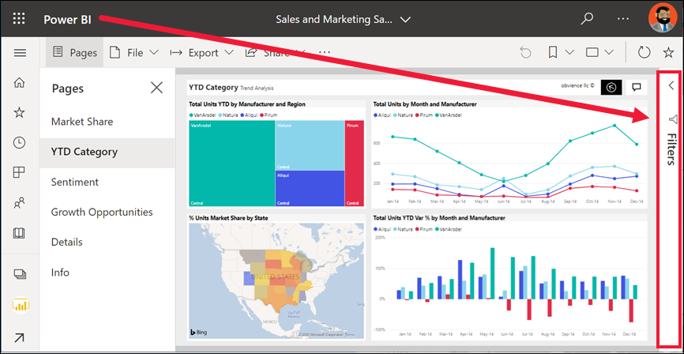
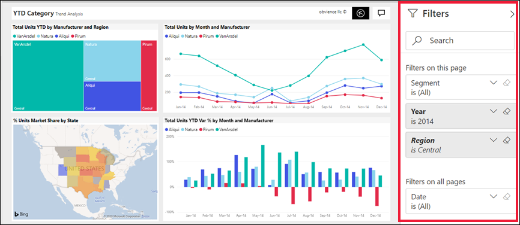
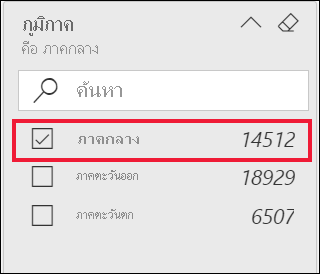
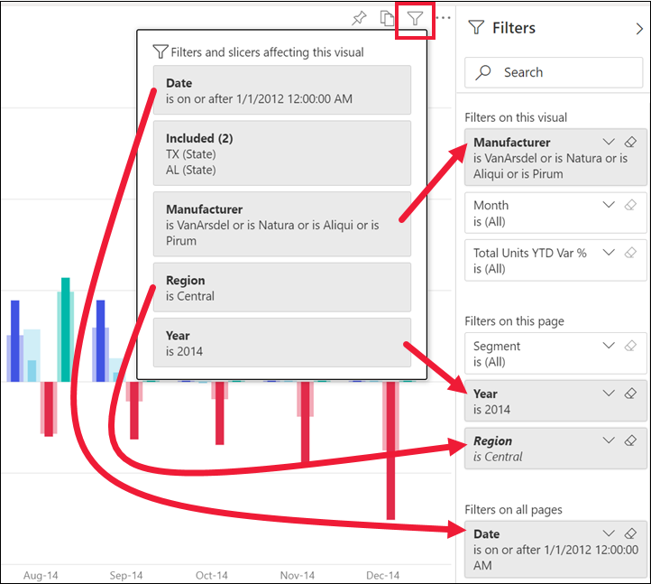
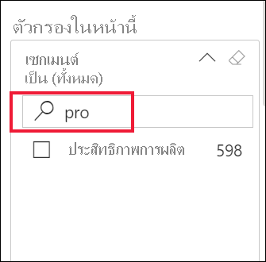
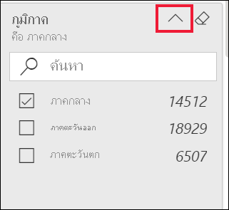
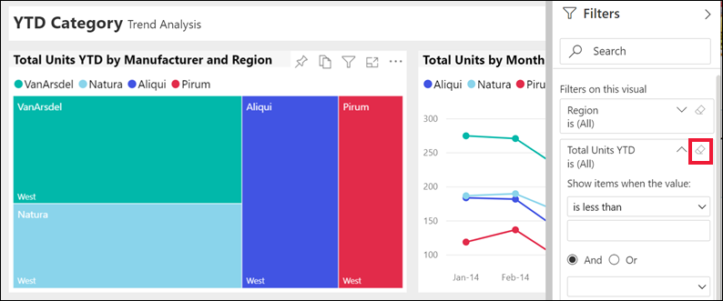

# สำรวจภาพรวมของบานหน้าต่างตัวกรองรายงานTake a tour of the report Filters pane

[!INCLUDE[consumer-appliesto-yyny](../includes/consumer-appliesto-yyny.md)]

[!INCLUDE [power-bi-service-new-look-include](../includes/power-bi-service-new-look-include.md)]

บทความนี้จะอธิบายบานหน้าต่าง **ตัวกรอง** รายงานในบริการของ Power BIThis article takes a look at the report **Filters** pane in the Power BI service. ใช้ตัวกรองเพื่อค้นหาข้อมูลเชิงลึกใหม่ในข้อมูลของคุณUse the filters to discover new insights in your data.

มีหลายวิธีในการกรองข้อมูลใน Power BIThere are many different ways to filter data in Power BI. บทความนี้อธิบายวิธีการใช้บานหน้าต่าง **ตัวกรอง**This article explains how to use the **Filters** pane.  คุณยังสามารถกรองได้โดยการเลือกจุดข้อมูลบนวิชวลรายงานเพื่อกรองวิชวลอื่น ๆ บนเพจ ซึ่งเรียกว่า**การกรองข้าม**และ**การไฮไลต์ข้าม**You can also filter by selecting data points on a report visual to filter the other visuals on the page -- this is referred to as **cross-filtering** and **cross-highlighting**. สำหรับข้อมูลเพิ่มเติมเกี่ยวกับการกรองข้ามและการไฮไลต์ข้าม โปรดดู [ตัวกรองและการไฮไลท์ในรายงาน Power BI](../create-reports/power-bi-reports-filters-and-highlighting.md)For more information about cross-filtering and cross-highlighting, see [Filters and highlighting in Power BI reports](../create-reports/power-bi-reports-filters-and-highlighting.md).

## สำรวจภาพบานหน้าต่างตัวกรองรายงานWorking with the report Filters pane

เมื่อเพื่อนร่วมงานแชร์รายงานกับคุณ ให้แน่ใจว่าได้ดูบานหน้าต่าง**ตัวกรอง**When a colleague shares a report with you, be sure to look for the **Filters** pane. ในบางครั้งจะถูกยุบตามขอบด้านขวาของรายงานSometimes it's collapsed along the right edge of the report. เลือกเพื่อขยายSelect it to expand it.

บานหน้าต่าง **ตัวกรอง** ประกอบด้วยตัวกรองที่ *ผู้ออกแบบ* ได้เพิ่มในรายงานThe **Filters** pane contains filters that the report *designer* added to the report. *ผู้ใช้ทางธุรกิจ*เช่นคุณสามารถโต้ตอบกับตัวกรองที่มีอยู่ และบันทึกการเปลี่ยนแปลงได้ แต่ไม่สามารถเพิ่มตัวกรองใหม่ในรายงาน*Business users* like you can interact with the existing filters and save your changes, but you can't add new filters to the report. ตัวอย่างเช่น สกรีนช็อตด้านบนตัวออกแบบได้เพิ่มตัวกรองระดับหน้าสามตัวกรอง: **เซกเมนต์คือทั้งหมด**, **ปีคือ 2014** และ**ภูมิภาคเป็นภาคกลาง**For example, in the screenshot above the designer added three page level filters: **Segment is All**, **Year is 2014**, and **Region is Central**. คุณสามารถโต้ตอบ และเปลี่ยนตัวกรองเหล่านี้ แต่คุณไม่สามารถเพิ่มตัวกรองระดับหน้าตัวที่สี่ได้You can interact and change these filters, but you can't add a fourth page level filter.

มีการแรเงาตัวกรองบางรายการและไม่ได้แรเงาบางรายการSome of the filters are shaded, and some are not. ถ้ามีการแรเงาตัวกรอง นั่นหมายความว่ามีการนำตัวกรองไปใช้และมีการแยกข้อมูลบางอย่างออกIf a filter is shaded, that means a filter has been applied and some data is being excluded. ตัวอย่างเช่น มีการแรเงาการ์ดตัวกรอง **ภูมิภาค** และเมื่อคุณใช้งานการ์ดคุณเห็นว่ามีเพียง **ภาคกลาง** เท่านั้นที่ถูกเลือกจากรายการดรอปดาวน์For example, the **Region** filter card is shaded, and when you expend the card you see that only **Central** is selected from the dropdown. เนื่องจากภูมิภาคอยู่ภายใต้ส่วนหัว **ตัวกรองในหน้านี้** วิชวลทั้งหมดในหน้าเพจนี้จึงไม่แสดงข้อมูล (ไม่รวม) สำหรับภูมิภาค**ตะวันตก**และ**ตะวันออก**Since Region is under the **Filters on this page** heading, all visuals on this page are not displaying (excluding) data for the **West** and **East** regions.

ในบริการ Power BI รายงานจะเก็บข้อมูลการเปลี่ยนแปลงที่คุณทำในบานหน้าต่าง **ตัวกรอง**In the Power BI service, reports keep any changes you make in the **Filters** pane. บริการจะขยายการเปลี่ยนแปลงเหล่านั้นผ่านไปยังอุปกรณ์เคลื่อนที่ของรายงานThe service carries those changes through to the mobile version of the report. 

หากต้องการรีเซ็ตบานหน้าต่าง **ตัวกรอง** เป็นค่าเริ่มต้นของตัวออกแบบ เลือก **รีเซ็ตเป็นค่าเริ่มต้น** จากแถบเมนูด้านบนTo reset the **Filters** pane to the designer's defaults, select **Reset to default** from the upper menu bar.

 

> [!NOTE]
> หากคุณไม่เห็นตัวเลือก **รีเซ็ตเป็นค่าเริ่มต้น** ตัวเลือกนี้อาจถูกปิดใช้งานโดย *ผู้ออกแบบ*รายงานIf you don't see the **Reset to default** option, it may have been disabled by the report *designer*. *ผู้ออกแบบ* ยังสามารถล็อกตัวกรองที่ระบุเพื่อไม่ให้คุณสามารถเปลี่ยนแปลงได้The *designer* can also lock specific filters so that you can't change them.

## ดูตัวกรองทั้งหมดสำหรับหน้ารายงานView all the filters for a report page

บานหน้าต่าง **ตัวกรอง** จะแสดงตัวกรองทั้งหมดที่เพิ่มโดยผู้ออกแบบในรายงานThe **Filters** pane displays all filters added by the designer to the report. บานหน้าต่าง **ตัวกรอง** เป็นพื้นที่ที่คุณสามารถดูข้อมูลเกี่ยวกับตัวกรอง และโต้ตอบกับตัวกรองเหล่านั้นThe **Filters** pane is also the area where you can view information about the filters and interact with them. บันทึกการเปลี่ยนแปลงที่คุณสร้างหรือใช ้**รีเซ็ตเป็นค่าเริ่มต้น** เพื่อแปลงกลับเป็นการตั้งค่าตัวกรองต้นฉบับได้Save changes you make or use **Reset to default** to revert to the original filter settings.

ถ้ามีการเปลี่ยนแปลงที่คุณต้องการบันทึก คุณสามารถสร้างบุ๊กมาร์กส่วนบุคคลได้If there are changes you'd like to save, you can also create a personal bookmark. สำหรับข้อมูลเพิ่มเติม ให้ดูที่ [บุ๊กมาร์กคืออะไร](end-user-bookmarks.md)For more information, see [What are bookmarks?](end-user-bookmarks.md).

บานหน้าต่าง **ตัวกรอง** จะแสดงและจัดการตัวกรองรายงานหลายชนิด: รายงาน หน้ารายงาน และวิชวลThe **Filters** pane displays and manages several types of report filters: report, report page, and visual.

ในตัวอย่างนี้ เราได้เลือกวิชวลที่มีตัวกรองสามตัว: **ผู้ผลิต** **เดือน** และ **หน่วยทั้งหมด**In this example, we've selected a visual that has three filters: **Manufacturer**, **Month**, and **Total units**. หน้ารายงานยังมีตัวกรอง ซึ่งแสดงรายการภายใต้หัวเรื่อง **ตัวกรองในหน้านี้**The report page also has filters, listed under the **Filters on this page** heading. และรายงานทั้งหมดมีตัวกรองสำหรับ **วันที่** แสดงอยู่ภายใต้ **ตัวกรองบนหน้าทั้งหมด**And, the entire report has a filter for **Date**, listed under **Filters on all pages**.

บางตัวกรองมี **(ทั้งหมด)** อยู่ถัดจากตัวกรองเหล่านั้นSome of the filters have **(All)** next to them. \*\*(ทั้งหมด) \*\* หมายความว่าค่าทั้งหมดจะถูกรวมอยู่ในตัวกรอง**(All)** means all values are being included in the filter. ในสกรีนช็อตข้างต้น **Segment(All)** จะบอกให้เราว่าหน้ารายงานนี้มีข้อมูลเกี่ยวกับเซ็กเมนต์ผลิตภัณฑ์ทั้งหมดIn the screenshot above, **Segment(All)** tells us this report page includes data about all the product segments. 

ทุกคนที่มีสิทธิ์ดูรายงานนี้สามารถโต้ตอบกับตัวกรองเหล่านี้ได้Anyone with permissions to view this report can interact with these filters.

### ดูเฉพาะตัวกรองที่นำไปใช้กับวิชวลเท่านั้นView only those filters applied to a visual

เมื่อต้องการดูรายละเอียดตัวกรองที่ส่งผลกระทบต่อวิชวลเฉพาะ ให้โฮเวอร์เหนือวิชวลเพื่อแสดงไอคอนตัวกรอง To get a closer look at the filters affecting a specific visual, hover over the visual to reveal the filter icon . เลือกไอคอนตัวกรองเพื่อดูเมนูแบบป็อปอัพที่มีตัวกรองทั้งหมด ตัวแบ่งส่วนข้อมูล และอื่นๆ ที่มีผลต่อวิชวลนั้นSelect that filter icon to see a pop-up with all the filters, slicers, and so on, affecting that visual. ตัวกรองบนป๊อปอัพมีตัวกรองเดียวกันที่แสดงอยู่ในบานหน้าต่าง **ตัวกรอง** รวมถึงการกรองเพิ่มเติมที่ส่งผลกระทบต่อวิชวลที่เลือกThe filters on the pop-up include the same filters displayed on the **Filters** pane, plus any additional filtering affecting the selected visual.

นี่คือชนิดตัวกรองที่มุมมองนี้สามารถแสดงได้:Here are the types of filters this view can display:

- ตัวกรองพื้นฐานBasic filters
- ตัวแบ่งส่วนข้อมูลSlicers
- ไฮไลต์เชื่อมโยงCross-highlighting
- กรองข้ามCross-filtering
- ตัวกรองขั้นสูงAdvanced filters
- ตัวกรอง Top NTop N filters
- ตัวกรองวันที่ที่เกี่ยวข้องRelative Date filters
- ตัวแบ่งส่วนข้อมูลซิงค์Sync-slicers
- ตัวกรอง รวม/ไม่รวมInclude/Exclude filters
- ตัวกรองที่ส่งผ่าน URLFilters passed through a URL

ในตัวอย่างนี้:In this example:
1. **รวม**บอกเราว่าวิชวลได้รับการกรองแบบข้าม**Included** tells us that the visual has been cross-filtered. สิ่งนี้หมายความว่ารัฐอลาบามา และเท็กซัสได้ถูกเลือกไว้บนหนึ่งในวิชวลอื่น ๆ บนหน้ารายงานนี้What this means is that the states of Alabama and Texas have been selected on one of the other visuals on this report page. ในกรณีนี้ นี่เป็นวิชวลแผนที่In this case, it's the map visual. การคัดเลือกทั้งสองรัฐมีการตัดข้อมูลสำหรับรัฐอื่น ๆ ทั้งหมดออกจากการแสดงบนแผนภูมิแท่งที่เลือกไว้The selection of those two states has eliminated data for all other states from displaying on the selected bar chart.  

1. **วันที่**คือตัวกรองที่นำไปใช้กับทุกหน้าในรายงานนี้**Date** is a filter applied to all pages in this report.

1. **ภูมิภาคคือภาคกลาง**และ**ปีคือ 2014** เป็นตัวกรองที่นำไปใช้กับหน้ารายงานนี้**Region is Central** and **Year is 2014** are filters applied to this report page.

4. **ผู้ผลิตคือ VanArsdel, Natura, Aliqui, หรือ Pirum** เป็นตัวกรองที่นำไปใช้กับวิชวลนี้**Manufacturer is VanArsdel, Natura, Aliqui, or Pirum** is a filter applied to this visual.

### ค้นหาในตัวกรองSearch in a filter

ในบางครั้งตัวกรองอาจมีรายการค่าที่ยาวSometimes a filter can have a long list of values. ใช้กล่องค้นหาเพื่อค้นหา และเลือกค่าคุณต้องการUse the search box to find and select the value you want.

### แสดงรายละเอียดตัวกรองDisplay filter details

หากต้องการทำความเข้าใจตัวกรอง ให้ขยายและดูค่าและจำนวนที่ใช้ได้To understand a filter, expand it and take a look at the available values and counts.  หากต้องการขยายตัวกรอง ให้เลือกลูกศรที่อยู่ถัดจากชื่อตัวกรองTo expand the filter, select the arrow next to the filter name.
  

### เปลี่ยนแปลงการเลือกตัวกรองChange filter selections

วิธีหนึ่งในการค้นหาข้อมูลเชิงลึกคือการโต้ตอบกับตัวกรองOne way to search for data insights is to interact with the filters. คุณสามารถเปลี่ยนการเลือกตัวกรองโดยใช้ลูกศรดรอปดาวน์ถัดจากชื่อเขตข้อมูลYou can change filter selections using the drop-down arrow next to the field name.  ตัวเลือกของคุณจะมีตั้งแต่ตัวเลือกแบบง่ายจากรายการไปจนถึงการระบุช่วงของวันที่หรือตัวเลข ทั้งนี้ขึ้นอยู่กับตัวกรองและชนิดของข้อมูลที่ Power BI กำลังกรองDepending on the filter and type of data that Power BI is filtering, your options will range from simple selections from a list, to identifying ranges of dates or numbers. ในตัวกรองขั้นสูงด้านล่าง เราได้เปลี่ยนแปลงตัวกรอง **YTD ของหน่วยรวม** บนแผนที่ต้นไม้เพื่อให้อยู่ระหว่าง 2,000 และ 3,000In the advanced filter below, we've changed the **Total Units YTD** filter on the treemap to be between 2,000 and 3,000. โปรดสังเกตว่าการเปลี่ยนแปลงนี้จะลบ Pirum ออกจากแผนที่ต้นไม้Notice that this change removes Pirum from the treemap.
  

> [!TIP]
> เมื่อต้องเลือกค่าตัวกรองมากกว่าหนึ่งรายการในแต่ละครั้ง ให้กดแป้น CTRL ค้างไว้To select more than one filter value at a time, hold down the CTRL key. ตัวกรองส่วนใหญ่รองรับการเลือกหลายรายการMost filters support multi-select.

### รีเซ็ตตัวกรองเป็นค่าเริ่มต้นReset filter to default

ถ้าคุณต้องการย้อนกลับการเปลี่ยนแปลงทั้งหมดที่คุณได้ทำกับตัวกรอง ให้เลือก**รีเซ็ตเป็นค่าเริ่มต้น**จากแถบเมนูด้านบนIf you want to back out of all changes you've made to the filters, select **Reset to default** from the top menu bar.  การเลือกนี้เปลี่ยนกลับตัวกรองเป็นแบบเดิมตามที่ผู้ออกแบบรายงานตั้งค่าไว้This selection reverts the filters to their original state, as set by the report designer.

### ล้างตัวกรองClear a filter

เมื่อต้องการรีเซ็ตตัวกรองเป็น (ทั้งหมด) ให้ล้างข้อมูลด้วยการเลือกไอคอนยางลบที่อยู่ถัดจากชื่อตัวกรองTo reset a filter to (All), clear it by selecting the eraser icon next to the filter name.

  
<!--  too much detail for consumers

## Types of filters: text field filters
### List mode
Ticking a checkbox either selects or deselects the value. The **All** checkbox can be used to toggle the state of all checkboxes on or off. The checkboxes represent all the available values for that field.  As you adjust the filter, the restatement updates to reflect your choices. 

Note how the restatement now says "is Mar, Apr or May".

### Advanced mode
Select **Advanced Filtering** to switch to advanced mode. Use the dropdown controls and text boxes to identify which fields to include. By choosing between **And** and **Or**, you can build complex filter expressions. Select the **Apply Filter** button when you've set the values you want.  

## Types of filters: numeric field filters
### List mode
If the values are finite, selecting the field name displays a list.  See **Text field filters** &gt; **List mode** above for help using checkboxes.   

### Advanced mode
If the values are infinite or represent a range, selecting the field name opens the advanced filter mode. Use the dropdown and text boxes to specify a range of values that you want to see. 

By choosing between **And** and **Or**, you can build complex filter expressions. Select the **Apply Filter** button when you've set the values you want.

## Types of filters: date and time
### List mode
If the values are finite, selecting the field name displays a list.  See **Text field filters** &gt; **List mode** above for help using checkboxes.   

### Advanced mode
If the field values represent date or time, you can specify a start/end time when using Date/Time filters.  

-->

## ขั้นตอนถัดไปNext steps

เรียนรู้วิธีที่ [วิชวลกรองแบบไขว้และข้ามไฮไลท์ของแต่ละตัวบนหน้ารายงาน](end-user-interactions.md)Learn how and why [visuals cross-filter and cross-highlight each other on a report page](end-user-interactions.md)
