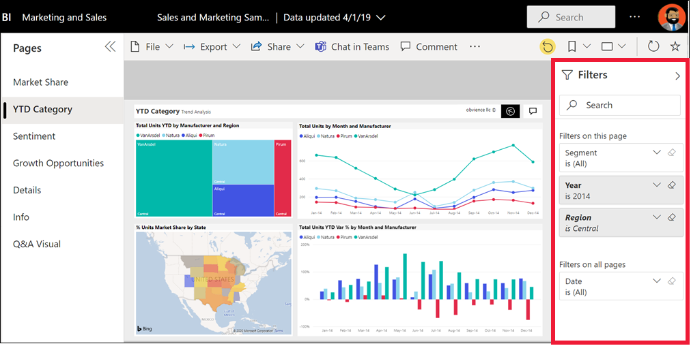

# ดูรายงานในบริการของ Power BI สำหรับ *ผู้ใช้ทางธุรกิจ*View a report in the Power BI service for *business users*

[!INCLUDE[consumer-appliesto-yynn](../includes/consumer-appliesto-yynn.md)]

[!INCLUDE [power-bi-service-new-look-include](../includes/power-bi-service-new-look-include.md)]

รายงานเป็นภาพอย่างน้อยหนึ่งหน้าA report is one or more pages of visuals. รายงานถูกสร้างโดย *นักออกแบบของ* Power BI และ [แชร์กับ *ผู้ใช้ทางธุรกิจโดยตรง*](end-user-shared-with-me.md) หรือในฐานะที่เป็นส่วนหนึ่งของ [แอป](end-user-apps.md)Reports are created by Power BI *designers* and [shared with *business users directly*](end-user-shared-with-me.md) or as part of an [app](end-user-apps.md). เมื่อต้องการเปิดรายงาน คุณจะต้องมีสิทธิ์การใช้งาน Power BI Pro หรือสำหรับรายงานที่เป็นส่วนหนึ่งของพื้นที่ทำงานที่จัดเก็บไว้ในความจุเฉพาะแบบพรีเมียมTo open a report, you'll need either a Power BI Pro license, or for the report to be part of a workspace that is stored in Premium dedicated capacity. [เรียนรู้เกี่ยวกับสิทธิ์การใช้งานและการสมัครใช้งานLearn about licenses and subscriptions](end-user-license.md)

มีหลายวิธีในการเปิดรายงาน และเราจะแสดงให้คุณเห็นสองวิธี: เปิดจากหน้าหลักและเปิดจากแดชบอร์ดThere are many different ways to open a report and we'll show you two of them: open from Home and open from a dashboard. 

<!-- add art-->

## เปิดรายงานจากหน้าหลักของ Power BIOpen a report from Power BI Home
ลองเปิดรายงานที่ได้แชร์กับคุณโดยตรง จากนั้น เปิดรายงานที่แชร์ไว้เป็นส่วนหนึ่งของแอปLet's open a report that's been shared with you directly and then open a report that was shared as part of an app.

   

### เปิดรายงานที่ได้แชร์โดยตรงกับคุณOpen a report that has been directly shared with you
*นักออกแบบ* Power BI สามารถแชร์รายงานเดี่ยวกับคุณโดยตรงผ่านลิงก์ในอีเมลหรือโดยเพิ่มรายงานดังกล่าวลงในเนื้อหาของ Power BI ของคุณโดยอัตโนมัติPower BI *designers* can share an individual report directly with you via a link in email or by adding it automatically to your Power BI content. เนื้อหาที่แชร์ด้วยวิธีนี้ปรากฏขึ้นในคอนเทนเนอร์ **แชร์กับฉัน** บนหน้าต่างการนำทาง และในส่วน **แชร์กับฉัน** ของพื้นที่ทำงานของหน้าหลักของคุณReports that are shared this way show up in the **Shared with me** container on your nav pane and in the **Shared with me** section of your Home canvas.

1. เปิดบริการของ Power BI (app.powerbi.com)Open the Power BI service (app.powerbi.com).

2. จากหน้าต่างนำทาง เลือก **หน้าหลัก** เพื่อแสดงพื้นที่ทำงานของหน้าหลักของคุณFrom the nav pane, select **Home** to display your Home canvas.  

   
   
3. เลื่อนลงจนกว่าคุณเห็น **แชร์กับฉัน**Scroll down until you see **Shared with me** . ค้นหาไอคอนรายงานLook for the report icon . ในภาพถ่ายหน้าจอนี้ เรามีแดชบอร์ดหนึ่งอันและรายงานหนึ่งชิ้นIn this screenshot we have one dashboard and one report. รายงายนั้นชื่อว่า *ตัวอย่างการขายและการตลาด*The report is named *Sales and marketing sample* . 
   
   

4. เพียงแค่เลือก *การ์ด* รายงานเพื่อเปิดรายงานSimply select the report *card* to open the report.

   

5. โปรดสังเกตแถบทางด้านซ้ายNotice the tabs along the left side.  แต่ละแท็บแสดง *หน้า* รายงานEach tab represents a report *page* . ขณะนี้เรามีหน้า *โอกาสการเติบโต* ที่เปิดอยู่We currently have the *Growth Opportunity* page open. เลือกแท็บ *ประเภท YTD* เพื่อเปิดหน้ารายงานนั้นแทนSelect the *YTD Category* tab to open that report page instead. 

   

6. ขยายบานหน้าต่าง **ตัวกรอง** ทางด้านขวาExpand the **Filters** pane along the right side. ตัวกรองที่ถูกนำไปใช้กับหน้ารายงานนี้หรือรายงานทั้งหมดจะแสดงที่นี่Filters that have been applied to this report page, or to the entire report, are displayed here. คุณสามารถเปลี่ยนตัวกรองเหล่านี้เพื่อดูผลกระทบต่อวิชวลและรายงานของคุณได้You can change these filters to see the impact on your visuals and report.

   

7. แสดงเมนูการดำเนินการสำหรับวิชวลDisplay the actions menu for a visual. การวางเมาส์เหนือวิชวลรายงานจะแสดงการดำเนินการที่คุณสามารถทำได้ในวิชวลนั้นHovering over a report visual reveals actions you can take on that visual. เมื่อต้องการดูตัวกรองที่ใช้กับวิชวลที่ระบุ ให้เลือกไอคอนตัวกรองTo see the filters applied to a specific visual, select the filter icon. ที่นี่เราได้เลือกไอคอนตัวกรองสำหรับแผนภูมิเส้น *หน่วยรวมตามเดือนและผู้ผลิต*Here we've selected the filter icon for the *Total units by month and manufacturer* line chart.

   

6. คุณยังสามารถเปลี่ยนการแสดงของหน้ารายงานได้You can also change the display of the report page. ในตอนนี้เราแสดงหน้ารายงานทั้งหมดRight now, we're displaying the entire report page. หากต้องการเปลี่ยนการแสดงผล (ซูม) ของหน้า ให้เลือกรายการแบบเลื่อนลง **มุมมอง** จากมุมบนขวา และเลือก **ขนาดจริง** จากนั้นเปลี่ยนเป็น **พอดีกับความกว้าง**To change the display (zoom) of the page, select the **View** dropdown from the upper right corner and choose **Actual size** and then switch to **Fit to width** . จะสังเกตได้ถึงความแตกต่างแต่ละตัวเลือกมุมมองที่มีต่อการแสดงผลของรายงานของคุณNotice the differences each view option makes to the display of your report.

   

   

มีหลายวิธีที่คุณสามารถโต้ตอบกับรายงาน เพื่อค้นหาข้อมูลเชิงลึกและทำการตัดสินใจทางธุรกิจThere are many ways for you to interact with a report to discover insights and make business decisions.  ใช้สารบัญทางด้านซ้ายมือ เพื่ออ่านบทความต่าง ๆ เกี่ยวกับรายงาน Power BIUse the table of contents on the left to read through other articles about Power BI reports. 

### เปิดรายงานที่เป็นส่วนหนึ่งของแอปOpen a report that is part of an app
หากคุณได้รับแอปจากเพื่อนร่วมงานหรือ AppSource สามารถดูแอปเหล่านั้นได้จากหน้าหลักของคุณ และจากคอนเทนเนอร์ **แอป** และ **แชร์กับฉัน** บนหน้าต่างนำทางของคุณIf you've received apps from colleagues or from AppSource, those apps are available from Home, and from the **Apps** and **Shared with me** containers on your nav pane. [แอป](end-user-apps.md) คือคอลเลกชันของแดชบอร์ดและรายงานที่จับคู่รวมกันสำหรับคุณโดย *นักออกแบบ* ของ Power BIAn [app](end-user-apps.md) is a collection of dashboards and reports that have been bundled together for you by a Power BI *designer* .

### สิ่งที่จำเป็นต้องมีPrerequisites
การเปิดแอปจะต้องมีสิทธิ์ใช้งาน Power BI Pro หรือสำหรับพื้นที่ทำงานแอปที่จะจัดเก็บไว้ในความจุแบบ PremiumOpening an app requires a Power BI Pro license, or for the app workspace to be stored in Power BI Premium capacity. [เรียนรู้เกี่ยวกับสิทธิ์การใช้งานและการสมัครใช้งานLearn about licenses and subscriptions](end-user-license.md)    
    
หากต้องการทำตามคำแนะนำ ให้ดาวน์โหลดแอปการขายและการตลาดTo follow along, download the Sales and Marketing app.
1. ในเบราว์เซอร์ของคุณ ให้นำทางไปยัง appsource.microsoft.comIn your browser, navigate to appsource.microsoft.com.
1. เลือกกล่องกาเครื่องหมายสำหรับ **Power Platform**Select the checkbox for **Power Platform** .
1. ค้นหา "การขายและการตลาด" และเลือก **ตัวอย่างของ Microsoft - การขายและการตลาด**Search for "Sales & Marketing" and select **Microsoft sample - Sales & Marketing** . เลื่อนลงเพื่อดูผลลัพธ์การค้นหาScroll down to see the search results.
1. เลือก **รับตอนนี้** > **ดำเนินการต่อ** > **ติดตั้ง** เพื่อติดตั้งแอปในคอนเทนเนอร์แอปของคุณSelect **Get it now** > **Continue** > **Install** to install the app in your Apps container. 

คุณสามารถเปิดแอปจากคอนเทนเนอร์ **แอป** หรือจาก **หน้าแรก** ได้You can now open the app from your **Apps** container or from **Home** .
1. กลับไปที่หน้าหลักโดยการเลือก **หน้าหลัก** จากหน้าต่างนำทางGo back to Home by selecting **Home** from the nav pane.

7. เลื่อนลงจนกว่าคุณเห็น **แอปของฉัน**Scroll down until you see **My Apps** .

   

8. เลือกแอป *การขายและการตลาด* ใหม่เพื่อเปิดSelect your new *Sales and marketing* app to open it. ขึ้นอยู่กับตัวเลือกที่กำหนดโดย *ตัวออกแบบ* แอป แอปจะเปิดแดชบอร์ดหรือหรือรายงานDepending on the options set by the app *designer* , the app will open either a dashboard or a report. แอปนี้จะเปิดไปยังแดชบอร์ดThis app opens to a dashboard.  

## เปิดรายงานจากแดชบอร์ดOpen a report from a dashboard
สามารถเปิดรายงานได้จากแดชบอร์ดReports can be opened from a dashboard. [ไทล์](end-user-tiles.md)แดชบอร์ดส่วนใหญ่มีการ *ปักหมุด* จากรายงานMost dashboard [tiles](end-user-tiles.md) are *pinned* from reports. เลือกไทล์เปิดรายงานที่ใช้เพื่อสร้างไทล์Selecting a tile opens the report that was used to create the tile. 

1. จากแดชบอร์ด เลือกไทล์From the dashboard, select a tile. กหในตัวอย่างนี้ เราได้เลือกไทล์แผนภูมิคอลัมน์ *จำนวนหน่วยรวม ตั้งแต่ต้นปีถึงปัจจุบัน...*In this example we've selected the *Total Units YTD...* column chart tile.

    

2.  เปิดรายงานที่เกี่ยวข้องThe associated report opens. ฟหโปรดสังเกตว่า เรากำลังอยู่บนหน้า *ประเภทตั้งแต่ต้นปีถึงปัจจุบัน*Notice that we're on the *YTD Category* page. นี่คือหน้ารายงานที่มีแผนภูมิคอลัมน์ที่เราเลือกจากแดชบอร์ดThis is the report page that contains the column chart we selected from the dashboard.

    

> [!NOTE]
> ไทล์ทั้งหมดไม่นำไปสู่รายงานNot all tiles lead to a report. ถ้าคุณเลือกไทล์ที่[ถูกสร้างขึ้นด้วยการถามตอบ](end-user-q-and-a.md) หน้าจอถามตอบจะเปิดขึ้นIf you select a tile that was [created with Q&A](end-user-q-and-a.md), the Q&A screen will open. หากคุณเลือกไทล์ที่ [สร้างขึ้นโดยใช้แดชบอร์ด **เพิ่มวิดเจ็ต** ของไทล์](../create-reports/service-dashboard-add-widget.md) แล้วสิ่งต่างๆ อาจเกิดขึ้นได้ วิดีโออาจเล่น เว็บไซต์เปิดขึ้น และอื่น ๆ อีกมากมายIf you select a tile that was [created using the dashboard **Add tile** widget](../create-reports/service-dashboard-add-widget.md), several different things may happen: a video may play, a website open, and more.  

##  ยังคงวิธีอื่น ๆ ในการเปิดรายงานStill more ways to open a report
เมื่อคุณใช้บริการของ Power BI ต่าง ๆ ได้คล่องแล้ว คุณจะรู้ว่าเวิร์กโฟลว์การทำงานแบบไหนที่ดีที่สุดสำหรับคุณAs you get more comfortable navigating the Power BI service, you'll figure out workflows that work best for you. สองสามวิธีอื่น ๆ ในการเข้าถึงรายงาน:A few other ways to access reports:
- จากหน้าต่างนำทาง ใช้[รายการโปรด](end-user-favorite.md) และ [ล่าสุด](end-user-recent.md)From the nav pane using [Favorites](end-user-favorite.md) and [Recent](end-user-recent.md)    
- ใช้[เนื้อหาที่เกี่ยวข้องกับมุมมอง](end-user-related.md)Using [View related](end-user-related.md)    
- ในอีเมล เมื่อมีใคร[แชร์กับคุณ](../collaborate-share/service-share-reports.md) หรือคุณ[ตั้งค่าการแจ้งเตือน](end-user-alerts.md)In an email, when someone [shares with you](../collaborate-share/service-share-reports.md) or you [set an alert](end-user-alerts.md)    
- จาก[ศูนย์การแจ้งเตือน](end-user-notification-center.md)ของคุณFrom your [Notification center](end-user-notification-center.md)    
- จากพื้นที่ทำงานFrom a workspace
- และอื่น ๆ อีกมากมายand more

## ขั้นตอนถัดไปNext steps
[เปิดและดูแดชบอร์ด](end-user-dashboard-open.md)  [Open and view a dashboard](end-user-dashboard-open.md)    
[ตัวกรองรายงานReport filters](end-user-report-filter.md)

