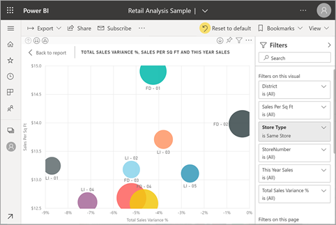

# เปลี่ยนการแสดงหน้ารายงานChange the display of a report page

[!INCLUDE[consumer-appliesto-yyny](../includes/consumer-appliesto-yyny.md)]

ผู้คนจะดูรายงานได้ในหลายอุปกรณ์ที่มีขนาดหน้าจอและอัตราส่วนกว้างยาวแตกต่างกันPeople view reports on many different devices with varying screen sizes and aspect ratios. เปลี่ยนวิธีแสดงหน้ารายงานให้ตรงกับความต้องการของคุณChange the way a report page displays to fit your needs.

## สำรวจเมนูมุมมองExplore the View menu

ตัวเลือกในเมนู **มุมมอง** มีความยืดหยุ่นในการแสดงหน้ารายงานที่ขนาดและความกว้างที่คุณเลือก:The options in the **View** menu give you flexibility to display report pages at the size and width you choose:

- สมมติว่าคุณกำลังดูรายงานบนอุปกรณ์ขนาดเล็ก และเป็นเรื่องยากที่จะเห็นชื่อเรื่องและคำอธิบายแผนภูมิLet's say you're viewing a report on a small device and it's hard to see titles and legends.  เลือก **มุมมอง** > **ขนาดจริง** เพื่อเพิ่มขนาดของหน้ารายงานSelect **View** > **Actual size** to increase the size of the report page. ใช้แถบเลื่อนเพื่อย้ายไปรอบ ๆ รายงานUse the scroll bars to move around the report.

    

- ตัวเลือกอื่นคือเพื่อจัดรายงานให้เหมาะกับความกว้างของหน้าจอโดยการเลือก **พอดีกับความกว้าง**Another option is to fit the report to your screen width by selecting **Fit to width**. เนื่องจากเป็นเพียงความกว้างและไม่ใช่ความสูง คุณอาจยังต้องการใช้แถบเลื่อนแนวตั้งSince it's just the width and not the height, you may still need to use the vertical scroll bar.

  

- ถ้าคุณไม่ต้องการแถบเลื่อนใด ๆ แต่ต้องการใช้ขนาดหน้าจอให้ดีที่สุด เลือก **พอดีกับหน้า**If you don't want any scroll bars, but want to make the best use of your screen size, select **Fit to Page**.

   

- คุณยังสามารถเลือกจาก **สีความคมชัดสูง** 4 สี: ความคมชัดสูง#1, ความคมชัดสูง#2, สีดำความคมชัดสูง และสีขาวความคมชัดสูงYou can also choose from four **High contrast colors**: High contrast #1, High contrast #2, High contrast black, and High contrast white. ซึ่งเป็นคุณลักษณะช่วบในการเข้าถึงที่คุณสามารถใช้เพื่อให้ผู้ที่มีความบกพร่องทางการมองเห็นสามารถดูรายงานได้ดีขึ้นIt's an accessibility feature that you can use so people who may have impaired vision can see the reports better. ตัวอย่างด้านล่างเป็นแบบความคมชัดสูงที่มีค่าเท่ากับ 1The example below is high contrast 1. 

    

- ตัวเลือกสุดท้าย **เต็มหน้าจอ** แสดงหน้ารายงานของคุณ โดยไม่มีแถบเมนูและหัวเรื่องThe final option, **Full screen**, displays your report page without menu bars and headers. เต็มหน้าจออาจมีตัวเลือกที่ดีสำหรับหน้าจอขนาดเล็กที่มองเห็นรายละเอียดได้ยากFull screen may be a good choice for small screens where the details are hard to see.  เต็มหน้าจออาจยังมีตัวเลือกที่ดีเมื่อแสดงหน้ารายงานบนหน้าจอขนาดใหญ่ให้บุคคลอื่นสามารถดู แต่ไม่มีการโต้ตอบFull screen may also be a good choice when projecting report pages on large screens for people to view but not interact.  

    

เมื่อคุณออกจากรายงาน การตั้งค่า **มุมมอง** ของคุณจะไม่ถูกบันทึก แต่แปลงกลับเป็นค่าเริ่มต้นWhen you exit the report, your **View** settings aren't saved, but revert to the default. ถ้าเป็นสิ่งสำคัญสำหรับคุณในการบันทึกการตั้งค่าเหล่านี้ ให้ใช้[บุ๊กมาร์ก](end-user-bookmarks.md)If it's important to you to save these settings, use [bookmarks](end-user-bookmarks.md).

## ใช้เบราว์เซอร์ของคุณเพื่อเปลี่ยนการแสดงหน้าเพจUse your browser to change page display

ตัวควบคุมการย่อ/ขยายในเบราว์เซอร์ของคุณเพิ่มและลดพื้นที่พื้นที่ทำงานที่มีอยู่The zoom controls in your browser increase and decrease the available canvas area. การลดการย่อ/ขยายทำให้พื้นที่ทำงานเพิ่มขึ้นเพื่อขยายและในทางกลับกันDecreasing the zoom causes the available canvas area to expand, and vice versa. 

การเปลี่ยนแปลงขนาดของเบราว์เซอร์ของคุณเป็นอีกหนึ่งวิธีการเปลี่ยนแปลงขนาดการแสดงผลรายงานของคุณResizing your entire browser is another way to change the display size of your report. 

## ขยายการแสดงผลด้วยภาพZoom in on a visual
บางครั้งก็ยากที่จะเห็นรายละเอียดการแสดงผลด้วยภาพSometimes it's difficult to see the details in a visual. คุณสามารถทำให้การแสดงผลใหญ่ขึ้นด้วยตนเองYou can make that visual display bigger, and by itself. สำหรับข้อมูลเพิ่มเติมดูโหมดโฟกัส ศึกษา [โหมดโฟกัสและโหมดเต็มหน้าจอ](end-user-focus.md)For more information, see [Focus mode and Full screen mode](end-user-focus.md)

### การแสดงผลในโหมด *โฟกัส*A visual in *Focus* mode

### การแสดงผลในโหมด *เต็มหน้าจอ*A visual in *Full screen* mode

## ขั้นตอนถัดไปNext steps

* [สำรวจภาพรวมของบานหน้าต่างตัวกรองของรายงานTake a tour of the report Filters pane](end-user-report-filter.md)