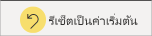

# รายงานใน Power BIReports in Power BI

[!INCLUDE[consumer-appliesto-yynn](../includes/consumer-appliesto-yyn.md)]

รายงาน Power BI มีมุมมองแบบหลากหลายมุมมองในชุดข้อมูล พร้อมด้วยวิชวลที่แสดงถึงผลลัพธ์และข้อมูลเชิงลึกที่แตกต่างจากชุดข้อมูลนั้นA Power BI report is a multi-perspective view into a dataset, with visuals that represent different findings and insights from that dataset.  รายงานอาจมีวิชวลเดียวหรือมีหน้าที่เต็มไปด้วยวิชวลA report can have a single visual or pages full of visuals. คุณอาจเป็นบุคคลที่ *ออกแบบ* รายงานได้ ทั้งนี้ขึ้นอยู่กับบทบาทงานของคุณDepending on your job role, you may be someone who *designs* reports. คุณยังอาจเป็น *ผู้ใช้ทางธุรกิจ* ที่ *ใช้ประโยชน์* หรือใช้รายงานYou also may be a *business user* who *consumes* or uses reports. บทความนี้มีไว้สำหรับ *ผู้ใช้ธุรกิจ*This article is for *business users*.

## ส่วนต่างๆของรายงานThe parts of a report

A.A. รายงานนี้มีหกหน้า (หรือแท็บ) และคุณกำลังดูหน้า **ความคิดเห็น**This report has six pages (or tabs) and you're currently viewing the **Sentiment** page.    
B.B. ในหน้านี้จะมีวิชวลที่แตกต่างกัน 5 ภาพและชื่อเรื่องของหน้าOn this page are five different visuals and a page title.    
C.C. บานหน้าต่าง *ตัวกรอง* แสดงตัวกรองตัวเดียวที่ใช้กับหน้ารายงานทั้งหมดThe *Filters* pane shows us one filter applied to all report pages. เมื่อต้องการยุบบานหน้าต่างตัวกรอง ให้เลือกลูกศร ( **>** )To collapse the Filters pane, select the arrow (**>**).    
D.D. แบนเนอร์ Power BI แสดงชื่อของรายงานและวันที่อัปเดตล่าสุดThe Power BI banner displays the name of the report and the last updated date. เลือกลูกศรเพื่อเปิดเมนูที่แสดงชื่อของเจ้าของรายงานSelect the arrow to open a menu that also show the name of the report owner.    
E.E. แถบการดำเนินการมีการดำเนินการที่คุณสามารถใช้ในรายงานนี้ได้The action bar contains actions you can take on this report.  ตัวอย่างเช่น คุณสามารถเพิ่มข้อคิดเห็น ดูบุ๊กมาร์ก หรือส่งออกข้อมูลจากรายงานได้For example, you can add a comment, view a bookmark, or export data from the report.  เลือก **ตัวเลือกเพิ่มเติม** (...) เพื่อแสดงรายการฟังก์ชันการทำงานเพิ่มเติมของรายงานSelect **More options** (...) to reveal a list of additional report functionality.    

หากคุณไม่คุ้นเคยกับ Power BI คุณสามารถเรียนรู้ข้อมูลพื้นฐานได้โดยการอ่าน[แนวคิดพื้นฐานสำหรับผู้ใช้ทางธุรกิจของบริการของ Power BI](end-user-basic-concepts.md)If you're new to Power BI, you can get a good foundation by reading [Basic concepts for the Power BI service business users](end-user-basic-concepts.md). รายงานจะพร้อมใช้งานสำหรับการดู แชร์ และใส่คำอธิบายประกอบบนอุปกรณ์เคลื่อนที่Reports are available for viewing, sharing, and annotating on mobile devices. สำหรับข้อมูลเพิ่มเติม ดู[สำรวจรายงานในแอปสำหรับอุปกรณ์เคลื่อน Power BI](mobile/mobile-reports-in-the-mobile-apps.md)For more info, see [Explore reports in the Power BI mobile apps](mobile/mobile-reports-in-the-mobile-apps.md).

## ข้อดีของรายงานAdvantages of reports

Power BI สร้างรายงานโดยอ้างอิงจากชุดข้อมูลเดียวPower BI bases a report on a single dataset. *ผู้ออกแบบ* รายงานจะสร้างวิชวลในรายงานเพื่อแสดงถึงนักเก็ตของข้อมูลReport *designers* create the visuals in a report to represent nuggets of information. วิชวลไม่คงที่The visuals aren't static.  วิชวลเหล่านี้จะอัปเดตเมื่อมีการเปลี่ยนแปลงข้อมูลพื้นฐานThey update as the underlying data changes. คุณสามารถโต้ตอบกับวิชวลและตัวกรองเมื่อคุณเจาะลึกลงในข้อมูลเพื่อค้นหาข้อมูลเชิงลึก และค้นหาคำตอบYou can interact with the visuals and filters as you dig into the data to discover insights and look for answers. รายงานจะสามารถปรับแต่งและโต้ตอบได้อย่างมากเช่นเดียวและมากกว่ากับแดชบอร์ดLike a dashboard, but more so, a report is highly interactive and highly customizable. ขอบเขตของสิ่งที่คุณสามารถทำได้ด้วยรายงานจะขึ้นอยู่กับบทบาทและสิทธิ์ที่กำหนดโดยรายงาน *ผู้ออกแบบ*The extent of what you can do with a report will depend on the role and permissions assigned by the report *designer*.

### โต้ตอบกับเนื้อหาอย่างปลอดภัยSafely interact with content

ขณะที่คุณสำรวจและโต้ตอบกับเนื้อหาของคุณเช่น การกรอง การแบ่งส่วน การสมัครใช้งาน และการส่งออก คุณจะไม่สามารถแบ่งรายงานได้As you explore and interact with your content: filtering, slicing, subscribing, and exporting, you can't break the reports. การทำงานของคุณไม่มีผลต่อชุดข้อมูลพื้นฐานหรือแชร์เนื้อหาต้นฉบับYour work doesn't affect the underlying dataset or the original shared content. ซึ่งนำไปใช้กับแดชบอร์ด รายงาน และแอปThis applies to dashboards, reports, and apps.

> [!NOTE]
> โปรดทราบว่าคุณจะทำให้ข้อมูลให้เสียหายไม่ได้Remember, you can't hurt your data. บริการ Power BI เป็นพื้นที่ที่ดีที่สุดสำหรับคุณในการสำรวจ และการทดลองโดยไม่ต้องกังวลว่าคุณจะทำให้ข้อมูลเสียหายThe Power BI service is a great place for you to explore and experiment without worrying that you'll break something.

### บันทึกการเปลี่ยนแปลงของคุณหรือแปลงกลับเป็นค่าเริ่มต้นSave your changes or revert to the default settings

ซึ่งไม่ได้หมายความว่า คุณไม่สามารถบันทึกการเปลี่ยนแปลงThat doesn't mean you can't save your changes. แต่การเปลี่ยนแปลงเหล่านั้นมีผลเฉพาะกับการดูเนื้อหาของคุณเท่านั้นYou can, but those changes only affect your view of the content. เมื่อต้องการแปลงกลับไปยังมุมมองเริ่มต้นของรายงาน ให้เลือก **รีเซ็ตเป็นค่าเริ่มต้น**To revert to the original default view of the report, select **Reset to default**.

## แดชบอร์ดเทียบกับรายงานDashboards versus reports

เรามักจะสับสนระหว่าง[แดชบอร์ด](end-user-dashboards.md)กับรายงานเนื่องจากทั้งสองเป็นพื้นที่ที่กรอกข้อมูลด้วยวิชวลเหมือนกัน[Dashboards](end-user-dashboards.md) are often confused with reports since they're also canvases filled with visuals. แต่แดชบอร์ดกับรายงานมีความแตกต่างที่สำคัญบางประการBut there are some major differences.  

| **ขีดความสามารถ****Capability** | **แดชบอร์ด****Dashboards** | **รายงาน****Reports** |
| --- | --- | --- |
| หน้าPages |หนึ่งหน้าOne page |อย่างน้อยหนึ่งหน้าOne or more pages |
| แหล่งข้อมูลData sources |อย่างน้อยหนึ่งรายงานและอย่างน้อยหนึ่งชุดข้อมูลต่อแดชบอร์ดOne or more reports and one or more datasets per dashboard |ชุดข้อมูลเดียวต่อรายงานA single dataset per report |
| การกรองFiltering |ไม่สามารถกรองหรือแบ่งส่วนได้Can't filter or slice |มีหลายวิธีในการกรอง ทำไฮไลท์ และแบ่งส่วนMany different ways to filter, highlight, and slice |
| ตั้งค่าการแจ้งเตือนSet alerts |สามารถสร้างการแจ้งเตือนไปยังอีเมลของคุณเมื่อแดชบอร์ดเป็นไปตามเงื่อนไขบางประการCan create alerts to email you when the dashboard meets certain conditions |ไม่ใช่No |
| ลักษณะการทำงานFeature |สามารถตั้งค่าแดชบอร์ดหนึ่งเป็นแดชบอร์ดที่แนะนำของคุณได้Can set one dashboard as your featured dashboard |ไม่สามารถสร้างรายงานที่แนะนำได้Can't create a featured report |
| สามารถดูตารางชุดข้อมูลพื้นฐานและพื้นที่ข้อมูลได้Can see underlying dataset tables and fields |ไม่No. สามารถส่งออกข้อมูลได้ แต่ไม่สามารถมองเห็นตารางชุดข้อมูลและเขตข้อมูลในแดชบอร์ดได้Can export data but can't see the dataset tables and fields in the dashboard itself |ได้Yes. สามารถดูตารางชุดข้อมูล และเขตข้อมูล และค่าที่คุณมีสิทธิ์ในการดูCan see dataset tables and fields and values that you have permissions to see |
| การเลือกกำหนดCustomization |ไม่ใช่No  |สามารถกรอง ส่งออก ดูเนื้อหาที่เกี่ยวข้อง เพิ่มบุ๊กมาร์ก สร้างรหัส QR วิเคราะห์ใน Excel และอื่น ๆCan filter, export, view related content, add bookmarks, generate QR codes, analyze in Excel, and more |

<!--| Available in Power BI Desktop |No |Yes, can create and view reports in Desktop |
| Pinning |Can pin existing visuals (tiles) only from current dashboard to your other dashboards |Can pin visuals (as tiles) to any of your dashboards. Can pin entire report pages to any of your dashboards. | -->

## ผู้ออกแบบรายงานและผู้ใช้รายงานReport designers and report users

คุณอาจเป็น *ผู้ออกแบบ* รายงานเพื่อใช้งานด้วยตนเอง หรือเพื่อแชร์กับเพื่อนร่วมงาน ทั้งนี้ขึ้นอยู่กับบทบาทของคุณDepending on your role, you may be a *designer*, someone who creates reports for your own use or to share with colleagues. คุณต้องการเรียนรู้วิธีการสร้างและแชร์รายงานYou'll want to learn how to create and share reports.

หรือคุณอาจเป็น *ผู้ใช้ทางธุรกิจ* ที่ได้รับรายงานจากผู้อื่นOr you may be a *business user*, someone who receives reports from others. คุณต้องการเรียนรู้วิธีการทำความเข้าใจและโต้ตอบกับรายงานYou'll want to learn how to understand and interact with the reports. หากคุณเป็น *ผู้ใช้ทางธุรกิจ* ของรายงาน ลิงก์เหล่านี้มีไว้สำหรับคุณ:If you're a report *business user*, these links are for you:

* เริ่มต้นด้วย[การแนะนำบริการของ Power BI](end-user-basic-concepts.md) เพื่อให้คุณทราบจุดที่จะค้นหารายงานและเครื่องมือรายงานStart with a [tour of the Power BI service](end-user-basic-concepts.md) so you know where to find reports and report tools.
* เรียนรู้วิธีการ[เปิดรายงาน](end-user-report-open.md)และ[การโต้ตอบทั้งหมดที่ผู้ใช้ทางธุรกิจสามารถใช้งานได้](end-user-reading-view.md)Learn how to [open a report](end-user-report-open.md) and all the [interactions available to business users](end-user-reading-view.md).
* สร้างความคุ้นเคยกับรายงานโดยเข้าดูหนึ่งใน[ตัวอย่าง](../create-reports/sample-tutorial-connect-to-the-samples.md)ของเราGet comfortable with reports by taking a tour of one of our [samples](../create-reports/sample-tutorial-connect-to-the-samples.md).  
* หากต้องการดูชุดข้อมูลที่รายงานใช้ และดูว่าแดชบอร์ดใดที่แสดงภาพจากรายงาน (*ปักหมุด*) ให้ [ดูเนื้อหาที่เกี่ยวข้องในบริการของ Power BI](end-user-related.md)To see which dataset the report is using and which dashboards are displaying visuals from the report (*pins*), see [View related content in the Power BI service](end-user-related.md).

> [!TIP]
> ถ้าคุณไม่พบสิ่งที่คุณกำลังค้นหาที่นี่ ใช้ตารางเนื้อหาทางด้านซ้ายเพื่อเรียกดูบทความใน *รายงาน* ทั้งหมดIf you didn't find what you're looking for here, use the Table of Contents to the left to browse all *Report* articles.

## ขั้นตอนถัดไปNext steps

[เปิดและดูรายงาน](end-user-report-open.md)  [Open and view a report](end-user-report-open.md)    
[แดชบอร์ดในบริการของ Power BIDashboards in the Power BI service](end-user-dashboards.md)

