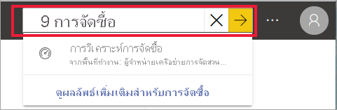
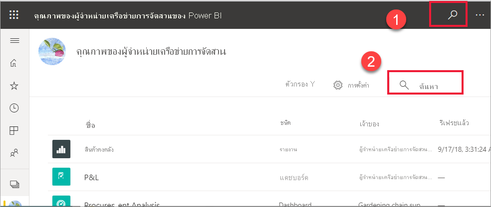
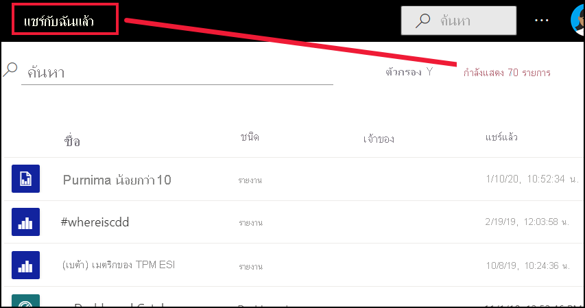
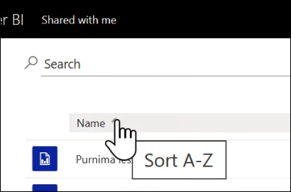
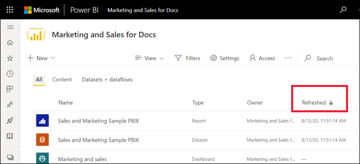

# การนำทางสำหรับผู้ใช้ธุรกิจ Power BI: การค้นหาส่วนกลางNavigation for Power BI business users: global search

[!INCLUDE[consumer-appliesto-yyny](../includes/consumer-appliesto-yyny.md)]

เมื่อคุณเพิ่งเริ่มใช้บริการ Power BI คุณจะมีเนื้อหาเพียงไม่กี่ชิ้น (แดชบอร์ด รายงาน แอป)When you're new to the Power BI service, you'll have only a few pieces of content (dashboards, reports, apps). แต่ในขณะที่เพื่อนร่วมงานเริ่มแบ่งปันเนื้อหากับคุณ และคุณเริ่มดาวน์โหลดแอป คุณอาจจบลงด้วยรายการเนื้อหาที่ยาวBut as colleagues begin sharing content with you and you begin downloading apps, you may end up with long lists of content. นั่นคือเวลาที่คุณจะพบว่าการค้นหาและการเรียงลำดับเป็นประโยชน์อย่างยิ่งThat's when you'll find searching and sorting extremely helpful.

## กำลังค้นหาสำหรับเนื้อหาSearching for content
 การค้นหาพร้อมใช้งานจากเกือบทุกส่วนของบริการ Power BISearch is available from almost every part of the Power BI service. เพียงแค่มองหากล่องค้นหาหรือไอคอนค้นหาJust look for the search box or search icon ..

 ในเขตข้อมูลการค้นหา ให้พิมพ์ชื่อทั้งหมดหรือบางส่วนของแดชบอร์ด รายงาน สมุดงาน พื้นที่ทำงาน แอป หรือเจ้าของIn the Search field, type all or part of the name of a dashboard, report, workbook, workspace, app, or owner. Power BI ค้นหาเนื้อหาทั้งหมดของคุณPower BI searches all of your content. 

  

 ในพื้นที่บางส่วนของ Power BI เช่นพื้นที่ทำงาน คุณจะพบเขตข้อมูลการค้นหาที่แตกต่างกันสองช่องIn some areas of Power BI, such as workspaces, you'll find two different search fields. เขตข้อมูลการค้นหาในแถบเมนูจะค้นหาเนื้อหาของคุณทั้งหมดในขณะที่เขตข้อมูลการค้นหาบนพื้นที่ทำงานที่จะค้นหาเฉพาะพื้นที่ทำงานนั้นThe search field in the menu bar searches all of your content while the search field on the workspace canvas searches only that workspace.

  

## เรียงลำดับรายการเนื้อหาSorting content lists

หากคุณมีเนื้อหาเพียงเล็กน้อยเท่านั้น คุณอาจไม่จำเป็นต้องใช้การเรียงลำดับIf you only have a few pieces of content, sorting may not be necessary.  แต่เมื่อคุณมีรายการแดชบอร์ดและรายงานที่ยาวแล้ว การเรียงลำดับจะช่วยให้คุณค้นหาสิ่งที่คุณต้องการBut when you have long lists of dashboards and reports, sorting will help you find what you need. ตัวอย่างเช่น รายการเนื้อหาที่ **แชร์กับฉัน** นี้มี 70 รายการFor example, this **Shared with me** content list has 70 items. 

ตอนนี้รายการเนื้อหานี้เรียงตามตัวอักษรตามชื่อจาก Z ถึง A หากต้องการเปลี่ยนเกณฑ์การจัดเรียงให้เลือกลูกศรทางด้านขวาของ **ชื่อ (A-Z)**Right now, this content list is sorted alphabetical by name, from Z to A. To change the sort criteria, select the arrow to the right of **Name (A-Z)**.

นอกจากนี้ยังมีการเรียงลำดับในพื้นที่ทำงานSorting is also available in workspaces. ในตัวอย่างนี้ เนื้อหาจะเรียงลำดับตามวันที่  **รีเฟรช**In this example, the content is sorted by **Refreshed** date. ในการกำหนดเกณฑ์การเรียงลำดับสำหรับพื้นที่ทำงานให้เลือกส่วนหัวข้อคอลัมน์แล้วเลือกอีกครั้งเพื่อเปลี่ยนทิศทางการเรียงลำดับTo set sorting criteria for workspaces, select column headers and select again to change sorting direction. 

ไม่ใช่ทุกคอลัมน์ที่จะสามารถจัดเรียงได้Not all columns can be sorted. วางเมาส์เหนือส่วนหัวของคอลัมน์เพื่อค้นหาส่วนหัวใดที่สามารถเรียงลำดับได้Hover over the column headings to discover which can be sorted.

## การกรองรายการเนื้อหาFiltering content lists
อีกวิธีหนึ่งในการค้นหาเนื้อหาอย่างรวดเร็วคือการใช้รายการเนื้อหา **ตัวกรอง**Another way to locate content quickly is by using the content list **Filters**. แสดงตัวกรองโดยเลือก **ตัวกรอง** จากมุมขวาบนDisplay the filters by selecting **Filters** from the upper right corner. ตัวกรองที่พร้อมใช้งานจะขึ้นอยู่กับตำแหน่งของคุณในบริการ Power BIThe filters available will depend on your location in the Power BI service.  ตัวอย่างด้านล่างนี้มาจากรายการเนื้อหา **ล่าสุด**The example below is from a **Recent** content list.  ช่วยให้คุณสามารถกรองรายการตามประเภทเนื้อหาIt allows you to filter the list by content type.  ในรายการเนื้อหาที่ **แชร์กับฉัน** **ตัวกรอง** ที่พร้อมใช้งาน ได้แก่ เจ้าของและประเภทเนื้อหาOn a **Shared with me** content list, the **Filters** available include Owner as well as content type.

## ขั้นตอนถัดไปNext steps
[เรียงลำดับวิชวลในรายงานSort visuals in reports](end-user-change-sort.md)

[การเรียงลำดับข้อมูลในวิชวลSorting data in visuals](end-user-change-sort.md)

มีคำถามเพิ่มเติมหรือไม่More questions? [ลองไปที่ชุมชน Power BITry the Power BI Community](https://community.powerbi.com/)
