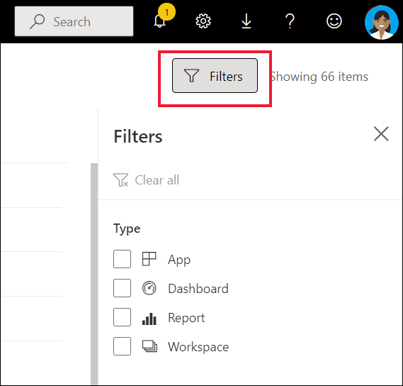

# การนำทางสำหรับผู้ใช้ธุรกิจ Power BI: การค้นหาส่วนกลาง

[!INCLUDE[consumer-appliesto-yyny](../includes/consumer-appliesto-yyny.md)]

เมื่อคุณเพิ่งเริ่มใช้บริการ Power BI คุณจะมีเนื้อหาเพียงไม่กี่ชิ้น (แดชบอร์ด รายงาน แอป) แต่ในขณะที่เพื่อนร่วมงานเริ่มแบ่งปันเนื้อหากับคุณ และคุณเริ่มดาวน์โหลดแอป คุณอาจจบลงด้วยรายการเนื้อหาที่ยาว นั่นคือเวลาที่คุณจะพบว่าการค้นหาและการเรียงลำดับเป็นประโยชน์อย่างยิ่ง

## กำลังค้นหาสำหรับเนื้อหา
 การค้นหาพร้อมใช้งานจากเกือบทุกส่วนของบริการ Power BI เพียงแค่มองหากล่องค้นหาหรือไอคอนค้นหา .

 ในเขตข้อมูลการค้นหา ให้พิมพ์ชื่อทั้งหมดหรือบางส่วนของแดชบอร์ด รายงาน สมุดงาน พื้นที่ทำงาน แอป หรือเจ้าของ Power BI ค้นหาเนื้อหาทั้งหมดของคุณ 

  

 ในพื้นที่บางส่วนของ Power BI เช่นพื้นที่ทำงาน คุณจะพบเขตข้อมูลการค้นหาที่แตกต่างกันสองช่อง เขตข้อมูลการค้นหาในแถบเมนูจะค้นหาเนื้อหาของคุณทั้งหมดในขณะที่เขตข้อมูลการค้นหาบนพื้นที่ทำงานที่จะค้นหาเฉพาะพื้นที่ทำงานนั้น

  

## เรียงลำดับรายการเนื้อหา

หากคุณมีเนื้อหาเพียงเล็กน้อยเท่านั้น คุณอาจไม่จำเป็นต้องใช้การเรียงลำดับ  แต่เมื่อคุณมีรายการแดชบอร์ดและรายงานที่ยาวแล้ว การเรียงลำดับจะช่วยให้คุณค้นหาสิ่งที่คุณต้องการ ตัวอย่างเช่น รายการเนื้อหาที่ **แชร์กับฉัน** นี้มี 70 รายการ 

ตอนนี้รายการเนื้อหานี้เรียงตามตัวอักษรตามชื่อจาก Z ถึง A หากต้องการเปลี่ยนเกณฑ์การจัดเรียงให้เลือกลูกศรทางด้านขวาของ **ชื่อ (A-Z)**

นอกจากนี้ยังมีการเรียงลำดับในพื้นที่ทำงาน ในตัวอย่างนี้ เนื้อหาจะเรียงลำดับตามวันที่  **รีเฟรช** ในการกำหนดเกณฑ์การเรียงลำดับสำหรับพื้นที่ทำงานให้เลือกส่วนหัวข้อคอลัมน์แล้วเลือกอีกครั้งเพื่อเปลี่ยนทิศทางการเรียงลำดับ 

ไม่ใช่ทุกคอลัมน์ที่จะสามารถจัดเรียงได้ วางเมาส์เหนือส่วนหัวของคอลัมน์เพื่อค้นหาส่วนหัวใดที่สามารถเรียงลำดับได้

## การกรองรายการเนื้อหา
อีกวิธีหนึ่งในการค้นหาเนื้อหาอย่างรวดเร็วคือการใช้รายการเนื้อหา **ตัวกรอง** แสดงตัวกรองโดยเลือก **ตัวกรอง** จากมุมขวาบน ตัวกรองที่พร้อมใช้งานจะขึ้นอยู่กับตำแหน่งของคุณในบริการ Power BI  ตัวอย่างด้านล่างนี้มาจากรายการเนื้อหา **ล่าสุด**  ช่วยให้คุณสามารถกรองรายการตามประเภทเนื้อหา  ในรายการเนื้อหาที่ **แชร์กับฉัน** **ตัวกรอง** ที่พร้อมใช้งาน ได้แก่ เจ้าของและประเภทเนื้อหา

## ขั้นตอนถัดไป
[เรียงลำดับวิชวลในรายงาน](end-user-change-sort.md)

[การเรียงลำดับข้อมูลในวิชวล](end-user-change-sort.md)

มีคำถามเพิ่มเติมหรือไม่ [ลองไปที่ชุมชน Power BI](https://community.powerbi.com/)
