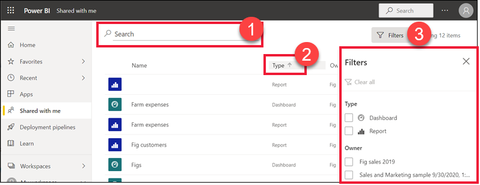

# แสดงแดชบอร์ดและรายงานที่ได้แชร์กับฉัน

[!INCLUDE[consumer-appliesto-yyny](../includes/consumer-appliesto-yyny.md)]

เมื่อเพื่อนร่วมงานแชร์แดชบอร์ดหรือรายงานให้กับคุณ จะปรากฏอยู่ใคอนเทนเนอร์ **แชร์กับฉัน** ของคุณ เมื่อเพื่อนร่วมงานแชร์แอปกับคุณแอปจะปรากฏในคอนเทนเนอร์ **แอป** ของคุณและรายงานและแดชบอร์ดของแอปจะปรากฏในคอนเทนเนอร์ **แชร์กับฉัน**   

ดู Amanda ่อธิบายรายการเนื้อหา **แชร์กับฉัน** และแสดงให้เห็นวิธีการนำทางและกรองรายการ แล้ว ทำตามคำแนะนำทีละขั้นตอนด้านล่างวิดีโอเพื่อลองทำด้วยตนเอง เพื่อที่คุณจะสามารถดูแดชบอร์ดที่แชร์กับคุณ คุณจำเป็นต้องมีสิทธิ์การใช้งาน Power BI Pro อ่าน[Power BI Premium คืออะไร](../admin/service-premium-what-is.md)สำหรับรายละเอียด
    

> [!NOTE]
> วิดีโอนี้ใช้บริการ Power BI รุ่นเก่า
    

<iframe width="560" height="315" src="https://www.youtube.com/embed/G26dr2PsEpk" frameborder="0" allowfullscreen></iframe>

## โต้ตอบกับเนื้อหาแชร์

คุณมีตัวเลือกในการโต้ตอบกับแดชบอร์ดและรายงานแชร์ที่แชร์ โดยขึ้นอยู่กับสิทธิ์ที่ *ผู้ออกแบบ* กำหนดให้กับคุณ ซึ่งรวมถึงการทำสำเนาของแดชบอร์ด การสมัครใช้งาน การเปิดรายงาน [ในมุมมองการอ่าน](end-user-reading-view.md) และแชร์อีกครั้งกับเพื่อนร่วมงานคนอื่น ๆ เลือกแดชบอร์ดหรือรายงานที่ต้องการเปิด

## ค้นหาและจัดเรียงแดชบอร์ดและรายงานที่แชร์
หากรายการเนื้อหา **แชร์กับฉัน** ของคุณยาวเกินไป คุณมีหลายตัวเลือกในการค้นหาสิ่งที่คุณต้องการ ใช้ช่องค้นหา (1) จัดเรียงตามคอลัมน์ใดคอลัมน์หนึ่ง (2) หรือใช้บานหน้าต่างตัวกรอง ในการพื้นที่ตัวกรองให้เลือก **ตัวกรอง** จากมุมบนขวา    

