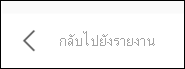

# แสดงข้อมูลพร้อมรายงาน Power BIShow data with Power BI reports

[!INCLUDE[consumer-appliesto-yyny](../includes/consumer-appliesto-yyny.md)]

ระบบจะสร้างการแสดงผลด้วยภาพของ Power BI ขึ้นโดยใช้ข้อมูลจากชุดข้อมูลเบื้องต้นA Power BI visual is constructed using data from underlying datasets. หากคุณสนใจที่เห็นเบื้องหลัง Power BI ให้คุณสามารถ *แสดง* ข้อมูลที่กำลังกำลังมีการใช้เพื่อสร้างภาพดังกล่าวในรายงานIf you're interested in seeing behind-the-scenes, the Power BI service lets you *display* the data that is being used to create a visual in a report. เมื่อคุณเลือก **แสดงเป็นตาราง** Power BI จะแสดงข้อมูลด้านล่าง (หรือถัดจาก) วิชวลWhen you select **Show as a table**, Power BI displays the data below (or next to) the visual.

จากแดชบอร์ด สามารถดูข้อมูลที่เกี่ยวข้องได้โดยใช้ [ส่งออกเป็น Excel](end-user-export.md)On a dashboard, to see the underlying data, use [Export to Excel](end-user-export.md)

## แสดงข้อมูลที่กำลังใช้เพื่อจัดทำส่วนการแสดงผลรายงานShow the data being used to create a report visual
1. ในบริการของ Power BI ให้[เปิดรายงาน](end-user-report-open.md)แล้วเลือกการแสดงผลด้วยภาพIn the Power BI service, [open a report](end-user-report-open.md) and select a visual.  
2. เมื่อต้องการแสดงข้อมูลเบื้องหลังวิชวล เลือก **ตัวเลือกเพิ่มเติม** (...) และเลือก **แสดงเป็นวิชวล**To display the data behind the visual, select **More options** (...) and choose **Show as a table**.
   
   
3. ตามค่าเริ่มต้น ข้อมูลจะแสดงที่ด้านล่างภาพBy default, the data displays below the visual.
   
   

4. หากต้องการเปลี่ยนการวางแนว โปรดเลือกเค้าโครงแนวตั้งTo change the orientation, select vertical layout  บริเวณมุมบนขวาของการแสดงผลภาพfrom the top-right corner of the visualization.
   
   

หากต้องการกลับไปที่รายงาน ให้เลือก **กลับไปที่รายงาน** จากมุมบนซ้ายTo return to the report, select **Back to report** from the upper left corner. 

   

## ขั้นตอนถัดไปNext steps
[การแสดงผลด้วยภาพในรายงาน Power BI](../visuals/power-bi-report-visualizations.md)  [Visuals in Power BI reports](../visuals/power-bi-report-visualizations.md)    
[รายงาน Power BIPower BI reports](end-user-reports.md)    
