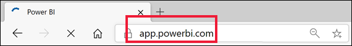
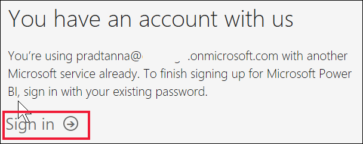
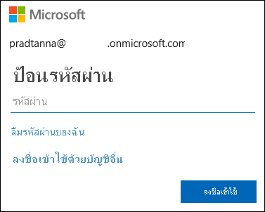
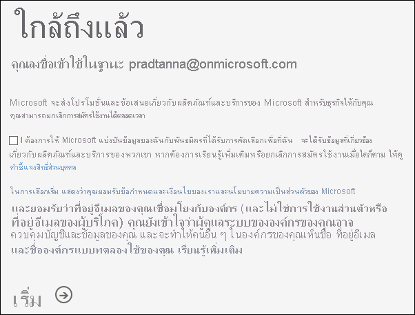
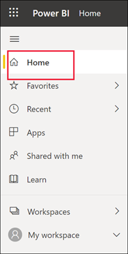
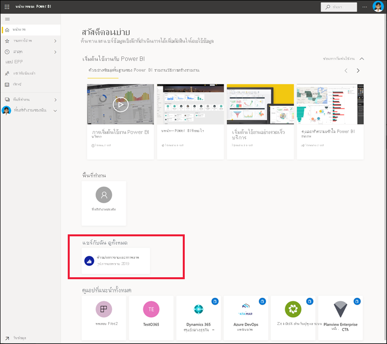
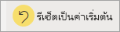
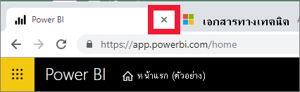
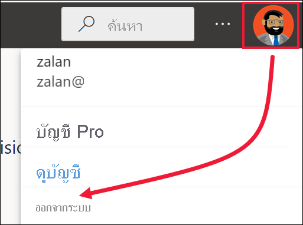

# ลงชื่อเข้าใช้บริการ Power BISign in to Power BI service

[!INCLUDE[consumer-appliesto-yynn](../includes/consumer-appliesto-yynn.md)]

## บัญชี Power BIPower BI accounts
ก่อนที่คุณจะสามารถลงชื่อเข้าใช้ Power BI คุณต้องมีบัญชีBefore you can sign in to Power BI, you'll need an account. มีสองวิธีในการรับบัญชี Power BIThere are two ways to get a Power BI account. วิธีแรกคือเมื่อองค์กรของคุณซื้อสิทธิ์การใช้งาน Power BI สำหรับพนักงานขององค์กรThe first is when your organization purchases Power BI licenses for its employees. และวิธีที่สองคือเมื่อ [บุคคลลงทะเบียนทดลองใช้ฟรีหรือมีสิทธิ์การใช้งานส่วนบุคคล](../fundamentals/service-self-service-signup-for-power-bi.md)And the second is when [individuals sign up for free trials or personal licenses](../fundamentals/service-self-service-signup-for-power-bi.md). บทความนี้ครอบคลุมถึงสถานการณ์แรกThis article covers the first scenario.

## ลงชื่อเข้าใช้เป็นครั้งแรกSign in for the first time

### ขั้นตอนที่ 1: เปิดบริการ Power BIStep 1: open the Power BI service
บริการ Power BI ทำงานในเบราว์เซอร์The Power BI service runs in a browser. 

- ถ้าคุณได้รับอีเมลจากเพื่อนร่วมงานที่มีลิงก์ไปยังแดชบอร์ดหรือรายงาน ให้เลือกลิงก์เพื่อ **เปิดรายงานนี้** หรือ **เปิดแดชบอร์ดนี้**If you've received an email from a colleague, with a link to a dashboard or report, select the link to **Open this report** or **Open this dashboard**.

        

- หรือ เปิดเบราว์เซอร์ที่คุณชื่นชอบและพิมพ์ **app.powerbi.com**Otherwise, open your favorite browser and type **app.powerbi.com**.

        

### ขั้นตอนที่ 2: พิมพ์ที่อยู่อีเมลของคุณStep 2: type your email address
ในครั้งแรกที่คุณลงชื่อเข้าใช้ Microsoft จะตรวจสอบเพื่อดูว่าคุณมีบัญชี Microsoft 365 อยู่แล้วหรือไม่The first time you sign in, Microsoft checks to see if you already have a Microsoft 365 account. ในตัวอย่างด้านล่าง Pradtanna มีสิทธิ์การใช้งานสำหรับบริการอื่นๆ ของ Microsoft อยู่แล้วIn the example below, Pradtanna already has a license for other Microsoft services. 

กรอกรหัสผ่านของคุณEnter your password. นี่คือรหัสผ่านบัญชี Microsoft 365 ของคุณThis is your Microsoft 365 account password. โดยเป็นอีเมลและรหัสผ่านเดียวกันกับที่คุณใช้สำหรับผลิตภัณฑ์อื่นๆ ของ Microsoft เช่น Outlook และ OfficeIt is the same email and password that you use for other Microsoft products, such as Outlook and Office.  ทั้งนี้ขึ้นอยู่กับวิธีการตั้งค่าบัญชีของคุณ คุณอาจได้รับพร้อมท์แจ้งให้ป้อนรหัสที่ส่งไปยังอีเมลหรืออุปกรณ์เคลื่อนที่ของคุณDepending on how your account is set up, you may also be prompted to enter a code sent to your email or mobile device.   

ในบางครั้งผู้ดูแลระบบส่วนกลางของคุณจะมอบหมายสิทธิ์การใช้งานและส่งอีเมลพร้อมกับข้อมูลนี้ให้คุณSometimes, your global administrator will assign you a license and send you an email with this information. ค้นหาในกล่องขาเข้าของคุณสำหรับอีเมลต้อนรับและทำตามคำแนะนำเพื่อลงชื่อเข้าใช้เป็นครั้งแรกLook in your Inbox for a welcome email and follow the instructions to sign in for the first time. ใช้บัญชีอีเมลเดียวกันนี้สำหรับการลงชื่อเข้าใช้ของคุณUse this same email account for your sign-in. 
 
### ขั้นตอนที่ 3: ทบทวนข้อตกลงและเงื่อนไขStep 3: Review the terms and conditions
ทบทวนข้อตกลงและเงื่อนไข และหสกคุณยอมรับ ให้เลือกกล่องกาเครื่องหมายและเลือก **เริ่มต้น**Review the terms and conditions, and if you agree, select the checkbox and choose **Start**.

### ขั้นตอนที่ 4: ตรวจสอบหน้า landing page ของคุณStep 4: review your Home landing page
เมื่อคุณเข้ามาเป็นครั้งแรก Power BI จะเปิด **หน้าแรก** ของ landing page ขึ้นOn your first visit, Power BI opens your **Home** landing page. ถ้า **หน้าแรก**  ไม่เปิดขึ้นให้เลือกจากบานหน้าต่างนำทางIf **Home** doesn't open, select it from the nav pane. 

คุณจะเห็นเนื้อหาทั้งหมดที่คุณได้รับอนุญาตให้ใช้ในหน้าแรกOn Home, you'll see all the content that you have permission to use. สำหรับตอนแรก อาจมีเนื้อหาไม่มากนัก แต่ไม่ต้องกังวล เพราะหน้าโฮมของคุณจะเปลี่ยนแปลงไปเมื่อคุณเริ่มใช้ Power BI กับเพื่อนร่วมงานของคุณAt first, there may not be much content, but don't worry, that will change as you start to use Power BI with your colleagues. จดจำรายงานที่เพื่อนร่วมงานของคุณแชร์กับคุณทางอีเมลหรือไม่Remember that report that your colleague shared with you via email? รายงานนั้นจะอยู่บนหน้าแรกของ landing page ของคุณภายใต้หัวเรื่อง **แชร์กับฉัน**It's on your Home landing page under the heading **Shared with me**.

หากคุณไม่ต้องการให้ Power BI เปิดหน้าแรกของคุณ คุณสามารถ [ตั้งค่า **ฟีเจอร** ์แดชบอร์ดหรือรายงานที่สนใจ](end-user-featured.md)เพื่อเปิดทดแทนได้If you don't want Power BI to open to Home, you can [set a **Featured** dashboard or report](end-user-featured.md) to open instead. 

## โต้ตอบกับเนื้อหาอย่างปลอดภัยSafely interact with content
ในฐานะ **_ผู้ใช้ทางธุรกิจ_ *_, คนอื่นๆ จะแบ่งปันเนื้อหากับคุณและคุณจะโต้ตอบกับเนื้อหานั้นเพื่อสำรวจข้อมูลและตัดสินใจทางธุรกิจ  ในขณะที่คุณกรอง แบ่ง ทำการสมัครเป็นสมาชิก ส่งออก และปรับขนาด ไม่ต้องกังวลไป งานของคุณจะไม่ส่งผลกระทบต่อชุดข้อมูลพื้นฐานหรือเนื้อหาที่มีการแชร์ดั้งเดิม (แดชบอร์ดและรายงาน) Power BI เป็นพื้นที่ปลอดภัยสำหรับคุณในการสำรวจและทดสอบ ซึ่งไม่ได้หมายความว่า คุณไม่สามารถบันทึกการเปลี่ยนแปลงของคุณ - คุณสามารถ แต่การเปลี่ยนแปลงเหล่านั้นมีผลเฉพาะกับมุมมองของเนื้อหา_* ของคุณ** เท่านั้นAs a **_business user_*_, others will share content with you and you'll interact with that content to explore the data and make business decisions.  As you filter, slice, subscribe, export, and resize, don't worry -- your work is not impacting the underlying dataset or the original shared content (dashboards and reports). Power BI is a safe space for you to explore and experiment. That doesn't mean you can't save your changes - you can. But those changes only affect _\* your*\* view of the content. และการย้อนกลับไปยังมุมมองเริ่มต้นดั้งเดิมนั้นง่าย เพียงแค่การคลิกปุ่มAnd reverting to the original default view is as easy as clicking a button.

## ลงชื่อออกจากบริการ Power BISign out of the Power BI service
เมื่อคุณปิดหรือลงชื่อออกจากบริการ Power BI การเปลี่ยนแปลงของคุณจะได้รับการบันทึกเพื่อให้คุณสามารถดำเนินการต่อจากจุดที่คุณค้างไว้ได้When you close or sign out of the Power BI service, your changes are saved so you can pick up right where you left off.

หากต้องการปิด Power BI ให้ปิดแท็บเบราว์เซอร์ที่คุณใช้งานอยู่To close Power BI, close the browser tab where you are working. 

 

หากคุณแชร์คอมพิวเตอร์ เราขอแนะนำให้ออกจากระบบทุกครั้งที่คุณปิด Power BIIf you share a computer, we recommend signing out each time you close Power BI.  ในการออกจากระบบ ให้เลือกรูปโปรไฟล์ของคุณแล้วเลือก **ออกจากระบบ** จากมุมขวาบนTo sign out, from the upper right corner, select your Profile picture, and choose **Sign out**.  

 

## การแก้ไขปัญหาและข้อควรพิจารณาTroubleshooting and considerations
- หากคุณลงทะเบียน Power BI เป็นรายบุคคล ให้ลงชื่อเข้าใช้ด้วยที่อยู่อีเมลที่คุณใช้ในกาลงทะเบียนIf you've signed up for Power BI as an individual, sign in with the email address you used to sign up.

- บางคนใช้ Power BI มากกว่าหนึ่งบัญชีSome people use Power BI with more than one account. หากเป็นเช่นนี้ เมื่อลงชื่อเข้าใช้คุณจะได้รับแจ้งให้เลือกบัญชีจากรายการIf so, when signing in, you will be prompted to select an account from a list. 

## ขั้นตอนถัดไปNext steps
[ดูแอป Power BIView a Power BI app](end-user-app-view.md)
