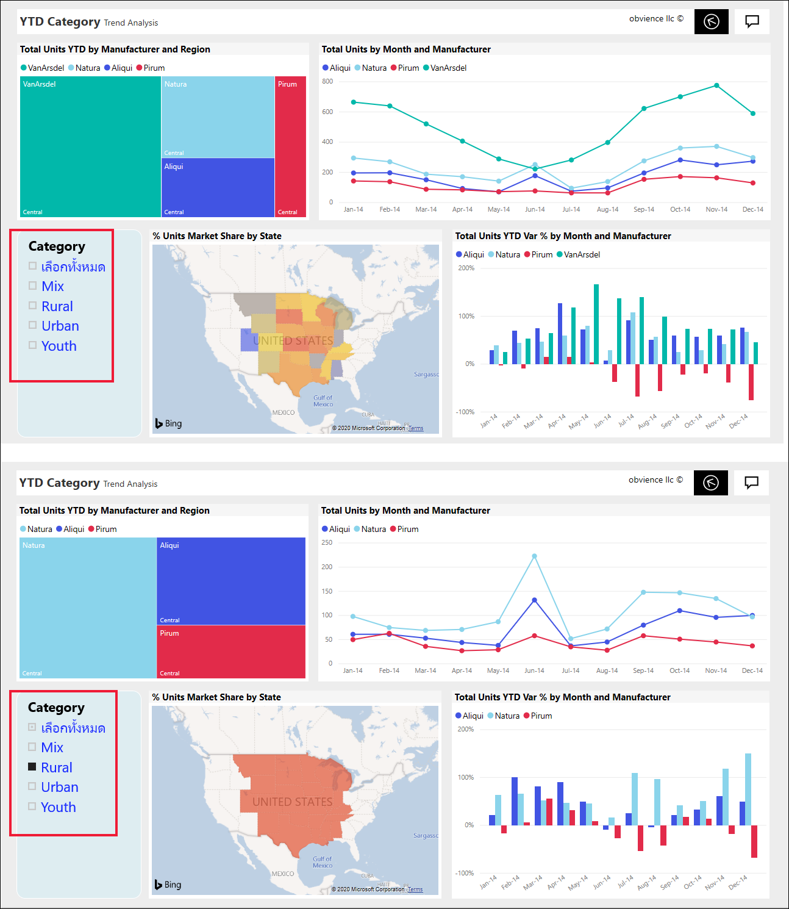
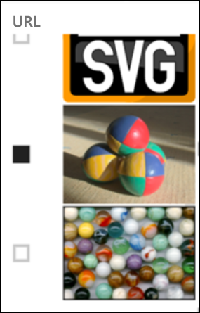
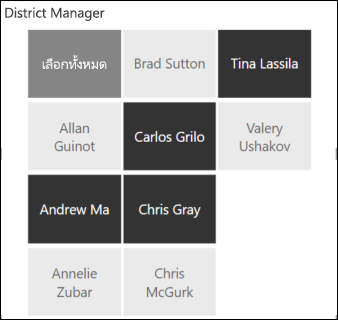
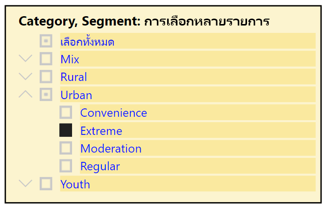
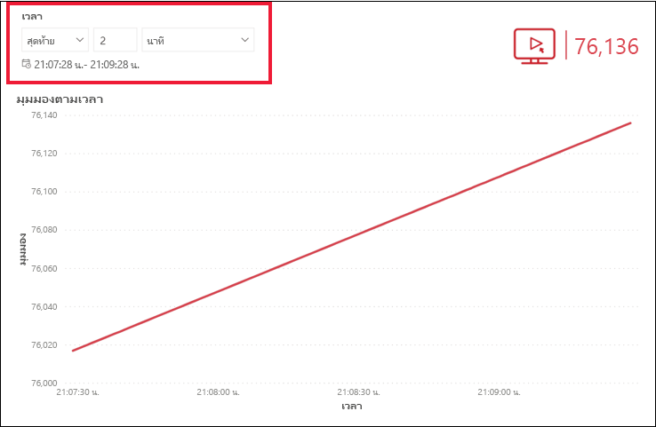
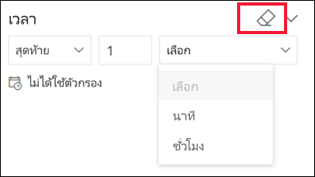

# ตัวแบ่งส่วนข้อมูลในบริการ Power BISlicers in the Power BI service

[!INCLUDE[consumer-appliesto-ynnn](../includes/consumer-appliesto-yynn.md)]

ตัวแบ่งส่วนข้อมูลเป็นภาพชนิดหนึ่งที่กรองวิชวลอื่นๆ บนหน้ารายงานA slicer is a type of visual that filters the other visuals on a report page. เมื่อใช้รายงาน Power BI คุณจะพบตัวแบ่งส่วนข้อมูลหลายชนิดWhen using Power BI reports, you'll discover many types of slicers. รูปภาพด้านบน แสดงตัวแบ่งส่วนข้อมูลเดียวกัน แต่เป็นรายการเลือกที่แตกต่างกันThe image, above, shows the same slicer but with different selections. ให้สังเกตลักษณะการกรองวิชวลอื่น ๆ บนหน้าของรายการที่เลือกแต่ละรายการNotice how each selection filters the other visuals on the page.  

## วิธีการใช้ตัวแบ่งส่วนข้อมูลHow to use slicers
ขณะที่สร้างรายงาน *นักออกแบบ* จะเพิ่มตัวแบ่งส่วนข้อมูลเพื่อช่วยบอกเล่าเรื่องราว และมอบเครื่องมือในการสำรวจข้อมูลของคุณให้แก่คุณWhen creating reports, *designers* add slicers to help tell a story and to give you tools to explore your data.

### ตัวแบ่งส่วนช่วงตัวเลขNumeric range slicer
 ตัวแบ่งส่วนข้อมูลช่วงตัวเลขจะช่วยคุณสำรวจข้อมูลเชิงปริมาณ เช่น ยอดขายทั้งหมดตาม: ภูมิศาสตร์, หน่วยในสต็อก และวันที่สั่งซื้อThe numeric range slicer helps you explore quantitative data such as total sales by: geography, units in stock, and order date. ใช้จุดจับเพื่อเลือกช่วงUse the handles to select a range. 

### ตัวแบ่งส่วนข้อมูลของช่องทำเครื่องหมายแนวตั้งพื้นฐานBasic vertical checkbox slicer

ในตัวแบ่งส่วนข้อมูลของช่องทำเครื่องหมายพื้นฐาน ให้ทำเครื่องหมายที่กล่องช่องทำเครื่องหมายอย่างน้อยหนึ่งกล่อง เพื่อดูผลกระทบเกี่ยวกับวิชวลอื่นๆ บนหน้าIn a basic checkbox slicer, select one or more checkboxes to see the impact on the other visuals on the page. เมื่อต้องการเลือกมากกว่าหนึ่งกล่อง ให้ใช้ CTRL-selectTo select more than one, use CTRL-select. ในบางครั้ง *นักออกแบบ* รายงานจะตั้งค่าตัวแบงส่วนข้อมูลเพื่ออนุญาตให้เฉพาะคุณเลือกหนึ่งค่าต่อครั้งSometimes, the report *designer* will set the slicer to only allow you to select one value at a time. 

### ตัวแบ่งส่วนรูปภาพและรูปทรงImage and shape slicers
เมื่อตัวเลือกตัวแบ่งส่วนข้อมูลเป็นรูปภาพหรือรูปทรง ทำให้รายการที่คุณเลือกคล้ายคลึงกับการใช้ช่องทำเครื่องหมายWhen the slicer options are images or shapes, making your selections is similar to using checkboxes. คุณสามารถเลือกรูปภาพหรือรูปทรงอย่างน้อยหนึ่งภาพที่จะปรับใช้ตัวแบ่งส่วนข้อมูลกับวิชวลอื่นๆ ในหน้าดังกล่าวYou can choose one or more image or shape to apply the slicer to the other visuals on the page. 

    

    

### ตัวแบ่งส่วนข้อมูลลำดับชั้นHierarchy slicer

ในตัวแบ่งส่วนข้อมูลที่มีลำดับชั้น ให้ใช้เครื่องหมายบั้งเพื่อขยายและยุบลำดับชั้นIn a slicer with a hierarchy, use the chevrons to expand and collapse the hierarchy. ส่วนหัวจะอัปเดตเพื่อแสดงรายการที่คุณเลือกThe header updates to show your selections.

### ตัวแบ่งส่วนเวลาแบบสัมพัทธ์Relative time slicer
ด้วยสถานการณ์การรีเฟรชอย่างรวดเร็วที่เกิดขึ้นใหม่ ความสามารถในการกรองไปยังหน้าต่างที่มีขนาดเล็กกว่าจะมีประโยชน์มากWith emerging fast refresh scenarios, the ability to filter to a smaller window of time can be very useful.
การใช้ตัวแบ่งเวลาแบบสัมพัทธ์จะทำให้คุณสามารถใช้ตัวกรองตามเวลากับข้อมูลวันที่หรือเวลาในรายงานของคุณUsing the relative time slicer, you can apply time-based filters to any date or time data in your report. ตัวอย่างเช่น คุณสามารถใช้ตัวแบ่งส่วนเวลาแบบสัมพัทธ์ เพื่อแสดงเฉพาะการดูวิดีโอภายใน 2 วัน ชั่วโมง หรือนาทีที่ผ่านมาFor example, you can use the relative time slicer to show only video views within the last 2 days, hours, or even minutes. 

## ปิดใช้งานตัวแบ่งส่วนข้อมูลDeactivate a slicer
เมื่อต้องการปิดใช้งานตัวแบ่งส่วนข้อมูล ให้เลือกไอคอนยางลบTo deactivate a slicer, select the eraser icon.

## ขั้นตอนถัดไปNext steps
สำหรับข้อมูลเพิ่มเติม ให้ดูบทความต่อไปนี้:For more information, see the following articles:

[ชนิดการแสดงภาพใน Power BIVisualization types in Power BI](end-user-visualizations.md)

