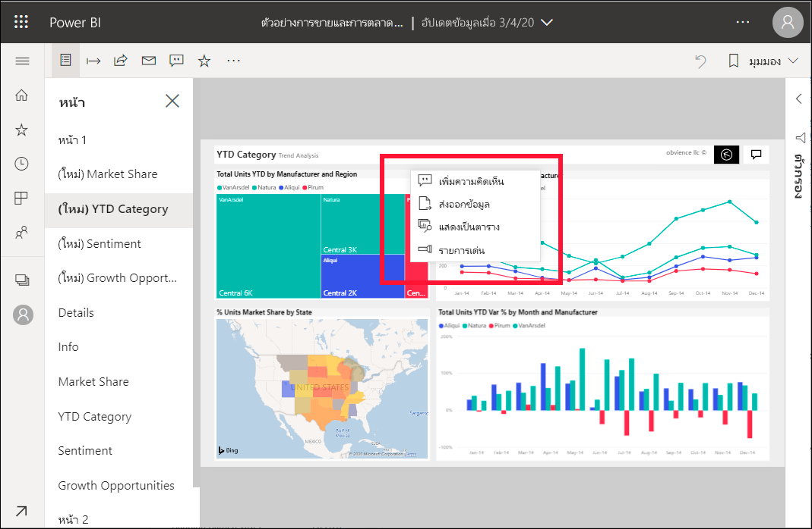

# เพิ่มการแสดงผลด้วยภาพไปยังรายงาน Power BIAdd spotlights to Power BI reports

[!INCLUDE[consumer-appliesto-yyny](../includes/consumer-appliesto-yyny.md)]

ด้วยสปอตไลท์ คุณสามารถดึงดูดความสนใจไปยังการแสดงผลด้วยภาพที่เฉพาะเจาะจงบนหน้ารายงานได้With spotlight, you can draw attention to a specific visual on a report page.  ถ้าเลือกโหมดสปอตไลต์ เมื่อคุณเพิ่มบุ๊กมาร์ก โหมดดังกล่าวจะถูกเก็บไว้ในบุ๊กมาร์กIf the spotlight mode is selected when you add a bookmark, that mode is retained in the bookmark.

## การใช้สปอตไลต์Add a spotlight

1. [เปิดรายงานในt](end-user-report-open.md) Power BI[Open a report](end-user-report-open.md) in the Power BI service.

2. ตัดสินใจว่าการแสดงผลด้วยภาพใดที่คุณต้องการไฮไลท์บนหน้ารายงานDecide which visual you'd like to highlight on the report page. เลือกเมนูดรอปดาวน์ **การดำเนินการเพิ่มเติม (...)**Select the **More actions (...)** dropdown.  

    

3. เลือกตัวเลือกสำหรับ **สปอตไลท์**Choose the option for **Spotlight**. การแสดงผลด้วยภาพที่เลือกไว้จะถูกเน้นซึ่งทำให้ภาพอื่นๆ ทั้งหมดบนหน้าจะเลือนหายไปใกล้กับความโปร่งใสThe selected visual is highlighted, which causes all other visuals on the page to fade to near transparency. 

    

## ขั้นตอนถัดไปNext steps

* [แสดงไทล์แดชบอร์ดหรือวิชวลรายงานในโหมดโฟกัสDisplay a dashboard tile or report visual in focus mode](end-user-focus.md)

