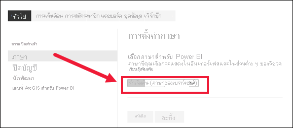
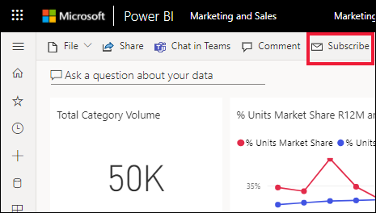
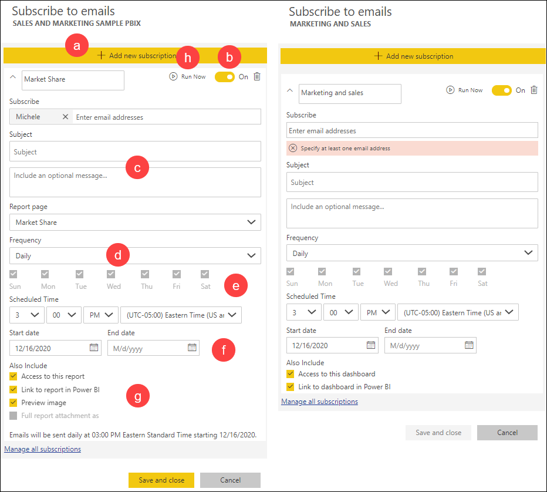
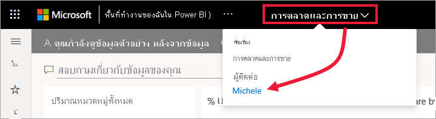
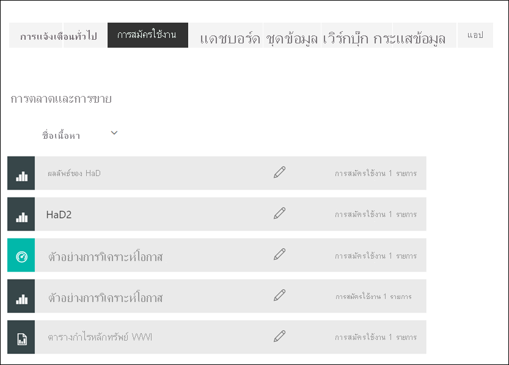

# สมัครสมาชิกรายงานหรือแดชบอร์ดในบริการของ Power BISubscribe to a report or dashboard in the Power BI service 

[!INCLUDE[consumer-appliesto-ynny](../includes/consumer-appliesto-ynny.md)]

ไม่เคยที่จะเท่าทันแดชบอร์ดและรายงานที่สำคัญที่สุดของคุณอย่างนี้มาก่อนIt's never been easier to stay up-to-date on your most important dashboards and reports. สมัครใช้งานหน้ารายงานและแดชบอร์ดที่สำคัญที่สุดคุณ และ Power BI จะส่งอีเมสแนปช็อตถึงคุณSubscribe to report pages and dashboards that matter most to you, and Power BI will email a snapshot to your inbox. คุณบอก Power BI ความถี่ที่คุณต้องการรับอีเมล: รายวัน รายสัปดาห์ หรือเมื่อรีเฟรชข้อมูลYou tell Power BI how often you want to receive the emails: daily, weekly, or when the data refresh. คุณสามารถกำหนดเวลาเฉพาะสำหรับ Power BI ในการส่งอีเมล หรือเรียกใช้งานตอนนี้You can even set a specific time for Power BI to send the emails or have it run now.  โดยรวมแล้ว คุณสามารถตั้งค่าการสมัครใช้งานถึง 24 รายการต่อรายงานหรือแดชบอร์ดได้In all, you can set up to 24 different subscriptions per report or dashboard.

อีเมลและสแนปช็อตจะใช้ภาษาที่ถูกตั้งในการตั้งค่า Power BI (ดู[ภาษาที่รองรับและประเทศ/ภูมิภาคสำหรับ Power BI](../fundamentals/supported-languages-countries-regions.md))The email and snapshot will use the language set in Power BI settings (see [Supported languages and countries/regions for Power BI](../fundamentals/supported-languages-countries-regions.md)). ถ้าไม่ได้กำหนดภาษา Power BI จะใช้ภาษาอังกฤษแสดงแทนIf no language is defined, Power BI uses English as a fallback. เมื่อต้องการดู หรือตั้งค่าการกำหนดลักษณะภาษาของคุณ ให้เลือกไอคอนรูปเฟือง  >  **ตั้งค่า > ทั่วไป > ภาษา**To see or set your language preference, select the cog icon  > **Settings > General > Language**. 

เมื่อคุณได้รับอีเมล ในอีเมลจะมีลิงก์เพื่อ "ไปยังรายงาน/แดชบอร์ด"When you receive the email, it includes a link to "go to report or dashboard". บนอุปกรณ์เคลื่อนท่ีที่่ติดตั้งแอป Power BI ให้เลือกลิงก์นี้เพื่อเปิดใช้แอป (โดยเป็นค่าตรงข้ามกับค่าเริ่มต้นการดำเนินการเปิดรายงานหรือแดชบอร์ดบนเว็บไซต์ Power BI)On mobile devices with Power BI apps installed, selecting this link launches the app (as opposed to the default action of opening the report or dashboard on the Power BI website).

## ข้อกำหนดRequirements
**การสร้าง** การสมัครใช้งานสำหรับตัวคุณเองจำเป็นต้องม [ีใบอนุญาต](end-user-license.md)ให้ใช้งาน *Power BI Pro* หรือ *Premium ต่อผู้ใช้***Creating** a subscription for yourself requires a *Power BI Pro* or *Premium per user* [license](end-user-license.md). คุณยังสามารถสร้างการสมัครใช้งานสำหรับตัวคุณเองหากรายงานหรือแดชบอร์ดอยู่ในพื้นที่ทำงาน Premium และคุณได้รับสิทธิ์เข้าถึงพื้นที่ทำงานนั้นYou can also create a subscription for yourself if the report or dashboard resides in a Premium workspace and you have been given access to that workspace. ถ้าคุณไม่สามารถสร้างการสมัครใช้งานได้ โปรดติดต่อผู้ดูแลระบบ Power BI หรือฝ่ายช่วยเหลือด้าน IT ของคุณIf you are unable to create a subscription, contact your Power BI administrator or IT help desk. 

**การสมัครสมาชิกผู้อื่น** จะใช้ได้เฉพาะกับแดชบอร์ดหรือเจ้าของรายงานที่มีใบอนุญาต *Power BI Pro* เท่านั้น**Subscribing others** is only available to the dashboard or report owners who have a *Power BI Pro* license. การสมัครใช้งานในรายงานที่มีการแบ่งหน้าจะแตกต่างกันเล็กน้อยSubscribing to paginated reports is a little different. ดูที่ [สมัครใช้งานในรายงานที่มีการแบ่งหน้าสำหรับตัวคุณเองและผู้อื่นในบริการของ Power BI](paginated-reports-subscriptions.md) สำหรับรายละเอียดSee [Subscribe yourself and others to a paginated report in the Power BI service](paginated-reports-subscriptions.md) for details. 

## สมัครใช้งานแดชบอร์ดหรือหน้ารายงานSubscribe to a dashboard or a report page
ไม่ว่าคุณกำลังสมัครใช้งานแดชบอร์ดหรือรายงาน กระบวนการจะคล้ายกันWhether you're subscribing to a dashboard or to a report, the process is similar. ปุ่มเดียวกันนี้ช่วยให้คุณสามารถบอกรับแดชบอร์ดหรือรายงานของบริการ Power BIThe same button allows you to subscribe to the Power BI service dashboards and reports.
 
..

1. เปิดแดชบอร์ดหรือรายงานOpen the dashboard or report.
2. จากแถบเมนูด้านบน ให้เลือก **สมัครใช้งาน** หรือเลือกไอคอนซองจดหมายFrom the top menu bar, select **Subscribe** or select the envelope icon .    
1. เลือก **เพิ่มการสมัครใช้งานใหม่**Select **Add new subscription**.
   

   
    
    หน้าจอทางด้านซ้ายจะปรากฏขึ้นเมื่อคุณอยู่ในหน้ารายงานและเลือก **สมัครใช้งาน**The screen on the left appears when you're on a report page and select **Subscribe**. หน้าจอด้านขวาจะปรากฏขึ้นเมื่อคุณอยู่บนแดชบอร์ดและเลือก **สมัครใช้งาน**The screen on the right appears when you're on a dashboard and select **Subscribe**. 
    
    a.a. ในการสมัครใช้งานมากกว่าหนึ่งหน้าในรายงาน: เลือก **เพิ่มการสมัครใช้งานใหม่** และเลือกหน้าอื่นจากเมนูแบบเลื่อนลงใกล้ด้านบนสุดหรือเลือกกล่องกาเครื่องหมาย **ไฟล์แนบรายงานฉบับเต็มเป็น** ใต้ **รวมด้วย**To subscribe to more than one page in a report: Either select **Add new subscription** and select a different page from the dropdown near the top, or select the **Full report attachment as** checkbox under **Also include**. 

    b.b. ใช้แถบเลื่อนสีเหลืองเพื่อเปิดการสมัครใช้งานและปิดUse the yellow slider to turn the subscription on and off.  ตั้งค่าแถบเลื่อนเป็น **ปิด** จะไม่ลบการสมัครใช้งานSetting the slider to **Off** doesn't delete the subscription. เมื่อต้องลบการสมัครใช้งาน เลือกไอคอนถังขยะTo delete the subscription, select the trashcan icon.

    c.c. เพิ่มที่อยู่อีเมลอย่างน้อยหนึ่งรายการและเพิ่มหัวเรื่องและรายละเอียดข้อความอีเมลAdd at least one email address and, optionally, add a subject and email message details. 

    d.d. เลือก **ความถี่** สำหรับการสมัครใช้งานSelect a **Frequency** for your subscription.  คุณอาจเลือกรายวัน รายสัปดาห์ หรือหลังจากรีเฟรชข้อมูล (รายวัน)You may choose Daily, Weekly, or After data refresh (Daily).  หากต้องการรับอีเมลการสมัครสมาชิกเฉพาะในบางวัน ให้เลือก **รายสัปดาห์** แล้วเลือกวันที่คุณต้องการรับTo receive the subscription email only on certain days, select **Weekly** and choose which days you'd like to receive it.  ตัวอย่างเช่น หากคุณต้องการรับอีเมลที่สมัครรับข้อมูลไว้ในวันทำงานเท่านั้น ให้เลือก **รายสัปดาห์** เป็นความถี่ของคุณ และยกเลิกการเลือกช่องสำหรับวันเสาร์และอาทิตย์For example, if you'd like to receive the subscription email only on workdays, select **Weekly** for your frequency and un-check the boxes for Sat and Sun. ถ้าคุณเลือก **รายเดือน** ให้ใส่วันของเดือนที่คุณต้องการรับอีเมลที่สมัครใช้งานIf you select **Monthly**, enter the day(s) of the month you wish to receive the subscription mail.   

    e.e. หากคุณเลือก รายวัน รายชั่วโมง รายเดือน หรือ รายสัปดาห์ คุณยังจะสามารถเลือกเวลาตามกำหนดการสำหรับการสมัครใช้งานได้If you choose Daily, Hourly, Monthly, or Weekly, you can also choose a Scheduled Time for the subscription. คุณสามารถเรียกใช้เป็นชั่วโมงหรือที่ 15, 30 หรือ 45 นาทีที่ผ่านมาYou can have it run on the hour, or at 15, 30, or 45 minutes past. เลือกเช้า (AM) หรือบ่าย/เย็น (PM)Select morning (AM) or afternoon/evening (PM). คุณยังสามารถระบุโซนเวลาได้อีกด้วยYou can also specify the time zone. หากคุณเลือก รายชั่วโมง ให้เลือก เวลาตามกำหนดการ ที่คุณต้องการให้การสมัครใช้งานเริ่มต้น จากนั้นระบบจะเรียกใช้ทุกชั่วโมงหลังจากนั้นIf you choose Hourly, select the Scheduled Time you want the subscription to start, and it will run every hour after that.  

    f.f. กำหนดเวลาวันที่เริ่มต้นและสิ้นสุดโดยป้อนวันที่ในเขตข้อมูลวันที่Schedule the start and end date by entering dates in the date fields. ตามค่าเริ่มต้น เวลาเริ่มต้นสำหรับการสมัครใช้งานของคุณจะเป็นวันที่คุณสร้างขึ้นและวันที่สิ้นสุดจะเป็นหนึ่งปีต่อมาBy default, the start time for your subscription will be the date you create it and the end date will be one year later. คุณสามารถเปลี่ยนเป็นวันใดก็ได้ในอนาคต (สูงสุด 9999 ปี) ได้ตลอดเวลาก่อนที่การสมัครใช้งานจะสิ้นสุดลงYou can change it to any date in the future (up to the year 9999) at any time before the subscription ends. เมื่อการสมัครใช้งานถึงวันที่สิ้นสุด การทำงานจะหยุดจนกว่าคุณจะเปิดใช้งานอีกครั้งWhen a subscription reaches an end date, it stops until you re-enable it.  คุณจะได้รับการแจ้งเตือนก่อนวันที่สิ้นสุดตามกำหนดเพื่อถามว่าคุณต้องการที่จะขยายเวลาออกไปไหมYou will receive notification(s) before the scheduled end date to ask if you'd like to extend it.     

    เช่นg. เลือกกล่องกาเครื่องหมายอย่างน้อยหนึ่งช่องSelect one or more of the checkboxes.
    - ให้สิทธิ์การใช้งานของผู้รับในการเปิดและดูรายงานหรือแดชบอร์ดGive recipients permission to open and view the report or dashboard.
    - เลือก **ไปที่รายงาน / แดชบอร์ด** เพื่อเพิ่มลิงก์ "ไปที่รายงาน" ในเนื้อหาของอีเมลSelect **Go to report/dashboard** to add a "Go to report" link to the body of the email.
    - เพิ่มภาพตัวอย่างขนาดย่อของหน้ารายงานลงในเนื้อหาของอีเมลAdd a thumbnail preview of the report page to the body of the email.
    - เพิ่มรายงานฉบับเต็มเป็นไฟล์แนบแทนที่จะเป็นเพียงหน้ารายงานเดียวแล้วเลือกเป็น PDF หรือ PowerPointAdd the full report as an attachment instead of only a single report page and select either PDF or PowerPoint. ขนาดของไฟล์แนบจำกัดไว้ที่ไม่เกิน 20 หน้าและน้อยกว่า 25 MBThe size of the attachment is limited to no more than 20 pages and less than 25 MB. เอกสารแนบจะเป็นไปตามป้ายกำกับสิทธิความเป็นส่วนตัวทั้งหมดสำหรับรายงานThe attachment respects all privacy labels for the report. 
    
    h.h. หากต้องการตรวจสอบการสมัครใช้งาน และทดสอบการใช้งาน ให้เลือก **เรียกใช้ทันที**To review your subscription and test it out, select **Run now**.  ซึ่งส่งอีเมลที่คุณทันทีThis sends the email to you right away. 

3. หากไม่มีปัญหา ให้เลือก **บันทึกและปิด** เมื่อต้องบันทึกการสมัครใช้งานIf everything looks good, select **Save and close** to save the subscription. คุณจะได้รับอีเมลและสแนปช็อตของแดชบอร์ดหรือรายงานตามกำหนดการที่คุณตั้งค่าไว้You will receive an email and snapshot of the dashboard or report on the schedule you set. การสมัครใช้งานทั้งหมดที่มีความถี่ในการตั้งค่าเป็น **หลังจากรีเฟรชข้อมูล** จะส่งอีเมลหลังจากรีเฟรชตามกำหนดครั้งแรกในวันนั้นเท่านั้นAll subscriptions that have the frequency set to **After data refresh** will only send an email after the first scheduled refresh on that day.
   
   
   
    คุณจะรีเฟรชหน้ารายงานได้แต่ไม่ใช่ชุดข้อมูลYou will be able to refresh the report page but not the dataset. เฉพาะเจ้าของชุดข้อมูลเท่านั้นที่สามารถรีเฟรชชุดข้อมูลได้ด้วยตนเองOnly the dataset owner can manually refresh a dataset. ในการค้นหาชื่อเจ้าของของชุดข้อมูลพื้นฐาน ให้เปิดรายงานและเลือกรายการแบบเลื่อนลงจากแถบเมนูTo look up the owner name of the underlying dataset(s), open the report and select the dropdown from the menu bar.
   
    

## จัดการการสมัครใช้งานของคุณManage your subscriptions
เฉพาะคุณเท่านั้นที่สามารถจัดการการสมัครใช้งานที่คุณสร้างOnly you can manage the subscriptions you create. เลือก **บอกรับ** อีกครั้ง และเลือก **จัดการการสมัครใช้งานทั้งหมด** จากมุมล่างซ้าย (ดูสกรีนช็อตด้านล่าง)Select **Subscribe** again and choose **Manage all subscriptions** from the bottom left corner (see screenshots  above). การสมัครสมาชิกสำหรับการแสดงพื้นที่ทำงานปัจจุบันThe subscriptions for the current workspace display. เพื่อทำความเข้าใจพื้นที่ทำงาน ให้ดู[พื้นที่ทำงานใน Power BI](end-user-workspaces.md)For help understanding workspaces, see [Workspaces in Power BI](end-user-workspaces.md). 

การสมัครใช้งานจะสิ้นสุดลง ถ้าสิทธิ์การใช้งาน Pro หมดอายุ แดชบอร์ดหรือรายงานจะถูกลบโดยเจ้าของ หรือบัญชีผู้ใช้ที่ใช้ในการสมัครใช้งานจะถูกลบA subscription will end if the Pro license expires, the dashboard or report is deleted by the owner, or the user account used to create the subscription is deleted.

## ข้อควรพิจารณาและการแก้ไขปัญหาConsiderations and troubleshooting
* เพื่อหลีกเลี่ยงไม่ให้อีเมลการสมัครใช้งานถูกส่งไปยังโฟลเดอร์จดหมายขยะของคุณ ให้เพิ่มนามแฝงอีเมลของ Power BI (no-reply-powerbi@microsoft.com) ไปยังรายชื่อผู้ติดต่อของคุณTo avoid subscription emails going to your spam folder, add the Power BI email alias (no-reply-powerbi@microsoft.com) to your contacts. ถ้าคุณกำลังใช้ Microsoft Outlook ให้คลิกขวาที่นามแฝงและเลือก **เพิ่มลงในรายชื่อติดต่อ Outlook**If you're using Microsoft Outlook, right-click the alias and select **Add to Outlook contacts**. 
* แดชบอร์ดที่มีไทล์ปักหมุดมากกว่า 25 รายการ หรือหน้ารายงานสดที่ปักหมุดสี่หน้า อาจไม่สามารถแสดงผลได้อย่างสมบูรณ์ในอีเมลสมัครสมาชิกที่ส่งถึงผู้ใช้Dashboards with over 25 pinned tiles, or four pinned live report pages, may not render fully in subscription e-mails sent to users. เราขอแนะนำให้คุณติดต่อผู้ออกแบบแดชบอร์ดและขอให้พวกเขาลดไทล์ที่ปักหมุดให้เหลือน้อยกว่า 25 หมุดและปักหมุดรายงานสดให้น้อยกว่า 4 หมุดเพื่อให้แน่ใจว่าอีเมลแสดงข้อมูลอย่างถูกต้องWe suggest that you contact the dashboard designer and ask them to reduce pinned tiles to less than 25 and pinned live reports to less than four to ensure that the email renders correctly.  
* สำหรับการสมัครอีเมล์แดชบอร์ด ไทล์ใดก็ตามที่ใช้ความปลอดภัยระดับแถว (RLS) จะไม่แสดงFor dashboard email subscriptions, if any tiles have row level security (RLS) applied, those tiles will not display.  
* ถ้าลิงก์ในอีเมลของคุณ (ไปยังเนื้อหา) หยุดการทำงาน อาจเป็นไปได้ว่าเนื้อหาถูกลบไปแล้วIf the links in your email (to the content) stop working, it may be that the content was deleted. ในอีเมล ที่ใต้ภาพหน้าจอคุณสามารถดูได้ว่าคุณสมัครใช้งานด้วยตัวคุณเองหรือมีบุคคลอื่นสมัครใช้งานแทนคุณIn the email, beneath the screenshot, you can look to see if you subscribed yourself or if someone else subscribed you. หากบุคคลอื่นสมัครใช้งานแทน ขอให้เพื่อนร่วมงานยกเลิกอีเมลหรือสมัครใช้งานใหม่If someone else, ask that co-worker to either cancel the emails or re-subscribe you.
* สำหรับการสมัครใช้งานแดชบอร์ด ไทล์บางประเภทยังไม่ได้รับการสนับสนุนFor dashboard subscriptions, certain types of tiles aren't yet supported. ซึ่งรวมถึง สตรีมไทล์ วิดีโอไทล์ ไทล์เนื้อหาเว็บแบบกำหนดเองThese include: streaming tiles, video tiles, custom web content tiles. 
* การสมัครใช้งานหน้ารายงานจะถูกผูกกับชื่อของหน้ารายงานReport page subscriptions are tied to the name of the report page. หากคุณสมัครใช้งานในหน้ารายงานและเปลี่ยนชื่อ คุณจะต้องสร้างการสมัครใช้งานใหม่If you subscribe to a report page, and it gets renamed, you will have to re-create your subscription.
* หากคุณไม่สามารถใช้คุณสมบัติการสมัครใช้งานได้ ให้ติดต่อผู้ดูแลระบบ หรือฝ่ายช่วยเหลือด้าน IT ของคุณIf you aren't able to use the subscription feature, contact your system administrator or IT help desk. องค์กรของคุณอาจปิดใช้งานคุณลักษณะนี้แล้วหรือจำนวนผู้สมัครใช้งานอาจถึงขีดจำกัดสูงสุดแล้วYour organization may have disabled this feature or a maximum subscriber limit may have been reached.  
* การสมัครใช้งานด้วยอีเมล่ไม่รองรับ[รูปแบบกำหนดเอง](../developer/visuals/power-bi-custom-visuals.md)ส่วนใหญ่Email subscriptions do not support most [custom visuals](../developer/visuals/power-bi-custom-visuals.md).  ข้อยกเว้นคือวิชวลแบบกำหนดเองของ Power BI ที่ได้รับ [การรับรอง](../developer/visuals/power-bi-custom-visuals-certified.md)The exception is those Power BI custom visuals that have been [certified](../developer/visuals/power-bi-custom-visuals-certified.md).    
* สมัครใช้งานด้วยอีเมล จะได้รับตัวกรองรายงานสถานะเริ่มต้นและตัวแบ่งส่วนข้อมูลEmail subscriptions are sent with the report's default filter and slicer states. การเปลี่ยนแปลงใด ๆ กับค่าเริ่มต้นที่คุณทำหลังการสมัครใช้งานจะไม่แสดงในอีเมลAny changes to the defaults that you make after subscribing don't show up in the email. รายงานที่มีการแบ่งหน้าจะสนับสนุนความสามารถนี้และอนุญาตให้คุณตั้งค่าพารามิเตอร์เฉพาะต่อการสมัครใช้งานได้Paginated Reports do support this capability and allow you to set the specific parameter values per subscription.  
* การสมัครใช้งานด้วยอีเมลไม่รองรับวิชวล Power BI แบบ R ในขณะนี้Email subscriptions do not support R-powered Power BI visuals at this time.  
* การสมัครใช้งานอาจใช้ไม่ได้บนแดชบอร์ดหรือรายงานที มีรูปภาพมีขนาดใหญ่มาก เนื่องจากอีเมลจำกัดความจุSubscriptions may fail on dashboards or reports with extremely large images due to email size limits.    
* Power BI หยุดรีเฟรชชั่วคราวบนชุดข้อมูลที่เกี่ยวข้องกับแดชบอร์ดและรายงานที่มีการเยี่ยมชมในมากกว่าสองเดือน โดยอัตโนมัติPower BI automatically pauses refresh on datasets associated with dashboards and reports that haven't been visited in more than two months.  อย่างไรก็ตาม ถ้าคุณเพิ่มการสมัครใช้งานในแดชบอร์ดหรือรายงาน จะไม่สามารถหยุดชั่วคราวถึงแม้ว่าจะไม่ได้เข้าเยี่ยมชมHowever, if you add a subscription to a dashboard or report, it won't pause even if it goes unvisited.
* โปรดทราบว่าเช่นเดียวกับผลิตภัณฑ์ BI อื่นๆ เวลาที่คุณตั้งไว้สำหรับการสมัครใช้งานของคุณ คือ เวลาเมื่อการสมัครใช้งานนั้นเริ่มต้นการประมวลผลKeep in mind that like other BI products, the time you set your subscription for is when the subscription begins processing.  เมื่อการประมวลผลรายงานเสร็จสมบูรณ์แล้ว การสมัครใช้งานจะอยู่ในคิวและส่งไปยังผู้รับอีเมลOnce the report processing is complete, then the subscription is queued and sent to the e-mail recipients.  ขณะที่เรามุ่งมั่นดำเนินการและส่งการสมัครใช้งานทั้งหมดให้เร็วที่สุดเท่าที่เป็นไปได้ มีบางช่วงเวลาที่มีจำนวนคำขอสูง ซึ่งคุณอาจต้องพบกับความล่าช้ามากขึ้น เนื่องจากจำนวนการสมัครใช้งานจำกัดที่สามารถส่งได้ในครั้งเดียวWhile we strive to process and deliver all subscriptions as quickly as possible, there are times at peak demand when you may see a longer delay due to the number of subscriptions that can be sent at once.  สำหรับลูกค้าส่วนใหญ่ พวกเขาไม่ควรพบความล่าช้าเกินกว่า 15 นาทีในการดำเนินการและส่งรายงานของพวกเขา แม้ว่าในบางครั้ง และในผู้เช่าที่มีการใช้งานมาก อาจใช้เวลามากถึง 30 นาทีFor the majority of customers, they shouldn’t see a delay of more than 15 minutes to process and send their reports, though it may take up to 30 minutes for certain times and tenants that have significant usage.  ความล่าช้าในการส่งไม่ควรยาวนานเกินกว่า 60 นาที จากเวลาที่การสมัครใช้งานถูกกำหนดเวลาไว้We never expect any delay in delivery to be more than 60 minutes from the time the subscription is scheduled.  ถ้าลูกค้ารายใดประสบความล่าช้าของระยะเวลาดังกล่าว ควรตรวจสอบให้แน่ใจว่าที่อยู่ no-reply-powerbi@microsoft.com อยู่ในรายชื่อผู้ส่งที่ปลอดภัยและไม่ถูกบล็อกโดยผู้ให้บริการอีเมลของคุณIf any customer experiences a delay of that length, they should first ensure that the address no-reply-powerbi@microsoft.com is on your safe sender list and isn't blocked by your e-mail provider.  ถ้าไม่มีการบล็อกอีเมล พวกเขาควรติดต่อผู้ดูแลระบบ Power BI หรือฝ่ายช่วยเหลือด้าน IT ของพวกเขาเพื่อขอความช่วยเหลือได้If the email isn't being blocked, they should contact their Power BI administrator or IT help desk for assistance.
* คุณลักษณะการแนบรายงานฉบับสมบูรณ์มีให้สำหรับรายงานที่ตรงตามเงื่อนไขสามประการต่อไปนี้The full report attachment feature is available for reports that meet the following three conditions. การสมัครใช้งานที่มีอยู่ซึ่งมีรายงานฉบับสมบูรณ์เป็นไฟล์แนบที่ไม่ตรงตามเงื่อนไขเหล่านี้โดยจะถูกปิดใช้งานและคุณจะได้รับอีเมลอธิบายข้อผิดพลาดAny existing subscriptions with full reports as attachments that do not meet these conditions are disabled and you will receive an email explaining the error.
    - รายงานเหล่านั้นอยู่ในพื้นที่ทำงานที่อัปเกรดด้วย [Power BI Premium หรือ Premium Per User](../admin/service-premium-what-is.md)They're in an upgraded workspace with [Power BI Premium or Premium Per User](../admin/service-premium-what-is.md). 
    - ไฟล์ที่แนบมามีขนาดน้อยกว่า 25 MBThe attachment file is under 25 MB in size.
    - รายงานมีจำนวนหน้าน้อยกว่า 20 หน้าThe report has fewer than 20 pages.

## ขั้นตอนถัดไปNext steps

[ค้นหาและเรียงลำดับเนื้อหาSearch for and sort content](end-user-search-sort.md)
