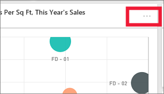

# ไทล์แดชบอร์ดใน Power BIDashboard tiles in Power BI

[!INCLUDE[consumer-appliesto-yyny](../includes/consumer-appliesto-ynny.md)]

ไทล์เป็นสแนปช็อตของข้อมูลของคุณที่ปักหมุดไปยังแดชบอร์ดโดย *ผู้ออกแบบ*A tile is a snapshot of your data, pinned to a dashboard by a *designer*. *ผู้ออกแบบ* สามารถสร้างไทล์จากรายงาน ชุดข้อมูล แดชบอร์ด กล่องคำถามของ Q&A, Excel และ SQL Server Reporting Services (SSRS) และอื่น ๆ ได้*Designers* can create tiles from a report, dataset, dashboard, the Q&A question box, Excel, SQL Server Reporting Services (SSRS), and more.  ภาพถ่ายหน้าจอนี้แสดงไทล์ต่าง ๆ มากมายที่ปักหมุดไปยังแดชบอร์ดหนึ่งThis screenshot shows many different tiles pinned to a dashboard.

นอกเหนือจากไทล์ที่ปักหมุดจากรายงาน *ผู้ออกแบบ* สามารถเพิ่มไทล์แบบเดี่ยวได้โดยตรงบนแดชบอร์ดผ่านตัวเลือก **เพิ่มไทล์**Besides tiles pinned from reports, *designers* can add standalone tiles directly on the dashboard using **Add tile**. ไทล์แบบเดี่ยวรวมถึง: กล่องข้อความ รูปภาพ วิดีโอ ข้อมูลสตรีมมิ่ง และเนื้อหาบนเว็บStandalone tiles include: text boxes, images, videos, streaming data, and web content.

ต้องการความช่วยเหลือในการทำความเข้าใจเกี่ยวกับบล็อกที่ประกอบเป็น Power BI หรือไม่?Need help understanding the building blocks that make up Power BI?  ดู[Power BI - แนวคิดพื้นฐาน](end-user-basic-concepts.md)See [Power BI - Basic Concepts](end-user-basic-concepts.md).

## โต้ตอบกับไทล์บนแดชบอร์ดInteracting with tiles on a dashboard

1. เลื่อนเหนือไทล์เพื่อแสดงจุดไข่ปลาHover over the tile to display the ellipses.
   
    
2. เลือกจุดไข่ปลาเพื่อเปิดเมนูการดำเนินการไทล์Select the ellipses to open the tile action menu. ตัวเลือกที่พร้อมใช้งานจะแตกต่างกันไปตามสิทธิ์ของคุณ ชนิดของภาพ และวิธีการที่ใช้ในการสร้างไทล์The options available vary by your permissions, the visual type, and the method used to create the tile. ตัวอย่างเช่น รายการเมนูที่พร้อมใช้งานสำหรับไทล์ที่ปักหมุดจากการถามตอบมีความแตกต่างจากไทล์ที่ปักหมุดจากรายงานFor example, the menu items available for tiles pinned from Q&A are different than the tiles pinned from a report. นี่คือเมนูการดำเนินการสำหรับไทล์ที่สร้างขึ้นโดยใช้การถามตอบHere is an action menu for a tile created using Q&A.

   
    

   
    บางการดำเนินการที่พร้อมใช้งานจากเมนูเหล่านี้ได้แก่:Some of the actions available from these menus are:
   
   * [เปิดรายงานที่ถูกใช้เพื่อสร้างไทล์](end-user-reports.md) [Open the report that was used to create the tile ](end-user-reports.md)   
   
   * [เปิดคำถามของ Q&A ที่ถูกใช้เพื่อสร้างไทล์](end-user-reports.md)[Open the Q&A question that was used to create the tile ](end-user-reports.md)   
   

   * [เปิดสมุดงานที่ถูกใช้เพื่อสร้างไทล์](end-user-reports.md) [Open the workbook that was used to create the tile ](end-user-reports.md)   
   * [ดูไทล์ในโหมดโฟกัส](end-user-focus.md)[View the tile in focus mode ](end-user-focus.md)   
   * [ดูข้อมูลเชิงลึก](end-user-insights.md)[View insights ](end-user-insights.md) 
   * [เพิ่มข้อคิดเห็นและเริ่มการอภิปราย](end-user-comment.md) [Add a comment and start a discussion](end-user-comment.md)  
   * [จัดการการแจ้งเตือนที่ตั้งค่าบนไทล์ของแดชบอร์ด](end-user-alerts.md) [Manage alerts set on a dashboard tile](end-user-alerts.md)  
   * [เปิดข้อมูลใน Excel](end-user-export.md)[Open the data in Excel](end-user-export.md)  

3. เมื่อต้องปิดเมนูการดำเนินการ เลือกพื้นที่ว่างในพื้นที่ใช้งานTo close the action menu, select a blank area in the canvas.

### เลือก (คลิกที่) ไทล์Select (click) a tile
เมื่อคุณเลือกไทล์หนึ่ง สิ่งที่จะเกิดขึ้นถัดไปขึ้นอยู่กับวิธีที่ไทล์ถูกสร้างขึ้น และขึ้นอยู่กับว่าไทล์ดังกล่าวมี[ลิงก์แบบกำหนดเอง](../create-reports/service-dashboard-edit-tile.md)หรือไม่When you select a tile, what happens next depends on how the tile was created and if it has a [custom link](../create-reports/service-dashboard-edit-tile.md). หากมีีการลิงก์แบบกำหนดเอง การเลือกไทล์จะนำคุณไปที่ลิงก์นั้นIf it has a custom link, selecting the tile takes you to that link. มิฉะนั้น การเลือกไทล์จะนำคุณไปยังรายงาน สมุดงาน Excel Online รายงาน SSRS ที่อยู่ภายในองค์กร หรือการถามตอบที่ถูกใช้เพื่อสร้างไทล์ดังกล่าวOtherwise, selecting the tile takes you to the report, Excel Online workbook, SSRS report that is on-premises, or Q&A question that was used to create the tile.

> [!NOTE]
> ข้อยกเว้นนี้คือไทล์วิดีโอที่เพิ่มไปยังแดชบอร์ดโดย *นักออกแบบ*The exception to this is video tiles added to dashboards by *designers*. การเลือกไทล์วิดีโอ (ที่ถูกสร้างขึ้นด้วยวิธีนี้) ทำให้วิดีโอเล่นบนแดชบอร์ดดังกล่าวSelecting a video tile (that was created this way) causes the video to play right there on the dashboard.   
> 
> 

## ข้อควรพิจารณาและการแก้ไขปัญหาConsiderations and troubleshooting
* ถ้าไม่มีอะไรเกิดขึ้นเมื่อคุณเลือก (คลิก) ไทล์ หรือคุณได้รับข้อผิดพลาด ต่อไปนี้เป็นสาเหตุที่เป็นไปได้บางประการ:If nothing happens when you select (click) a tile, or you receive an error message, here are some possible reasons:
  - รายงานที่ถูกใช้เพื่อสร้างการแสดงภาพไม่ได้รับการบันทึก หรือถูกลบไปแล้วThe report that was used to create the visualization was not saved, or has been deleted.
  - ถ้าไทล์ถูกสร้างขึ้นจากเวิร์กบุ๊กใน Excel Online และคุณไม่มีสิทธิ์ในการอ่านสำหรับเวิร์กบุ๊กนั้นเป็นอย่างน้อยThe tile was created from a workbook in Excel Online, and you do not have at least Read permissions for that workbook.
  - ถ้าไทล์ถูกสร้างขึ้นจาก SSRS และคุณไม่มีสิทธิ์ในรายงาน SSRS หรือคุณไม่สามารถเข้าถึงเครือข่ายที่เซิร์ฟเวอร์ SSRS อยู่ได้If the tile was created from SSRS, and you don't have permission to the SSRS report or you don't have access to the network where the SSRS server is located.
* สำหรับไทล์ที่สร้างขึ้นโดยตรงบนแดชบอร์ดโดยใช้ **เพิ่มไทล์** ถ้ามีการตั้งค่าไฮเปอร์ลิงก์แบบกำหนดเอง การเลือกชื่อเรื่อง ชื่อเรื่องรอง และหรือไทล์จะเปิด URL นั้นFor tiles created directly on the dashboard using **Add tile**, if a custom hyperlink has been set, selecting the title, subtitle, and or tile will open that URL.  มิฉะนั้น ตามค่าเริ่มต้น การเลือกหนึ่งไทล์จากไทล์เหล่านี้ที่ถูกสร้างขึ้นโดยตรงบนแดชบอร์ดสำหรับรูปภาพหนึ่ง โค้ดของเว็บ หรือกล่องข้อความ จะไม่ก่อให้เกิดการดำเนินการใดOtherwise, by default, selecting one of these tiles created directly on the dashboard for an image, web code, or text box produces no action.
* ถ้าการแสดงภาพต้นฉบับที่ใช้เพื่อสร้างไทล์เปลี่ยนแปลง ไทล์ดังกล่าวจะไม่เปลี่ยนแปลงไปด้วยIf the original visualization used to create the tile changes, the tile doesn't change.  ตัวอย่างเช่น ถ้า *ผู้ออกแบบ* ปักหมุดแผนภูมิเส้นจากรายงาน จากนั้นคุณเปลี่ยนแผนภูมิเส้นเป็นแผนภูมิแท่ง ไทล์แดชบอร์ดจะยังคงแสดงแผนภูมิเส้นFor example, if the *designer* pinned a line chart from a report and then changed the line chart to a bar chart, the dashboard tile continues to show a line chart. รีเฟรชข้อมูลแต่การชนิดแสดงภาพไม่เปลี่ยนThe data refreshes, but the visualization type does not.

## ขั้นตอนถัดไปNext steps
[รีเฟรชข้อมูลData refresh](../connect-data/refresh-data.md)

[Power BI แนวคิดพื้นฐานPower BI - Basic Concepts](end-user-basic-concepts.md)

