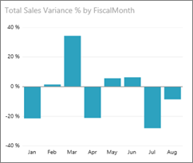
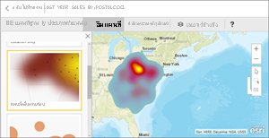
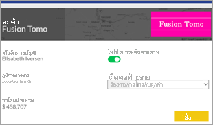
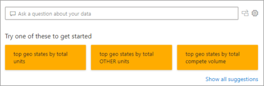
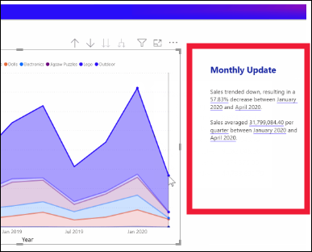
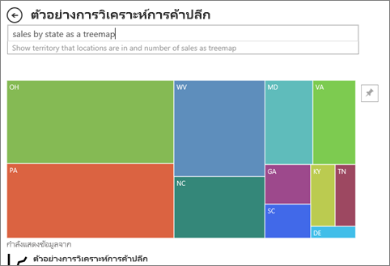

# ชนิดของวิชวลใน Power BIVisual types in Power BI

[!INCLUDE[consumer-appliesto-yynn](../includes/consumer-appliesto-yynn.md)]

วิชวล (หรือที่เรียกว่า *แผนภูมิ* และ *การแสดงภาพ*) เป็นการแสดงข้อมูลของคุณในรูปแบบภาพVisuals (also known as *charts* and *visualizations*) are picture representations of your data. ตัวอย่างทั่วไป คือ แผนภูมิคอลัมน์ แผนที่ แผนภูมิกระจาย และแผนภูมิหน้าปัดความเร็วSome common examples are column charts, maps, scatter charts, and radial gauges. คุณจะพบวิชวลในรายงาน แดชบอร์ด และถามตอบ (Q&A)You'll find visuals in reports, dashboards, and Q&A.

วิชวลที่อธิบายไว้ในหน้านี้เป็นรายการที่มีอยู่ใน Power BIThe visuals described on this page are the ones that are packaged with Power BI. นี่คือชนิดของวิชวลที่คุณจะพบได้บ่อยที่สุดThese are the visual types you'll encounter most often. หน้านี้จะให้ภาพรวมสั้นๆ ของวิชวลที่มีมาให้พร้อมอยู่แล้วThis page gives you a quick overview of these pre-packaged visuals. สำหรับข้อมูลเชิงลึกเกี่ยวกับวิชวลเหล่านี้ โปรดดูเอกสารประกอบของ [ผู้ออกแบบรายงาน *Power BI* เกี่ยวกับชนิดของวิชวล](../visuals/power-bi-visualization-types-for-reports-and-q-and-a.md)For in-depth information about any of these visuals, see the [Power BI report *designer* documentation on visual types](../visuals/power-bi-visualization-types-for-reports-and-q-and-a.md).

วิชวลที่ไม่รวมอยู่ใน Power BI โดยอัตโนมัติจะเรียกว่า *วิชวลแบบกำหนดเอง*Visuals that are not automatically included with Power BI are referred to as *custom visuals*. วิชวลแบบกำหนดเองสามารถนำเข้าสู่ Power BI จากเว็บไซต์ภายนอกได้ เช่น Microsoft AppSource หรือจากแหล่งข้อมูลภายใน เช่น ร้านค้าในองค์กรของคุณCustom visuals can be imported into Power BI from external websites such as Microsoft AppSource or from internal sources such as your organizational store. การนำเข้าวิชวลแบบกำหนดเองต้องมีสิทธิ์การแก้ไขในรายงานImporting custom visuals requires edit permissions to the report. หากต้องการเรียนรู้เกี่ยวกับวิชวลเสริมเหล่านี้ ไปที่ [วิชวลแบบกำหนดเองใน Power BI](../developer/visuals/power-bi-custom-visuals.md)To learn about these add-in visuals, visit [Custom visuals in Power BI](../developer/visuals/power-bi-custom-visuals.md).

## รายการวิชวลที่พร้อมใช้งานใน Power BIList of visuals available in Power BI
คุณสามารถพบวิชวลเหล่านี้ทั้งหมดได้ในแดชบอร์ดและรายงาน Power BI และ [ที่ระบุในถามตอบ (Q&A)](end-user-q-and-a.md)All of these visuals can be found in Power BI dashboards and reports, and [specified in Q&A](end-user-q-and-a.md). หากต้องการเรียนรู้วิธีการโต้ตอบกับวิชวล โปรดดูหัวข้อ [โต้ตอบกับวิชวลในรายงาน แดชบอร์ด และแอป](end-user-visualizations.md)To learn how to interact with visuals, see [Interact with visuals in reports, dashboards, and apps](end-user-visualizations.md)

## AA
### แผนภูมิพื้นที่: พื้นฐาน (เป็นชั้น) และแบบเรียงซ้อนArea charts: basic (layered) and stacked

แผนภูมิพื้นที่พื้นฐานจะยึดตามแผนภูมิเส้นที่มีพื้นที่ระหว่างแกนและเส้นเป็นบริเวณทึบThe basic area chart is based on the line chart with the area between the axis and line filled in. แผนภูมิพื้นที่เน้นให้เห็นปริมาณการเปลี่ยนแปลงตามเวลา และสามารถใช้เพื่อดึงความสนใจไปยังค่าผลรวมในทั่วทั้งแนวโน้มArea charts emphasize the magnitude of change over time, and can be used to draw attention to the total value across a trend. ตัวอย่างเช่น เราสามารถลงจุดข้อมูลที่แสดงกำไรเมื่อเวลาผ่านไปในแผนภูมิพื้นที่เพื่อเน้นกำไรรวมได้For example, data that represents profit over time can be plotted in an area chart to emphasize the total profit.

## BB
### แผนภูมิแท่งและแผนภูมิคอลัมน์Bar and column charts

 

แผนภูมิแท่งเป็นมาตรฐานสำหรับการดูที่ีค่าเฉพาะในแต่ละประเภทBar charts are the standard for looking at a specific value across different categories.

## CC
### การ์ด: หมายเลขเดียวCards: Single number

บัตรหมายเลขเดียวแสดงข้อเท็จจริงเดียว จุดข้อมูลเดียวSingle number cards display a single fact, a single data point. บางครั้งตัวเลขเพียงตัวเดียวก็เป็นสิ่งสำคัญที่สุดที่คุณต้องการติดตามในแดชบอร์ด Power BI หรือรายงานของคุณ เช่น ยอดขายรวม ส่วนแบ่งตลาดแบบปีต่อปี ตลาดแชร์ปีปี หรือโอกาสทั้งหมดSometimes a single number is the most important thing you want to track in your Power BI dashboard or report, such as total sales, market share year over year, or total opportunities.  

### การ์ด: หลายแถวCards: Multi row

บัตรหลายแถวแสดงจุดข้อมูลอย่างน้อยหนึ่งจุดต่อหนึ่งแถวMulti row cards display one or more data points, one per row.

### แผนภูมิผสมCombo charts

แผนภูมิผสมรวมแผนภูมิคอลัมน์และแผนภูมิเส้นไว้ด้วยกันA combo chart combines a column chart and a line chart. การรวมแผนภูมิทั้งสองให้เป็นหนึ่งเดียว ช่วยให้คุณทำการเปรียบเทียบข้อมูลได้อย่างรวดเร็วCombining the two charts into one lets you make a quicker comparison of the data. แผนภูมิผสมสามารถมีแกน Y หนึ่งหรือสองแกนดังนั้นอย่าลืมดูให้ละเอียดCombo charts can have one or two Y axes, so be sure to look closely. 

แผนภูมิผสม เป็นตัวเลือกที่ดี:Combo charts are a great choice:
- เมื่อคุณมีแผนภูมิเส้นและแผนภูมิคอลัมน์ ที่ใช้แกน X เดียวกันwhen you have a line chart and a column chart with the same X axis.
- เพื่อเปรียบเทียบการวัดหลายรายการกับช่วงค่าที่แตกต่างกันto compare multiple measures with different value ranges
- เพื่อแสดงตัวอย่างความสัมพันธ์ระหว่างหน่วยวัดสองหน่วยในวิชวลหนึ่งภาพto illustrate the correlation between two measures in one visual
- เพื่อตรวจสอบว่า หน่วยวัดหนึ่งบรรลุตามเป้าหมายที่ถูกกำหนดโดยอีกหน่วยวัดหนึ่งหรือไม่to check whether one measure meets the target which is defined by another measure
- เพื่อประหยัดพื้นที่ทำงานto conserve canvas space

## DD    
### โครงข่ายของข้อมูลDecomposition tree

วิชวลโครงข่ายของข้อมูลช่วยให้คุณเห็นภาพข้อมูลในหลายมิติThe decomposition tree visual lets you visualize data across multiple dimensions. โดยจะรวมข้อมูลและช่วยให้เจาะลึกลงในมิติของคุณในลำดับใดก็ได้It automatically aggregates data and enables drilling down into your dimensions in any order. นอกจากนี้ยังเป็นการแสดงภาพข่าวกรอง (AI) แบบเทียมเพื่อให้คุณสามารถขอให้ค้นหามิติถัดไปเพื่อดูรายละเอียดแนวลึกตามเกณฑ์บางอย่างIt is also an artificial intelligence (AI) visualization, so you can ask it to find the next dimension to drill down into based on certain criteria. ซึ่งทำให้เป็นเครื่องมือที่มีประโยชน์สำหรับการสำรวจแบบเฉพาะกิจและการดำเนินการวิเคราะห์สาเหตุหลักThis makes it a valuable tool for ad hoc exploration and conducting root cause analysis.

### แผนภูมิโดนัทDoughnut charts

แผนภูมิโดนัทจะคล้ายกับแผนภูมิวงกลมDoughnut charts are similar to pie charts.  โดยที่จะแสดงความสัมพันธ์ของส่วนต่าง ๆ ต่อส่วนทั้งหมดThey show the relationship of parts to a whole. ความแตกต่างเพียงประการเดียว คือ ส่วนตรงกลางนั้นว่างเปล่า และมีพื้นที่ว่างสำหรับระบุป้ายชื่อหรือไอคอนThe only difference is that the center is blank and allows space for a label or icon.

## FF
### แผนภูมิกรวยFunnel charts

แผนภูมิกรวยช่วยในการสร้างภาพของกระบวนการที่มีลำดับขั้น และรายการต่าง ๆ ให้จัดเรียงตามลำดับจากขั้นหนึ่งไปยังอีกขั้นFunnels help visualize a process that has stages, and items flow sequentially from one stage to the next.  ตัวอย่างหนึ่งคือกระบวนการขายที่เริ่มต้นด้วยลูกค้าเป้าหมาย และลงท้ายด้วยการซื้อขายOne example is a sales process that starts with leads and ends with purchase fulfillment.

ยกตัวอย่างเช่น ช่วงระยะการขายที่มีการติดตามลูกค้าตามขั้นตอนดังนี้: ลูกค้าที่เป็นเป้าหมาย > ลูกค้าเป้าหมายที่มีคุณสมบัติ > ผู้ที่มีแนวโน้มจะเป็นลูกค้า > ทำสัญญา > ปิดการขายFor example, a sales funnel that tracks customers through stages: Lead > Qualified Lead > Prospect > Contract > Close. มองอย่างรวดเร็ว รูปร่างของกรวยบ่งบอกสุขภาพของกระบวนการที่คุณกำลังติดตามAt a glance, the shape of the funnel conveys the health of the process you're tracking.
แต่ละขั้นตอนกรวยการแสดงเปอร์เซ็นต์ของผลรวมEach funnel stage represents a percentage of the total. ดังนั้น ในกรณีส่วนใหญ่ แผนภูมิกรวยจะมีรูปเหมือนกรวย - ด้วยขั้นตอนแรกที่ใหญ่ที่สุด และขั้นตอนถัด ๆ มาเล็กกว่าขั้นตอนก่อนหน้าSo, in most cases, a funnel chart is shaped like a funnel -- with the first stage being the largest, and each subsequent stage smaller than its predecessor. แผนภูมิเป็นรูปต้นแพร์จะยังมีประโยชน์ -- สามารถใช้ระบุปัญหาในกระบวนการได้A pear-shaped funnel is also useful -- it can identify a problem in the process. แต่โดยทั่วไปแล้ว ขั้นแรกหรือขั้น "ทางเข้า" มีขนาดใหญ่ที่สุดBut typically, the first stage, the "intake" stage, is the largest.

## GG
### แผนภูมิตัววัดGauge charts

แผนภูมิหน้าปัดความเร็วมีโค้งวงกลม และแสดงเป็นค่าเดียวที่วัดความคืบหน้าตามเพื่อไปสู่เป้าหมาย/KPIA radial gauge chart has a circular arc and displays a single value that measures progress toward a goal/KPI. เป้าหมาย หรือค่าเป้าหมาย ถูกแสดงทีละบรรทัด (needle)The goal, or target value, is represented by the line (needle). ความคืบสู่เป้าหมายที่ถูกแสดงด้วยการแรเงาProgress toward that goal is represented by the shading. และค่าที่แสดงว่าความคืบหน้าจะแสดงในเป็นหนาภายในส่วนโค้ง ค่าที่เป็นไปได้ทั้งหมดจะกระจายเท่าๆ กันตามส่วนโค้ง จากค่าต่ำสุด (ค่าซ้ายสุด) ไปสู่ค่าสูงสุด (ค่าขวาสุด)And the value that represents that progress is shown in bold inside the arc. All possible values are spread evenly along the arc, from the minimum (left-most value) to the maximum (right-most value).

ในตัวอย่างด้านบน เรามีผู้ค้าปลีกรถยนต์กำลังติดตามการขายเฉลี่ยของทีมขายของเราต่อเดือนIn the example above, we are a car retailer, tracking our Sales team's average sales per month. เป้าหมายของเราคือ 140 และแสดงด้วยเข็มสีดำOur goal is 140 and represented by the black needle. การขายเฉลี่ยที่เป็นไปได้น้อยที่สุดคือ 0 และเราได้ตั้งค่าสูงสุดเป็น 200The minimum possible average sales is 0 and we've set the maximum as 200. การแรเงาสีน้ำเงินแสดงว่า ตอนนี้เราประมาณการว่ามีการขาย 120 ตัวในเดือนนี้The blue shading shows that we're currently averaging approximately 120 sales this month. โชคดีทีี่เรายังคงมีสัปดาห์อื่นเพื่อจะทำให้ถึงเป้าหมายLuckily, we still have another week to reach our goal.

แผนภูมิหน้าปัดความเร็วเป็นทางเลือกที่ดีสำหรับRadial gauges are a great choice to:
- แสดงความคืบหน้าเพื่อจะบรรลุเป้าหมายshow progress toward a goal
- แสดงการวัดร้อยละ เช่น KPIrepresent a percentile measure, like a KPI
- แสดงความสมบูรณ์ของการวัดเดี่ยวshow the health of a single measure
- แสดงข้อมูลที่สามารถสแกนและทำความเข้าใจได้อย่างรวดเร็วdisplay information that can be quickly scanned and understood

## KK
 ### แผนภูมิผู้มีอิทธิพลหลักKey influencers chart

แผนภูมิผู้มีอิทธิพลหลักแสดงผู้สนับสนุนหลักไปยังผลลัพธ์หรือค่าที่เลือกA key influencer chart displays the major contributors to a selected result or value.

ผู้มีอิทธิพลหลักเป็นตัวเลือกที่ยอดเยี่ยมเพื่อช่วยให้คุณเข้าใจปัจจัยที่ส่งผลต่อเมตริกหลักKey influencers are a great choice to help you understand the factors that influence a key metric. ตัวอย่างเช่น *อะไรคือสิ่งที่มีอิทธิพลต่อลูกค้าในการสั่งซื้อครั้งที่สอง *หรือ* ทำไมยอดขายถึงสูงมากเมื่อเดือนมิถุนายนที่ผ่านมา*For example, *what influences customers to place a second order *or* why were sales so high last June*. 

### KPIKPIs

ดัชนีประสิทธิภาพหลัก (KPI) เป็นภาพสัญลักษณ์ที่แสดงปริมาณความก้าวหน้าของงานที่ทำเพื่อมุ่งไปยังเป้าหมายที่วัดผลได้A Key Performance Indicator (KPI) is a visual cue that communicates the amount of progress made toward a measurable goal. 

KPI เป็นตัวเลือกที่ดีที่สุด:KPIs are a great choice:
- เมื่อต้องวัดความคืบหน้า (ฉันอยู่ข้างหน้าหรือข้างหลังสิ่งใด)to measure progress (what am I ahead or behind on?)
- เมื่อวัดระยะห่างจากเป้าหมาย (ฉันอยู่ห่างจากเป้าหมายหรือห่างจากจุดเริ่มเท่าใด)to measure distance to a goal (how far ahead or behind am I?)

## LL
### แผนภูมิเส้นLine charts

แผนภูมิเส้นเน้นรูปร่างโดยรวมของชุดข้อมูลค่าทั้งหมด โดยปกติแล้วจะดูเทียบกับเวลาที่ผ่านไปLine charts emphasize the overall shape of an entire series of values, usually over time.

## MM
### แผนที่: แผนที่พื้นฐานMaps: Basic maps

แผนที่พื้นฐานใช้เพื่อเชื่อมโยงข้อมูลเชิงหมวดหมู่และข้อมูลเชิงปริมาณเข้ากับตำแหน่งที่ตั้งเชิงพื้นที่Use a basic map to associate both categorical and quantitative information with spatial locations.

### แผนที่: แผนที่ ArcGISMaps: ArcGIS maps

การรวมกันระหว่างแผนที่ ArcGIS และ Power BI ทำให้การนำเสนอจุดต่าง ๆ บนแผนที่ก้าวขึ้นไปอีกระดับThe combination of ArcGIS maps and Power BI takes mapping beyond the presentation of points on a map to a whole new level. ตัวเลือกที่พร้อมใช้งานสำหรับแผนที่พื้นฐาน ชนิดตำแหน่งที่ตั้ง ธีม สไตล์สัญลักษณ์ และเลเยอร์อ้างอิงสร้างสร้างวิชวลแผนที่ที่มีข้อมูลครบครันและสวยงามThe available options for base maps, location types, themes, symbol styles, and reference layers creates gorgeous informative map visuals. ชุดข้อมูลของเลเยอร์ข้อมูลที่น่าเชื่อถือ (เช่น ข้อมูลการสำรวจสำมะโนประชากร) บนแผนที่ที่มีการวิเคราะห์ข้อมูลเชิงพื้นที่บ่งบอกถึงความเข้าใจข้อมูลในวิชวลของคุณที่ลึกซึ้งขึ้นThe combination of authoritative data layers (such as census data) on a map with spatial analysis conveys a deeper understanding of the data in your visual.

### แผนที่: แผนที่แถบสี (Choropleth)Maps: Filled maps (Choropleth)

แผนที่แถบสีใช้เฉดสีหรือ หรือการปรับสีอ่อนแก่ หรือรูปแบบต่าง ๆ เพื่อแสดงว่าค่าแตกต่างกันมากเพียงใดในสัดส่วนทั่วทั้งภูมิศาสตร์หรือภูมิภาคA filled map uses shading or tinting or patterns to display how a value differs in proportion across a geography or region. เพื่อแสดงความแตกต่างเหล่านี้ที่สัมพันธ์กับเฉดสีที่อยู่ในช่วงจากสีอ่อน (ความถี่น้อยกว่า/ต่ำกว่า) ไปถึงเข้ม (ความถี่มากกว่า/สูงกว่า) ได้อย่างรวดเร็วQuickly display these relative differences with shading that ranges from light (less-frequent/lower) to dark (more-frequent/more).

### แผนที่: แผนที่รูปร่างMaps: Shape maps

แผนที่รูปร่างเปรียบเทียบภูมิภาคบนแผนที่โดยใช้สีShape maps compare regions on a map using color. แผนที่รูปร่างไม่สามารถแสดงตำแหน่งที่ตั้งทางภูมิศาสตร์อย่างแม่นยำของจุดข้อมูลบนแผนที่ได้A shape map can't show precise geographical locations of data points on a map. แต่วัตถุประสงค์หลักคือการเปรียบเทียบภูมิภาคบนแผนที่โดยการใช้สีแตกต่างกันInstead, its main purpose is to show relative comparisons of regions on a map by coloring them differently.

### เมทริกซ์Matrix

วิชวลเมทริกซ์คือ ชนิดของภาพตาราง (ดู "ตาราง" ด้านล่าง) ที่สนับสนุนรูปแบบขั้นThe matrix visual is a type of table visual (see "Table" below) that supports a stepped layout. บ่อยครั้งที่ผู้ออกแบบรายงานจะรวมเมทริกซ์ในรายงานและแดชบอร์ดเพื่อให้ผู้ใช้สามารถเลือกองค์ประกอบอย่างน้อยหนึ่งองค์ประกอบ (แถว, คอลัมน์, เซลล์) ในเมทริกซ์เพื่อไฮไลต์ข้ามภาพอื่น ๆ ในหน้ารายงานได้Often, report designers include matrixes in reports and dashboards to allow users to select one or more element (rows, columns, cells) in the matrix to cross-highlight other visuals on a report page.  

## PP
### แผนภูมิวงกลมPie charts

แผนภูมิวงกลมจะแสดงความสัมพันธ์ของส่วนต่าง ๆ ต่อส่วนทั้งหมดPie charts show the relationship of parts to a whole. 

### วิชวล Power AppsPower Apps visual

นักออกแบบรายงานสามารถสร้าง Power App และฝังลงในรายงาน Power BI ได้Report designers can create a Power App and embed it into a Power BI report. *ผู้ใช้ทางธุรกิจ* สามารถโต้ตอบกับวิชวลภายในรายงาน Power BI ได้*Business users* can interact with that visual within the Power BI report. 

## QQ
### วิชวลถามตอบQ&A visual

>[!TIP]
>คล้ายกับ [ประสบการณ์ถามตอบเกี่ยวกับแดชบอร์ด](../create-reports/power-bi-tutorial-q-and-a.md) วิชวลถามตอบช่วยให้คุณสามารถถามคำถามเกี่ยวกับข้อมูลของคุณโดยใช้ภาษาธรรมชาติSimilar to the [Q&A experience on dashboards](../create-reports/power-bi-tutorial-q-and-a.md), the Q&A visual lets you ask questions about your data using natural language. 

สำหรับข้อมูลเพิ่มเติม โปรดดู[วิชวลถามตอบใน Power BI](../visuals/power-bi-visualization-types-for-reports-and-q-and-a.md)For more information, see [Q&A visuals in Power BI](../visuals/power-bi-visualization-types-for-reports-and-q-and-a.md).

## RR
### แผนภูมิริบบอนRibbon chart

แผนภูมิ Ribbon แสดงประเภทข้อมูลที่มีอันดับสูงสุด (ค่ามากที่สุด)Ribbon charts show which data category has the highest rank (largest value). แผนภูมิ Ribbon เหมาะกับการแสดงการเปลี่ยนแปลงอันดับ โดยที่ค่าอันดับสูงสุดจะแสดงอยู่ด้านบนสุดของแต่ละช่วงเวลาเสมอRibbon charts are effective at showing rank change, with the highest range (value) always displayed on top for each time period.

## SS
### แผนภูมิกระจาย แผนภูมิฟองอากาศ และแผนภูมิลงจุดScatter, bubble, and dot plot charts

แผนภูมิกระจายจะมีแกนค่าสองแกนเสมอเพื่อแสดงข้อมูลตัวเลขหนึ่งชุดตามแกนแนวนอนและอีกชุดของค่าตัวเลขตามแกนแนวตั้งA scatter chart always has two value axes to show one set of numerical data along a horizontal axis and another set of numerical values along a vertical axis. แผนภูมิแสดงจุดที่จุดตัดของค่าตัวเลข x และ y เพื่อรวมค่าเหล่านี้ลงในจุดข้อมูลเดียวThe chart displays points at the intersection of an x and y numerical value, combining these values into single data points. จุดข้อมูลเหล่านี้อาจถูกกระจายสม่ำเสมอกันหรืออาจไม่สม่ำเสมอกันตามแกนแนวนอน โดยขึ้นอยู่กับข้อมูลดังกล่าวThese data points may be distributed evenly or unevenly across the horizontal axis, depending on the data.

แผนภูมิฟองอากาศจะแทนที่จุดข้อมูลด้วยฟองอากาศ และขนาดของฟองอากาศแสดงมิติเพิ่มเติมของข้อมูลA bubble chart replaces data points with bubbles, with the bubble size representing an additional dimension of the data.

แผนภูมิลงจุดนั้นเหมือนกันกับแผนภูมิฟองอากาศและแผนภูมิกระจาย ที่แตกต่างกันคือคุณสามารถลงข้อมูลเชิงตัวเลขหรือเชิงหมวดหมู่ตามแกน X ได้A dot plot chart is similar to a bubble chart and scatter chart except that it can plot numerical or categorical data along the X axis. ตัวอย่างนี้แสดงให้เห็นถึงการใช้สี่เหลี่ยมแทนที่วงกลม และลงจุดยอดขายตามแกน XThis example happens to use squares instead of circles and plots sales along the X axis.

### ความหนาแน่นสูงกระจายScatter-high density

จากคำนิยาม ข้อมูลความหนาแน่นสูง จะถูกสุ่มตัวอย่างเพื่อสร้างวิชวลให้รวดเร็วพอสมควรที่จะตอบสนองต่อการโต้ตอบได้By definition, high-density data is sampled to create visuals reasonably quickly that are responsive to interactivity. การสุ่มตัวอย่างความหนาแน่นสูงใช้อัลกอริทึมที่กำจัดจุดที่ทับซ้อนกันและทำให้มั่นใจได้ว่าจุดทั้งหมดในชุดข้อมูลจะถูกแสดงในภาพHigh-density sampling uses an algorithm that eliminates overlapping points, and ensures that all points in the data set are represented in the visual. ไม่เพียงแค่ลงจุดตัวอย่างของข้อมูลเท่านั้นIt doesn't just plot a representative sample of the data.  

แต่ยังช่วยให้ได้การผสมผสานที่ดีที่สุด ระหว่างการตอบสนอง, ตัวแทนข้อมูล และการคงจุดข้อมูลที่สำคัญในชุดข้อมูลโดยรวมThis ensures the best combination of responsiveness, representation, and clear preservation of important points in the overall data set.

### ตัวแบ่งส่วนข้อมูลSlicers

ตัวแบ่งส่วนข้อมูลเป็นแผนภูมิแบบสแตนด์อโลนที่สามารถใช้เพื่อกรองภาพอื่น ๆ บนหน้าเว็บได้A slicer is a standalone chart that can be used to filter the other visuals on the page. ตัวแบ่งส่วนข้อมูลมีหลายรูปแบบ (หมวดหมู่ ช่วงวันที่ และอื่น ๆ) และสามารถจัดรูปแบบเพื่อให้เลือกได้เพียงค่าเดียว จำนวนมาก หรือทั้งหมดSlicers come in many different formats (category, range, date, etc.) and can be formatted to allow selection of only one, many, or all of the available values. 

ตัวแบ่งส่วนข้อมูลเป็นตัวเลือกที่ดีเพื่อ:Slicers are a great choice to:
- แสดงตัวกรองที่ใช้งานบ่อยหรือสำคัญ บนพื้นที่รายงานเพื่อให้ง่ายต่อการเข้าถึงdisplay commonly-used or important filters on the report canvas for easier access
- ทำให้การดูสถานะตัวกรองปัจจุบันได้ง่ายขึ้น โดยไม่ต้องเปิดรายการดรอปดาวน์make it easier to see the current filtered state without having to open a drop-down list
- กรองตามคอลัมน์ที่ไม่จำเป็นและซ่อนอยู่ในตารางข้อมูลfilter by columns that are unneeded and hidden in the data tables
- สร้างรายงานที่เฉพาะเจาะจงมากขึ้น โดยการใส่ตัวแบ่งส่วนข้อมูลข้างกับวิชวลที่สำคัญcreate more focused reports by putting slicers next to important visuals

### คำบรรยายอัจฉริยะSmart narrative

คำบรรยายอัจฉริยะจะเพิ่มข้อความไปยังรายงานเพื่อชี้แนวโน้ม การประเด็นสำคัญ และเพิ่มคำอธิบายและบริบทต่างๆThe Smart narrative adds text to reports to point out trends, key takeaways, and add explanations and context. ข้อความจะช่วยให้ผู้ใช้เข้าใจข้อมูลและระบุข้อสรุปค้นพบที่สำคัญได้อย่างรวดเร็วThe text helps users to understand the data and identify the important findings quickly.

### รูปภาพเดี่ยวStandalone images

รูปภาพแบบสแตนด์อโลนเป็นกราฟิกที่มีการเพิ่มไปยังรายงานหรือแดชบอร์ดA standalone image is a graphic that has been added to a report or dashboard. 

## TT
### ตารางTables

ตารางคือ เส้นตารางที่ประกอบด้วยข้อมูลที่เกี่ยวข้องในชุดที่สมเหตุผลของแถวและคอลัมน์A table is a grid that contains related data in a logical series of rows and columns. ซึ่งอาจยังประกอบด้วยส่วนหัวและแถวสำหรับผลรวมด้วยIt may also contain headers and a row for totals. ตารางทำงานได้ดีกับข้อเปรียบเทียบเชิงปริมาณซึ่งเป็นการที่คุณดูหลายค่าสำหรับหนึ่งประเภทTables work well with quantitative comparisons where you are looking at many values for a single category. ตัวอย่างเช่น ตารางนี้แสดงการวัดที่แตกต่างกันห้า การวัดสำหรับประเภทFor example, this table displays five different measures for Category.

ตารางเป็นตัวเลือกที่ดีมาก:Tables are a great choice:
- เมื่อต้องการดูและเปรียบเทียบข้อมูลโดยละเอียดและค่าที่แน่นอน (แทนการนำเสนอแบบเป็นภาพ)to see and compare detailed data and exact values (instead of visual representations)
- เพื่อแสดงข้อมูลในรูปแบบตารางto display data in a tabular format
- เพื่อแสดงข้อมูลตัวเลขตามประเภทto display numerical data by categories

### แผนภูมิต้นไม้Tree maps

แผนภูมิต้นไม้ คือ แผนภูมิสี่เหลี่ยมผืนผ้าสีต่างๆ ที่ขนาดจะแสดงค่าข้อมูลTree maps are charts of colored rectangles, with size representing value.  แผนภูมิเหล่านี้อาจเป็นแบบชั้นโดยที่มีสี่เหลี่ยมผืนผ้าที่ซ้อนกันภายในสี่เหลี่ยมผืนผ้าหลักThey can be hierarchical, with rectangles nested within the main rectangles. ช่องว่างภายในสี่เหลี่ยมผืนผ้าแต่ละจัดไว้ตามค่าที่วัดThe space inside each rectangle is allocated based on the value being measured. และสี่เหลี่ยมผืนผ้าจัดเรียงในขนาดจากด้านบนซ้าย (มากที่สุด) ไปด้านล่างขวา (น้อยที่สุด)And the rectangles are arranged in size from top left (largest) to bottom right (smallest).

แผนภูมิต้นไม้เป็นตัวเลือกที่ดี:Tree maps are a great choice:
- เมื่อต้องการแสดงข้อมูลแบบลำดับชั้นเป็นจำนวนมากto display large amounts of hierarchical data
- เมื่อไม่สามารถใช้แผนภูมิแท่งในการนำเสนอข้อมูลจำนวนมากได้อย่างมีประสิทธิภาพwhen a bar chart can't effectively handle the large number of values
- เมื่อต้องการแสดงสัดส่วนระหว่างแต่ละองค์ประกอบกับข้อมูลทั้งหมดto show the proportions between each part and the whole
- เมื่อต้องการแสดงรูปแบบของการแจกแจงข้อมูลของข้อมูลตัวเลขในแต่ละระดับของประเภทในลำดับชั้นto show the pattern of the distribution of the measure across each level of categories in the hierarchy
- เมื่อต้องการแสดงแอตทริบิวต์ที่ใช้การแสดงรหัสด้วยสีและขนาดto show attributes using size and color coding
- เมื่อต้องการกำหนดรูปแบบ ค่าผิดปกติ ปัจจัยสนับสนุนที่สำคัญอย่างยิ่งและและข้อยกเว้นto spot patterns, outliers, most-important contributors, and exceptions

## WW
### แผนภูมิแบบน้ำตกWaterfall charts

แผนภูมิแบบน้ำตกจะแสดงผลรวมสะสมเป็นค่าที่เพิ่มขึ้นหรือลดลงA waterfall chart shows a running total as values are added or subtracted. แผนภูมินี้มีประโยชน์สำหรับการวิเคราะห์ว่าค่าเริ่มต้น (ตัวอย่างเช่น กำไรสุทธิ) ได้รับผลกระทบอย่างไร เมื่อมีการเปลี่ยนแปลงเชิงบวก และเชิงลบที่เกิดขึ้นอย่างต่อเนื่องในช่วงระยะเวลาหนึ่งIt's useful for understanding how an initial value (for example, net income) is affected by a series of positive and negative changes.

คอลัมน์เป็นสีที่่แสดงรหัส เพื่อให้คุณสามารถระบุการเพิ่มขึ้นและการลดลงได้อย่างรวดเร็วThe columns are color coded so you can quickly tell increases and decreases. คอลัมน์ค่าเริ่มต้นและคอลัมน์ค่าสุดท้ายมักเริ่มต้นบนแกนนอนขณะที่ค่ากลางจะเป็นคอลัมน์แบบลอยตัวThe initial and the final value columns often start on the horizontal axis, while the intermediate values are floating columns. เนื่องจากมี "รูปร่าง" แบบนี้ จึงยังเรียกแผนภูมิแบบน้ำตกอีกชื่อหนึ่งว่าแผนภูมิแบบสะพานBecause of this "look", waterfall charts are also called bridge charts.

แผนภูมิแบบน้ำตกเป็นตัวเลือกที่เหมาะสมอย่างยิ่ง ในกรณีต่อไปนี้:Waterfall charts are a great choice:
- เมื่อคุณมีการเปลี่ยนแปลงข้อมูลหน่วยวัดตลอดช่วงระยะเวลาหนึ่งหรือตามหมวดหมู่ที่แตกต่างwhen you have changes for the measure across time or across different categories
- เมื่อต้องการตรวจสอบการเปลี่ยนแปลงหลักที่ส่งผลให้เกิดค่าผลรวมto audit the major changes contributing to the total value
- เมื่อต้องการลงจุดกำไรรายปีของบริษัทคุณ โดยแสดงแหล่งข้อมูลต่างๆ ของรายได้ และจนถึงกำไร (หรือขาดทุน) รวมto plot your company's annual profit by showing various sources of revenue and arrive at the total profit (or loss).
- เมื่อต้องการแสดงจำนวนพนักงานตอนต้นปีและปลายปีในบริษัทของคุณในหนึ่งปีto illustrate the beginning and the ending headcount for your company in a year
- เมื่อต้องการแสดงภาพจำนวนเงินที่หาได้และใช้จ่ายในแต่ละเดือน และยอดคงเหลือสะสมสำหรับบัญชีของคุณto visualize how much money you make and spend each month, and the running balance for your account.

## บอกถามตอบ (Q&A) ว่าต้องใช้วิชวลแบบไหนTell Q&A which visual to use
เมื่อพิมพ์คิวรีด้วยภาษาธรรมชาติในการถามตอบของ Power BI คุณสามารถระบุชนิดของวิชวลในคิวรีของคุณได้When typing natural language queries with Power BI Q&A, you can specify the visual type in your query.  ตัวอย่างเช่น:For example:

"***ยอดขายในแต่ละรัฐในแผนภูมิต้นไม้***""***sales by state as a tree map***"

## ขั้นตอนถัดไปNext steps
[โต้ตอบกับวิชวลในรายงาน แดชบอร์ด และแอป](end-user-visualizations.md)  [Interact with visuals in reports, dashboards, and apps](end-user-visualizations.md)    
[อ้างอิงภาพที่ถูกต้องจาก sqlbi.comThe right visual reference from sqlbi.com](https://www.sqlbi.com/wp-content/uploads/videotrainings/dashboarddesign/visuals-reference-may2017-A3.pdf)

