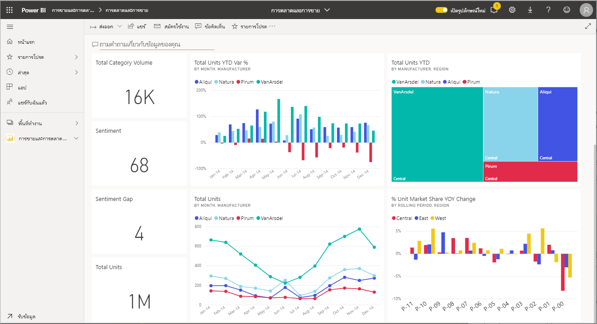
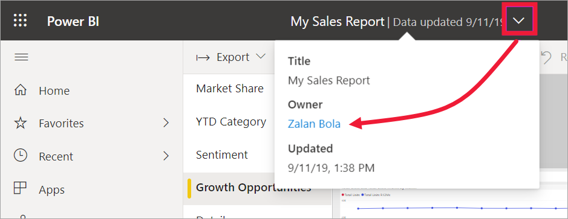

# โต้ตอบกับการแสดงผลด้วยภาพในรายงาน แดชบอร์ด และแอปInteract with visuals in reports, dashboards, and apps

[!INCLUDE[consumer-appliesto-ynny](../includes/consumer-appliesto-ynny.md)]

ที่คุณสมบัติพื้นฐานที่สุด **การแสดงภาพ** _(หรือ_ภาพ\*) เป็นแผนภูมิชนิดที่สร้างขึ้น โดยตัวออกแบบของ *Power BI* โดยใช้ข้อมูลในรายงานและชุดข้อมูลAt its most basic, a ***visualization** _ (or _visual*), is a type of chart built by Power BI *designers* using the data in reports and datasets. 

พบภาพบนแดชบอร์ดในรายงาน และสามารถสร้างการแสดงภาพโดยใช้ Power BI Q & A ได้ในทันทีVisuals are found on dashboards, in reports, and can be created on-the-fly using Power BI Q&A. เมื่อผู้ออกแบบสร้างการแสดงภาพในรายงาน พวกเขาสามารถ *ปักหมุด* ภาพนั้นไปยังแดชบอร์ดได้When a designer creates a visual in a report, they can *pin* that visual to a dashboard. [การแสดงภาพบนแดชบอร์ดเรียกว่า *ไทล์*](end-user-tiles.md)A [visual on a dashboard is called a *tile*](end-user-tiles.md). แดชบอร์ดนี้มีไทล์แปดแผ่นThis dashboard has eight tiles. 

> [!TIP]
> ขอแนะนำให้อ่านในหัวข้อภาพรวมของ [แนวคิดพื้นฐาน Power BI สำหรับ *ผู้ใช้ทางธุรกิจ*](end-user-basic-concepts.md) ก่อนอ่านเนื้อหานี้โดยละเอียดเพิ่มเติมWe recommend first reading the overview topic [Power BI basic concepts for *business users*](end-user-basic-concepts.md) before reading this more-detailed content.

## ฉันสามารถทำอะไรกับวิชวลได้บ้าง?What can I do with visuals?

วิชวลที่สร้างขึ้นโดย *นักออกแบบ* รายงานและแดชบอร์ด และแชร์กับ เพื่อนร่วมงานVisuals are created by report and dashboard *designers* and shared with colleagues. ผู้ออกแบบจะกำหนดสิทธิ์ที่แตกต่างกันให้กับเพื่อนร่วมงานของพวกเขา โดยขึ้นอยู่กับวิธีการใช้รายงานหรือแดชบอร์ดของแต่ละบุคคลThe designer assigns different permissions to their colleagues, depending on how the colleague is going to use the report or dashboard. ตัวอย่างเช่น *ผู้พัฒนา* อาจได้รับกำหนดสิทธิ์ที่แตกต่างจาก *ผู้ใช้ทางธุรกิจ*For example, a *developer* may be assigned different permissions than a *business user*. 

งานทั่วไปส่วนใหญ่สำหรับ *ผู้ใช้ทางธุรกิจ* แสดงอยู่ในตารางด้านล่าง พร้อมลิงก์ไปยังคำแนะนำทีละขั้นตอนThe most common tasks for a *business user* are listed in the table below, with links to step-by-step instructions. *ผู้ใช้ทางธุรกิจ* มีหลายทางเลือกในการโต้ตอบกับวิชวลเพื่อเปิดเผยข้อมูลเชิงลึกและทำการตัดสินใจทางธุรกิจโดยใช้ข้อมูล*Business users* have many options for interacting with visuals to uncover insights and make data-driven business decisions.  

สำหรับตัวเลือกเหล่านี้ ผู้ดูแลระบบของคุณหรือ *ผู้ออกแบบ* สามารถปิดใช้งานความสามารถในการดูหรือใช้คุณลักษณะเหล่านี้ของคุณได้For many of these options, your administrator or the *designer* can disable your ability to see or use these features. และคุณลักษณะบางอย่างเหล่านี้จะทำงานกับชนิดการแสดงภาพที่เฉพาะเจาะจงเท่านั้นAnd some of these features only work on specific visual types.  หากคุณมีคำถามใด ๆ โปรดติดต่อผู้ดูแลระบบของคุณหรือเจ้าของรายงานหรือแดชบอร์ดIf you have any questions, contact your administrator or the owner of the report or dashboard. หากต้องการค้นหาเจ้าของ ให้เลือกรายการแดชบอร์ดหรือรายงานแบบเลื่อนลงTo find the owner, select the dashboard or report dropdown. 

> [!IMPORTANT]
> แต่ก่อนอื่น มาดูคำถามและคำตอบBut first, a word about Q&A. คำถามและคำตอบเป็นเครื่องมือค้นหาภาษาที่เป็นธรรมชาติของ Power BIQ&A is Power BI's natural language search tool. คุณพิมพ์คำถามโดยใช้ภาษาธรรมชาติ คำตอบและคำตอบจะตอบคำถามในรูปแบบของวิชวลYou type a question using natural language and Q&A answers the question in the form of a visual. คำถามและคำตอบเป็นวิธีที่ผู้ใช้ทางธุรกิจสามารถสร้างวิชวลของตนเองได้ในทันทีQ&A is a way business users can create their own visuals on the fly. อย่างไรก็ตาม ไม่สามารถบันทึกวิชวลที่คุณสร้างด้วยคำถามและคำตอบได้However, the visuals you create with Q&A cannot be saved. แต่ หากมีบางอย่างที่เฉพาะเจาะจงซึ่งคุณต้องการเรียนรู้จากข้อมูล และตัวออกแบบไม่ได้รวมไว้ในรายงานหรือบนแดชบอร์ด คำถามและคำตอบเป็นตัวเลือกที่ดีมากBut, if there's something specific you want to learn from the data, and the designer didn't include it in a report or on a dashboard, Q&A is a great option. เรียนรู้เพิ่มเติมเกี่ยวกับคำถามและคำตอบ ดู [คำถามและคำตอบสำหรับผู้ใช้ทางธุรกิจ](end-user-q-and-a.md)To learn more about Q&A, see [Q&A for business users](end-user-q-and-a.md).

|งานTask  |บนแดชบอร์ดOn a dashboard  |ในรายงานIn a report  | ในคำถามและคำตอบIn Q&A
|---------|---------|---------|--------|
|[เพิ่มข้อคิดเห็นในวิชวลสำหรับตัวคุณเอง หรือเริ่มการสนทนากับเพื่อนร่วมงานเกี่ยวกับวิชวล](end-user-comment.md)[Add comments to a visual for yourself or start a conversation with colleagues about the visual](end-user-comment.md).     |  ใช่yes       |   ใช่yes      |  ไม่no  |
|[เปิดและสำรวจรายงานที่สร้างวิชวล](end-user-tiles.md)[Open and explore the report where the visual was created](end-user-tiles.md).     |    ใช่yes     |   ไม่ระบุna      |  ไม่no |
|[ดูรายการตัวกรองและตัวแบ่งส่วนข้อมูลที่ส่งผลกระทบต่อวิชวล](end-user-report-filter.md)[View a list of the filters and slicers that are affecting the visual](end-user-report-filter.md).     |    ถ้าคุณเปิดในโหมดโฟกัสif you open in focus mode     |   ใช่yes      |  ไม่no |
|[เปิดและสำรวจการแสดงภาพในการถามตอบ (หาก *ผู้ออกแบบใช้* Q&A ในการสร้างการแสดงภาพ)](end-user-q-and-a.md)[Open and explore a visual in Q&A (if the *designer* used Q&A to create the visual)](end-user-q-and-a.md).     |   ใช่yes      |   ไม่ระบุna      |  ไม่ระบุna  |
|[สร้างการแสดงภาพในการถามตอบ (สำหรับการสำรวจ คุณจะไม่สามารถบันทึกภาพนั้นได้) ](end-user-q-and-a.md)[Create a visual in Q&A (for exploration, you won't be able to save it)](end-user-q-and-a.md).     |   ใช่yes      |   หากผู้ออกแบบเพิ่มการถามตอบไปยังรายงานแล้วif designer has added Q&A to the report      |  ใช่yes  |
|[ขอให้ Power BI ค้นหาข้อเท็จจริงที่น่าสนใจหรือมีแนวโน้ม](end-user-insights.md)ในข้อมูลของวิชวลสำหรับคุณ[Ask Power BI to look for interesting facts or trends](end-user-insights.md) in the visual's data for you.  ภาพที่สร้างโดยอัตโนมัติเหล่านี้เรียกว่า *ข้อมูลเชิงลึก*These automatically generated visuals are called *insights*.     |    ใช่ สำหรับไทล์yes, for tiles    |  ไม่no       | ไม่no   |
|[ดูวิชวลเดียวเมื่อใช้ *โหมด* โฟกัส](end-user-focus.md)[View just one visual at a time using *focus* mode](end-user-focus.md).     | ใช่ สำหรับไทล์yes, for tiles        |   ใช่ สำหรับวิชวลyes, for visuals      | ไม่ระบุna  |
|[ค้นหาการรีเฟรชภาพครั้งล่าสุด](end-user-fresh.md)[Look up the last time the visual was refreshed](end-user-fresh.md).     |  ใช่yes       |    ใช่yes     | ไม่ระบุna  |
|[ดูครั้งละหนึ่งวิชวล โดยไม่มีขอบหรือบานหน้าต่างนำทาง โดยใช้ *โหมด* เต็มหน้าจอ](end-user-focus.md)[View just one visual at a time, without borders or nav panes, using *full screen* mode](end-user-focus.md).     |   ใช่yes      |  ใช่yes       | ตามค่าเริ่มต้นby default  |
|[พิมพ์](end-user-print.md)[Print](end-user-print.md).     |  ใช่yes       |   ใช่yes      | ไม่ใช่no  |
|[เจาะลึกลงในวิชวล โดยการเพิ่ม และปรับเปลี่ยนตัวกรองวิชวลDig into the visual by adding and modifying visual filters.](end-user-report-filter.md)     |    ไม่ใช่no     |   ใช่yes      | ไม่no  |
|โฮเวอร์เหนือวิชวลเพื่อเปิดเผยรายละเอียดเพิ่มเติมและคำแนะนำเกี่ยวกับเครื่องมือHover over a visual to reveal additional details and tooltips.     |    ใช่yes     |   ใช่yes      | ใช่yes  |
|[กรองข้ามและเน้นข้ามสำหรับวิชวลอื่นบนหน้าCross-filter and cross-highlight other visuals on the page.](end-user-interactions.md)    |   ไม่no      |   ใช่yes      | ไม่ระบุna  |
|[ดูข้อมูลที่ใช้เพื่อสร้างภาพ](end-user-show-data.md)[Show the data used to create the visual](end-user-show-data.md).     |  ไม่ใช่no       |   ใช่yes      | ไม่ใช่no  |
| [เปลี่ยนวิธีการจัดเรียงวิชวล](end-user-change-sort.md)[Change the way the visual is sorted](end-user-change-sort.md). | ไม่no  | ใช่yes  | สามารถเปลี่ยนการเรียงลำดับของคำถามด้วยการเรียงคำใหม่can change sort by rewording the question  |
| [เพิ่มสปอตไลต์สำหรับวิชวล](end-user-spotlight.md)[Add a spotlight to a visual](end-user-spotlight.md). | ไม่ใช่no  | ใช่yes  |  ไม่no |
| [ส่งออกไปยัง ExcelExport to Excel.](end-user-export.md) | ใช่yes | ใช่yes | ไม่no|
| [สร้างการแจ้งเตือน](end-user-alerts.md) เพื่อแจ้งให้คุณทราบเมื่อค่าเกินเกณฑ์มาตรฐานที่คุณกำหนดไว้[Create an alert](end-user-alerts.md) to notify you when a value exceeds a threshold you've set.  | ใช่yes  | ไม่no  | ไม่ใช่no |
| [ใช้การกรองข้ามและการไฮไลท์ข้ามกับภาพอื่น ๆ บนหน้า](end-user-report-filter.md)[Cross filter and cross highlight the other visuals on the page](end-user-report-filter.md).  | ไม่no      | ใช่yes  | ไม่ระบุna |
| [ดูรายละเอียดการแสดงภาพที่มีลำดับชั้น](end-user-drill.md)[Drill a visual that has a hierarchy](end-user-drill.md).  | ไม่ใช่no  | ใช่yes   | ไม่no |

## ขั้นตอนถัดไปNext steps
กลับไปยัง [แนวคิดพื้นฐานสำหรับผู้ใช้ทางธุรกิจ](end-user-basic-concepts.md)  Back to [Basic concepts for business users](end-user-basic-concepts.md)    
[เลือกวิชวลเพื่อเปิดรายงาน](end-user-report-open.md)  [Select a visual to open a report](end-user-report-open.md)    
[ชนิดของวิชวลที่พร้อมใช้งานใน Power BITypes of visuals available in Power BI](end-user-visual-type.md)