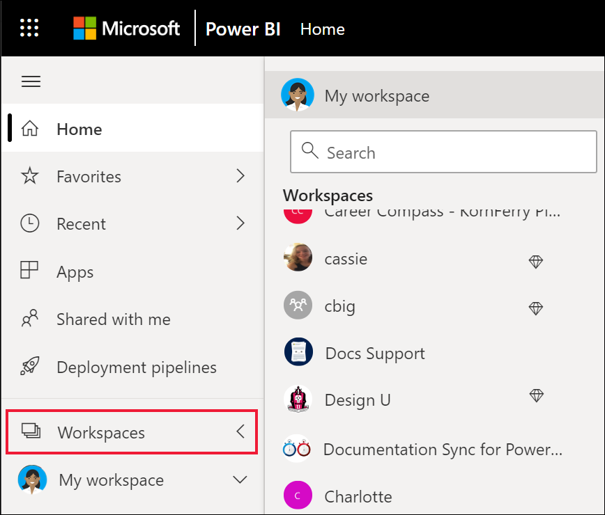

# ทำงานร่วมกันในพื้นที่ทำงาน

 *พื้นที่ทำงาน* คือสถานที่ที่จะร่วมงานกับเพื่อนร่วมงานในเนื้อหาเฉพาะ พื้นที่ทำงานถูกสร้างขึ้นโดย *นักออกแบบ* Power BI เพื่อเก็บคอลเลกชันของแดชบอร์ดและรายงาน นักออกแบบสามารถใช้พื้นที่ทำงานร่วมกับเพื่อนร่วมงานได้ นอกจากนี้นักออกแบบยังสามารถรวมคอลเลกชันของแดชบอร์ดและรายงานลงใน *แอป* และเผยแพร่ไปยังชุมชนทั้งหมด ไปยังองค์กร หรือไปยังบุคคลหรือเฉพาะกลุ่มได้ แอปบางชนิดเรียกว่า *แอปเทมเพลต* สร้างพื้นที่ทำงานเมื่อมีการติดตั้งแอป [เรียนรู้เพิ่มเติมเกี่ยวกับแอป](end-user-apps.md) 

 ทุกคนที่ใช้บริการของ Power BI ยังมี **พื้นที่ทำงานของฉัน** ด้วย  พื้นที่ทำงานของฉันคือ Sandbox ส่วนบุคคลที่คุณสามารถสร้างเนื้อหาสำหรับตัวคุณเองได้

 คุณสามารถดูพื้นที่ทำงานของคุณใน **หน้าหลัก** ของ Power BI หรือโดยการเลือก **พื้นที่ทำงาน** จากบานหน้าต่างการนำทางของคุณ

 

## ชนิดของพื้นที่ทำงาน
**พื้นที่ทำงานของฉัน** จัดเก็บเนื้อหาทั้งหมดที่คุณเป็นเจ้าของและสร้าง ให้คิดว่าเป็น sandbox ส่วนบุคคลของคุณหรือพื้นที่ทำงานสำหรับเนื้อหาของคุณเอง สำหรับ *ผู้ใช้ทางธุรกิจ* Power BI จำนวนมาก **พื้นที่ทำงานของฉัน** ยังว่างเปล่าเพราะงานของคุณไม่เกี่ยวข้องกับการสร้างเนื้อหาใหม่ *ผู้ใช้ทางธุรกิจ* โดยความหมายนั้น ใช้ข้อมูลที่สร้างขึ้นโดยผู้อื่นและใช้ข้อมูลนั้นเพื่อตัดสินใจทางธุรกิจ ถ้าคุณพบว่าคุณกำลังสร้างเนื้อหาอยู่ ลองอ่าน [บทความ Power BI สำหรับผู้ออกแบบ](../create-reports/index.yml) แทน

**พื้นที่ทำงาน** ประกอบด้วยเนื้อหาทั้งหมดสำหรับแอปเฉพาะนั้นๆ เมื่อ *ผู้ออกแบบ* สร้างแอป พวกเขาจะรวมเนื้อหาทั้งหมดที่จำเป็นสำหรับการใช้แอปนั้นเข้าด้วยกัน เนื้อหาอาจรวมถึงแดชบอร์ด รายงาน และชุดข้อมูล ไม่ใช่ทุกแอปจะมีเนื้อหาสามอย่างนี้ แอปอาจมีแดชบอร์ดเดียวเท่านั้น หรือเนื้อหาแต่ละประเภทสามรายการ หรือแม้แต่รายงานยี่สิบรายการ ทุกอย่างขึ้นอยู่กับสิ่งที่ *ผู้ออกแบบ* รวมอยู่ในแอป โดยทั่วไปแล้วพื้นที่ทำงานของแอปที่ใช้ร่วมกับ *ผู้ใช้ทางธุรกิจ*  ไม่มีชุดข้อมูล

พื้นที่ทำงานของการขาย Fig ด้านล่างประกอบด้วยรายงานสามรายการและแดชบอร์ดหนึ่งรายการ 

## สิทธิ์ในพื้นที่ทำงาน

สิทธิ์การเข้าถึงจะกำหนดสิ่งที่คุณสามารถทำได้ในพื้นที่ทำงานเพื่อให้ทีมสามารถทำงานร่วมกันได้  เมื่อให้สิทธิ์การเข้าถึงพื้นที่ทำงานใหม่ *นักออกแบบ* จะเพิ่มบุคคลหรือกลุ่มหนึ่งในบทบาทพื้นที่ทำงาน: **ผู้ชม** **สมาชิก** **ผู้สนับสนุน** หรือ **ผู้ดูแลระบบ** 

ในฐานะที่เป็น *ผู้ใช้ทางธุรกิจ* ของ Power BI โดยปกติแล้วคุณจะโต้ตอบในพื้นที่ทำงานโดยใช้บทบาท **ผู้ชม** แต่ *นักออกแบบ* ยังสามารถกำหนดบทบาทของ **สมาชิก** หรือ **ผู้สนับสนุน** ให้กับคุณได้ บทบาทผู้ชมช่วยให้คุณสามารถดูและโต้ตอบกับเนื้อหาได้ (แดชบอร์ด รายงาน แอป) ที่ผู้อื่นสร้างและแชร์กับคุณได้ และเนื่องจากบทบาทผู้ชมไม่สามารถเข้าถึงชุดข้อมูลเบื้องต้นได้ วิธีการนี้จึงเป็นวิธีที่ปลอดภัยในการโต้ตอบกับเนื้อหาและไม่ต้องกังวลว่าคุณจะ "ทำให้" ข้อมูลเบื้องต้นเสียหาย

สำหรับรายการโดยละเอียดของสิ่งที่คุณสามารถทำได้ในฐานะ *ผู้ใช้ทางธุรกิจ* กับบทบาทของผู้ชม โปรดดูที่ [คุณลักษณะ Power BI สำหรับผู้ใช้ทางธุรกิจ](end-user-features.md)

### สิทธิ์และบทบาทของพื้นที่ทำงาน

ต่อไปนี้คือความสามารถของทั้งสี่บทบาท: ผู้ดูแลระบบ สมาชิก ผู้สนับสนุน และผู้ชม ความสามารถเหล่านี้ทั้งหมด ยกเว้นการ *ดูและการโต้ตอบกับรายการ* ต้องใช้สิทธิ์การใช้งาน Power BI Pro

[!INCLUDE[power-bi-workspace-roles-table](../includes/power-bi-workspace-roles-table.md)]

## สิทธิ์การใช้งาน พื้นที่ทำงาน และความจุ
สิทธิ์การใช้งานยังเป็นส่วนหนึ่งในการกำหนดสิ่งที่คุณสามารถทำได้ คุณลักษณะหลายอย่างต้องมีผู้ใช้ที่มีสิทธิการใช้งาน Power BI *Pro* หรือสำหรับพื้นที่ทำงานที่จะจัดเก็บไว้ในความจุพรีเมียม 

บ่อยครั้งที่ *ผู้ใช้ทางธุรกิจ* ทำงานด้วยสิทธิ์การใช้ฟรี [เรียนรู้เพิ่มเติมเกี่ยวกับสิทธิ์การใช้งาน](end-user-license.md) ถ้าเนื้อหาไม่ได้ถูกจัดเก็บไว้ในความจุพรีเมียม ผู้ใช้ทางธุรกิจจะไม่สามารถเข้าถึงได้

ถ้ามีการจัดเก็บพื้นที่ทำงานไว้ในความจุระดับพรีเมียม *ผู้ใช้ทางธุรกิจ* จะสามารถดูและโต้ตอบกับเนื้อหาในพื้นที่ทำงานนั้นได้ ไอคอนเพชรระบุพื้นที่ทำงานที่จัดเก็บไว้ในความจุระดับพรีเมียม

 หากต้องการเรียนรู้เพิ่มเติม ให้ดู [สิทธิ์การใช้งานใดบ้างที่ฉันมี](end-user-license.md)

## ขั้นตอนถัดไป
* [แอปใน Power BI](end-user-apps.md)    

* มีคำถามหรือไม่ [ลองถามชุมชน Power BI](https://community.powerbi.com/)

