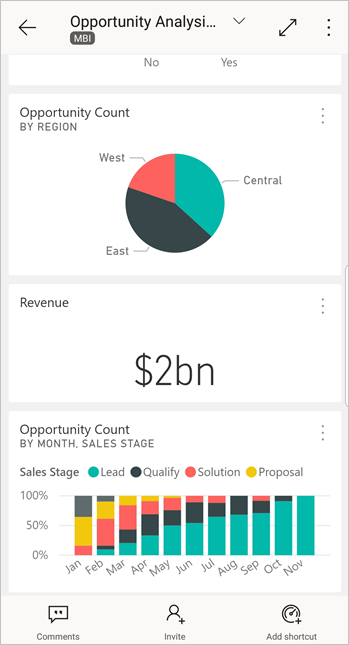
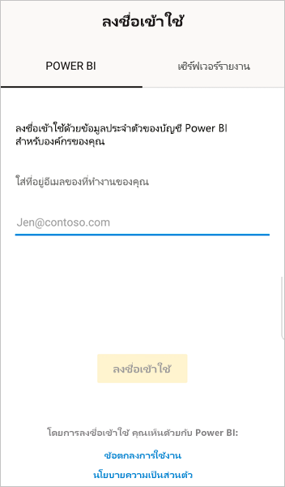
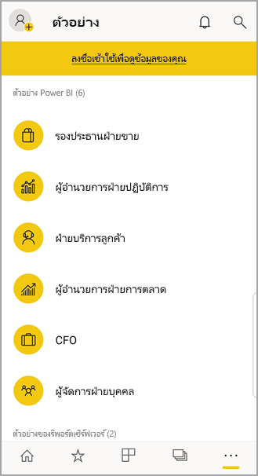

# เริ่มต้นใช้งานแอป Power BI สำหรับอุปกรณ์เคลื่อนที่ บนอุปกรณ์ AndroidGet started with the Power BI mobile app on Android devices
แอป Android สำหรับ Microsoft Power BI มอบประสบการณ์ BI บนอุปกรณ์เคลื่อนที่สำหรับ Power BI, เซิร์ฟเวอร์รายงาน Power BI และ Reporting ServicesThe Android app for Microsoft Power BI delivers the mobile BI experience for Power BI, Power BI Report Server, and Reporting Services. ดูและโต้ตอบกับแดชบอร์ดของบริษัทของคุณ ภายในองค์กรและในคลาวด์ จากที่ใดก็ได้ ผ่านอุปกรณ์เคลื่อนที่ ที่รองรับระบบสัมผัสและดูข้อมูลสดได้View and interact with your company dashboards on premises and in the cloud from anywhere, with live, touch-enabled mobile access. สำรวจข้อมูลในแดชบอร์ด และแชร์กับเพื่อนร่วมงานของคุณผ่านอีเมลหรือการส่งข้อความExplore the data in dashboards, and share with your colleagues in email or text messages. 

คุณสร้างรายงาน Power BI ใน Power BI Desktop และเผยแพร่:You create Power BI reports in Power BI Desktop, and publish them:

* [เผยแพร่ไปยังบริการของ Power BI](../../fundamentals/power-bi-overview.md) และสร้างแดชบอร์ด[Publish them to the Power BI service](../../fundamentals/power-bi-overview.md), and create dashboards.
* [เผยแพร่ภายในองค์กรไปยัง เซิร์ฟเวอร์รายงาน Power BI](../../report-server/quickstart-create-powerbi-report.md)[Publish them on premises to Power BI Report Server](../../report-server/quickstart-create-powerbi-report.md).

จากนั้น ในแอป Power BI สำหรับ Android คุณโต้ตอบกับแดชบอร์ดและรายงานของคุณ ไม่ว่าจะอยู่ภายในองค์กรหรืออยู่ในระบบคลาวด์Then in the Power BI app for Android, you interact with your dashboards and reports, whether on premises or in the cloud.

ดูว่า[มีอะไรใหม่ในแอป Power BI สำหรับอุปกรณ์เคลื่อนที่](mobile-whats-new-in-the-mobile-apps.md)Find out [what's new in the Power BI mobile apps](mobile-whats-new-in-the-mobile-apps.md).

## ข้อกำหนดเบื้องต้นPrerequisites

### รับแอปGet the app

[ดาวน์โหลดแอป Power BI สำหรับ Android](https://go.microsoft.com/fwlink/?LinkID=544867) จาก Google Play[Download the Power BI for Android app](https://go.microsoft.com/fwlink/?LinkID=544867) from Google Play.
  
Power BI สามารถทำงานบนอุปกรณ์ Android ที่ใช้ระบบปฏิบัติการ Android 5.0 หรือใหม่กว่าPower BI can run on a number of different Android devices, running the Android 5.0 operating system or later. เพื่อตรวจสอบอุปกรณ์ของคุณ ไปที่ **การตั้งค่า** > **เกี่ยวกับ** > **เวอร์ชันของ Android**To check on your device, go to **Settings** > **About device** > **Android version**. 

**เริ่มต้นเมื่อคุณเปิดแอป**  **Start when you open the app**    
ถึงแม้ว่าคุณจะยังไม่ลงทะเบียนหรือลงชื่อเข้าใช้ หลังจากที่คุณเปิดแอปแล้วคุณสามารถพลิกดูหน้าลงชื่อเข้าใช้ สำหรับภาพรวมของสิ่งที่คุณสามารถทำได้ ด้วยแอป Power BI บนอุปกรณ์ Android ของคุณEven without signing up or signing in, after you open the app you can flip through the sign-in pages for a quick overview of things you can do with the Power BI app on your Android device. แตะ **ข้าม** เพื่อดูและสำรวจตัวอย่าง และทดลองประสบการณ์การใช้งานกับแอปTap **Skip** to view and explore the samples, and get hands-on experience with the app. คุณสามารถ[กลับไปยังตัวอย่าง](mobile-android-app-get-started.md#try-the-power-bi-and-reporting-services-samples) เมื่อใดก็ตามที่คุณต้องการ จากโฮมเพจแดชบอร์ดได้You can [go back to the samples](mobile-android-app-get-started.md#try-the-power-bi-and-reporting-services-samples) whenever you want from the dashboards home page.

ดูว่า[มีอะไรใหม่ในแอป Power BI สำหรับอุปกรณ์เคลื่อนที่](mobile-whats-new-in-the-mobile-apps.md)Find out [what's new in the Power BI mobile apps](mobile-whats-new-in-the-mobile-apps.md).

## ลงทะเบียนสำหรับบริการของ Power BI บนเว็บSign up for the Power BI service on the web
ถ้าคุณยังไม่ได้ลงทะเบียน ไปที่ [บริการของ Power BI](https://powerbi.com/) เพื่อลงทะเบียนบัญชีของคุณ สำหรับสร้างและจัดเก็บแดชบอร์ดและรายงาน และนำข้อมูลของคุณรวมเข้าด้วยกันIf you haven't signed up yet, go to the [Power BI service](https://powerbi.com/) to sign up for your own account for creating and storing dashboards and reports, and bringing your data together. จากนั้น ลงชื่อเข้าใช้ Power BI จากอุปกรณ์ Android ของคุณเพื่อดูแดชบอร์ดของคุณเองจากที่ไหนก็ได้Then sign in to Power BI from your Android device to see your own dashboards from anywhere.

1. ในบริการของ Power BI แตะ [ลงทะเบียน](https://go.microsoft.com/fwlink/?LinkID=513879) เพื่อสร้างบัญชี Power BIIn the Power BI service, tap [Sign up](https://go.microsoft.com/fwlink/?LinkID=513879) to create a Power BI account.
2. เริ่มต้น[สร้างแดชบอร์ดและรายงานของคุณเอง](../../fundamentals/service-get-started.md)Start [creating your own dashboards and reports](../../fundamentals/service-get-started.md).

## เริ่มต้นใช้งานแอป Power BI บนอุปกรณ์ของคุณGet started with the Power BI app on your device
1. บนอุปกรณ์ Android ของคุณ จากหน้าจอเริ่มต้น เปิดแอป Power BI สำหรับ AndroidOn your Android device, from the start screen open the Power BI for Android app.
   
   
2. หากต้องการลงชื่อเข้าใช้ Power BI ให้แตะแท็บ **Power BI** และกรอกรายละเอียดการลงชื่อเข้าใช้ของคุณTo sign in to Power BI, tap the **Power BI** tab and fill in your sign-in details.

    ถ้าคุณได้รับข้อความว่า Power BI ไม่สามารถลงชื่อคุณเข้าใช้ ดูที่ ["ไม่สามารถรับรองความถูกต้องได้เนื่องจากใบรับรอง SSL ของบริษัทของคุณไม่น่าเชื่อถือ"](mobile-android-app-error-corporate-ssl-account-is-untrusted.md) สำหรับรายละเอียดวิธีการแก้ปัญหานี้If you get a message that Power BI can't sign you in, see ["Could not authenticate because your corporate SSL certificate is untrusted"](mobile-android-app-error-corporate-ssl-account-is-untrusted.md) for details on how to resolve the issue.

   หากต้องการลงชื่อเข้าใช้รายงานมือถือและ KPI ของ Reporting Services ของคุณให้แตะแท็บ **เซิร์ฟเวอร์รายงาน** และกรอกรายละเอียดการลงชื่อเข้าใช้ของคุณTo sign in to your Reporting Services mobile reports and KPIs, tap the **Report server** tab and fill in your sign-in details.
   
   

## ลองใช้ตัวอย่าง Power BI และ Reporting ServicesTry the Power BI and Reporting Services samples
แม้ว่าจะยังไม่ลงทะเบียน คุณสามารถดูและโต้ตอบกับตัวอย่าง Power BI และ Reporting Services ได้Even without signing up, you can view and interact with the Power BI and Reporting Services samples.

หากต้องการเข้าถึงตัวอย่าง ให้แตะ **ตัวเลือกเพิ่มเติม** (...) บนแถบนำทางและเลือก **ตัวอย่าง**.To access the samples, tap **More options** (...) on the navigation bar and choose **Samples**.

จำนวนตัวอย่างของ Power BI จะตามด้วยตัวอย่างของเซิร์ฟเวอร์รายงานหลายรายการA number of Power BI samples are followed by several Report server samples.
   
   

   
   > [!NOTE]
   > ไม่สามารถใช้งานคุณลักษณะทั้งหมดได้ในตัวอย่างNot all features are available in the samples. ตัวอย่างเช่น คุณไม่สามารถดูรายงานตัวอย่างทีอยู่ใต้แดชบอร์ด คุณไม่สามารถแชร์ตัวอย่างกับผู้อื่นได ้และคุณไม่สามารถทำให้เป็นรายการโปรดของคุณได้For example, you can't view the sample reports that underlie the dashboards, you can't share the samples with others, and you can't make them your favorites. 
   > 
   >

## ค้นหาเนื้อหาของคุณในแอป Power BI สำหรับอุปกรณ์เคลื่อนที่Find your content in the Power BI mobile apps

แตะแว่นขยายในส่วนหัวเพื่อเริ่มค้นหาเนื้อหา Power BI ของคุณTap the magnifying glass in the header to start searching for your Power BI content.

## ดูแดชบอร์ดและรายงานโปรดของคุณView your favorite dashboards and reports
แตะ **รายการโปรด** () บนแถบนำทางเพื่อดูหน้ารายการโปรดของคุณTap **Favorites** () on the navigation bar to view your Favorites page. 

อ่านข้อมูลเพิ่มเติมเกี่ยวกับ [รายการโปรดในแอป Power BI สำหรับอุปกรณ์เคลื่อนที่](mobile-apps-favorites.md)Read more about [favorites in the Power BI mobile apps](mobile-apps-favorites.md).

## การสนับสนุนองค์กรสำหรับแอปสำหรับอุปกรณ์เคลื่อนที่ Power BIEnterprise support for the Power BI mobile apps
องค์กรสามารถใช้ Microsoft Intune เพื่อจัดการอุปกรณ์และแอปพลิเคชัน รวมถึงแอป Power BI สำหรับอุปกรณ์เคลื่อนที่ สำหรับ Android และ iOSOrganizations can use Microsoft Intune to manage devices and applications, including the Power BI mobile apps for Android and iOS.

Microsoft Intune ช่วยให้องค์กรควบคุมรายการ เช่น การบังคับใช้ Pin เพื่อเข้าใช้งาน การควบคุมวิธีจัดการกับข้อมูลโดยแอปพลิเคชัน หรือแม้แต่ารเข้ารหัสลับข้อมูลแอปพลิเคชันเมื่อไม่ได้ใช้งานMicrosoft Intune lets organizations control items like requiring an access pin, controlling how data is handled by the application, and even encrypting application data when the app isn't in use.

> [!NOTE]
> ถ้าคุณใช้แอป Power BI สำหรับอุปกรณ์เคลื่อนที่ บนอุปกรณ์ Android ของคุณ และองค์กรของคุณได้กำหนดค่า Microsoft Intune MAM การรีเฟรชข้อมูลพื้นหลังจะถูกปิดใช้งานIf you use the Power BI mobile app on your Android device and your organization has configured Microsoft Intune MAM, then background data refresh is turned off. Power BI จะรีเฟรชข้อมูลจากบริการของ Power BI บนเว็บ ในครั้งต่อไปที่คุณเข้าใช้งานแอปThe next time you enter the app, Power BI refreshes the data from the Power BI service on the web.
> 
> 

อ่านเพิ่มเติมเกี่ยวกับ[การกำหนดค่าแอปโทรศัพท์เคลื่อนที่ Power BI ด้วย Microsoft Intune](../../admin/service-admin-mobile-intune.md)Read more about [configuring Power BI mobile apps with Microsoft Intune](../../admin/service-admin-mobile-intune.md). 

## ขั้นตอนถัดไปNext steps
ต่อไปนี้คือสิ่งอื่น ๆ ที่คุณสามารถทำได้ในแอปอุปกรณ์ Android สำหรับ Power BI ที่มีแดชบอร์ดและรายงานใน Power BI, รายงานและ KPI ในพอร์ทัลของเว็บเซิร์ฟเวอร์รายงาน Power BI หรือ Reporting ServicesHere are some other things you can do in the Android device app for Power BI with dashboards and reports in Power BI, and reports and KPIs in the Power BI Report Server or Reporting Services web portal.

### แดชบอร์ดและรายงาน Power BIPower BI dashboards and reports
* ดู[แอปของคุณ](../../collaborate-share/service-create-distribute-apps.md)View [your apps](../../collaborate-share/service-create-distribute-apps.md).
* ดู[แดชบอร์ด](mobile-apps-view-dashboard.md)ของคุณView your [dashboards](mobile-apps-view-dashboard.md).
* สำรวจ[ไทล์บนแดชบอร์ดของคุณ](mobile-tiles-in-the-mobile-apps.md)Explore the [tiles on your dashboards](mobile-tiles-in-the-mobile-apps.md).
* เปิด[รายงาน Power BI](mobile-reports-in-the-mobile-apps.md)Open [Power BI reports](mobile-reports-in-the-mobile-apps.md).
* ดู[แอปของคุณ](../../collaborate-share/service-create-distribute-apps.md)View [your apps](../../collaborate-share/service-create-distribute-apps.md).
* [ใส่คำอธิบายประกอบ และแชร์ไทล์](mobile-annotate-and-share-a-tile-from-the-mobile-apps.md)[Annotate and share tiles](mobile-annotate-and-share-a-tile-from-the-mobile-apps.md).
* แชร์[แดชบอร์ด](mobile-share-dashboard-from-the-mobile-apps.md)Share [dashboards](mobile-share-dashboard-from-the-mobile-apps.md).
* [สแกนรหัส QR Power BI](mobile-apps-qr-code.md) ด้วยมือถือ Android ของคุณ เพื่อเปิดไทล์แดชบอร์ดหรือรายงานที่เกี่ยวข้อง[Scan a Power BI QR code](mobile-apps-qr-code.md) with your Android phone to open a related dashboard tile or report. 
* ดู[การแจ้งเตือนเกี่ยวกับอัปเดตต่าง ๆ ในบัญชี Power BI ของคุณ](mobile-apps-notification-center.md) เช่นแดชบอร์ดที่เพื่อนร่วมงานแชร์ให้คุณView [notifications about updates to your Power BI account](mobile-apps-notification-center.md), such as dashboards that colleagues share with you.

### รายงานและ KPI บนพอร์ทัลของเว็บเซิร์ฟเวอร์รายงาน Power BI และ Reporting ServicesReports and KPIs on the Power BI Report Server and Reporting Services web portals
* [ดูรายงานและ KPI บนพอร์ทัลของเว็บ](mobile-app-ssrs-kpis-mobile-on-premises-reports.md)ในแอป Power BI สำหรับอุปกรณ์เคลื่อนที่ สำหรับอุปกรณ์ Android[View reports and KPIs on the web portal](mobile-app-ssrs-kpis-mobile-on-premises-reports.md) in the Power BI mobile app for Android devices.
* สร้าง [KPI บนพอร์ทัลของเว็บ](/sql/reporting-services/working-with-kpis-in-reporting-services)Create [KPIs on the web portal](/sql/reporting-services/working-with-kpis-in-reporting-services).
* สร้าง [รายงานใน Power BI Desktop และเผยแพร่รายการนั้น ๆ บนพอร์ทัลของเว็บเซิร์ฟเวอร์รายงาน Power BI](../../report-server/quickstart-create-powerbi-report.md)Create [reports in Power BI Desktop and publish them on the Power BI Report Server](../../report-server/quickstart-create-powerbi-report.md) web portal

### อาจดูได้จากSee also
* [ดาวน์โหลดแอป Android](https://go.microsoft.com/fwlink/?LinkID=544867) จาก Android app store[Download the Android app](https://go.microsoft.com/fwlink/?LinkID=544867) from the Android app store.
* [Power BI คืออะไรWhat is Power BI?](../../fundamentals/power-bi-overview.md)
* มีคำถามหรือไม่Questions? [ลองถามชุมชน Power BITry asking the Power BI Community](https://community.powerbi.com/)