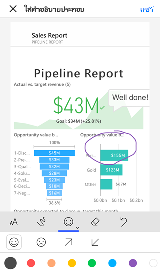
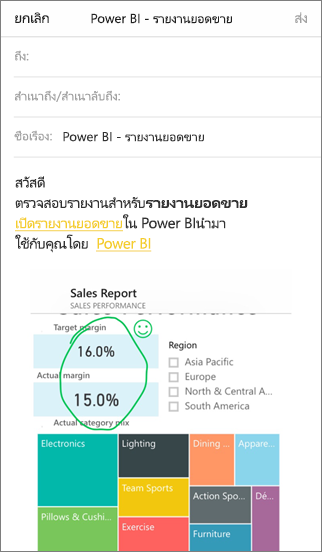

# ใส่คำอธิบายประกอบ และแชร์ไทล์ รายงาน หรือรูปภาพในแอปสำหรับอุปกรณ์เคลื่อนที่ของ Power BIAnnotate and share a tile, report, or visual in Power BI mobile apps
ใช้ได้กับ:Applies to:

|  |  |  |  |
|:--- |:--- |:--- |:--- |
| iPhonesiPhones |iPadiPads |มือถือ AndroidAndroid phones |แท็บเล็ต AndroidAndroid tablets |

คุณสามารถใส่คำอธิบายประกอบ และแชร์สแนปช็อตของไทล์ รายงาน หรือภาพจากอุปกรณ์เคลื่อนที่ Power BI สำหรับอุปกรณ์ iOS และ AndroidYou can annotate and share a snapshot of a tile, report, or visual from the Power BI mobile app for iOS and Android devices. ผู้รับของคุณเห็นเหมือนกับเวลาที่คุณส่งเมล์ รวมถึงลิงก์Your recipients see it exactly as it was when you sent the mail, plus a link. คุณสามารถส่งสแนปช็อตของไทล์ให้ทุกคน ไม่เพียงเพื่อนร่วมงานในโดเมนอีเมลเดียวกันเท่านั้นYou can send snapshots of tiles to anyone — not just colleagues in the same email domain. คุณสามารถเพิ่มคำอธิบายประกอบ บรรทัด ข้อความ หรือประทับตรา ก่อนที่คุณแชร์ได้You can add annotations — lines, text, or stamps — before you share it.

*รายงานที่มีคำอธิบายประกอบ**A report with annotations*

จดหมายที่ มีสแนปช็อตของไทล์ รายงาน หรือรูปภาพที่ยังมีลิงก์ไปยังวัตถุจริงบน Power BI service ([https://powerbi.com](https://powerbi.com))The mail with the snapshot of the tile, report, or visual also includes a link to the actual object on the Power BI service ([https://powerbi.com](https://powerbi.com)). ผู้รับของคุณสามารถคลิกลิงก์ และไปยังที่ไทล์ รายงาน หรือรูปภาพวิชวล ถ้าคุณและพวกเขามีสิทธิ์การใช้งาน Power BI Pro หรือเนื้อหาอยู่ใน[ความจุพรีเมียม](../../admin/service-premium-what-is.md)และคุณได้แชร์รายการกับบุคคลเหล่านั้นYour recipients can click the link and go straight to that tile, report, or visual, if you and they have Power BI Pro licenses, or the content is in a [Premium capacity](../../admin/service-premium-what-is.md), and you've already shared the item with them. 

คุณสามารถ[แชร์ไทล์จากแอป mobile Power BI ให้กับอุปกรณ์ Windows 10](mobile-windows-10-phone-app-get-started.md) แช่นกัน แต่อย่าใส่คำอธิบายประกอบYou can [share a tile from the Power BI mobile app for Windows 10 devices](mobile-windows-10-phone-app-get-started.md), too, but not annotate it.

## เปิดไทล์สำหรับใส่คำอธิบายประกอบOpen a tile for annotating
1. แตะไทล์เพื่อเปิดในโหมดโฟกัสTap the tile to open it in focus mode.
2. แตะไอคอนใส่คำอธิบายประกอบTap the annotate icon  ในมุมขวาบนของไทล์in the upper-right corner of the tile.
3. คุณพร้อมที่จะ[ใส่คำอธิบายประกอบและแชร์ไทล์](mobile-annotate-and-share-a-tile-from-the-mobile-apps.md#annotate-and-share-the-tile-report-or-visual)You're ready to [annotate and share the tile](mobile-annotate-and-share-a-tile-from-the-mobile-apps.md#annotate-and-share-the-tile-report-or-visual).

## เปิดรายงานสำหรับใส่คำอธิบายประกอบOpen a report for annotating
1. เปิดรายงานOpen a report. 
2. แตะไอคอนใส่คำอธิบายประกอบTap the annotate icon  ในมุมขวาบนของรายงานin the upper-right corner of the report.
3. คุณพร้อมที่จะ[ใส่คำอธิบายประกอบและแชร์รายงาน](mobile-annotate-and-share-a-tile-from-the-mobile-apps.md#annotate-and-share-the-tile-report-or-visual)You're ready to [annotate and share the report](mobile-annotate-and-share-a-tile-from-the-mobile-apps.md#annotate-and-share-the-tile-report-or-visual).

## เปิดรูปภาพสำหรับใส่คำอธิบายประกอบOpen a visual for annotating
1. ในรายงาน แตะรูปภาพ จากนั้นแตะไอคอนขยายเพื่อเปิดในโหมดโฟกัสIn a report, tap a visual, then tap the expand icon to open it in focus mode. 
   
    
2. แตะไอคอนใส่คำอธิบายประกอบTap the annotate icon  ในมุมขวาบนของรูปภาพin the upper-right corner of the visual.
3. คุณพร้อมที่จะ[ใส่คำอธิบายประกอบและแชร์รูปภาพ](mobile-annotate-and-share-a-tile-from-the-mobile-apps.md#annotate-and-share-the-tile-report-or-visual)You're ready to [annotate and share the visual](mobile-annotate-and-share-a-tile-from-the-mobile-apps.md#annotate-and-share-the-tile-report-or-visual).

## ใส่คำอธิบายประกอบ และแชร์ไทล์ รายงาน หรือรูปภาพAnnotate and share the tile, report, or visual
1. นี่คือวิธีคุณเขียนคำอธิบายHere's how you annotate:  
   
   
   
   *แถบคำอธิบายประกอบใน iPhones และ iPads**The annotation bar in iPhones and iPads*
   
   
   
   *แถบคำอธิบายประกอบในอุปกรณ์ Android**The annotation bar in Android devices*
   
   * เมื่อต้องวาดเส้นของสีและความหนาที่ต่างกัน ให้แตะไอคอนเส้นหยัก เลือกความกว้างและสี แล้ววาดTo draw lines of different colors and thicknesses, tap the squiggly-line icon, choose a width and color, and draw.  
   * เมื่อต้องพิมพ์ข้อคิดเห็น แตะ **AA** ให้เลือกขนาด สี และชนิดข้อความTo type comments, tap the **AA**, choose the text size and color, and type.  
   * เมื่อต้องวางตราประทับ(เช่นอิโมติคอน) บนไทล์ แตะหน้ายิ้ม เลือกสี และแตะจุดที่คุณต้องการTo paste stamps (like emoticons) on the tile, tap the smiley face, choose a color, and tap where you want them.   
2. หลังจากที่ใส่คำอธิบายประกอบ ให้แตะ **แชร์** ในมุมขวาบนAfter annotating, tap **Share** in the upper-right corner.
3. เปิดแอปอีเมล์ของคุณ พิมพ์ชื่อของผู้รับ และปรับเปลี่ยนข้อความถ้าคุณต้องการOpen your mail app, type the recipients' names, and modify the message, if you want.  
   
   
   
   อีเมล์มีรูปภาพ และการเชื่อมโยงไปยังไทล์เฉพาะ รายงาน หรือรูปภาพวิชวลThe mail has an image, and a link to the specific tile, report, or visual. 
4. แตะ **ส่ง**Tap **Send**.

## ขั้นตอนถัดไปNext steps
* [แชร์แดชบอร์ดจากแอป Power BI mobile Share a dashboard from the Power BI mobile apps](mobile-share-dashboard-from-the-mobile-apps.md)
* มีคำถามหรือไม่?Questions? [ลองถามชุมชน Power BITry asking the Power BI Community](https://community.powerbi.com/)
