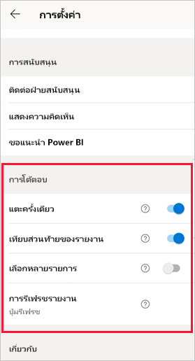
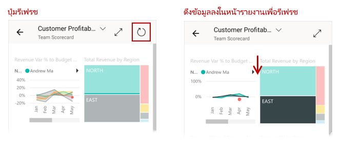
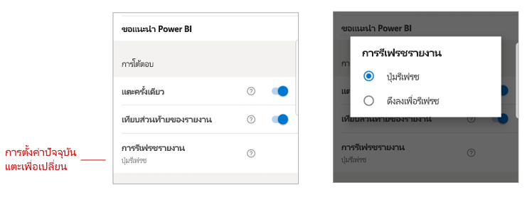

# กำหนดค่าการตั้งค่าการโต้ตอบของรายงานConfigure report interaction settings

## ภาพรวมOverview

แอป Power BI สำหรับอุปกรณ์เคลื่อนที่มีจำนวนการตั้งค่า "การโต้ตอบ" ที่สามารถกำหนดค่าได้ที่ช่วยให้คุณสามารถควบคุมวิธีการที่คุณโต้ตอบกับข้อมูลของคุณ และเพื่อกำหนดวิธีที่องค์ประกอบบางอย่างในแอป Power BI สำหรับอุปกรณ์เคลื่อนที่ทำงานThe Power BI mobile app has a number of configurable "interaction" settings that enable you to control how you interact with your data, and to define how some elements in the Power BI mobile app behave. ตารางด้านล่างแสดงการตั้งค่าการโต้ตอบที่พร้อมใช้งานและอุปกรณ์ที่มีอยู่ในขณะนี้The table below shows the interaction settings that are currently available and the devices which have them.

| การตั้งค่าSetting | โทรศัพท์ AndroidAndroid phone | iPhoneiPhone | แท็บเล็ต AndroidAndroid tablet  | iPadiPad |
|---------|:-:|:-:|:-:|:-:|
| [การโต้ตอบแบบแตะครั้งเดียวเทียบกับการโต้ตอบแบบแตะสองครั้งบนวิชวลรายงานSingle versus double tap interaction on report visuals](#single-tap) |✔✔|✔✔|||
| [การเลือกหลายรายการเทียบกับการเลือกจุดข้อมูลเพียงครั้งเดียวบนการแสดงผลด้วย รายงานวีชวลMulti-select versus single select of data points on report visuals](#multi-select) |✔✔|✔✔|✔✔|✔✔|
| [ส่วนท้ายของรายงานที่เทียบกับรายงานแบบไดนามิกDocked versus dynamic report footer](#docked-report-footer) |✔✔|✔✔|||
| [ปุ่มการรีเฟรชรายงานปุ่มแบบดึงลง Button-initiated report refresh versus pull-to-refresh](#report-refresh) |✔✔||||

เมื่อต้องการไปที่การตั้งค่าการโต้ตอบ ให้แตะรูปภาพโปรไฟล์ของคุณเพื่อเปิด [แผงด้านข้าง](./mobile-apps-home-page.md#header) เลือก **การตั้งค่า** และค้นหาส่วน **การโต้ตอบ**To get to the interaction settings, tap your profile picture to open the [side panel](./mobile-apps-home-page.md#header), choose **Settings**, and find the **Interaction** section.

การตั้งค่าการโต้ตอบได้รับการอธิบายไว้ในส่วนด้านล่างThe interaction settings are described in the sections below.

## การตั้งค่าการโต้ตอบInteraction settings

### แตะครั้งเดียวSingle tap
เมื่อคุณดาวน์โหลดแอป Power BI สำหรับอุปกรณ์เคลื่อนที่ จะมีการตั้งค่าสำหรับการโต้ตอบแบบแตะครั้งเดียวWhen you download the Power BI mobile app, it is set for single tap interaction. ซึ่งหมายความว่าเมื่อคุณแตะในวิชวลเพื่อทำการดำเนินการบางอย่างเช่น การเลือกรายการตัวแบ่งส่วนข้อมูล การเน้นข้าม การคลิกที่ลิงก์หรือปุ่ม ฯลฯ การแตะทั้งสองเลือกวิชวลและดำเนินการตามที่คุณต้องการThis means that when you tap in a visual to do some action, such as selecting a slicer item, cross highlighting, clicking on a link or button, etc., the tap both selects the visual and performs the action you wanted.

ถ้าคุณต้องการ คุณสามารถปิดการโต้ตอบแบบแตะครั้งเดียวได้If you prefer, you can switch off single tap interaction. จากนั้นคุณจะสามารถใช้การแตะแบบสองครั้งได้You then have double-tap interaction. ด้วยการแตะสองครั้ง การแตะครั้งแรกที่วิชวลเพื่อเลือก และจากนั้นแตะอีกครั้งในวิชวลเพื่อดำเนินการตามที่คุณต้องการWith double tap interaction, you first tap on a visual to select it, and then tap again in the visual to perform your desired action.

### เลือกหลายรายการMulti-select

ตัวเลือกแบบหลายตัวเลือกทำให้สามารถเลือกจุดข้อมูลหลาย ๆ จุดในหน้ารายงานได้The multi-select option makes it possible to select multiple data points on a report page. เมื่อเปิดใช้งานการเลือกได้หลายจุดข้อมูล แต่ละจุดที่คุณแตะจะถูกเพิ่มไปยังจุดข้อมูลอื่นที่เลือกพร้อมกับผลลัพธ์ที่รวมกันจะถูกไฮไลท์โดยอัตโนมัติในทุกๆ ภาพของหน้าWhen multi-select is turned on, each data point you tap gets added to the other selected data points, with the combined results automatically highlighted in all the visuals on the page. เมื่อเลือกหลายรายการปิดเมื่อคุณแตะเพื่อเลือกจุดข้อมูลการเลือกใหม่จะแทนที่การเลือกปัจจุบันWhen multi-select is off, when you tap to select a data point, the new selection replaces the current selection.

หากต้องการยกเลิกการเลือกจุดข้อมูลให้แตะอีกครั้งTo unselect a data point, tap it again.

>[!NOTE]
>การเลือกหลายรายการไม่ได้รับการสนับสนุนในวิชวล Power BIMulti-select is not supported in Power BI visuals.
>
>โหมดการเลือกได้หลายจุดข้อมูลจะได้รับการรองรับบนเซิร์ฟเวอร์รายงาน Power BI ในรุ่นเซิร์ฟเวอร์รายงานถัดไปMulti-select mode will be supported on Power BI Report Server in the next Report Server release.

### เทียบส่วนท้ายของรายงานDocked report footer

การตั้งค่าส่วนท้ายของรายงานที่เทียบชิดขอบจะกำหนดว่าส่วนท้ายรายงานยังคงเทียบชิดขอบหรือไม่ (เช่น คงที่และมองเห็นได้เสมอ) ที่ด้านล่างของรายงาน หรือซ่อนและปรากฏขึ้นใหม่ตามการดำเนินการของคุณในรายงานเช่น การเลื่อนThe docked report footer setting determines whether the report footer remains docked (i.e. fixed and always visible) at the bottom of the report, or hides and reappears based on your actions in the report, such as scrolling.

บนโทรศัพท์ Android การตั้งค่าส่วนท้ายของรายงานที่เทียบชิดขอบจะ **เปิด** ตามค่าเริ่มต้น ซึ่งหมายความว่าส่วนท้ายของรายงานจะถูกเทียบชิดขอบและแสดงอยู่ที่ด้านล่างของรายงานเสมอOn Android phones the docked report footer setting is **on** by default, meaning that the report footer is docked and always visible at the bottom of the report. สลับการตั้งค่าเป็น **ปิด** ถ้าคุณต้องการให้ส่วนท้ายรายงานแบบไดนามิกที่ปรากฏและหายไป โดยขึ้นอยู่กับการดำเนินการของคุณในรายงานSwitch the setting to **off** if you prefer a dynamic report footer that appears and disappears, depending on your actions on the report.

### การรีเฟรชรายงานReport refresh

การตั้งค่าการรีเฟรชรายงานจะกำหนดวิธีการเริ่มต้นรีเฟรชรายงานของคุณThe report refresh setting defines how you initiate report refreshes. คุณสามารถเลือกจะเพิ่มปุ่มรีเฟรชลงในส่วนหัวของรายงานทั้งหมด หรือใช้การดำเนินการดึงเพื่อรีเฟรช (ดึงลงเล็กน้อยจากบนลงล่าง) ในหน้ารายงานเพื่อรีเฟรชรายงานYou can choose either to have a refresh button on all report headers, or to use the pull-to-refresh action (pulling down slightly from top to bottom) on the report page to refresh the report. รูปด้านล่างแสดงทางเลือกสองทางThe figure below illustrates the two alternatives. 

บนโทรศัพท์ Android ปุ่มรีเฟรชจะถูกเพิ่มตามค่าเริ่มต้นOn Android phones a refresh button is added by default.

เมื่อต้องการเปลี่ยนการตั้งค่าการรีเฟรชรายงาน ให้ไปที่รายการรีเฟรชรายงานในการตั้งค่าการโต้ตอบTo change the report refresh setting, go to the report refresh item in the interaction settings. การตั้งค่าปัจจุบันจะแสดงขึ้นThe current setting is shown. แตะค่าเพื่อเปิดป็อปอัพที่คุณสามารถเลือกค่าใหม่ได้Tap the value to open a pop-up where you can choose a new value.

## การกำหนดค่าระยะไกลRemote configuration

การโต้ตอบยังสามารถกำหนดค่าจากระยะไกลโดยผู้ดูแลระบบโดยใช้เครื่องมือ MDM ที่มีไฟล์การกำหนดค่าแอปInteractions can also be configured remotely by an administrator using an MDM tool with an app configuration file. ด้วยวิธีนี้ คุณสามารถปรับมาตรฐานประสบการณ์การโต้ตอบรายงานทั่วทั้งองค์กร หรือกลุ่มผู้ใช้เฉพาะในองค์กรIn this way it is possible to standardize the report interaction experience across the organization or for specific groups of users in the organization. ดู [กำหนดค่าการโต้ตอบโดยใช้การจัดการอุปกรณ์เคลื่อนที่](./mobile-app-configuration.md) สำหรับรายละเอียดSee [Configure interaction using mobile device management](./mobile-app-configuration.md) for detail.

## ขั้นตอนถัดไปNext steps
* [การตอบโต้กับรายงานInteracting with reports](./mobile-reports-in-the-mobile-apps.md#interact-with-reports)
* [กำหนดค่าการโต้ตอบโดยใช้การจัดการอุปกรณ์เคลื่อนที่Configure interaction using mobile device management](./mobile-app-configuration.md)
