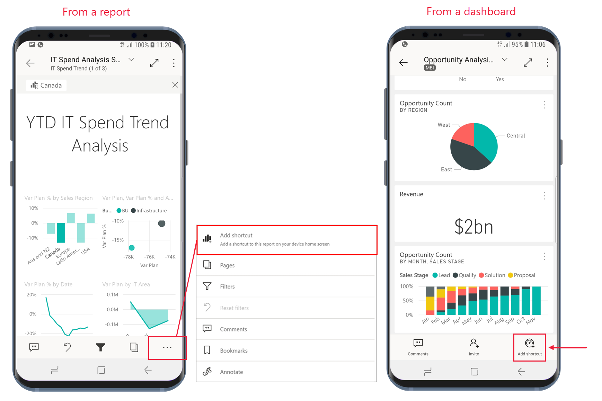
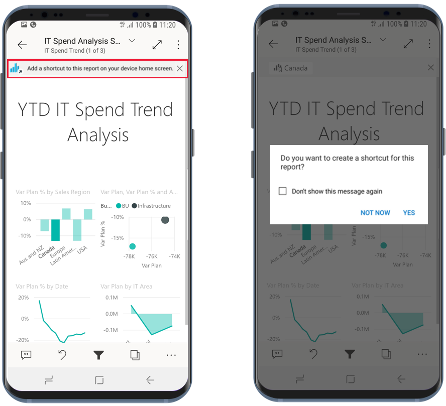
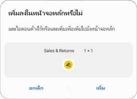
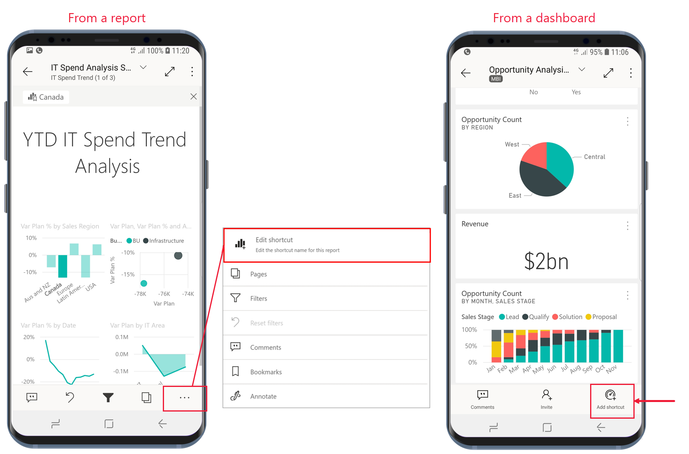
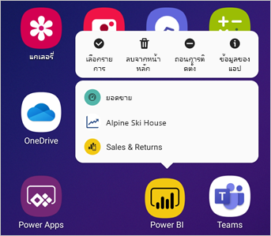

# ใช้ทางลัดแอปแอนดรอยด์ในแอป Power BI สำหรับแอนดรอยด์Use Android app Shortcuts in the Power BI Android app

นำไปใช้กับ:Applies to:

|  |  |
|:--- |:--- |
| โทรศัพท์ AndroidAndroid phones |แท็บเล็ต AndroidAndroid tablets |

แอป Power BI สำหรับอุปกรณ์เคลื่อนที่บนแอนดรอยด์มีวิธีการรับรายงานหรือแดชบอร์ดที่คุณต้องการโดยไม่ต้องเลื่อนผ่านแอปแบบง่าย ๆ สองวิธี: **ทางลัดบนหน้าจอหลักของอุปกรณ์** และ **ทางลัดตัวเปิดใช้แอป**The Power BI mobile app for Android provides two easy ways to get straight to the reports or dashboards you need, without having to navigate through the app: **device home screen shortcuts** and **app launcher shortcuts**.
 * **ทางลัดบนหน้าจอหลักของอุปกรณ์**: คุณสามารถสร้างทางลัดไปยังรายงานหรือแดชบอร์ด และปักหมุดไปไว้บนหน้าจอหลักของอุปกรณ์ของคุณได้**Device home screen shortcuts**: You can create a shortcut to any report or dashboard and pin it to your device's home screen. รายงานหรือแดชบอร์ดไม่จำเป็นต้องอยู่ในหนึ่งในพื้นที่ทำงานของคุณ เพราะคุณสามารถสร้างทางลัดไปยังรายงานและแดชบอร์ดที่อยู่ภายในแอป หรือแม้กระทั่งรายงานหรือแดชบอร์ดที่อยู่กับผู้เช่าภายนอก (B2B) ได้ด้วยThe report or dashboard doesn't have to be in one of your workspaces - you can also create shortcuts to reports and dashboards that are inside apps, or even to reports or dashboards that are located on an external (B2B) tenant.
 * **ทางลัดเปิดใช้แอป**: คุณสามารถเข้าถึงรายงานและแดชบอร์ดที่ดูบ่อยได้โดยตรง โดยการแตะที่ไอคอนตัวเปิดใช้แอปบนหน้าจอหลักของอุปกรณ์ของคุณเพื่อเปิดตัวเปิดใช้แอป**App launcher shortcuts**: You can get directly to frequently viewed reports and dashboards just by doing a long tap on the app launcher icon on your device's home screen to open the app launcher. เมนูการเข้าถึงด่วนจะมีทางลัดไปยังรายการที่มีการดูบ่อยสามรายการA quick access menu provides shortcuts to three frequently viewed items. รายการเหล่านี้จะเปลี่ยนแปลงไปเป็นระยะ โดยแอป Power BI สำหรับอุปกรณ์เคลื่อนที่จะติดตามสิ่งที่คุณดูบ่อยครั้งแล้วปรับเปลี่ยนทางลัดให้เหมาะสมThese items change from time to time - the Power BI mobile app keeps track of what you're viewing often and changes the shortcuts accordingly.

 >[!NOTE]
 >ทางลัดของแอปสำหรับแอนดรอยด์จะสามารถใช้งานได้ตั้งแต่แอนดรอยด์เวอร์ชัน 8 ขึ้นไปAndroid app shortcuts are available from Android 8 and higher.

## สร้างทางลัดไปยังรายงานหรือแดชบอร์ดต่าง ๆCreate a shortcut to any report or dashboard

คุณสามารถสร้างทางลัดไปยังรายงานหรือแดชบอร์ดต่าง ๆ ได้You can create shortcuts to any report or dashboard.

1. จากรายงานบนเมนูการดำเนินการ ให้แตะ **ตัวเลือกเพิ่มเติม...** และเลือก **เพิ่มทางลัด**From a report, on the Actions menu, tap **More options...** and select **Add shortcut**. จากแดชบอร์ด ให้แตะ **เพิ่มทางลัด** บนเมนูการดำเนินการFrom a dashboard, tap **Add shortcut** on the Actions menu.

   

   และี้ถ้าแอป Power BI เห็นว่าคุณมักเข้าถึงรายการใดบ่อย ๆ แอปจะแนะนำให้คุณสร้างทางลัดไปยังรายการนั้นAdditionally, if the Power BI app sees that you are often accessing an item, it will suggest creating a shortcut to the item. ซึ่งสามารถทำได้สองวิธี:This happens in two ways:
   * ในรายงานและแดชบอร์ดที่ดูบ่อย จะมีตัวเลือก **เพิ่มทางลัด** ปรากฏขึ้นในแบนเนอร์เมื่อคุณเปิดรายการOn frequently viewed reports and dashboards, the **Add shortcut** option will appear in a banner when you open the item.
   * ถ้าคุณมักใช้ลิงก์เพื่อเข้าถึงรายงาน (เช่น จากอีเมลที่ใช้ร่วมกัน คำอธิบายประกอบ ฯลฯ) หลังการใช้ลิงก์สองสามครั้งจะมีหน้าต่างแสดงขึ้นมาเพื่อถามคุณว่าคุณต้องการสร้างทางลัดหรือไม่If you frequently use a link to get to a report (for instance, from a shared email, annotation etc.), after a few times of using this link, a window will open asking you if you'd like to create a shortcut. การเลือก **ใช่** จะเปิดกล่องโต้ตอบ **เพิ่มทางลัด** ขึ้นมา (ดูด้านล่าง) ส่วนการเลือก **ยังไม่ต้องการในขณะนี้** จะนำคุณไปยังรายการที่คุณต้องการเข้าถึง**Yes** will open the **Add shortcut** dialog (see below), **Not now** will continue to take you to the item you were trying to access.
   
   ประสบการณ์ทั้งสองแบบจะเป็นดังภาพที่แสดงอยู่ด้านล่างThese two experiences are illustrated below.

   

 1. กล่องโต้ตอบ **เพิ่มทางลัด** จะแสดงขึ้นเป็นตัวเลือกพร้อมชื่อของรายการของคุณAn **Add shortcut** dialog will option with the name of your item. คุณสามารถแก้ไขชื่อได้หากคุณต้องการYou can edit the name if you like. เมื่อดำเนินการเสร็จสิ้นแล้ว ให้เลือก **เพิ่ม**When you're done, tap **ADD**.

    

1. ระบบจะขอให้คุณยืนยันว่าคุณต้องการเพิ่มทางลัดหรือไม่You will be asked to confirm if you want to add the shortcut. แตะ **เพิ่ม** เพื่อเพิ่มทางลัดไปไว้บนหน้าจอหลักของอุปกรณ์ของคุณTap **ADD** to add the shortcut to your device's home screen.

   

   ทางลัดของแดชบอร์ดหรือไอคอนรายงานจะเพิ่มลงไปที่หน้าจอหลักของอุปกรณ์ของคุณตามชื่อที่คุณป้อนไว้A shortcut dashboard or report icon will be added to your device's home screen with the name you entered.

   

## แก้ไขชื่อทางลัดEdit the shortcut name

หากต้องการแก้ไขชื่อทางลัด จากรายงานบนเมนูการดำเนินการ ให้แตะ **ตัวเลือกเพิ่มเติม...** จากนั้นเลือก **แก้ไขชื่อทางลัด**To edit the name of a shortcut, from a report, on the actions menu tap **More options...**, and then choose **Edit shortcut name**. จากแดชบอร์ด ให้แตะ **เพิ่มทางลัด**From a dashboard, tap **Add shortcut**. กล่องโต้ตอบ **แก้ไขชื่อทางลัด** จะปรากฏขึ้นThe **Edit shortcut name** dialog will appear.

 

## ใช้แอป Power BI สำหรับอุปกรณ์เคลื่อนที่เพื่อเข้าถึงเนื้อหาที่ดูบ่อยUse the Power BI mobile app launcher to access frequently viewed content

คุณสามารถใช้ตัวเปิดใช้แอป Power BI สำหรับอุปกรณ์เคลื่อนที่เพื่อไปยังรายการที่เข้าถึงบ่อยได้โดยตรงYou can use the Power BI mobile app launcher to get directly to frequently accessed items.

แตะตัวเปิดใช้แอปค้างไว้เพื่อแสดงเมนูการเข้าถึงด่วนของรายการที่ดูบ่อยLong tap the app launcher to display a quick access menu for frequently viewed items. จากนั้นแตะที่ทางลัดเพื่อเปิดรายการที่ต้องการThen tap a shortcut to open the desired item.

คุณสามารถสร้างทางลัดไปยังรายการแบบถาวรได้โดยการลากไอคอนทางลัดที่ต้องการไปที่หน้าจอหลักของอุปกรณ์ของคุณYou can create a permanent shortcut to any of the listed items just by dragging the desired shortcut icon to your device's home screen.

## ขั้นตอนถัดไปNext steps
* [ค้นหาและเข้าถึงเนื้อหาของคุณด้วย Google SearchFind and access your content with Google Search](mobile-app-find-access-google-search.md)
* ถ้าคุณใช้งานแอปบน iOS และต้องการใช้ทางลัดผ่าน Siri โปรดศึกษาที่[การใช้ทางลัดผ่าน Siri ในแอป Power BI Mobile สำหรับ iOS](mobile-apps-ios-siri-shortcuts.md)If you are on iOS and are looking for Siri shortcuts, see [Using Siri Shortcuts in Power BI Mobile iOS App](mobile-apps-ios-siri-shortcuts.md).
* [รายการโปรดในแอป Power BI สำหรับอุปกรณ์เคลื่อนที่Favorites in the Power BI mobile apps](mobile-apps-favorites.md)
