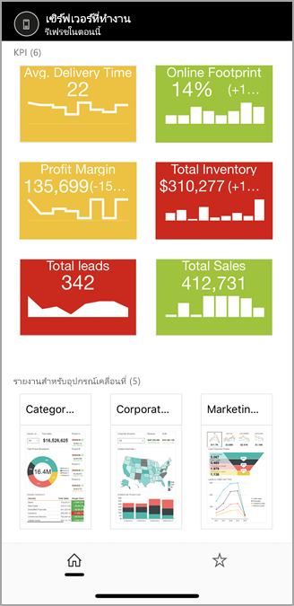

# ดูรายงานจากรีพอร์ตเซิร์ฟเวอร์ภายในองค์กรและ KPI ในแอป Power BI สำหรับอุปกรณ์เคลื่อนที่View on-premises report server reports and KPIs in the Power BI mobile apps

แอป Power BI สำหรับอุปกรณ์เคลื่อนที่ให้คุณใช้งานในระบบสัมผัสที่เชื่อมต่อแบบสดเพื่อเข้าถึงข้อมูลทางธุรกิจภายในองค์กรของคุณในเซิร์ฟเวอร์รายงาน Power BI และ SQL Server 2016 Reporting Services (SSRS)The Power BI mobile apps deliver live, touch-enabled mobile access to your on-premises business information in Power BI Report Server and SQL Server 2016 Reporting Services (SSRS).

นำไปใช้กับ:Applies to:

|  |  |  |  |
|:--- |:--- |:--- |:--- |
| iPhoneiPhones |iPadiPads |โทรศัพท์ AndroidAndroid phones |แท็บเล็ต AndroidAndroid tablets |

## ขั้นแรกFirst things first
**แอปสำหรับอุปกรณ์เคลื่อนที่เป็นตำแหน่งที่คุณดูเนื้อหา Power BI ไม่ใช่ตำแหน่งที่คุณสร้างเนื้อหา****The mobile apps are where you view Power BI content, not where you create it.**

* คุณและผู้สร้างรายงานคนอื่นๆ ในองค์กรของคุณ[สร้างรายงาน Power BI ด้วย Power BI Desktop จากนั้นเผยแพร่รายงานนั้นไปยังพอร์ทัลเว็บของเซิร์ฟเวอร์รายงาน Power BI](../../report-server/quickstart-create-powerbi-report.md)You and other report creators in your organization [create Power BI reports with Power BI Desktop, then publish them to the Power BI Report Server](../../report-server/quickstart-create-powerbi-report.md) web portal. 
* คุณสร้าง [KPI ในพอร์ทัลเว็บ](/sql/reporting-services/working-with-kpis-in-reporting-services)จัดระเบียบในโฟลเดอร์ และทำเครื่องหมายรายการโปรดของคุณเพื่อให้คุณสามารถค้นหาได้ง่ายขึ้นYou create [KPIs right in the web portal](/sql/reporting-services/working-with-kpis-in-reporting-services), organize them in folders, and mark your favorites so you can find them easily. 
* คุณ[สร้างรายงานสำหรับอุปกรณ์เคลื่อนที่จาก Reporting Services](/sql/reporting-services/mobile-reports/create-mobile-reports-with-sql-server-mobile-report-publisher) ด้วย SQL Server 2016 Enterprise Edition Mobile Report Publisher และเผยแพร่รายงานนนั้นไปยัง[พอร์ทัลเว็บของ Reporting Services](/sql/reporting-services/web-portal-ssrs-native-mode)You [create Reporting Services mobile reports](/sql/reporting-services/mobile-reports/create-mobile-reports-with-sql-server-mobile-report-publisher) with SQL Server 2016 Enterprise Edition Mobile Report Publisher and publish them to the [Reporting Services web portal](/sql/reporting-services/web-portal-ssrs-native-mode).  

จากนั้น ในแอป Power BI สำหรับอุปกรณ์เคลื่อนที่เชื่อมต่อกับรีพอร์ตเซิร์ฟเวอร์ได้ถึงห้าตัวเมื่อต้องการดูรายงาน Power BI และ KPI ที่ถูกจัดระเบียบในโฟลเดอร์หรือถูกเก็บรวบรวมเป็นรายการโปรดThen in the Power BI mobile apps, connect to up to five report servers to view the Power BI reports and KPIs, organized in folders or collected as favorites. 

## สำรวจตัวอย่างในแอปสำหรับอุปกรณ์เคลื่อนที่โดยไม่มีการเชื่อมต่อเซิร์ฟเวอร์Explore samples in the mobile apps without a server connection
แม้ว่าคุณไม่สามารถเข้าถึงพอร์ทัลเว็บของ Reporting Services คุณยังสามารถสำรวจฟีเจอร์ของรายงานสำหรับอุปกรณ์เคลื่อนที่ของ Reporting Services และ KPIEven if you don't have access to a Reporting Services web portal, you can still explore the features of Reporting Services mobile reports and KPIs. 

1. แตะรูปโปรไฟล์ของคุณที่มุมบนซ้ายจากนั้น แตะ **การตั้งค่า** บนแผงบัญชีที่เลื่อนออกTap your profile picture in the upper-left corner and then tap **Settings** on the accounts panel that slides out.

2. ในหน้าการตั้งค่าที่เปิด แตะ **ตัวอย่าง Reporting Services** จากนั้น เรียกดูเพื่อโต้ตอบกับตัวอย่าง KPI และรายงานสำหรับอุปกรณ์เคลื่อนที่On the settings page that opens, tap **Reporting Services samples**, then browse to interact with the sample KPIs and mobile reports.
   
   

## เชื่อมต่อกับเซิร์ฟเวอร์ภายในองค์กรConnect to an on-premises report server
คุณสามารถดูรายงาน Power BI สำหรับองค์กร รายงานจาก Reporting Services และ KPI ในแอป Power BI สำหรับอุปกรณ์เคลื่อนที่You can view on-premises Power BI reports, Reporting Services mobile reports, and KPIs in the Power BI mobile apps. 

1. บนอุปกรณ์เคลื่อนที่ เปิดแอป Power BIOn your mobile device, open the Power BI app.
2. ถ้าคุณยังไม่ได้ลงชื่อเข้าใช้ Power BI แตะ **รีพอร์ตเซิร์ฟเวอร์**If you haven't signed in to Power BI yet, tap **Report Server**.
   
   
   
   หากคุณล็อกอินในแอป Power BI แล้ว ให้แตะรูปโปรไฟล์ของคุณที่มุมบนซ้ายจากนั้น แตะ **การตั้งค่า** บนแผงบัญชีที่เลื่อนออกIf you've already signed in to the Power BI app, tap your profile picture in the upper-left corner and then tap **Settings** on the accounts pane that slides out.
3. บนหน้าการตั้งค่าที่เปิดขึ้น ให้แตะ **เชื่อมต่อกับเซิร์ฟเวอร์**On the settings page that opens, tap **Connect to server**.
   
    

    แอปสำหรับอุปกรณ์เคลื่อนที่จำเป็นต้องเข้าถึงเซิร์ฟเวอร์ในลักษณะบางอย่างThe mobile app needs to access the server in some way. มีสองสามวิธีดำเนินการดังกล่าว:There are a few ways to do that:
     * การใช้เครือข่ายเดียวกัน/การใช้ VPN เป็นวิธีง่ายที่สุดBeing on the same network/using VPN is the easiest way.
     * จำเป็นต้องใช้พร็อกซีของแอปพลิเคชันบนเว็บเพื่อเชื่อมต่อจากภายนอกองค์กรIt's possible to use a Web Application Proxy to connect from outside the organization. ดู[ใช้ OAuth เพื่อเชื่อมต่อกับ Reporting Services ](mobile-oauth-ssrs.md)สำหรับรายละเอียดSee [Using OAuth to connect to Reporting Services](mobile-oauth-ssrs.md) for details.
     * เปิดการเชื่อมต่อ (พอร์ต) ในไฟร์วอลล์Open a connection (port) in the firewall.

4. กรอกที่อยู่เซิร์ฟเวอร์และตั้งชื่อเซอร์ฟเวอร์ หากคุณต้องการFill in the server address and give the server a friendly name, if you'd like. ใช้รูปแบบนี้สำหรับที่อยู่เซิร์ฟเวอร์:Use this format for the server address:
   
     `https://<servername>/reports`
   
     OROR
   
     `https://<servername>/reports`
   
   ใส่ **http** หรือ **https** ด้านหน้าของสตริงการเชื่อมต่อInclude **http** or **https** in front of the connection string.
   
    
5. เมื่อคุณพิมพ์ที่อยู่เซิร์ฟเวอร์และตั้งชื่อเซิร์ฟเวอร์เมื่อต้องการแล้ว แตะ **เชื่อมต่อ** จากนั้นกรอกชื่อผู้ใช้และรหัสผ่านของคุณเมื่อมีข้อความขึ้นเตือนOnce you've typed in the server address and optional friendly name, tap **Connect**, and then fill in your username and password when prompted.
6. ในตอนนี้คุณเห็นเซิร์ฟเวอร์ในหน้าต่างบัญชีในตัวอย่างนี้ เรียกว่า "Work Server"Now you see the server in the Accounts pane - in this example, it is called "Work server".
   
   

## เชื่อมต่อกับเซิร์ฟเวอร์รายงานภายในองค์กรใน iOS หรือแอนดรอยด์Connect to an on-premises report server in iOS or Android

ถ้าคุณกำลังดู Power BI ในแอปสำหรับอุปกรณ์ iOS หรือแอนดรอยด์ ผู้ดูแลระบบ IT ของคุณอาจมีนโยบายการกำหนดค่าแอปIf you're viewing Power BI in the iOS or Android mobile app, your IT admin may have defined an app configuration policy. ถ้าเป็นเช่นนั้น ประสบการณ์การเชื่อมต่อกับเซิร์ฟเวอร์รายงานของคุณถูกทำให้ง่ายขึ้น และคุณไม่ต้องใส่ข้อมูลมากเท่าเดิมเมื่อคุณเชื่อมต่อกับเซิร์ฟเวอร์รายงานIf so, your experience connecting to the report server is streamlined, and you won't have to provide as much information when you connect to a report server. 

1. คุณจะเห็นข้อความว่า แอปสำหรับอุปกรณ์เคลื่อนที่ของคุณได้กำหนดค่าสำหรับเซิร์ฟเวอร์รายงานแล้วYou see a message that your mobile app is configured with a report server. แตะ **ลงชื่อเข้าใช้**Tap **Sign in**.

    

2.  บนหน้า **เชื่อมต่อกับเซิร์ฟเวอร์** รายละเอียดของเซิร์ฟเวอร์รายงานได้ถูกกรอกให้แล้วOn the **Connect to server** page, the report server details already filled in. แตะ **เชื่อมต่อ**Tap **Connect**.

    

3. พิมพ์รหัสผ่านเพื่อรับรองความถูกต้อง จากนั้นแตะ **ลงชื่อเข้าใช้**Type a password to authenticate, then tap **Sign in**. 

    

ตอนนี้ คุณสามารถดูและโต้ตอบกับ KPI และรายงาน Power BI ที่จัดเก็บบนเซิร์ฟเวอร์รายงานNow you can view and interact with KPIs and Power BI reports stored on the report server.

## ดูรายงาน Power BI และ KPI ในแอป Power BIView Power BI reports and KPIs in the Power BI app
รายงาน Power BI รายงานสำหรับอุปกรณ์เคลื่อนที่ของ Reporting Services และ KPI จะแสดงอยู่ในโฟลเดอร์เดียวกันบนพอร์ทัลเว็บของ Reporting ServicesPower BI reports, Reporting Services mobile reports, and KPIs are displayed in the same folders they're in on the Reporting Services web portal. 

* แตะรายงาน Power BITap a Power BI report .. การแตะจะเปิดโหมดแนวนอน และคุณสามารถโต้ตอบกับไฟล์ในแอป Power BI ได้It opens in landscape mode, and you can interact with it in the Power BI app.

    > [!NOTE]
  > ดูรายละเอียดลงและขึ้นในขณะนี้ไม่ได้เปิดใช้งานในรายงานของ Power BI บนเซิร์ฟเวอร์รายงาน Power BIDrill down and up is currently not enabled in Power BI reports on a Power BI Report Server.
  
    
* ใน Power BI Desktop เจ้าของรายงานสามารถ[ปรับรายงาน](../../create-reports/desktop-create-phone-report.md)ให้เหมาะสมสำหรับแอป Power BI สำหรับอุปกรณ์เคลื่อนที่ได้In Power BI Desktop, report owners can [optimize a report](../../create-reports/desktop-create-phone-report.md) for the Power BI mobile apps. บนโทรศัพท์มือถือ รายงานที่ปรับให้เหมาะสมจะมีไอคอนพิเศษและแบบการจัดหน้าOn your mobile phone, optimized reports have a special icon, , and layout.
  
    
* แตะ KPI เพื่อดูในโหมดโฟกัสTap a KPI to see it in focus mode.
  
    

## ดู KPI และรายงานที่เป็นรายการโปรดของคุณView your favorite KPIs and reports
คุณสามารถเพิ่ม KPIs และรายงานให้เป็นรายการโปรดบนพอร์ทัลเว็บ จากนั้น ดูข้อมูลดังกล่าวได้ในโฟลเดอร์หนึ่งที่สะดวกบนอุปกรณ์เคลื่อนที่ พร้อมกับแดชบอร์ดโปรด Power BI ของคุณYou can mark KPIs and reports as favorites on the web portal, and then view them in one convenient folder on your mobile device, along with your Power BI favorite dashboards.

* แตะ **รายการโปรด** บนแถบนำทางTap **Favorites** on the navigation bar.
  
   
  
   KPI และรายงานโปรดจากพอร์ทัลเว็บของคุณจะอยู่บนหน้านี้ทั้งหมด พร้อมกับแดชบอร์ด Power BI ในบริการของ Power BI:Your favorite KPIs and reports from the web portal are all on this page, along with Power BI dashboards in the Power BI service:
  
   

## ยุติการเชื่อมต่อกับรีพอร์ตเซิร์ฟเวอร์Remove a connection to a report server
1. เปิดหน้าต่างบัญชี แตะ **การตั้งค่า**Open the accounts pane, tap **Settings**.
2. แตะชื่อเซิร์ฟเวอร์ที่คุณไม่ต้องการเชื่อมต่อTap the name of the server you don't want to be connected to.
3. แตะ **ถอดเซิร์ฟเวอร์**Tap **Remove Server**.

## ขั้นตอนถัดไปNext steps
* [Power BI คืออะไรWhat is Power BI?](../../fundamentals/power-bi-overview.md)  
* มีคำถามหรือไม่Questions? [ลองถามชุมชน Power BITry asking the Power BI Community](https://community.powerbi.com/)