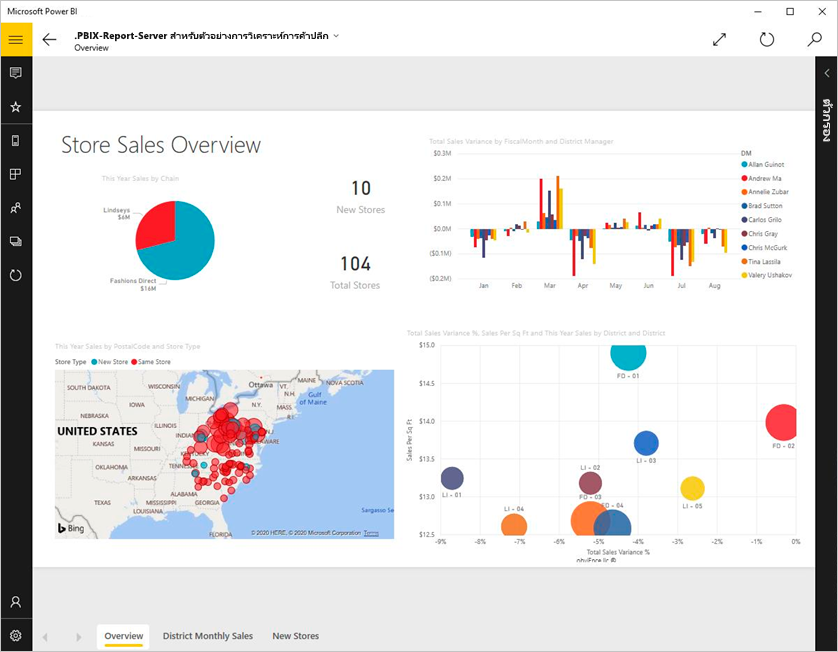
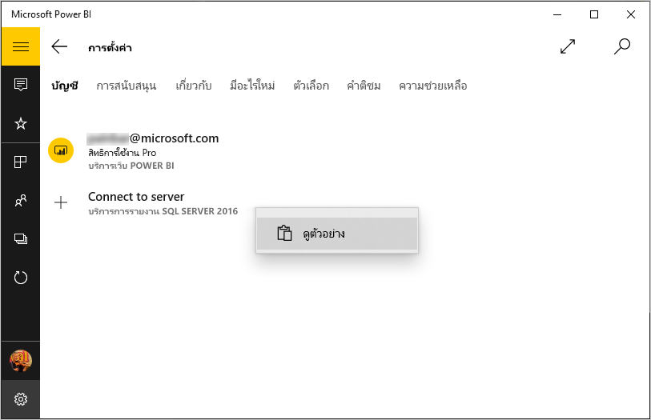
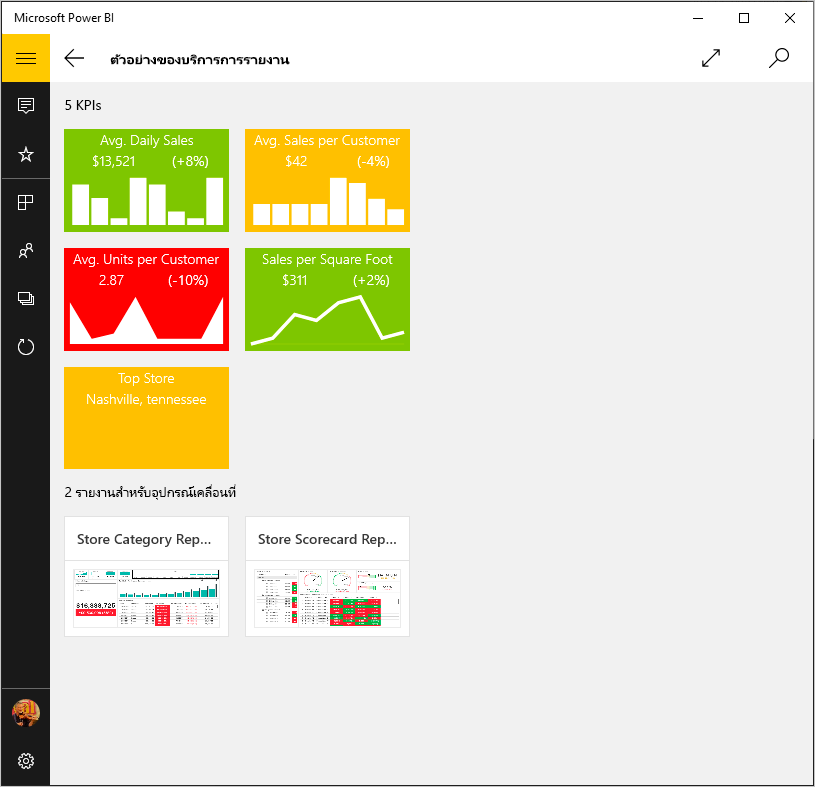
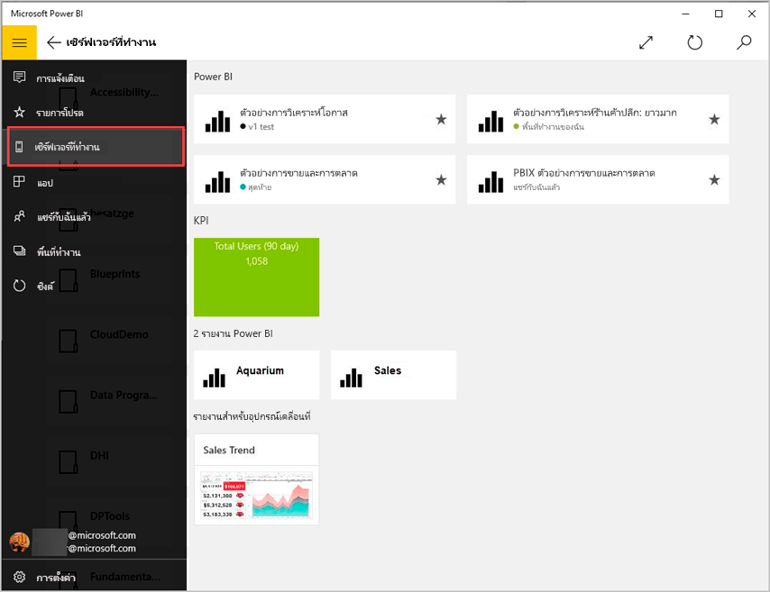
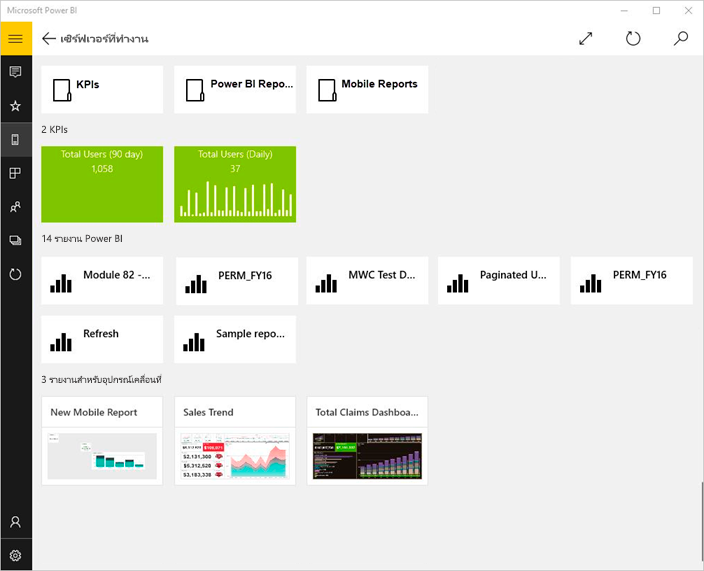
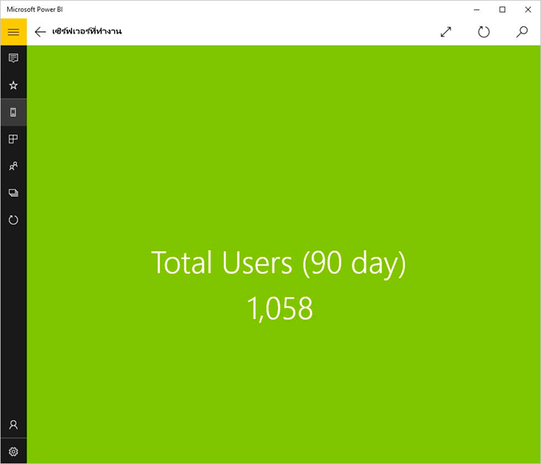
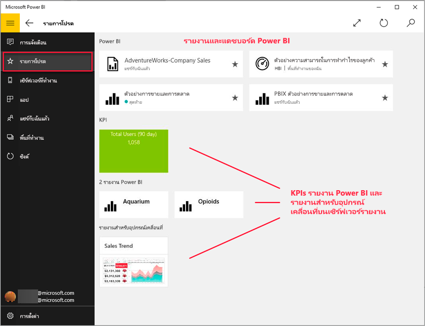
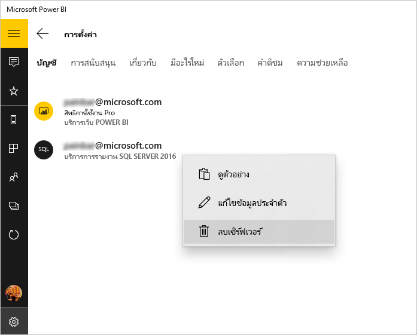

# ดูรายงานและ KPI ภายในองค์กรในแอป Power BI สำหรับอุปกรณ์เคลื่อนที่View on-premises reports and KPIs in the Power BI Windows app
แอป Power BI สำหรับ Windows 10 มีการเข้าถึงแบบไลฟ์, touch ที่เปิดใช้งานการเชื่อมต่อกับข้อมูลทางธุรกิจภายในองค์กรที่สำคัญของคุณในReporting Services SQL Server 2016The Power BI app for Windows 10 offers live, touch-enabled mobile access to your important on-premises business information in SQL Server 2016 Reporting Services. 

## สิ่งแรกที่ต้องทำFirst things first
[สร้างรายงานอุปกรณ์มือถือของ Reporting Services](/sql/reporting-services/mobile-reports/create-mobile-reports-with-sql-server-mobile-report-publisher) ด้วย SQL Server 2016 Enterprise Edition Mobile Report Publisher แล้วเผยแพร่รายงานอุปกรณ์มือถือนั้นไปยัง [พอร์ทัลของเว็บ Reporting Services](/sql/reporting-services/web-portal-ssrs-native-mode)[Create Reporting Services mobile reports](/sql/reporting-services/mobile-reports/create-mobile-reports-with-sql-server-mobile-report-publisher) with SQL Server 2016 Enterprise Edition Mobile Report Publisher and publish them to the [Reporting Services web portal](/sql/reporting-services/web-portal-ssrs-native-mode). สร้าง KPI อย่างเหมาะสมในพอร์ทัลของเว็บCreate KPIs right in the web portal. จัดระเบียบรายงานอุปกรณ์มือถือในโฟลเดอร์ แล้วทำเครื่องหมายเป็นรายการโปรดของคุณ เพื่อให้คุณสามารถค้นหาได้ง่ายOrganize them in folders and mark your favorites, so you can find them easily. 

จากนั้นในแอป Power BI สำหรับ Windows 10 ดู KPS รายงานมือถือและรายงาน Power BI จัดระเบียบในโฟลเดอร์หรือรวบรวมเป็นรายการโปรดThen in the Power BI app for Windows 10, view the KPS, mobile reports, and Power BI reports, organized in folders or collected as favorites. 

> [!NOTE]
> อุปกรณ์ของคุณจะต้องสามารถใช้งาน Windows 10 ได้Your device needs to be running Windows 10. แอปสามารถทำงานได้เต็มประสิทธิภาพในอุปกรณ์ที่มี RAM อย่างน้อย 1 GB และที่เก็บข้อมูลภายใน 8 GBThe app works best on devices with at least 1 GB RAM and 8 GB internal storage.

>[!NOTE]
>การสนับสนุนแอปอุปกรณ์เคลื่อนที่ Power BI สำหรับ **โทรศัพท์ที่ใช้ Windows 10 Mobile** จะถูกยกเลิกในวันที่ 16 มีนาคม 2021Power BI mobile app support for **phones using Windows 10 Mobile** will be discontinued on March 16, 2021. [ศึกษาเพิ่มเติมLearn more](/legal/powerbi/powerbi-mobile/power-bi-mobile-app-end-of-support-for-windows-phones)

## สำรวจตัวอย่างโดยไม่มีเซิร์ฟเวอร์ SQL Server 2016 Reporting ServicesExplore samples without a SQL Server 2016 Reporting Services server
แม้ว่าคุณไม่สามารถเข้าถึงพอร์ทัลของเว็บ Reporting Services ได้ แต่ยังสามารถสำรวจดูคุณลักษณะต่างๆ ในรายงานอุปกรณ์มือถือของ Reporting Services ได้Even if you don't have access to a Reporting Services web portal, you can still explore the features of Reporting Services mobile reports.

1. ในอุปกรณ์ที่ใช้งาน Windows 10 ของคุณ ให้เปิดแอป Power BIIn your Windows 10 device, open the Power BI app.
2. แตะปุ่มการนำทางส่วนกลางTap the global navigation button  ในมุมบนซ้ายin the upper-left corner.
3. แตะไอคอน **การตั้งค่า** คลิกขวา หรือแตะค้าง **เชื่อมต่อกับเซิร์ฟเวอร์** แล้วแตะ **ดูตัวอย่าง**Tap **Settings** icon , right-click or tap and hold **Connect to server**, then tap **View samples**.
   
   
4. เปิดโฟลเดอร์รายงานการขายปลีกหรือรายงานการขาย เพื่อสำรวจ KPI และรายงานอุปกรณ์มือถือของโฟลเดอร์เหล่านี้Open the Retail Reports or Sales Reports folder to explore their KPIs and mobile reports.
   
   

เรียกดูตัวอย่าง เพื่อโต้ตอบกับ KPI และรายงานอุปกรณ์มือถือBrowse the samples to interact with KPIs and mobile reports.

## เชื่อมต่อกับรีพอร์ตเซิร์ฟเวอร์ของ Reporting ServicesConnect to a Reporting Services report server
1. ที่ด้านล่างของบานหน้าต่างนำทาง ให้แตะ **การตั้งค่า** At the bottom of the nav pane, tap **Settings** 
2. แตะ **เชื่อมต่อกับเซิร์ฟเวอร์**Tap **Connect to server**.
3. กรอกที่อยู่เซิร์ฟเวอร์ รวมทั้งชื่อผู้ใช้และรหัสผ่านของคุณFill in the server address and your user name and password. ใช้รูปแบบนี้สำหรับที่อยู่เซิร์ฟเวอร์:Use this format for the server address:
   
     `https://<servername>/reports` OR   `https://<servername>/reports``https://<servername>/reports` OR   `https://<servername>/reports`
   
   > [!NOTE]
   > ใส่ **http** หรือ **https** ที่ด้านหน้าของสตริงการเชื่อมต่อInclude **http** or **https** at the beginning of the connection string.
   > 
   > 
   
    แตะ **ตัวเลือกขั้นสูง** เพื่อตั้งชื่อให้เซิร์ฟเวอร์ ถ้าต้องการTap **Advanced option** to give the server a name, if you'd like.
4. แตะเครื่องหมายถูก เพื่อเชื่อมต่อTap the check mark to connect. 
   
   ในตอนนี้ คุณจะเห็นเซิร์ฟเวอร์อยู่ในบานหน้าต่างนำทางNow you see the server in the nav pane.
   
   
   
   >[!TIP]
   >แตะปุ่มการนำทางส่วนกลาง  ได้ตลอดเวลา เพื่อสลับไปมาระหว่างรายงานอุปกรณ์มือถือของ Reporting Services ของคุณกับแดชบอร์ดของคุณในบริการของ Power BITap the global navigation button  anytime to go between your Reporting Services mobile reports and your dashboards in the Power BI service. 
   > 

   >[!NOTE]
   >เซิร์ฟเวอร์รายงานที่กำหนดค่าด้วยพอร์ตที่กำหนดเองไม่ได้รับการสนับสนุน และไม่สามารถเข้าถึงได้จากแอป Power BI WindowsReport Servers configured with custom ports are not supported and cannot be accessed from the Power BI Windows app. 

## ดู KPI และรายงานอุปกรณ์มือถือของ Reporting Services ในแอป Power BIView Reporting Services KPIs and mobile reports in the Power BI app
รายงาน Power BI รายงานสำหรับอุปกรณ์เคลื่อนที่ของบริการรายงานและ KPI จะแสดงอยู่ในโฟลเดอร์เดียวกันบนพอร์ทัลเว็บของบริการรายงานReporting Services KPIs, mobile reports, and Power BI reports (preview) are displayed in the same folders they're in on the Reporting Services web portal.

* แตะ KPI เพื่อดูในโหมดโฟกัสTap a KPI to see it in focus mode.
  
    
* แตะรายงานอุปกรณ์มือถือ เพื่อเปิด และโต้ตอบกับรายงานอุปกรณ์มือถือนั้นในแอป Power BITap a mobile report to open and interact with it in the Power BI app.
  
    

## ดู KPI และรายงานที่เป็นรายการโปรดของคุณView your favorite KPIs and reports
คุณสามารถทำเครื่องหมายให้ KPI และรายงานอุปกรณ์มือถือต่างๆ ในพอร์ทัลของเว็บบริการรายงานของคุณเป็นรายการโปรด จากนั้นดูรายการโปรดเหล่านี้ในโฟลเดอร์ใดโฟลเดอร์หนึ่งตามที่สะดวกในอุปกรณ์ Windows 10 ของคุณ รวมทั้งรายงานและแดชบอร์ดที่เป็นรายการโปรดใน Power BI ของคุณYou can mark KPIs, mobile reports, and Power BI reports as favorites on your Reporting Services web portal, and then view them in one convenient folder on your Windows 10 device, along with your Power BI favorite dashboards and reports.

* แตะ **รายการโปรด**Tap **Favorites**.
  
   
  
   รายการโปรดของคุณจากพอร์ทัลของเว็บทั้งหมดล้วนอยู่ในหน้านี้Your favorites from the web portal are all on this page.
  
อ่านข้อมูลเพิ่มเติมเกี่ยวกับ [รายการโปรดในแอป Power BI สำหรับอุปกรณ์เคลื่อนที่](mobile-apps-favorites.md)Read more about [favorites in the Power BI mobile apps](mobile-apps-favorites.md).

## ยุติการเชื่อมต่อกับรีพอร์ตเซิร์ฟเวอร์Remove a connection to a report server
คุณสามารถเชื่อมต่อกับรีพอร์ตเซิร์ฟเวอร์จากแอป Power BI สำหรับอุปกรณ์เคลื่อนที่ได้เพียงครั้งละหนึ่งเซิร์ฟเวอร์เท่านั้นYou can only be connected to one report server at a time from your Power BI mobile app. ถ้าคุณต้องการเชื่อมต่อกับเซิร์ฟเวอร์อื่น ก็จะต้องยกเลิกการเชื่อมต่อกับเซิร์ฟเวอร์ที่ใช้งานอยู่ในปัจจุบันก่อนIf you want to connect to a different server, you need to disconnect from the current one.

1. ที่ด้านล่างของบานหน้าต่างนำทาง ให้แตะ **การตั้งค่า** At the bottom of the nav pane, tap **Settings** .
2. แตะค้างที่ชื่อเซิร์ฟเวอร์ที่คุณไม่ต้องการเชื่อมต่อTap and hold the server name you don't want to be connected to.
3. แตะ **ลบเซิร์ฟเวอร์**Tap **Remove server**.
   
    

## สร้างรายงานอุปกรณ์มือถือและ KPI ของ Reporting ServicesCreate Reporting Services mobile reports and KPIs
คุณไม่สามารถสร้าง KPI และรายงานอุปกรณ์มือถือของ Reporting Services ในแอป Power BI สำหรับอุปกรณ์เคลื่อนที่ได้You don't create Reporting Services KPIs and mobile reports in the Power BI mobile app. คุณสามารถสร้างส่วนเหล่านั้นได้ใน SQL Server Mobile Report Publisher และพอร์ทัลของเว็บ SQL Server 2016 Reporting ServicesYou create them in SQL Server Mobile Report Publisher and a SQL Server 2016 Reporting Services web portal.

* [สร้างรายงานอุปกรณ์มือถือของ Reporting Services ของคุณเอง](/sql/reporting-services/mobile-reports/create-mobile-reports-with-sql-server-mobile-report-publisher) แล้วเผยแพร่ไปยังพอร์ทัลของเว็บ Reporting Services[Create your own Reporting Services mobile reports](/sql/reporting-services/mobile-reports/create-mobile-reports-with-sql-server-mobile-report-publisher), and publish them to a Reporting Services web portal.
* สร้าง [KPI ในพอร์ทัลของเว็บ Reporting Services](/sql/reporting-services/working-with-kpis-in-reporting-services)Create [KPIs on a Reporting Services web portal](/sql/reporting-services/working-with-kpis-in-reporting-services)

## ขั้นตอนถัดไปNext steps
* [เริ่มต้นใช้งานแอป Power BI สำหรับอุปกรณ์เคลื่อนที่สำหรับ Windows 10Get started with the Power BI mobile app for Windows 10](mobile-windows-10-phone-app-get-started.md)  
* [Power BI คืออะไรWhat is Power BI?](../../fundamentals/power-bi-overview.md)  
* มีคำถามหรือไม่Questions? [ลองถามชุมชน Power BITry asking the Power BI Community](https://community.powerbi.com/)