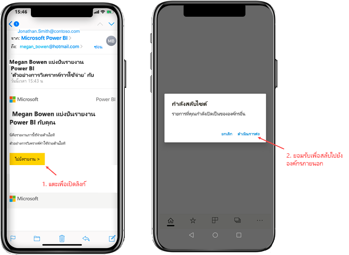
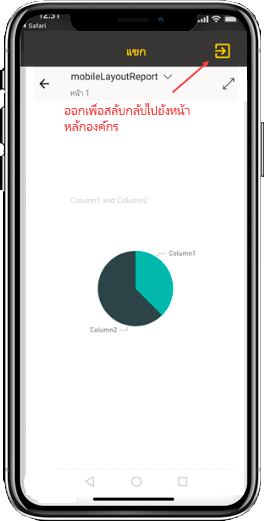
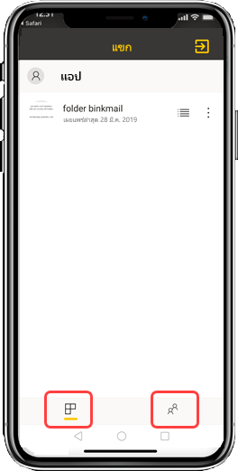

# ดูเนื้อหา Power BI ที่แชร์กับคุณจากองค์กรภายนอกView Power BI content shared with you from an external organization

Power BI บูรณาการรวมเข้ากับ Azure Active Directory แบบธุรกิจกับธุรกิจ (Azure AD B2B) เพื่ออนุญาตให้มีการกระจายความปลอดภัยของเนื้อหา Power BI ไปยังผู้ใช้เป็นผู้เยี่ยมชมภายนอกองค์กรของคุณPower BI integrates with Azure Active Directory business-to-business (Azure AD B2B) to allow secure distribution of Power BI content to guest users outside your organization. และผู้ใช้ที่เป็นผู้เยี่ยมชมภายนอกสามารถใช้แอป Power BI เพื่อเข้าถึงเนื้อหา Power BI ที่แชร์กับพวกเขาได้And external guest users can use the Power BI mobile app to access that Power BI content shared with them. 

ใช้ได้กับ:Applies to:

|  |  |  |  |
|:--- |:--- |:--- |:--- |
| iPhonesiPhones |iPadiPads |มือถือ AndroidAndroid phones |แท็บเล็ต AndroidAndroid tablets |

## การเข้าถึงเนื้อหาที่แชร์Accessing shared content

**ก่อนอื่น คุณต้องการใครสักคนจากองค์กรภายนอกเพื่อแชร์รายการกับคุณ****First, you need someone from an external organization to share an item with you.** เมื่อมีคน [แชร์รายการกับคุณ](../../collaborate-share/service-share-dashboards.md) ไม่ว่าจะเป็นจากองค์กรเดียวกันหรือจากองค์กรภายนอก คุณจะได้รับอีเมลพร้อมลิงก์ไปยังรายการที่แชร์นั้นWhen someone [shares an item with you](../../collaborate-share/service-share-dashboards.md), either from the same organization or from an external organization, you receive an email with a link to that shared item. การกดเข้าลิงก์ในอุปกรณ์มือถือของคุณจะเปิดแอป Power BI สำหรับอุปกรณ์เคลื่อนที่Following that link in your mobile device opens the Power BI mobile app. หากแอปตระหนักว่ารายการนั้นแชร์จากองค์กรภายนอก แอปจะเชื่อมต่อกับองค์กรนั้นอีกครั้งด้วยข้อมูลประจำตัวของคุณIf the app recognizes that the item was shared from an external organization, the app reconnects to that organization with your identity. หลังจากนั้นแอปจะโหลดรายการทั้งหมดที่แชร์กับคุณจากองค์กรนั้นThe app then loads all items that were shared with you from that organization.

> [!NOTE]
> หากนี่เป็นรายการแรกที่แชร์กับคุณในฐานะผู้ใช้ที่เป็นผู้เยี่ยมชมภายนอก คุณจะต้องอ้างสิทธิ์การเชิญในเบราว์เซอร์ก่อนIf this is the first item shared with you as an external guest user, you must claim the invitation in a browser. คุณไม่สามารถอ้างสิทธิ์คำเชิญในแอป Power BI ได้You can cannot claim the invitation in the Power BI app.

ตราบใดที่คุณเชื่อมต่อกับองค์กรภายนอก ส่วนหัวสีดำจะปรากฏขึ้นในแอปAs long as you are connected to an external organization, a black header appears in the app. ส่วนหัวนี้บ่งชี้ว่าคุณไม่ได้เชื่อมต่อกับองค์กรหลักของคุณThis header indicates that you are not connected to your home organization. หากต้องการเชื่อมต่อกลับไปยังองค์กรหลักของคุณ ให้ออกจากโหมดผู้เยี่ยมชมTo connect back to your home organization, exit from guest mode.

แม้ว่าคุณจะต้องมีลิงก์วัตถุ Power BI เพื่อเชื่อมต่อกับองค์กรภายนอก แต่เมื่อมีการสลับแอปของคุณ คุณสามารถเข้าถึงรายการทั้งหมดที่แชร์กับคุณได้ (ไม่เฉพาะรายการที่คุณเปิดจากอีเมลเท่านั้น)Even though you need to have a Power BI artifact link to connect to an external organization, once your app switches, you can access all items shared with you (not only the item you opened from the email). หากต้องการดูรายการทั้งหมดที่คุณสามารถเข้าถึงได้ในองค์กรภายนอก ให้ไปที่เมนูแอปและเลือก **แบ่งปันกับฉัน**To view all items you can access in the external organization, go to the app menu and select **Shared with me**. ภายใต้ **แอป** คุณจะพบแอปที่คุณสามารถใช้ได้เช่นกันUnder **Apps**, you find apps that you can use as well.

## ข้อจำกัดLimitations

- ผู้ใช้ต้องมีบัญชี Power BI ที่ใช้งานอยู่และผู้เช่าหลักUsers must have an active Power BI account and Home tenant.
- ผู้ใช้จะต้องลงชื่อเข้าใช้ผู้เช่าหลักของ Power BI ก่อนจึงจะสามารถเข้าถึงเนื้อหาที่แชร์กับผู้เช่าภายนอกได้Users must be signed in to their Power BI home tenant, before they can access the content shared with them from an external tenant.
- การเข้าถึงแบบมีเงื่อนไขและนโยบาย Intune อื่นไม่ได้รับการสนับสนุนใน Azure AD B2B และใน Power BI สำหรับอุปกรณ์เคลื่อนที่Conditional access and other Intune policies are not supported in Azure AD B2B and in Power BI mobile. ซึ่งหมายความว่าแอปจะบังคับใช้เฉพาะนโยบายขององค์กรหลักเท่านั้น ถ้ามีอยู่That means that the app enforces only the home organization's policies, if they exist.
- ผู้ใช้จะได้รับการแจ้งเตือนแบบพุชจากเว็บไซต์องค์กรหลักเท่านั้น (แม้ว่าผู้ใช้จะเชื่อมต่อในฐานะผู้เยี่ยมชมกับองค์กรภายนอก)Push notifications are received from the home organization site only (even when the user is connected as a guest to an external organization). การเปิดการแจ้งเตือนจะเชื่อมต่อแอปกับเว็บไซต์องค์กรหลักของผู้ใช้อีกครั้งOpening the notification reconnects the app to the user's home organization site.
- หากผู้ใช้ปิดแอป เมื่อเปิดใหม่อีกครั้ง แอปจะเชื่อมต่อกับองค์กรบหลักของผู้ใช้โดยอัตโนมัติIf the user shuts down the app, when reopened the app connects automatically to the user's home organization.
- เมื่อเชื่อมต่อกับองค์กรภายนอก การดำเนินการบางอย่างจะถูกปิดใช้งาน: รายการโปรด การแจ้งเตือนข้อมูล การแสดงข้อคิดเห็น และการแชร์When connected to an external organization, some actions are disabled: favorite items, data alerts, commenting, and sharing.
- ข้อมูลแบบออฟไลน์ไม่พร้อมใช้งานในขณะที่เชื่อมต่อกับองค์กรภายนอกOffline data is not available while connected to an external organization.
- หากคุณติดตั้งแอป Company Portal บนอุปกรณ์ของคุณคุณจะต้องลงทะเบียนอุปกรณ์ของคุณIf you have the Company Portal app installed on your device, then your device must be enrolled.
