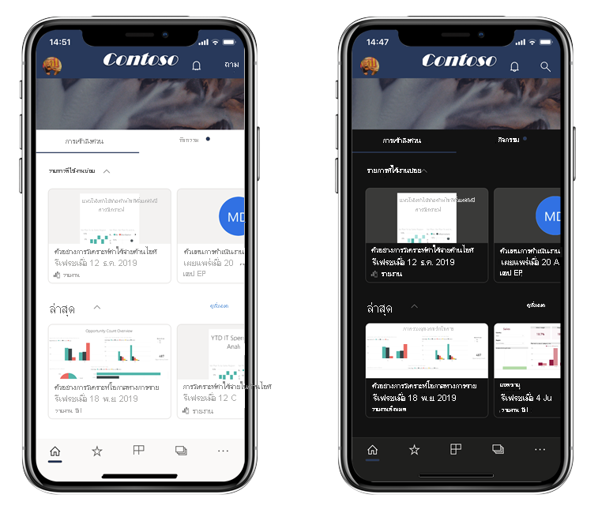
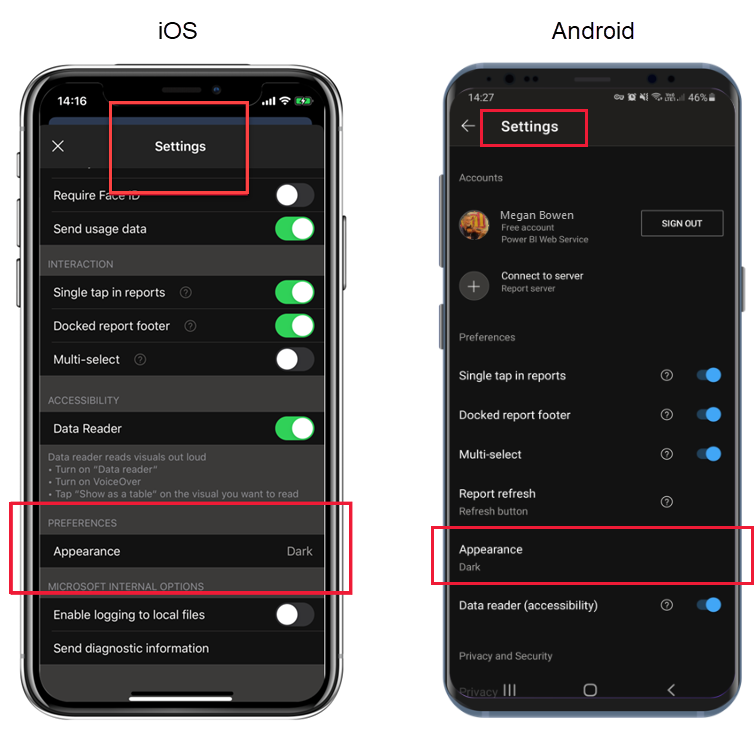

# โหมดสีเข้มDark mode

เพื่อรองรับมุมมองตามความต้องการส่วนบุคคลของคุณ แอป Power BI สำหรับอุปกรณ์เคลื่อนที่สำหรับ iOS และ Android รองรับทั้งโหมดสว่างและโหมดสีเข้มTo accommodate your individual viewing preferences, the Power BI mobile apps for iOS and Android support both light and dark screen modes. โหมดสีเข้มลดความสว่างของหน้าจอ ทำให้ง่ายต่อการดูเนื้อหาของคุณDark mode reduces the brightness of the screen, making it easier to see your content.

 ในโหมดสีเข้ม ประสบการณ์การใช้งานแอปทั้งหมดจะปรากฏด้วยพื้นหลังสีเข้มIn dark mode, all app experiences appear with a dark background. อย่างไรก็ตาม เนื้อหา Power BI จะไม่ได้รับผลกระทบใดPower BI content, however, is not affected. รายงาน แดชบอร์ด และแอปของคุณจะแสดงตามที่นักออกแบบต้องการเสมอYour reports, dashboards, and apps, are always displayed as the designers intended.
 
 ตามค่าเริ่มต้นแอป Power BI สำหรับอุปกรณ์เคลื่อนที่ของคุณจะใช้การตั้งค่าของอุปกรณ์ของคุณเพื่อกำหนดลักษณะของหน้าจอที่จะปรากฏBy default, your Power BI mobile app uses your device's settings to determine which screen appearance to display. ถ้าอุปกรณ์ของคุณได้รับการกำหนดค่าเป็นโหมดสีเข้ม แอปก็จะปรากฏในโหมดสีเข้มIf your device is configured for dark mode, the app will appear in dark mode.

>[!NOTE]
>การสนับสนุนระดับอุปกรณ์สำหรับโหมดสีเข้มบนอุปกรณ์ Android จะพร้อมใช้งานตั้งแต่ Android 10 อย่างเป็นทางการDevice-level support for dark mode on Android devices is officially available from Android 10. บนอุปกรณ์ที่ใช้ Android เวอร์ชันก่อนหน้านี้ โหมดสีเข้มในแอป Power BI สำหรับอุปกรณ์เคลื่อนที่สามารถควบคุมได้โดยการตั้งค่าลักษณะที่ปรากฏของแอปOn devices running earlier Android versions, dark mode in the Power BI mobile app can be controlled by the app's appearance settings.

หากต้องการสลับไปมาระหว่างโหมดสว่างและโหมดสีเข้ม หรือต้องการให้การตั้งค่าอุปกรณ์กำหนดโหมด ให้ไปที่หน้า **การตั้งค่า** เลื่อลงไปและแตะที่ที่ **ลักษณะที่ปรากฏ** เพื่อเลือกโหมดที่คุณต้องการTo switch between light and dark mode, or to let device settings determine the mode, go to the **Settings** page, scroll down to **Appearance**, tap it, and choose your desired mode.

