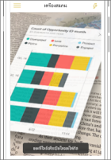
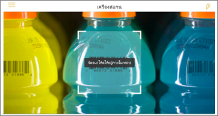

# รับข้อมูลจากโลกแห่งความจริงด้วยแอปโทรศัพท์เคลื่อนที่ Power BIGet data from the real world with the Power BI mobile apps
แอปโทรศัพท์เคลื่อนที่ Power BI สามารถเชื่อมโลกแห่งความจริงเข้ากับข้อมูล BI ที่เกี่ยวข้องได้โดยตรงในหลายวิธีที่แตกต่างกันPower BI mobile apps can connect the real world directly to related BI information, in a number of different ways. 

## คิวอาร์โค้ดสำหรับไทล์QR codes for tiles
สร้างคิวอาร์โค้ดสำหรับรายงาน หรือไทล์ในแดชบอร์ด และใส่คิวอาร์โค้ดที่ใดก็ได้คุณต้องการCreate a QR code for a report, or a tile in a dashboard, and put the QR code anywhere you want. เมื่อเพื่อนร่วมงานของคุณสแกนรหัสด้วย iPhones โทรศัพท์ Android หรือ Power BI เพื่อเข้าใช้แอปความเป็นจริงผสม พวกเขาจะเห็นไทล์ที่คุณได้โยงเข้ากับคิวอาร์โค้ดนั้น ๆWhen your colleagues scan the code with their iPhones, Android phones, or the Power BI for Mixed Reality app, they see the tile you've associated with that QR code. บน iPhone พวกเขาเห็นไทล์แบบเทคโนโลยีความเป็นจริงเสริมOn an iPhone, they see the tile in augmented reality.

ข้อมูลเพิ่มเติมเกี่ยวกับ:More about:

* [การสร้างคิวอาร์โค้ดสำหรับไทล์ใน Power BICreating a QR code for a tile in Power BI](../../create-reports/service-create-qr-code-for-tile.md)
* [การสแกนคิวอาร์โค้ดของ Power BI จากอุปกรณ์เคลื่อนที่ของคุณScanning a Power BI QR code from your mobile device](mobile-apps-qr-code.md)
* [การสแกนคิวอาร์โค้ด ด้วย Power BI สำหรับแอปความเป็นจริงผสม](./mobile-hololens2-app.md#open-reports-with-qr-codes)[Scanning a QR code with the Power BI for Mixed Reality app](./mobile-hololens2-app.md#open-reports-with-qr-codes).

## คิวอาร์โค้ดสำหรับรายงานQR codes for reports
สร้างคิวอาร์โค้ดสำหรับรายงานCreate a QR code for a report.  เมื่อเพื่อนร่วมงานของคุณสแกนรหัสด้วย iPhones ของพวกเขา (โทรศัพท์ Android กำลังมาในเร็ว ๆ นี้) พวกเขาจะเห็นรายงานคุณได้โยงเข้ากับคิวอาร์โค้ดนั้น ๆWhen your colleagues scan the code with their iPhones (Android phones are coming soon), they see the report you've associated with that QR code. 

ข้อมูลเพิ่มเติมเกี่ยวกับ[การสร้างคิวอาร์โค้ดสำหรับรายงานใน Power BI](../../create-reports/service-create-qr-code-for-report.md)More about [creating a QR code for a report in Power BI](../../create-reports/service-create-qr-code-for-report.md)

## บาร์โค้ดBarcodes
ติดป้ายข้อมูลบาร์โค้ดในรายงานของคุณเพื่อให้เพื่อนร่วมงานสามารถสแกนบาร์โค้ดที่อยู่บนผลิตภัณฑ์ และสามารถเข้าตรงไปยังรายงานที่ได้รับการกรองสำหรับผลิตภัณฑ์นั้นแล้วTag barcode data in your report so your colleagues can scan a barcode on a product and go straight to that report, filtered for that product.

ข้อมูลเพิ่มเติมเกี่ยวกับ:More about:

* [ติดป้ายข้อมูลบาร์โค้ดในรายงานTagging barcode data in a report](../../transform-model/desktop-mobile-barcodes.md)
* [การสแกนบาร์โค้ดจากแอป Power BI บน iPhone ของคุณScanning a barcode from the Power BI app on your iPhone](mobile-apps-scan-barcode-iphone.md)

## กรองข้อมูลตามตำแหน่งFilter by location
จัดประเภทข้อมูลทางภูมิศาสตร์ในรายงานใน Power BI DesktopCategorize geographical data in a report in Power BI Desktop. เมื่อเพื่อนร่วมงานของคุณดูรายงานนั้นในแอปโทรศัพท์เคลื่อนที่ Power BI สำหรับ iOS แอป Power BI จะให้การกรองข้อมูลทางภูมิศาสตร์ที่เข้ากับสถานที่ที่คุณอยู่ในตอนนั้นโดยอัตโนมัติThen your colleagues view that report in the Power BI mobile app for iOS, Power BI automatically provides geographical filters that match where they are.

ข้อมูลเพิ่มเติมเกี่ยวกับ[การกรองตามตำแหน่งที่ตั้ง](mobile-apps-geographic-filtering.md)More about [filtering by location](mobile-apps-geographic-filtering.md).

## ขั้นตอนถัดไปNext steps
* [การสร้างคิวอาร์โค้ดสำหรับไทล์ใน Power BICreate a QR code for a tile in Power BI](../../create-reports/service-create-qr-code-for-tile.md)
* [การสร้างคิวอาร์โค้ดสำหรับรายงานใน Power BICreate a QR code for a report in Power BI](../../create-reports/service-create-qr-code-for-report.md)
