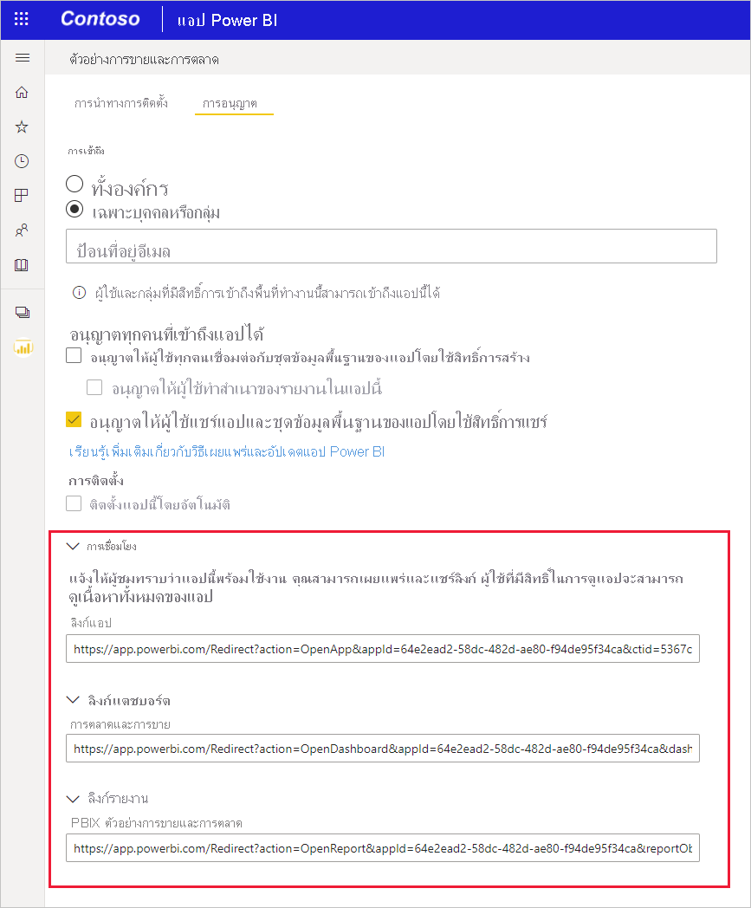

# สร้างการเชื่อมโยงไปยังตำแหน่งที่ตั้งเฉพาะในแอป Power BI สำหรับอุปกรณ์เคลื่อนที่
คุณสามารถใช้ลิงก์เพื่อเข้าถึงเนื้อหา Power BI ที่เจาะจงได้โดยตรง เช่น รายงาน หน้ารายงาน แดชบอร์ด ไทล์ที่เจาะจง เป็นต้น

การใช้ลิงก์เพื่อเข้าถึงเนื้อหาในแอป Power BI บนอุปกรณ์เคลื่อนที่ โดยหลักใหญ่แล้วมีอยู่ด้วยกันสองสถานการณ์: 

* เพื่อเปิด Power BI จาก **ภายนอกแอปสำหรับอุปกรณ์เคลื่อนที่** และเข้าสู่เนื้อหาเฉพาะ โดยปกติจะเป็นสถานการณ์การรวมที่คุณกำลังเปิดแอป Power BI สำหรับอุปกรณ์เคลื่อนที่จากแอปอื่น 
* เพื่อใช้ **สำรวจ** ภายใน Power BI โดยทั่วไปจะทำเมื่อคุณต้องการสร้างการนำทางแบบกำหนดเองใน Power BI

บทความนี้ครอบคลุมกรณีต่อไปนี้:
* การใช้ลิงก์เพื่อเปิดเนื้อหา Power BI เฉพาะจากภายนอกแอปสำหรับอุปกรณ์เคลื่อนที่ มีการอธิบายรูปแบบลิงก์สองรูปแบบ แบบหนึ่งใช้วิธีการเปลี่ยนเส้นทางและสามารถใช้ได้ไม่ว่าจะเปิด Power BI อยู่ที่ไหนก็ตาม อีกแบบจะเปิดขึ้นโดยตรงในแอป Power BI สำหรับอุปกรณ์เคลื่อนที่ และจะทำงานบนอุปกรณ์เคลื่อนที่ที่ติดตั้งแอปสำหรับอุปกรณ์เคลื่อนที่เท่านั้น
* การใช้ลิงก์ภายใน Power BI เพื่อนำทางไปยังเนื้อหา Power BI เฉพาะ

## ใช้ลิงก์จากภายนอกแอปสำหรับอุปกรณ์เคลื่อนที่
เมื่อคุณต้องการเชื่อมโยงไปยังรายการใดรายการหนึ่งใน Power BI จากภายนอกแอปสำหรับอุปกรณ์เคลื่อนที่ มีสองตัวเลือก ทั้งนี้ขึ้นอยู่กับตำแหน่งที่จะเปิดลิงก์:

* หากคุณต้องการให้ลิงก์เปิดอย่างถูกต้องไม่ว่าจะคลิกในเบราว์เซอร์คอมพิวเตอร์หรือบนอุปกรณ์เคลื่อนที่ คุณสามารถสร้างลิงก์เพื่อให้แน่ใจว่าจะเปิดได้อย่างถูกต้องไม่ว่าจะคลิกที่ใดก็ตาม ลิงก์นี้มีไวยากรณ์การเปลี่ยนเส้นทางพิเศษเพื่อเปิดใช้งานลักษณะการทำงานที่ชาญฉลาดนี้

* ถ้าคุณรู้ว่าลิงก์จะถูกเปิดบนอุปกรณ์เคลื่อนที่ที่ติดตั้งแอป Power BI สำหรับอุปกรณ์เคลื่อนที่เท่านั้น คุณสามารถหลีกเลี่ยงค่าใช้จ่ายในการเปลี่ยนเส้นทางของวิธีการข้างต้นและใช้ไวยากรณ์ลิงก์อื่นที่เปิดลิงก์โดยตรงในแอปมือถือ Power BI บนอุปกรณ์เคลื่อนที่ สิ่งสำคัญคือต้องทราบว่าแม้ว่าลิงก์นี้จะหลีกเลี่ยงค่าใช้จ่ายในการเปลี่ยนเส้นทางของวิธีแรก แต่จะไม่ทำงานหากเปิดที่ใดก็ตามนอกเหนือจากบนอุปกรณ์เคลื่อนที่ที่ติดตั้งแอป Power BI สำหรับอุปกรณ์เคลื่อนที่

### สร้างลิงก์ที่ทำงานได้จากทุกที่
รูปแบบลิงก์ที่อธิบายในส่วนนี้ใช้การเปลี่ยนเส้นทางเพื่อให้แน่ใจว่าลิงก์ใช้งานได้ไม่ว่าจะคลิกที่ใดก็ตาม
* ถ้ามีการคลิกลิงก์บนอุปกรณ์เคลื่อนที่ จะทำให้แน่ใจว่าอุปกรณ์นั้นใช้แอป Power BI สำหรับอุปกรณ์เคลื่อนที่เพื่อเปิดลิงก์ หากไม่ได้ติดตั้งแอปสำหรับอุปกรณ์เคลื่อนที่บนอุปกรณ์ ขอแนะนำให้ผู้ใช้ไปยังร้านค้าเพื่อรับแอปดังกล่าว
* ถ้ามีการคลิกลิงก์บนพีซี ระบบจะเปิดรายการที่เกี่ยวข้องในเว็บพอร์ทัล Power BI

ลิงก์ต้องขึ้นต้นด้วยคำนำหน้าพิเศษ ตามด้วยพารามิเตอร์คิวรี:

https<nolink>://app.powerbi.com/Redirect? **[QUERYPARAMETERS]** </code>

> [!IMPORTANT]
> ถ้าเนื้อหาของคุณโฮสต์อยู่ในศูนย์ข้อมูลพิเศษ เช่น ภาครัฐของประเทศจีน เป็นต้น ลิงก์ควรเริ่มต้นด้วยที่อยู่ Power BI ที่เหมาะสมเช่น **app.powerbigov.us** หรือ **app.powerbi.cn**

พารามิเตอรคิวรีคือ:

|พารามิเตอร์  | ค่า  | คำอธิบาย |
|---------|---------|---------|
|**การดำเนินการ** (บังคับ)    | OpenApp OpenReport OpenDashboard OpenTile | |
|**appId**| GUID อักขระ 36 | ต้องระบุหากคุณต้องการเปิดรายงานหรือแดชบอร์ดที่เป็นส่วนหนึ่งของแอป ตัวอย่าง: **appId=baf4b16d-b5bd-4360-8a3a-51d11242c09b** |
|**groupObjectId**| GUID อักขระ 36 | ระบุพื้นที่ทำงานเมื่อคุณต้องการเปิดรายงานหรือแดชบอร์ดที่ไม่ได้เป็นส่วนหนึ่งของพื้นที่ทำงานของฉัน ตัวอย่าง: **groupObjectId=9a3841c6-74b3-46f1-85fd-bdd78f27b30e** |
| **dashboardObjectId** | GUID อักขระ 36 | ID ออปเจ็กต์ของแดชบอร์ด (หากการดำเนินการคือ OpenDashboard หรือ OpenTile) ตัวอย่าง: **dashboardObjectId=033bb049-5b68-4392-b3ef-ae9a43738a4a** |
| **reportObjectId** | GUID อักขระ 36 | ID ออปเจ็กต์ของรายงาน (หากการดำเนินการคือ OpenReport) ตัวอย่าง: **reportObjectId=6114cec7-78e1-4926-88ff-0bc5338452cf** |
| **tileObjectId** | GUID อักขระ 36 | ID ออปเจ็กต์ของไทล์ (หากการดำเนินการคือ OpenTile) ตัวอย่าง: **tileObjectId=a845dcb8-a289-43a8-94ea-67a8c0a068f9** |
| **reportPage** | ReportSection&lt;num&gt; | ชื่อหน้าถ้าคุณต้องการเปิดหน้ารายงานที่เจาะจง (ถ้าการดำเนินการคือ OpenReport) ตัวอย่าง: **reportPage=ReportSection6**  |
| **bookmarkGuid** | GUID อักขระ 36 | ID บุ๊กมาร์กหากคุณต้องการเปิดมุมมองที่คั่นหน้าเฉพาะ (ถ้าการดำเนินการคือ OpenReport) ตัวอย่าง: **bookmarkGuid=18e8872f-6db8-4cf8-8298-3b2ab254cc7f** |
| **ctid** | GUID อักขระ 36 | ID หน่วยข้อมูลองค์กร (ที่เหมาะสมกับสถานการณ์ B2B ซึ่งสามารถเว้นไว้ได้หากหน่วยข้อมูลเป็นขององค์กรของผู้ใช้) ตัวอย่าง: **ctid=5367c770-09d0-4110-bf6a-d760cb5ef681** |
||||

**ตัวอย่าง:**

ในตัวอย่างต่อไปนี้ ตัวแทนสำหรับค่าพารามิเตอร์จะถูกเน้นด้วยตัวหนา หากต้องการรับค่าจริงให้ไปที่บริการ Power BI เปิดรายการที่คุณต้องการลิงก์ไปและแยกค่าที่คุณต้องการจาก URL ของรายการ

* **เปิดแอป**

    https<nolink>://app.powerbi.com/Redirect?action=OpenApp&appId= **&lt;appid-guid&gt;** &ctid= **&lt;ctid-guid&gt;**
   
* **เปิดแดชบอร์ดที่เป็นส่วนหนึ่งของแอป**

    https<nolink>://app.powerbi.com/Redirect?action=OpenDashboard&appId= **&lt;appid-guid&gt;** &dashboardObjectId= **&lt;dashboardid-guid&gt;** &ctid= **&lt;ctid-guid&gt;**

* **เปิดรายงานที่เป็นส่วนหนึ่งของพื้นที่ทำงานอื่นที่ไม่ใช่พื้นที่ทำงานของฉัน**

    https<nolink>://app.powerbi.com/Redirect?Action=OpenReport&reportObjectId= **&lt;reportid-guid&gt;** &groupObjectId= **&lt;groupobjectid-guid&gt;** &reportPage=**ReportSection&lt;num&gt;**

### วิธีการขอรูปแบบลิงก์ที่ถูกต้อง

#### ลิงก์ไปยังแอปและหน่วยข้อมูลในแอป

สำหรับ **แอปและสำหรับรายงานและแดชบอร์ดที่เป็นส่วนหนึ่งของแอป** วิธีที่ง่ายที่สุดในการขอลิงก์คือไปยังพื้นที่ทำงานของแอปแล้วเลือก **อัปเดตแอป** การดำเนินการนี้จะเป็นการเปิดประสบการณ์การใช้งาน "เผยแพร่แอป" เปิดแท็บสิทธิ์และขยายส่วนลิงก์เพื่อดูลิงก์ไปยังแอปและเนื้อหาทั้งหมด คุณสามารถใช้ลิงก์เหล่านี้จากภายนอก Power BI เพื่อเข้าถึงแอปและเนื้อหาได้โดยตรง

#### ลิงก์ไปยังรายการที่ไม่ได้อยู่ในแอป 

สำหรับรายงานและแดชบอร์ดที่ไม่ได้เป็นส่วนหนึ่งของแอป คุณต้องแยก ID ออบเจ็กต์ที่คุณต้องการออกจาก URL ของหน่วยข้อมูล เมื่อต้องการทำเช่นนี้ ให้ไปที่บริการ Power BI นำทางไปยังรายการที่คุณต้องการลิงก์ไป และค้นหาค่าที่คุณต้องการใน URL ที่คุณเห็นในแถบที่อยู่ของเบราว์เซอร์

ตัวอย่างด้านล่างแสดงตำแหน่งที่คุณสามารถค้นหา ID ที่คุณต้องการได้ใน URL ของรายการที่คุณต้องการลิงก์ไป

* เมื่อต้องการค้นหา ID ออบเจ็กต์ของแดชบอร์ด 36 อักขระ ให้ไปที่แดชบอร์ดเฉพาะที่คุณต้องการลิงก์ไปถึงในบริการ Power BI และค้นหา ID ออบเจ็กต์ของแดชบอร์ดและ ID ที่จำเป็นอื่น ๆ ในตำแหน่งที่ระบุไว้ด้านล่าง:

    https<nolink>://app.powerbi.com/groups/me/dashboards/ **&lt;dashboard-object-id&gt;** ?ctid= **&lt;org-object-id&gt;**

* เมื่อต้องการค้นหา ID ออบเจ็กต์ของรายงาน 36 อักขระ ให้ไปที่รายงานที่เจาะจงที่คุณต้องการลิงก์ไปถึงในบริการ Power BI และค้นหา ID ที่จำเป็นดังภาพประกอบด้านล่าง โปรดทราบว่าตัวอย่างนี้มีการอ้างอิงไปยังหน้ารายงานที่เจาะจงและบุ๊กมาร์กเฉพาะ

    https<nolink>://app.powerbi.com/groups/me/reports/ **&lt;report-object-id&gt;** /**ReportSection&lt;num&gt;** ?bookmarkGuid= **&lt;bookmark-id&gt;**

* หากต้องการลิงก์ไปยังรายการในพื้นที่ทำงานอื่นที่ไม่ใช่พื้นที่ทำงานของฉัน คุณต้องแยก ID อ็อบเจ็กต์ของกลุ่ม ตัวอย่างนี้แสดงรายงานจากพื้นที่ทำงานอื่นที่ไม่ใช่พื้นที่ทำงานของฉัน

    https<nolink>://app.powerbi.com/groups/ **&lt;group-object-id&gt;** /reports/ **&lt;report-object-id&gt;** /**ReportSection&lt;report-section-num&gt;** ?ctid= **&lt;org-object-id&gt;**

### สร้างลิงก์ที่เปิดเฉพาะบนอุปกรณ์ที่ติดตั้งแอป Power BI สำหรับอุปกรณ์เคลื่อนที่เท่านั้น

รูปแบบลิงก์ที่อธิบายไว้ในส่วนนี้จะลิงก์ไปยังตำแหน่งเฉพาะภายในแอป Power BI สำหรับอุปกรณ์เคลื่อนที่บนแพลตฟอร์มอุปกรณ์เคลื่อนที่ทั้งหมด: iOS, อุปกรณ์ Android และ Windows 10 รูปแบบลิงก์นี้จะเปิดตำแหน่งโดยตรง โดยไม่มีการเปลี่ยนเส้นทางที่เกี่ยวข้องกับวิธีการที่อธิบายไว้ในส่วนก่อนหน้า **คุณสามารถเปิดรูปแบบนี้ได้บนอุปกรณ์เคลื่อนที่ที่ติดตั้งแอป Power BI สำหรับอุปกรณ์เคลื่อนที่เท่านั้น**

ลิงก์ของรูปแบบนี้สามารถชี้ตรงไปยังแดชบอร์ด ไทล์ รายงาน ปลายทางของลิงก์ลึกจะกำหนดรูปแบบของลิงก์เอง ทำตามขั้นตอนเหล่านี้เพื่อสร้างการเชื่อมโยงโดยตรงไปยังตำแหน่งที่ตั้งต่างๆ 

* **เปิดแอป Power BI สำหรับอุปกรณ์เคลื่อนที่**

    ใช้ลิงก์นี้เพื่อเปิดแอป Power BI สำหรับอุปกรณ์เคลื่อนที่บนอุปกรณ์ใดก็ได้:

    mspbi://app/

* **เปิดไปยังแดชบอร์ดทีระบุ**

    ลิงก์นี้จะเปิดแอป Power BI สำหรับอุปกรณ์เคลื่อนที่ไปยังแดชบอร์ดที่ระบุ:

    mspbi://app/OpenDashboard?DashboardObjectId= **<36-character-dashboard-id>**

    เมื่อต้องการรับ ID ออปเจ็กต์ของแดชบอร์ด 36 อักขระ ให้นำทางไปยังแดชบอร์ดที่ระบุในบริการ Power BI และแยกออกจาก URL ตัวอย่างเช่น id ออบเจ็กต์ของแดชบอร์ดจะถูกเน้นใน URL ต่อไปนี้จากบริการ Power BI:

    https<nolink>://app.powerbi.com/groups/me/dashboards/ **&lt;61b7e871-cb98-48ed-bddc-6572c921e270&gt;**

    ถ้าแดชบอร์ดไม่ได้อยู่ในพื้นที่ทำงานของฉัน คุณต้องเพิ่ม ID อ็อบเจ็กต์ของกลุ่มด้วย ไม่ว่าจะก่อนหรือหลัง ID แดชบอร์ดก็ตาม ลิงก์ลึกที่แสดงด้านล่างมีพารามิเตอร์ id อ็อบเจ็กต์ของกลุ่มที่เพิ่มหลังจาก id อ็อบเจ็กต์ของแดชบอร์ด:

    mspbi://app/OpenDashboard?DashboardObjectId=**e684af3a-9e7f-44ee-b679-b9a1c59b5d60**&GroupObjectId=**8cc900cc-7339-467f-8900-fec82d748248**</code>

    โปรดสังเกตเครื่องหมายแอมเพอร์แซนด์ (&) ระหว่างพารามิเตอร์ทั้งสอง

* **เปิดไปยังไทล์ที่ระบุในโฟกัส**

    ลิงก์นี้เปิดไทล์เฉพาะในโหมดโฟกัสในแอป Power BI สำหรับอุปกรณ์เคลื่อนที่:

    mspbi://app/OpenTile?DashboardObjectId= **<36-character-dashboard-id>** &TileObjectId= **<36-character-tile-id>**

    เพื่อค้นหา ID ออปเจ็กต์ของแดชบอร์ดและไทล์ 36 ตัวอักษร นำทางไปยังแดชบอร์ดนั้นในบริการ Power BI และเปิดไทล์ในโหมดโฟกัส ในตัวอย่างด้านล่างจะมีการเน้น ID แดชบอร์ดและไทล์

    https<nolink>://app.powerbi.com/groups/me/dashboards/**3784f99f-b460-4d5e-b86c-b6d8f7ec54b7**/tiles/**565f9740-5131-4648-87f2-f79c4cf9c5f5**/infocus

    หากต้องการเปิดไทล์นี้โดยตรง ลิงก์จะเป็น:

    mspbi://app/OpenTile?DashboardObjectId=3784f99f-b460-4d5e-b86c-b6d8f7ec54b7&TileObjectId=565f9740-5131-4648-87f2-f79c4cf9c5f5

    โปรดสังเกตเครื่องหมายแอมเพอร์แซนด์ (&) ระหว่างพารามิเตอร์ทั้งสอง

    หากแดชบอร์ดไม่อยู่ในพื้นที่ทำงานของฉัน ให้เพิ่มพารามิเตอร์ GroupObjectId ตัวอย่างเช่น &GroupObjectId=<36-character-group-id>

* **เปิดไปยังรายงานที่ระบุ**

    ลิงก์นี้จะเปิดรายงานที่เจาะจงในแอป Power BI สำหรับอุปกรณ์เคลื่อนที่:

    mspbi://app/OpenReport?ReportObjectId= **<36-character-report-id>**

    เมื่อต้องการค้นหา ID ออปเจ็กต์ของรายงาน 36 ตัวอักษร ให้ไปยังรายงานที่เจาะจงในบริการของ Power BI URL ต่อไปนี้จากบริการ Power BI แสดง ID รายงานที่คุณต้องการแยก

    https<nolink>://app.powerbi.com/groups/me/reports/**df9f0e94-31df-450b-b97f-4461a7e4d300**

    หากรายงานไม่ได้อยู่ในพื้นที่ทำงานของฉัน คุณต้องเพิ่ม **&GroupObjectId=<36-character-group-id>** ด้วยไม่ว่าจะก่อนหรือหลัง ID รายงานก็ตาม ตัวอย่างเช่น ในกรณีนี้ลิงก์ลึกจะเป็น:

    mspbi://app/OpenReport?ReportObjectId=**e684af3a-9e7f-44ee-b679-b9a1c59b5d60**&GroupObjectId=**8cc900cc-7339-467f-8900-fec82d748248**

    โปรดสังเกตเครื่องหมายแอมเพอร์แซนด์ (&) ระหว่างพารามิเตอร์ทั้งสอง

* **เปิดหน้ารายงานที่เจาะจง**

    ลิงก์นี้จะเปิดหน้ารายงานที่เจาะจงในแอป Power BI สำหรับอุปกรณ์เคลื่อนที่:

    mspbi://app/OpenReport?ReportObjectId= **<36-character-report-id>** &reportPage=**ReportSection&lt;number&gt;**

    หน้ารายงานเรียกว่า **ReportSection** ตามด้วยตัวเลข อีกครั้งเพื่อค้นหาค่าที่คุณต้องการ ให้เปิดรายงานในบริการ Power BI นำทางไปยังหน้ารายงานที่เจาะจง และแยกค่าที่คุณต้องการจาก URL ตัวอย่างเช่น ส่วนที่ถูกเน้นของ URL นี้แสดงถึงค่าที่คุณจะต้องเปิดในหน้ารายงานที่เจาะจง:

    https<nolink>://app.powerbi.com/groups/me/reports/**df9f0e94-31df-450b-b97f-4461a7e4d300**/**ReportSection11**</code>

* **เปิดในโหมดเต็มหน้าจอ (สำหรับอุปกรณ์ Windows เท่านั้น)**

    สำหรับอุปกรณ์ Windows คุณสามารถเพิ่มพารามิเตอร์ **openFullScreen** เพื่อเปิดรายงานเที่เจาะจงในโหมดเต็มหน้าจอได้ ตัวอย่างต่อไปนี้จะเปิดหน้ารายงานในโหมดเต็มหน้าจอ:

    mspbi://app/OpenReport?ReportObjectId=500217de-50f0-4af1-b345-b81027224033&**openFullScreen=true**

* **เพิ่มบริบท** (ไม่บังคับ)

    คุณยังสามารถเพิ่มบริบทไปยังสตริงได้อีกด้วย จากนั้นถ้าคุณต้องการติดต่อเรา เราสามารถใช้บริบทนั้นเพื่อกรองข้อมูลของเราเพื่อค้นหาสิ่งที่เกี่ยวข้องกับแอปของคุณ เมื่อต้องการเพิ่มบริบท ให้เพิ่มพารามิเตอร์ **context=&lt;app-name&gt;** ไปยังลิงก์:

    ตัวอย่างเช่น ตัวอย่างต่อไปนี้แสดงลิงก์ที่มีพารามิเตอร์บริบท: 

    mspbi://app/OpenReport?ReportObjectId=**e684af3a-9e7f-44ee-b679-b9a1c59b5d60**&GroupObjectId=**8cc900cc-7339-467f-8900-fec82d748248**&**context=SlackDeepLink**

## ใช้ลิงก์ภายใน Power BI

ในแอป Power BI สำหรับอุปกรณ์เคลื่อนที่ ลิงก์ภายใน Power BI จะทำงานเหมือนกับที่ทำงานในบริการ Power BI

หากคุณต้องการเพิ่มลิงก์ไปยังรายงานของคุณที่ชี้ไปยังรายการ Power BI อื่น คุณสามารถคัดลอก URL ของหน่วยข้อมูลนั้นจากแถบที่อยู่ของเบราว์เซอร์ได้ ศึกษาเพิ่มเติมเรื่อง[วิธีการเพิ่มไฮเปอร์ลิงก์ไปยังกล่องข้อความในรายงาน](../../create-reports/service-add-hyperlink-to-text-box.md)

## ขั้นตอนถัดไป
คำติชมของคุณจะช่วยให้เราตัดสินใจว่าสิ่งใดควรดำเนินการในอนาคต ดังนั้นอย่าลืมลงคะแนนให้กับคุณลักษณะอื่นๆ ที่คุณต้องการเห็นในแอป Power BI สำหรับอุปกรณ์เคลื่อนที่ 

* [แอป Power BI สำหรับอุปกรณ์เคลื่อนที่](mobile-apps-for-mobile-devices.md)
* ติดตาม@MSPowerBIบน Twitter
* เข้าร่วมการสนทนาที่[ชุมชน Power BI](http://community.powerbi.com/)
* [Power BI คืออะไร](../../fundamentals/power-bi-overview.md)