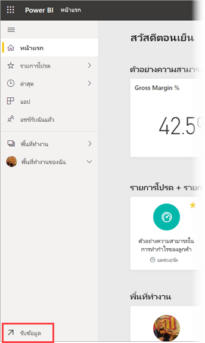
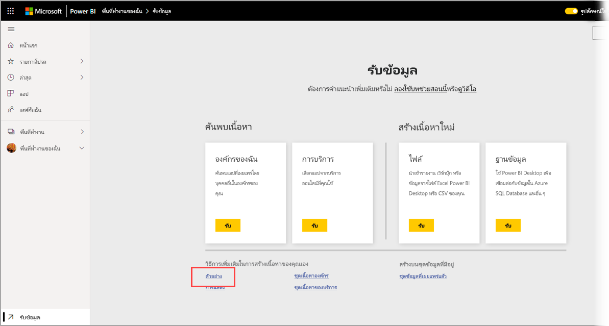
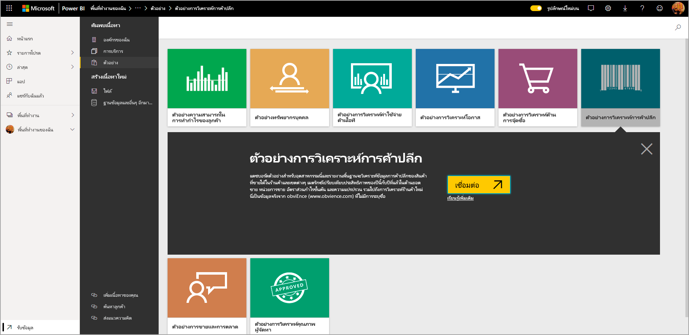
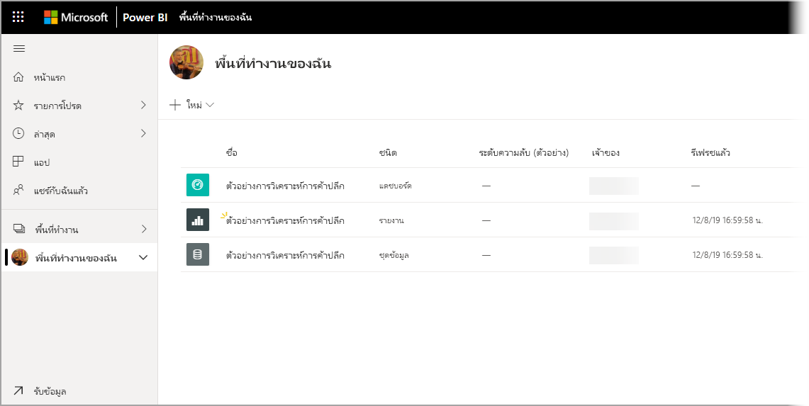

# การดาวน์โหลดตัวอย่างไปยังพื้นที่ทำงานของฉันในบริการของ Power BIDownloading samples to My workspace in the Power BI service

เอกสารประกอบของแอปสำหรับอุปกรณ์เคลื่อนที่พร้อมใช้งานที่นี่ใช้ข้อมูลตัวอย่างเพื่อวัตถุประสงค์ในการแสดงภาพSome of the Mobile app documentation available here uses sample data for the purposes of illustration. เมื่อต้องการทำตามบนอุปกรณ์ของคุณคุณสามารถดาวน์โหลดข้อมูลตัวอย่างไปยังบัญชีบริการของ Power BI ของคุณที่คุณสามารถดูได้จากแอป Power BI บนมือถือบนอุปกรณ์ของคุณTo follow along on your device, you can download the sample data to your Power BI service account, where you can then view it from the Power BI Mobile app on your device. บทความนี้อธิบายวิธีการดาวน์โหลดข้อมูลตัวอย่างไปยังบัญชีบริการของ Power BI ของคุณThis article describes how to download the sample data to your Power BI service account. 

## ข้อกำหนดเบื้องต้นPrerequisites

คุณต้องมีบัญชีบริการของ Power BI เพื่อให้สามารถดาวน์โหลดข้อมูลได้You must have a Power BI service account to be able to download data. ถ้าคุณไม่ได้ลงทะเบียน Power BI ให้[ลงทะเบียนรุ่นทดลองใช้ฟรี](https://app.powerbi.com/signupredirect?pbi_source=web)ก่อนที่คุณจะเริ่มต้นใช้งานIf you're not yet signed up for Power BI, [sign up for a free trial](https://app.powerbi.com/signupredirect?pbi_source=web) before you begin.

## ดาวน์โหลดตัวอย่างDownload a sample

1. เปิด[บริการ Power BI](https://app.powerbi.com) ในเบราว์เซอร์ของคุณและลงทะเบียนOpen the [Power BI service](https://app.powerbi.com) in your browser and sign in.

2. เลือก **รับข้อมูล** ที่มุมล่างซ้ายของบานหน้าต่างนำทางSelect **Get data** in the lower-left corner of the navigation pane. ถ้าบานหน้าต่างนำทางถูกซ่อนอยู่และคุณไม่สามารถดูการเชื่อมโยงรับข้อมูล ให้แสดงหน้าต่างโดยการคลิกที่ไอคอนแสดง/ซ่อนหน้าต่างการนำทาง If the navigation pane is hidden and you can't see the Get data link, display the pane by clicking the show/hide navigation pane icon .  
   
    

3. บนหน้ารับข้อมูล เลือกลิงค์ **ตัวอย่าง**On the Get Data page, select the **Samples** link.
   
   

4. เลือกตัวอย่างเพื่อดาวน์โหลดSelect a sample to download. โปรดตรวจสอบให้แน่ใจว่าได้เลือกตัวอย่างที่บทช่วยสอน เริ่มใช้งานด่วน หรือข้อความที่คุณกำลังใช้การโทรBe sure to choose the sample that the tutorial, quickstart, or article you're using calls for. หลังจากเลือกให้คลิก **เชื่อมต่อ**After selecting it, click **Connect**.
  
   
   
5. Power BI นำเข้าตัวอย่าง เพิ่มแดชบอร์ดใหม่, รายงาน และชุดข้อมูลลงในพื้นที่ทำงานของฉันPower BI imports the sample, adding a new dashboard, report, and dataset to your My Workspace.
   
   
  
คุณพร้อมที่จะดูตัวอย่างบนอุปกรณ์เคลื่อนที่ ของคุณแล้วYou are now ready to view the samples on your mobile device.

## ขั้นตอนถัดไปNext steps
* [เริ่มต้นใช้งานด่วนQuickstart](mobile-apps-quickstart-view-dashboard-report.md)
* มีคำถามหรือไม่?Questions? โปรดดู [ส่วนเนื้อหาแอปสำหรับอุปกรณ์เคลื่อนที่ของชุมชน Power BI](https://go.microsoft.com/fwlink/?linkid=839277)Check the [Mobile apps section of the Power BI Community](https://go.microsoft.com/fwlink/?linkid=839277)
