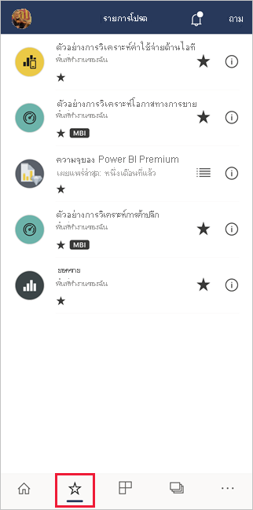
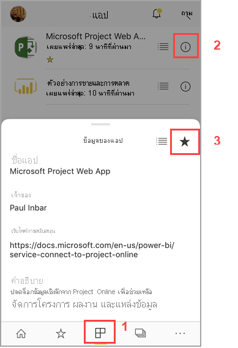
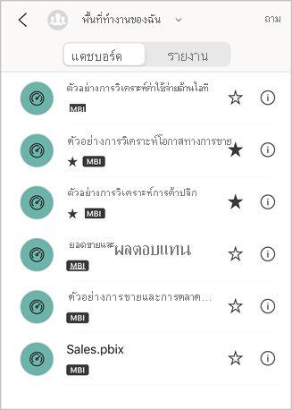
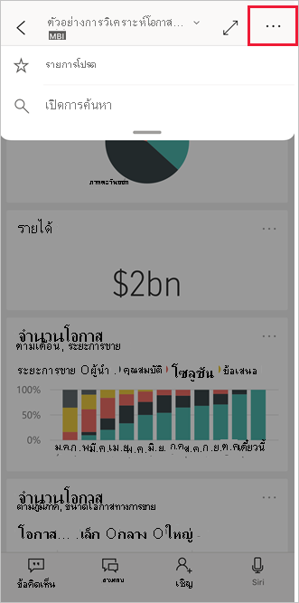
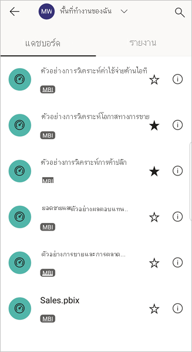
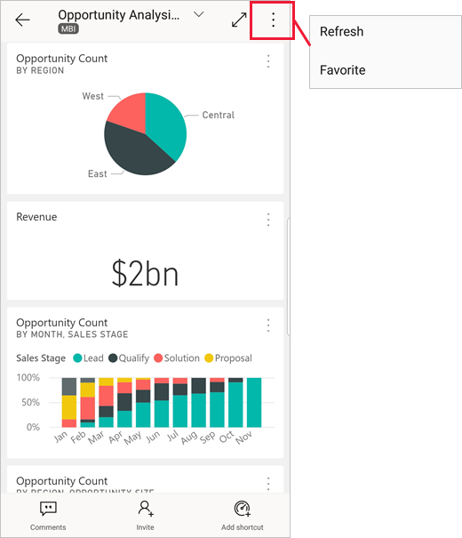

# สร้างและดูรายการโปรดในแอป Power BI สำหรับอุปกรณ์เคลื่อนที่Make and view favorites in the Power BI mobile apps
นำไปใช้กับ:Applies to:

|  |  |  |  |  |
|:--- |:--- |:--- |:--- |:--- |
| iPhoneiPhones |iPadiPads |โทรศัพท์ AndroidAndroid phones |แท็บเล็ต AndroidAndroid tablets |อุปกรณ์ Windows 10Windows 10 devices |

>[!NOTE]
>การสนับสนุนแอปอุปกรณ์เคลื่อนที่ Power BI สำหรับ **โทรศัพท์ที่ใช้ Windows 10 Mobile** จะถูกยกเลิกในวันที่ 16 มีนาคม 2021Power BI mobile app support for **phones using Windows 10 Mobile** will be discontinued on March 16, 2021. [ศึกษาเพิ่มเติมLearn more](/legal/powerbi/powerbi-mobile/power-bi-mobile-app-end-of-support-for-windows-phones)

อ่านเกี่ยวกับการสร้างและดูแดชบอร์ด รายงาน และแอป Power BI รายการโปรด รวมถึง KPI และเซิร์ฟเวอร์รายงาน Power BI และ Reporting Services ภายในองค์กรของคุณที่เป็นรายการโปรดในแอปสำหรับอุปกรณ์เคลื่อนที่Read about making and viewing your favorite Power BI dashboards, reports, and apps, together with your favorite on-premises Power BI Report Server and Reporting Services KPIs and reports, in the mobile apps.

เมื่อคุณสร้างรายการโปรดในแอป Power BI สำหรับอุปกรณ์เคลื่อนที่ คุณจะเห็นรายการนั้นในหน้ารายการโปรด ในบริการของ [Power BI service](https://powerbi.com) และในอุปกรณ์เคลื่อนที่ของคุณทั้งหมดWhen you make a favorite in the Power BI mobile apps, you see it on your Favorites page in the [Power BI service](https://powerbi.com) and on all of your mobile devices.

หากต้องการดูหน้ารายการโปรดของคุณ แตะที่ไอคอนรายการโปรดบนแถบนำทาง:To see your Favorites page, tap the Favorites icon on the navigation bar:

คุณยังสามารถ[สร้างแดชบอร์ดและแอป Power BI รายการโปรดได้ในบริการของ Power BI](../end-user-favorite.md)You can also [make Power BI dashboards and apps favorites in the Power BI service](../end-user-favorite.md). จากนั้น คุณจะเห็นรายการโปรดที่คุณสร้างในหน้ารายการโปรดของแอปอุปกรณ์เคลื่อนที่Then you see them on the Favorites page in the mobile app.

คุณสามารถทำเครื่องหมายให้ KPI และรายงานบนเซิร์ฟเวอร์รายงาน Power BI หรือพอร์ทัลเว็บ Reporting Services เป็นรายการโปรด และจากนั้น ดูรายการโปรดเหล่านี้ในโฟลเดอร์ที่คุณสะดวกบนอุปกรณ์เคลื่อนที่ พร้อมกับแดชบอร์ด Power BI ตัวโปรดของคุณYou can mark KPIs and reports as favorites on a Power BI Report Server or Reporting Services web portal, and then view them in one convenient folder on your mobile device, along with your Power BI favorite dashboards.

## เพิ่มแอปให้เป็นรายการโปรดMake an app a favorite
1. แตะไอคอนแอปบนแถบนำทางด้านล่าง เพื่อให้แสดงหน้าแอปของคุณTap the Apps icon on the bottom navigation bar to display your apps page.

2. ในอุปกรณ์ iOS แตะที่ปุ่มข้อมูลของชื่อแอปที่คุณต้องการทำให้เป็นรายการโปรดOn an iOS device, tap the info button to the right of the name of the app you want to make a favorite. ในอุปกรณ์แอนดรอยด์ จะมีปุ่มตัวเลือกเพิ่มเติม (...) แทนที่ปุ่มข้อมูลOn Android devices, More options (...) appears rather than the info button. 

3. ในส่วนของข้อมูลแอปที่เปิดขึ้น ให้แตะที่รูปดาวIn the App info section that opens, tap the star.
   
    
   
    แอปนั้นจะเข้าไปอยู่ในรายการโปรด พร้อมกับแดชบอร์ด รายงาน และแอปอื่นที่อนู่ในรายการโปรดของคุณThe app will now be listed on your Favorites page, along with your other favorite dashboards, reports, and apps.
   
## สร้างแดชบอร์ดหรือรายงานเป็นรายการโปรดในแอปสำหรับอุปกรณ์เคลื่อนที่ iOS และ Windows 10Make a dashboard or report a favorite in the iOS and Windows 10 mobile apps
คุณสามารถสร้างแดชบอร์ดหรือรายงาน Power BI เป็นรายการโปรดจากรายการของแดชบอร์ดหรือรายงาน หรือ จากแดชบอร์ดหรือรายงานนั้นๆYou can make a Power BI dashboard or report a favorite from the list of dashboards or reports, or from the dashboard or report itself.

* ในรายการของแดชบอร์ดหรือรายงานในแอปอุปกรณ์เคลื่อนที่ แตะดาวว่างเปล่าที่อยู่ถัดจากชื่อIn the list of dashboards or reports in the mobile app, tap the empty star next to the name .. ดาวเปลี่ยนเป็นสีดำThe star turns black ..
  
    
* ถ้าคุณอยู่ในแดชบอร์ดหรือรายงานให้แตะ **ตัวเลือกเพิ่มเติม** (...) ในส่วนหัวและจากนั้นแตะดาวที่ว่างเปล่า  ในเมนูที่แสดงIf you're in a dashboard or report, tap **More options** (...) in the header and then tap the empty star  in the menu that displays. ดาวจะเปลี่ยนเป็นสีดำ The star will turn black .
  
    

## สร้างแดชบอร์ดหรือรายงานเป็นรายการโปรดในแอปสำหรับอุปกรณ์เคลื่อนที่ AndroidMake a dashboard or report a favorite in the Android mobile apps
คุณสามารถสร้างแดชบอร์ดหรือรายงานเป็นรายการโปรดจากรายการของแดชบอร์ดหรือรายงาน หรือ จากแดชบอร์ดหรือรายงานนั้นๆYou can make a dashboard or report a favorite from the list of dashboards or reports, or from the dashboard or report itself.

* ในรายการแดชบอร์ดหรือรายงานในแอปมือถือให้แตะดาวถัดจากชื่อรายงานหรือแดชบอร์ดเพื่อชื่นชอบหรือไม่ชอบรายการIn the list of dashboards or reports in the mobile app, tap the star next to the name of the report or dashboard to favorite or un-favorite the item.
  
    

* เมื่อคุณอยู่ในแดชบอร์ดหรือรายงานให้แตะ **ตัวเลือกเพิ่มเติม (...)** จากนั้นเลือก **รายการโปรด**When you're in a dashboard or report, tap **More options (...)** and then select **Favorite**.
  
    

## สร้างเซิร์ฟเวอร์รายงาน Power BI และ Reporting Services report และ KPI ที่เป็นรายการโปรดMake favorite Power BI Report Server and Reporting Services reports and KPIs
คุณสามารถดูเซิร์ฟเวอร์รายงาน Power BI และ Reporting Services report และ KPI ที่เป็นรายการโปรดของคุณในแอป Power BI สำหรับอุปกรณ์เคลื่อนที่ได้ แต่คุณไม่สามารถทำให้เป็นรายการโปรดในแอปสำหรับอุปกรณ์เคลื่อนที่You can view your favorite Power BI Report Server and Reporting Services reports and KPIs in the Power BI mobile apps, but you can't make them favorites in the mobile apps. คุณ[แท็กสิ่งเหล่านี้เป็นรายการโปรดในพอร์ทัลเว็บ](../../report-server/tutorial-explore-report-server-web-portal.md#tag-your-favorites)You [tag them as favorites in the web portal](../../report-server/tutorial-explore-report-server-web-portal.md#tag-your-favorites). 

## ขั้นตอนถัดไปNext steps
* [แดชบอร์ดรายการโปรดในบริการของ Power BIFavorite dashboards in the Power BI service](../end-user-favorite.md) 
* มีคำถามหรือไม่Questions? [ลองถามชุมชน Power BITry asking the Power BI Community](https://community.powerbi.com/)