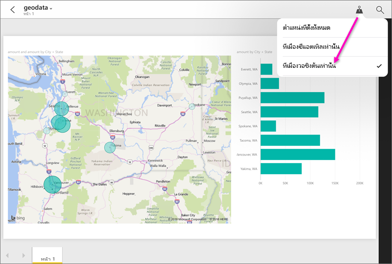

# กรองรายงานตามตำแหน่งที่ตั้งทางภูมิศาสตร์ในแอป Power BI สำหรับอุปกรณ์เคลื่อนที่Filter a report by geographic location in the Power BI mobile apps
ใช้ได้กับ:Applies to:

|  |  |  |  |  |
|:--- |:--- |:--- |:--- |:--- |
| iPhoneiPhones |iPadiPads |โทรศัพท์ AndroidAndroid phones |แท็บเล็ต AndroidAndroid tablets |มือถือ Windows 10Windows 10 phones |

เมื่อคุณดูที่รายงาน Power BI บนอุปกรณ์เคลื่อนที่ของคุณ คุณเห็นไอคอนรูปเข็มหมุดเล็ก ๆ ที่มุมบนขวาหรือไม่?When you look at a Power BI report on your mobile device, do you see a little pushpin icon in the upper-right corner? ถ้าเป็นเช่นนั้น คุณสามารถกรองรายงานตามตำแหน่งที่ตั้งทางภูมิศาสตร์ของคุณIf so, then you can filter that report based on your geographic location.

> [!NOTE]
> คุณสามารถกรองตามตำแหน่ง ถ้าชื่อทางภูมิศาสตร์ในรายงานเป็นภาษาอังกฤษเท่านั้น ตัวอย่างเช่น "New York City" หรือ "Germany"You can only filter by location if the geographic names in the report are in English; for example, "New York City" or "Germany". แท็บเล็ต Windows 10 และพีซีไม่สนับสนุนการกรองทางภูมิศาสตร์ แต่มือถือ Windows 10 ทำได้Windows 10 tablets and PCs don't support geographic filtering, but Windows 10 phones do.

>[!NOTE]
>การสนับสนุนแอปอุปกรณ์เคลื่อนที่ Power BI สำหรับ **โทรศัพท์ที่ใช้ Windows 10 Mobile** จะถูกยกเลิกในวันที่ 16 มีนาคม 2021Power BI mobile app support for **phones using Windows 10 Mobile** will be discontinued on March 16, 2021. [ศึกษาเพิ่มเติมLearn more](/legal/powerbi/powerbi-mobile/power-bi-mobile-app-end-of-support-for-windows-phones)

## กรองรายงานของคุณตามที่ตั้งทางภูมิศาสตร์ของคุณFilter your report by your geographic location
1. เปิดรายงานในแอป Power BI สำหรับอุปกรณ์เคลื่อนที บนอุปกรณ์เคลื่อนที่ของคุณOpen a report in the Power BI mobile app on your mobile device.
2. ถ้ารายงานมีข้อมูลทางภูมิศาสตร์ คุณเห็นข้อความขออนุญาตให้ Power BI เข้าถึงตำแหน่งที่ตั้งของคุณIf the report has geographic data, you see a message asking to allow Power BI to access your location. คลิกที่ **อนุญาต** จากนั้นกดเลือก **อนุญาต** อีกครั้งClick **Allow**, then tap **Allow** again.
3. แตะที่เข็มหมุดTap the push pin .. คุณสามารถกรองตาม เมือง รัฐ/จังหวัด หรือ ประเทศ/ภูมิภาค ขึ้นอยู่กับข้อมูลในรายงานYou can filter by city, state/province, or country/region, depending on the data in the report. ตัวกรองแสดงรายการตัวเลือก เฉพาะที่ตรงกับตำแหน่งปัจจุบันของคุณThe filter only lists options that match your current location.
   
    

## ทำไมฉันจึงไม่เห็นแท็กตำแหน่งที่ตั้งในรายงานWhy don't I see location tags on a report?
จะต้องปฏิบัติตามเงื่อนไขทั้งหมดสามข้อต่อไปนี้เพื่อให้คุณเห็นแท็กตำแหน่งAll three of the conditions below must be met for you to see location tags. 

* บุคคลที่สร้างรายงานใน Power BI Desktop จะต้องมีการ[จัดประเภทข้อมูลทางภูมิศาสตร์](../../transform-model/desktop-mobile-geofiltering.md)ให้กับคอลัมน์อย่างน้อยหนึ่งคอลัมน์ เช่น เมือง รัฐ หรือประเทศ/ภูมิภาคThe person who created the report in Power BI Desktop  must have [categorized geographical data](../../transform-model/desktop-mobile-geofiltering.md) for at least one column, such as City, State, or Country/Region.
* คุณอยู่ในตำแหน่งที่มีข้อมูลในคอลัมน์นั้นYou are in one of the locations that has data in that column.
* คุณกำลังใช้อุปกรณ์เคลื่อนที่อย่างใดอย่างหนึ่งในนี้:You're using one of these mobile devices:
  * iOS (iPad, iPhone, iPod)iOS (iPad, iPhone, iPod).
  * Android (โทรศัพท์, แท็บเล็ต)Android (phone, tablet).
  * มือถือ Windows 10 (อุปกรณ์ Windows 10 อื่น ๆ เช่นพีซีและแท็บเล็ตไม่สนับสนุนการกรองทางภูมิศาสตร์)Windows 10 phone (other Windows 10 devices such as PCs and tablets don't support geographic filtering).

อ่านเพิ่มเติมเกี่ยวกับ[การตั้งค่าการกรองทางภูมิศาสตร์](../../transform-model/desktop-mobile-geofiltering.md)ใน Power BI DesktopRead more about [setting up geographic filtering](../../transform-model/desktop-mobile-geofiltering.md) in Power BI Desktop.

### ขั้นตอนถัดไปNext steps
* [เชื่อมต่อกับข้อมูล Power BI จากโลกแห่งความจริง](mobile-apps-data-in-real-world-context.md)ด้วยแอปสำหรับอุปกรณ์เคลื่อนที่[Connect to Power BI data from the real world](mobile-apps-data-in-real-world-context.md) with the mobile apps
* [จัดประเภทข้อมูลใน Power BI DesktopData categorization in Power BI Desktop](../../transform-model/desktop-data-categorization.md) 
* มีคำถามหรือไม่Questions? [ลองถามชุมชน Power BITry asking the Power BI Community](https://community.powerbi.com/)