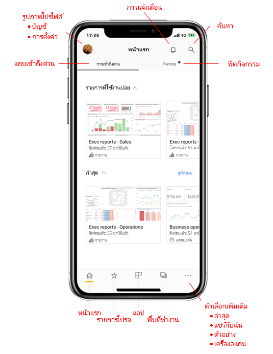
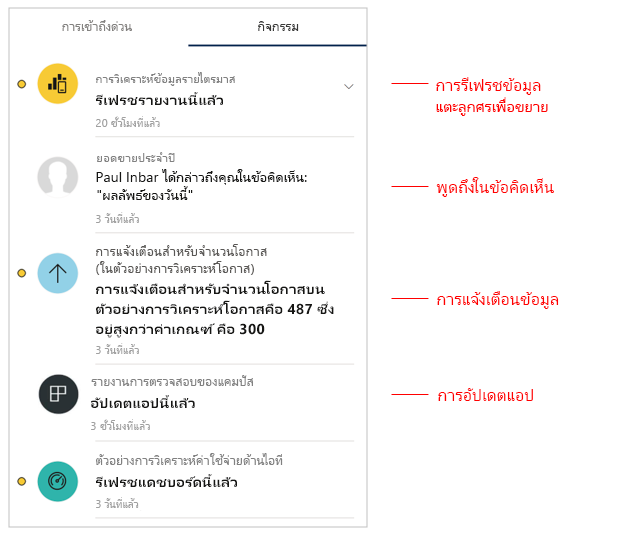
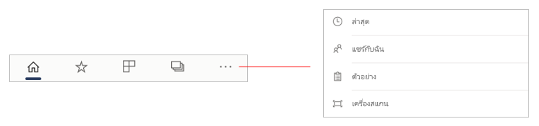
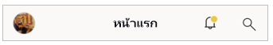
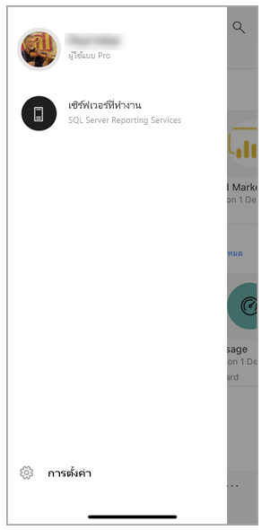
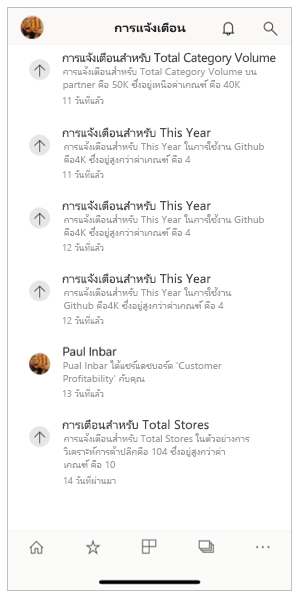
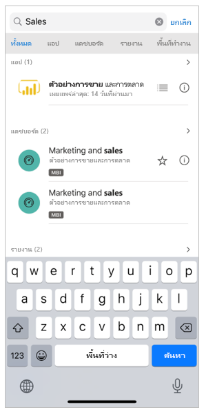

# แนะนำหน้าแรกของแอปสำหรับอุปกรณ์เคลื่อนที่อย่างรวดเร็วA quick tour of the Mobile app home page
ในการแนะนำนี้ คุณจะคุ้นเคยกับหน้าแรกของแอปสำหรับอุปกรณ์เคลื่อนที่ของ Power BI และตัวช่วยนำทางที่จะทำให้คุณได้รับสิ่งที่คุณต้องการอย่างรวดเร็วIn this tour, you become acquainted with the home page of the Power BI mobile app and the navigation aids it provides you to get to what you need quickly.

ใช้ได้กับ:Applies to:

|  |  |  |
|:--- |:--- |:--- |
| iPhoneiPhone | iPadiPad | AndroidAndroid | 

เมื่อคุณเปิดแอปอุปกรณ์เคลื่อนที่ Power BI คุณจะเข้าไปยังหน้าแรก ซึ่งคุณจะเข้าถึงรายงาน แดชบอร์ด และแอปที่คุณเปิดล่าสุด นี่หรือรายงานที่คุณดูบ่อย ๆ ได้อย่างรวดเร็วWhen you open Power BI Mobile app, you land on the home page, where you have quick access to your most frequently or recently visited reports, dashboards, and apps. นอกจากนั้นยังมีฟีดกิจกรรมที่ช่วยให้คุณอัปเดตสิ่งที่เกิดขึ้นกับเนื้อหาใน Power BI ของคุณ รวมทั้งตัวช่วยนำทางที่สะดวกที่จะพาคุณไปยังเนื้อหาที่คุณต้องการอย่างรวดเร็วIn addition, there is an activity feed that keeps you up-to-date about what's happening with your Power BI content, as well as convenient navigation aids to get you quickly to the content you need.

 
## แถบเข้าถึงด่วนQuick Access tab

แถบการเข้าถึงด่วนจะแสดงรายงาน แดชบอร์ด และแอปที่คุณเปิดเมื่อเร็ว ๆ นี่หรือรายงานที่คุณดูบ่อย ๆ โดยจัดกลุ่มเป็นสองส่วนThe quick access tab shows you your frequently and recently viewed reports, dashboards, and apps, grouped into two collapsible sections. หากต้องการดูรายการที่คุณเปิดล่าสุดมากขึ้น ให้แตะ **ดูทั้งหมด** ที่ด้านขวาTo see a longer list of your recently viewed items, tap **See all** to the right of Recents. 

## ตัวดึงข้อมูลกิจกรรมActivity feed

ฟิดกิจกรรมช่วยให้คุณติดตามสิ่งที่เกิดขึ้นกับเนื้อหา Power BI ของคุณThe activity feed helps you keep track of what's happening with your Power BI content. ซึ่งแสดงการแจ้งเตือน การเตือน ความคิดเห็น และ@mentions ล่าสดทั้งหมดของคุณIt shows you all your latest notifications, alerts, comments, and @mentions.

การอัปเดตในฟีดประกอบด้วย:The updates in the feed include:
* **ข้อมูลที่ถูกรีเฟรช**: เมื่อข้อมูลในรายงานหรือแดชบบอร์ดในรายการโปรดหรือรายการล่าสุดของคุณได้รับการรีเฟรช**Refreshed data**: when the underlying data in one of the reports or dashboards in your favorites or recents is refreshed.
* **ความคิดเห็นใหม่**: เมื่อผู้คนสร้างความคิดเห็นในรายงานหรือแดชบอร์ดที่อยู่ในรายการโปรดหรือรายการล่าสุดของคุณ หรือเมื่อมีคนกล่าวถึงคุณในความคิดเห็น**New comments**: when people create a comment in a report or a dashboard that is in your favorites or recents, or when someone mentions you in a comment.
* **การเตือนข้อมูล**: เมื่อข้อมูลถึงเกณฑ์ที่คุณได้ตั้งไว้ก่อนหน้าใน [การเตือนข้อมูล](mobile-set-data-alerts-in-the-mobile-apps.md)**Data alerts**: when data reaches a threshold you previously set in a [data alert](mobile-set-data-alerts-in-the-mobile-apps.md).
* **อัปเดตแอป**: เมื่อผู้สร้างแอปเผยแพร่อัปเดตแอปที่คุณกำลังใช้**App updates**: when an app creator publishes an update to an app you are using.

 แตะที่รายการกิจกรรม เพื่อไปยังตำแหน่งที่เกี่ยวข้อง เพื่อสำรวจเพิ่มเติมTap on an activity item to jump to the relevant place in order to explore further.

รายการกิจกรรมนั้นรวมกัน เพื่อให้การอัปเดตข้อมูลทั้งหมดจากกแอปหรือพื้นที่ทำงานเดียวกันอยู่ในกลุ่มเดียวกันActivity items are aggregated, so all data updates coming from the same app or workspace will be grouped together. ใช้Use the  ลูกศรเพื่อขยายและดูรายการที่รวบรวมarrow to expand and see the aggregated items. รายการล่าสุดจะแสดงด้านบนของรายชื่อเสมอThe most recent item will always be at the top of the list.

## แถบนำทางNavigation bar

ที่ด้านล่างของหน้าคุณจะเห็นแถบนำทางAt the bottom of the page you find the navigation bar.

แถบนำทางช่วยให้เข้าถึงอย่างรวดเร็วไปยัง:The navigation bar provides quick access to:

*  **หน้าหลัก** - กลับไปยังหน้าหลัก **Home** - returns you to the home page.
*  **รายการโปรด** - รายงาน แดชบอร์ด และแอปที่คุณทำเครื่องหมายเป็น [รายการโปรด](mobile-apps-favorites.md) **Favorites** - the reports, dashboards and apps you have marked as [favorites](mobile-apps-favorites.md).
*  **แอป** - แอปที่คุณติดตั้งในบัญชีของคุณ **Apps** - the apps you have installed in your account.
*  **พื้นที่ทำงาน** - โฟลเดอร์งานที่มีรายงานและแดชบอร์ดที่ผู้สร้างเนื้อหาสร้างขึ้น **Workspaces** - the working folders that keep together reports and dashboards that content creators are building.
*  **ล่าสุด** - ที่คุณได้รับการเข้าชมเมื่อเร็วๆนี้-รายการที่คุณเพิ่งดู **Recents** - the items you have recently viewed.
*  **แชร์กับฉัน** - รายการที่บุคคลอื่นแชร์ให้คุณ **Shared with me** - the items other people have shared with you.
*  **ตัวอย่าง**- ตัวอย่าง Power BI ที่คุณสามารถใช้เพื่อเรียนรู้เกี่ยวกับความสามารถของ Power BI **Samples** - Power BI samples you can use to learn about Power BI capabilities.
*  **สแกนเนอร์** - กล้องของอุปกรณ์ที่คุณสามารถใช้เป็นสแกนเนอร์เพื่อสแกนบาร์โค้ด [บาร์โค้ด](mobile-apps-scan-barcode-iphone.md) และ [คิวอาร์โค้ด](mobile-apps-qr-code.md) **Scanner** - the device camera that you can use as a scanner to scan [barcodes](mobile-apps-scan-barcode-iphone.md) and [QR codes](mobile-apps-qr-code.md).

## ส่วนหัวHeader

ที่ด้านบนของหน้า ส่วนหัวแสดงชื่อของหน้า Power BI รายงาน หรือแดชบอร์ดที่คุณอยู่At the top of the page, the header shows the name of the Power BI page, report, or dashboard you're on.

ส่วนหัวแสดงรายการนทางต่อไปนี้:The header provides the following navigation items:
* **รูปโปรไฟล์หรืออวตาร** - เปิดแผงด้านข้าง ซึ่งคุณสามารถ [สลับระหว่างบริการ Power BI ของคุณและบัญชีเซิร์ฟเวอร์รายงาน](mobile-app-ssrs-kpis-mobile-on-premises-reports.md) รวมทั้งการตั้งค่าแอปอุปกรณ์เคลื่อนที่ Power BI**Profile picture or avatar** - opens the side panel where you can [switch between your Power BI service and Report Server accounts](mobile-app-ssrs-kpis-mobile-on-premises-reports.md), as well as access Power BI mobile app settings.

    

* **การแจ้งเตือน** - เปิด [หน้าการแจ้งเตือน](mobile-apps-notification-center.md) ซึ่งคุณสามารถดูและเข้าถึงการแจ้งเตือนของเรา**Notifications** - opens the [notifications page](mobile-apps-notification-center.md) where you can view and access your notifications. จุดที่ระฆังการแจ้งเตือนที่คุณมีการแจ้งเตือนที่บ่งบอกว่าคุณมีการแจ้งเตือนใหม่A dot on the notifications bell indicates that you have new notifications.

    

* **ค้นหา** - ค้นหาเนื้อหา Power BI ที่คุณติดตาม**Search** - search for Power BI content in your subscription.

    

## ขั้นตอนถัดไปNext steps
ในการแนะนำนี้ คุณจะได้สำรวจหน้าหลักของแอปอุปกรณ์เคลื่อนที่ Power BIIn this tour, you explored the Power BI mobile app home page. อ่านข้อมูลเพิ่มเติมเกี่ยวกับการใช้สำหรับอุปกรณ์เคลื่อนที่ Power BIRead more about using the Power BI mobile app. 
* [สำรวจแดชบอร์ดและรายงานExplore dashboards and reports](mobile-apps-quickstart-view-dashboard-report.md)
* [สำรวจรายงานในแอปอุปกรณ์เคลื่อนที่ Power BIExplore reports in the Power BI mobile apps](mobile-reports-in-the-mobile-apps.md)
