# นักวิเคราะห์เสมือนของถามตอบ ในแอป iOS - Power BIQ&A virtual analyst in iOS apps - Power BI

วิธีง่ายที่สุดในการเรียนรู้เกี่ยวกับข้อมูลของคุณ คือ การถามคำถามเกี่ยวกับข้อมูลของคุณโดยใช้ถ้อยคำของคุณเองThe easiest way to learn about your data is to ask questions about it in your own words. ในบทความนี้ คุณจะถามคำถาม และดูข้อมูลเชิงลึกที่แนะนำเกี่ยวกับข้อมูลตัวอย่าง ด้วยนักวิเคราะห์เสมือนของถามตอบ ในแอปมือถือ Microsoft Power BI บน iPad, iPhone และ iPod TouchIn this article, you ask questions and view featured insights about sample data with the Q&A virtual analyst in the Microsoft Power BI mobile app on your iPad, iPhone, and iPod Touch. 

นำไปใช้กับ:Applies to:

|  |  |
|:--- |:--- |
| iPhoneiPhones |iPadiPads |

นักวิเคราะห์เสมือนของถามตอบ เป็นประสบการณ์การสนทนาข่าวกรองธุรกิจ ที่เข้าถึงข้อมูลการถามตอบเบื้องต้นในบริการของ Power BI [(https://powerbi.com)](https://powerbi.com)The Q&A virtual analyst is a conversational BI experience that accesses underlying Q&A data in the Power BI service [(https://powerbi.com)](https://powerbi.com). ซึ่งแนะนำข้อมูลเชิงลึก และคุณสามารถพิมพ์ หรือพูดคำถามของคุณเองIt suggests data insights, and you can type or speak your own questions.

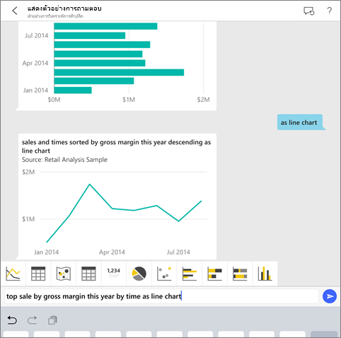

ถ้าคุณไม่ได้ลงทะเบียน Power BI ให้[ลงทะเบียนรุ่นทดลองใช้ฟรี](https://app.powerbi.com/signupredirect?pbi_source=web)ก่อนที่คุณจะเริ่มต้นใช้งานIf you're not signed up for Power BI, [sign up for a free trial](https://app.powerbi.com/signupredirect?pbi_source=web) before you begin.

## ข้อกำหนดเบื้องต้นPrerequisites

* **ติดตั้งแอป Power BI สำหรับ iOS**: [ดาวน์โหลดแอป iOS](https://go.microsoft.com/fwlink/?LinkId=522062) ไปยัง iPhone หรือ iPad ของคุณ**Install the Power BI for iOS app**: [Download the iOS app](https://go.microsoft.com/fwlink/?LinkId=522062) to your iPhone or iPad.
เวอร์ชันเหล่านี้รองรับแอป Power BI สำหรับ iOS:These versions support the Power BI app for iOS:
    * iPad ที่มี iOS 11 หรือใหม่กว่าiPad with iOS 11 or later.
    * iPhone 5 และสูงกว่า ที่มี iOS 11 หรือใหม่กว่าiPhone 5 and above, with iOS 11 or later.
* **ดาวน์โหลดตัวอย่างการวิเคราะห์ด้านการขายปลีกและการวิเคราะห์โอกาสทางการขาย**: ขั้นตอนแรกในเริ่มต้นใช้งานนี้คือ การดาวน์โหลดตัวอย่างการวิเคราะห์การค้าปลีก และตัวอย่างการวิเคราะห์โอกาสทางการขายในบริการของ Power BI**Download the Retail Analysis and Opportunity Analysis Samples**: The first step in this quickstart is to download the Retail Analysis and Opportunity Analysis samples in the Power BI service. [เรียนรู้วิธีการดาวน์โหลดตัวอย่าง](./mobile-apps-download-samples.md) ลงในบัญชี Power BI ของคุณเพื่อเริ่มต้นใช้งาน[Learn how to download a sample](./mobile-apps-download-samples.md) into your Power BI account to get started. ตรวจสอบให้แน่ใจว่าได้เลือกตัวอย่างการวิเคราะห์ร้านค้าปลีกและตัวอย่างการวิเคราะห์โอกาสทางการขายBe sure to choose the Retail Analysis Sample and the Opportunity Analysis Sample.

เมื่อคุณทำข้อกำหนดเบื้องต้นเสร็จสมบูรณ์แล้ว คุณพร้อมที่จะลองใช้นักวิเคราะห์เสมือนของถามตอบOnce you've completed the prerequisites you are ready to try the Q&A virtual analyst.

## ลองถามคำถามผ่าน iPhone หรือ iPad ของคุณTry asking questions on your iPhone or iPad
1. ที่แถบนำทางด้านล่างบน iPhone หรือ iPad ของคุณ ให้แตะปุ่มพื้นที่ทำงานOn the bottom navigation bar on your iPhone or iPad, tap the Workspaces button ไปที่ พื้นที่ทำงานของฉัน แล้วเปิดแดชบอร์ดตัวอย่างการวิเคราะห์ด้านการขายปลีก, go to My Workspace, and open the Retail Analysis Sample dashboard.

2. แตะไอคอนนักวิเคราะห์เสมือนของถามตอบ  จากเมนูการดำเนินการที่ด้านล่างของหน้า (ที่ด้านบนของหน้าใน iPad)Tap the Q&A virtual analyst icon  from the action menu at the bottom of the page (at the top of the page on an iPad).
     นักวิเคราะห์เสมือนของถามตอบจะมีตัวอย่างคำแนะนำ เพื่อเริ่มต้นใช้งานThe Q&A virtual analyst offers some suggestions to get started.
3. พิมพ์ **แสดง** แตะที่ **ยอดขาย** จากรายการแนะนำ > **ส่ง** Type **show**, tap **sales** from the suggestion list > **Send** .

    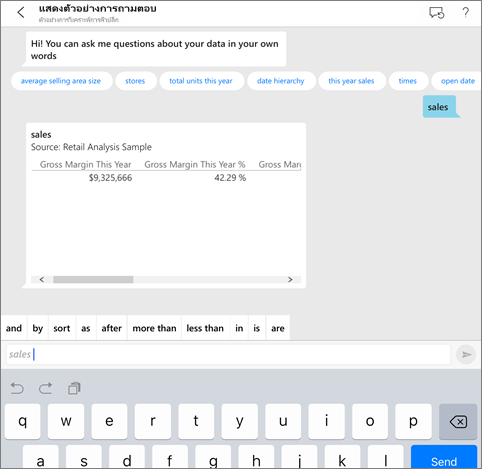
4. แตะที่ **ตาม** จากคำสำคัญ จากนั้นแตะที่ **รายการ** จากรายการแนะนำ > **ส่ง** Tap **by** from the keywords, then tap **item** from the suggestion list > **Send** .

    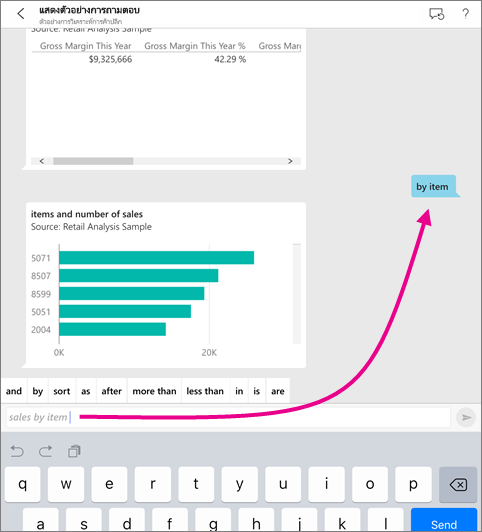
5. แตะ **เป็น** จากคำหลักแล้วแตะไอคอนแผนภูมิคอลัมน์ :::image type="icon" source="./media/mobile-apps-ios-qna/power-bi-ios-q-n-a-column-chart-icon.png" border="false":::จากนั้นแตะ **ส่ง** 
6. แตะแผนภูมิผลลัพธ์ค้างไว้ แล้วแตะ **ขยาย**Long-tap the resulting chart, then tap **Expand**.

    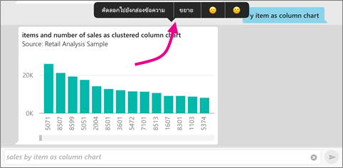

    แผนภูมิก็จะเปิดในโหมดโฟกัสในแอปThe chart opens in focus mode in the app.

    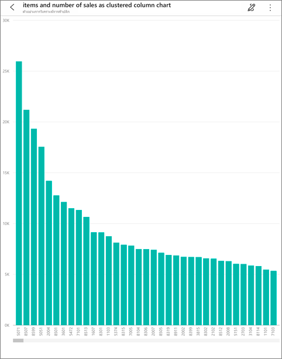
7. แตะลูกศรที่มุมซ้ายบน เพื่อกลับไปยังหน้าต่างการสนทนาสำหรับนักวิเคราะห์เสมือนของถามตอบTap the arrow in the upper-left corner to go back to the Q&A virtual analyst chat window.
8. แตะ X ที่ด้านขวาของกล่องข้อความ เพื่อลบข้อความ แล้วเริ่มต้นอีกครั้งTap the X at the right of the text box to delete the text and start over.
9. ลองตั้งคำถามใหม่: แตะที่ **สูงสุด** จากคำสำคัญ แตะที่ **ยอดขายโดยเฉลี่ย $/หน่วย** > **ส่ง** Try a new question: Tap **top** from the keywords, tap **sale by avg $/unit ly** > **Send** .

    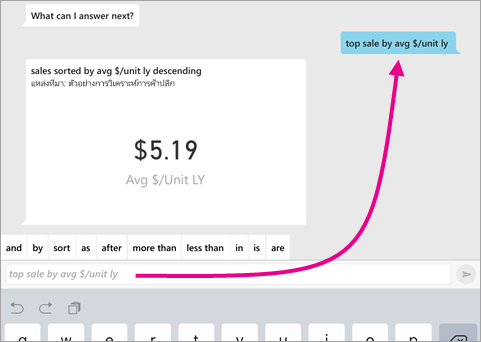
10. เลือก **ตาม** จากคำสำคัญ แตะที่ **เวลา** จากรายการคำแนะนำด้านบน > **ส่ง** Choose **by** from the keywords, tap **time** from the suggestion list at the top > **Send** .

     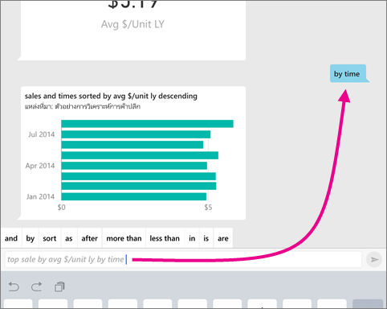
11. พิมพ์ **เป็น** เลือกไอคอนแผนภูมิเส้น :::image type="icon" source="./media/mobile-apps-ios-qna/power-bi-ios-q-n-a-line-chart-icon.png" border="false"::: จากรายการคำแนะนำ> **ส่ง** 

    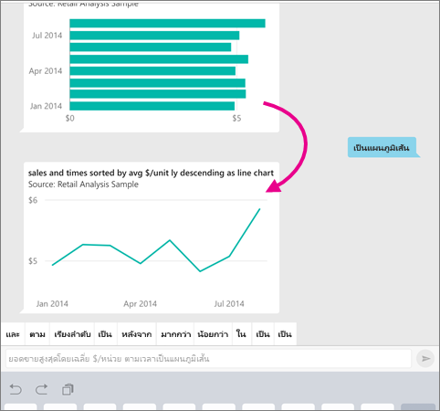

## ลองพูดถามคำถามของคุณTry saying your questions
ถึงตอนี้ คุณก็สามารถถามคำถามเกี่ยวกับข้อมูลของคุณในแอปสำหรับอุปกรณ์เคลื่อนที่ Power BI ได้โดยการพูดแทนที่จะใช้วิธีพิมพ์You can now ask questions about your data in the Power BI mobile app by speaking instead of typing.

1. แตะไอคอนนักวิเคราะห์เสมือนของถามตอบTap the Q&A virtual analyst icon  จากเมนูการดำเนินการที่ด้านล่างของหน้า (ที่ด้านบนของหน้าใน iPad)from the action menu at the bottom of the page (at the top of the page on an iPad).
2. แตะไอคอนไมโครโฟนTap the microphone icon ..

    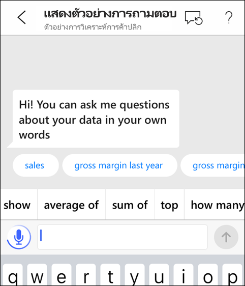

1. เมื่อไอคอนไมโครโฟนพร้อมใช้งาน ให้เริ่มพูดWhen the microphone icon is active, start speaking. ตัวอย่างเช่น พูดว่า "average unit price by time (ราคาเฉลี่ยต่อหน่วยตามระยะเวลา)" จากนั้นแตะที่ **ส่ง** For example, say "average unit price by time", then tap **Send** .

    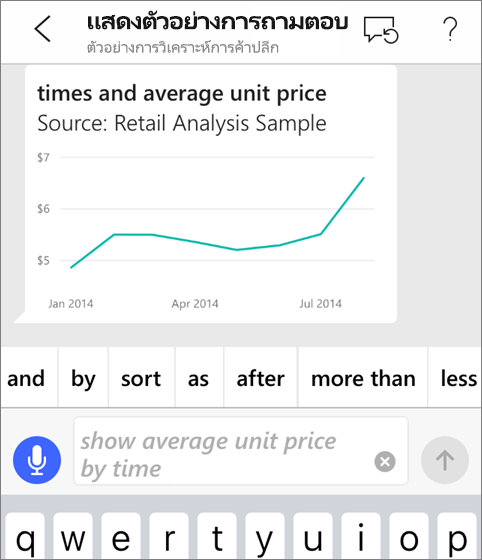

### มีคำถามเกี่ยวกับความเป็นส่วนตัว เมื่อใช้การเปลี่ยนคำพูดให้เป็นข้อความหรือไม่Questions about privacy when using speech-to-text?
โปรดดูส่วนเนื้อหาการรู้จำเสียงของ[มีอะไรใหม่ใน iOS](https://go.microsoft.com/fwlink/?linkid=845624) ในคู่มือสำหรับนักพัฒนา Apple iOSSee the Speech Recognition section of [What's New in iOS](https://go.microsoft.com/fwlink/?linkid=845624) in the Apple iOS Developer Guides.

## วิธีใช้และคำติชมHelp and feedback
* ต้องการความช่วยเหลือหรือไม่Need help? เพียงแค่พูดว่า "Hi (สวัสดี)" หรือ "Help (ช่วยด้วย)" แล้วคุณก็จะได้รับความช่วยเหลือเกี่ยวกับการเริ่มต้นถามคำถามใหม่Just say "Hi" or "Help", and you'll get assistance with starting a new question.
* มีความประสงค์จะส่งคำติชมเกี่ยวกับผลลัพธ์นี้หรือไม่Care to provide feedback on the results? แตะแผนภูมิหรือผลลัพธ์อื่นๆ ค้างไว้ แล้วแตะที่รูปหน้ายิ้มหรือหน้าบึ้งLong-tap a chart or other result, then tap the smiley or frowny face.

    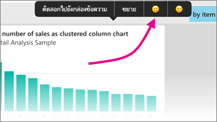

    คำติชมของคุณเป็นแบบไม่ระบุชื่อ และจะช่วยให้เราปรับปรุงการตอบคำถามของเราYour feedback is anonymous, and helps us improve our answers to questions.

## ปรับปรุงผลลัพธ์นักวิเคราะห์เสมือนของถามตอบของคุณEnhance your Q&A virtual analyst results
คุณสามารถปรับปรุงผลลัพธ์ที่คุณและลูกค้าของคุณได้รับ เมื่อมีการใช้นักวิเคราะห์เสมือนของถามตอบในชุดข้อมูลได้ด้วยการถามคำถามที่กำหนดเป้าหมายแล้วเพิ่มมากขึ้น หรือการปรับปรุงชุดข้อมูลดังกล่าวYou can improve the results you and your customers get when they use the Q&A virtual analyst on a dataset, either by asking more targeted questions or by enhancing the dataset.

### วิธีการถามคำถามHow to ask questions
* ทำตาม [เคล็ดลับเหล่านี้ในการถามคำถามในถามตอบ](../end-user-q-and-a-tips.md) ในบริการของ Power BI หรือนักวิเคราะห์เสมือนของถามตอบในแอปสำหรับอุปกรณ์เคลื่อนที่ระบบ iOS ของคุณFollow these [tips for asking questions in Q&A](../end-user-q-and-a-tips.md) in the Power BI service or the Q&A virtual analyst in your iOS mobile app.

### วิธีการปรับปรุงชุดข้อมูลHow to enhance the dataset
* ปรับปรุงชุดข้อมูลใน Power BI Desktop หรือในบริการของ Power BI เพื่อ [ทำให้ข้อมูลของคุณสามารถใช้งานได้อย่างมีประสิทธิภาพในการถามตอบและนักวิเคราะห์เสมือนของถามตอบ](../../create-reports/service-prepare-data-for-q-and-a.md)Enhance the dataset in Power BI Desktop or in the Power BI service to [make your data work well with Q&A and the Q&A virtual analyst](../../create-reports/service-prepare-data-for-q-and-a.md).

## ขั้นตอนถัดไปNext steps
* [การถามตอบในบริการ Power BIQ&A in the Power BI service](../end-user-q-and-a.md)
* มีคำถามหรือไม่Questions? โปรดดู [ส่วนเนื้อหาแอปสำหรับอุปกรณ์เคลื่อนที่ของชุมชน Power BI](https://go.microsoft.com/fwlink/?linkid=839277)Check the [Mobile apps section of the Power BI Community](https://go.microsoft.com/fwlink/?linkid=839277)
