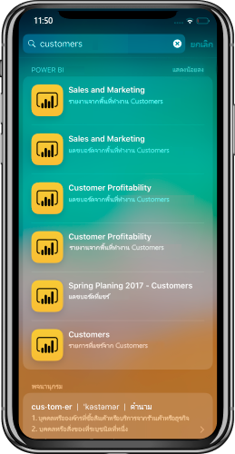

# การรวมการค้นหาอุปกรณ์ iOS (สปอตไลต์) ด้วยแอป Power BI บนมือถือระบบ iOS (ตัวอย่าง)iOS Device Search (Spotlight) integration with Power BI Mobile iOS App (preview)
ใช้การค้นหาอุปกรณ์เพื่อค้นหาและเข้าถึงเนื้อหาที่คุณต้องการUse iOS device search to find and access the content you need.

เมื่อคุณใช้การค้นหาอุปกรณ์ iOS (สปอตไลต์) เพื่อค้นหาเนื้อหาเฉพาะเ รายการ Power BI จะรวมอยู่ในรายการผลลัพธ์When you use iOS device search (spotlight) to look for specific content, Power BI items are included in the result list. เมื่อแตะรายการ Power BI จากรายการผลลัพธ์ ระบบจะนำคุณไปยังรายการภายในแอป Power BI โดยตรงTapping on a Power BI item from the result list takes you directly to that item inside the Power BI app.

## ค้นหารายการโดยใช้การค้นหาอุปกรณ์Find items using device search

หากต้องการค้นหารายการโดยใช้การค้นหาอุปกรณ์:To find items using device search:

1. ปัดลงจากตรงกลางของหน้าจอ **หน้าแรก** เพื่อไปที่การค้นหาอุปกรณ์Swipe down from the middle of the **Home** screen to get into the device search.

2. แตะที่เขตข้อมูล **ค้นหา** แล้วพิมพ์ข้อความที่คุณกำลังค้นหาTap the **Search** field and type the text you're looking for.
 
   ผลลัพธ์การค้นหาจะรวมรายการ Power BI ของประเภทต่อไปนี้:The search results will include Power BI items of the following types:

    * แดชบอร์ดDashboards
    * รายงานReports
    * แอปApps
    * พื้นที่ทำงานWorkspaces
    * รายการที่แชร์โดยผู้ติดต่อที่คุณค้นหาItems shared by the contact you search for

    

 3. เมื่อคุณค้นหารายการที่คุณต้องการ ให้แตะที่รายการนั้นOnce you find the item you want, tap on it. แอป Power BI จะเปิดที่รายการที่เลือกโดยตรงThe Power BI app will open directly on the selected item. 

นอกจากนี้ การค้นหาอุปกรณ์ที่สนับสนุนโดย Siri จะมีคำแนะนำตามการดำเนินการของคุณใช้บ่อยในแอป Power BIDevice search, powered by Siri, will also include suggestions based on your frequent actions in the Power BI app. คำแนะนำของ Siri จะแสดงในการค้นหาและหน้าจอเมื่อล็อกSiri suggestions will be shown in the search and lock screen.

>[!NOTE]
>
>หากต้องการปิดใช้งานการค้นหาอุปกรณ์และคำแนะนำของ Siri ให้ไปที่ **การตั้งค่าอุปกรณ์**>**การตั้งค่า Power BI**>**Siri และการค้นหา** และปิดใช้งานการตั้งค่า **Siri และคำแนะนำ**To disable device search and Siri suggestions, go to **Device settings** > **Power BI settings** > **Siri & Search**, and disable the **Siri & suggestions** setting.
>

## ขั้นตอนถัดไปNext steps
เรียนรู้เพิ่มเติมเกี่ยวกับแอป Power BI สำหรับอุปกรณ์เคลื่อนที่โดยดำเนินการดังนี้:Learn more about the Power BI mobile app by doing the following: 

* การดาวน์โหลด [แอป Power BI สำหรับ iPhone](https://go.microsoft.com/fwlink/?LinkId=522062)Downloading the [Power BI iPhone mobile app](https://go.microsoft.com/fwlink/?LinkId=522062)
* ติดตาม[@MSPowerBIบน Twitter](https://twitter.com/MSPowerBI)Following [@MSPowerBI on Twitter](https://twitter.com/MSPowerBI)
* การเข้าร่วมการสนทนาที่[ชุมชน Power BI](https://community.powerbi.com/)Joining the conversation at the [Power BI Community](https://community.powerbi.com/)

